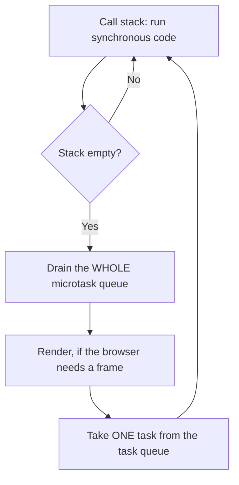

# The Event Loop {#ch-event-loop}

> Predict the exact order a piece of asynchronous code will log, and say why.

**In this chapter:** the call stack · the task and microtask queues · why microtasks starve tasks · `setTimeout(fn, 0)` · rendering and the frame budget

## 💡 The Core Idea

JavaScript runs on one thread with one call stack. Asynchronous work is not run by JavaScript at all —
the host (the browser, or Node.js) does it and puts a callback on a queue. The event loop is the rule
for choosing what to run next, and it has one shape worth memorising: **run all synchronous code,
then drain the entire microtask queue, then take exactly one task.** Every ordering puzzle in an
interview is that sentence applied.

## How It Works



**One turn of the loop: all microtasks, then a possible paint, then a single task.**

| Queue         | Holds                                                                 | How many per turn |
| ------------- | --------------------------------------------------------------------- | ----------------- |
| **Microtask** | `.then`/`.catch`/`.finally`, resumed `await`, `queueMicrotask`, `MutationObserver` | **All of them**   |
| **Task**      | `setTimeout`, `setInterval`, I/O, events, `setImmediate` (Node.js)     | **Exactly one**   |

### The canonical ordering

```typescript
console.log('1 script start');

setTimeout((): void => console.log('2 setTimeout'), 0); // task

void Promise.resolve().then((): void => console.log('3 promise')); // microtask

console.log('4 script end');

// 1 script start
// 4 script end
// 3 promise      ← the microtask queue drains first
// 2 setTimeout   ← then one task
```

The `0` is irrelevant. A microtask scheduled last still runs before a task scheduled first, because
the two queues are not one queue.

### Microtasks queued from a task run before the next task

```typescript
setTimeout((): void => {
  console.log('task A');
  void Promise.resolve().then((): void => console.log('microtask from A'));
}, 0);

setTimeout((): void => console.log('task B'), 0);

// task A
// microtask from A   ← the queue is drained after every task, not once per loop
// task B
```

### Why microtasks can starve tasks

A microtask that queues another microtask is appended to the same drain. The loop does not move on
until the queue is empty, so a self-scheduling microtask hangs the page — no timers, no input, no
paint:

```typescript
function starve(): void {
  void Promise.resolve().then(starve); // ❌ never yields
}
```

`setTimeout`-based recursion has the opposite property: each callback is a separate task, so the
browser gets a chance to render between them.

### Rendering and the frame budget

The browser can only paint between tasks — never in the middle of one, and never during a microtask
drain. At 60 frames per second the whole turn has about **16 milliseconds**. A single 50 ms
synchronous function drops three frames, which is what "janky" means in a profiler.

```typescript
// ❌ one long task — the tab is frozen for three seconds
const start: number = Date.now();
while (Date.now() - start < 3000) {
  /* nothing else runs: no paint, no input, no timers */
}
```

## When to Use It

| You want                                     | Reach for                             | Why                                              |
| -------------------------------------------- | ------------------------------------- | ------------------------------------------------ |
| To run after the current code, before a paint | `queueMicrotask` or `Promise.resolve().then` | Microtasks drain before rendering          |
| To let the browser paint and handle input first | `setTimeout(fn, 0)`                 | Yields the turn; a microtask would not            |
| To do work aligned to the next frame          | `requestAnimationFrame`               | Runs just before paint, with the frame's timestamp |
| To keep a long computation off the main thread | A Web Worker                         | Chunking hides jank; a worker removes it          |

To chunk a long job, slice the work and `await` a `setTimeout(resolve, 0)` between slices. The yield
**must** be a task: awaiting an already-resolved promise queues a microtask, which the loop drains
before it moves on, so nothing is painted.

## Common Mistakes

**❌ Reading `setTimeout(fn, 0)` as "run now".** It means "queue a task", which waits for all
synchronous code and every pending microtask. Browsers also clamp nested timers to roughly 4 ms and
throttle them hard in background tabs.

**❌ Assuming `await` makes surrounding code wait.** `await` suspends its own function and returns
control to the loop. Two async functions started together interleave:

```typescript
void task1(); // logs 'start', suspends
void task2(); // logs 'start', suspends — before task1 resumes
```

**❌ Expecting a state update to be visible in the same turn.** In React 19 the value is a `const`
captured by that render's closure, so nothing scheduled from the handler can see the new one:

```tsx
const handleClick = (): void => {
  setCount(count + 1);
  console.log(count); // this render's value
  setTimeout((): void => console.log(count), 0); // still this render's value
};
```

The re-render happens later, with a new closure. Use the updater form, `setCount((c) => c + 1)`, when
the next value depends on the current one.

**❌ Using a microtask to "yield".** Microtasks are drained before the loop moves on, so awaiting a
resolved promise inside a loop yields nothing at all and still blocks rendering.

> ⚠️ Node.js has extra phases the browser does not: `process.nextTick` drains before other
> microtasks, and `setImmediate` is a distinct phase from timers. The synchronous → microtask → task
> ordering still holds; the detail inside the task phase differs.

## 🔑 Key Takeaways

- One thread, one stack: async callbacks are queued by the host, never run concurrently with your code.
- Every turn drains the **whole** microtask queue but takes only **one** task.
- Microtasks always beat tasks, whatever delay the task was given.
- The browser can only paint between tasks, so a long synchronous function drops frames.
- To actually yield, queue a task — a microtask does not give the loop a chance to move on.

## Interview Questions

**Q: What does this log — `setTimeout(() => log('A'), 0)` then `Promise.resolve().then(() => log('B'))`?**

`B` then `A`. The promise callback is a microtask and the timer callback is a task. When the
synchronous script finishes, the loop drains every microtask before picking up a single task, so the
zero-millisecond timer still comes second.

**Q: How can a page freeze even though nothing is synchronously blocking?**

A microtask that schedules another microtask. The loop drains the queue to empty before it advances,
so a self-scheduling promise chain never lets a task run or a frame paint. Recursion through
`setTimeout` avoids this because each callback is its own task.

**Q: When would you reach for a Web Worker instead of chunking work with `setTimeout`?**

When the work is genuinely CPU-heavy and cannot be interrupted cleanly — parsing a large file,
running a diff, image processing. Chunking spreads jank rather than removing it and adds coordination
code. A worker moves the work off the main thread entirely; the cost is structured-clone message
passing and no DOM access.

## What to Read Next

- [Chapter ?? — Promises and Async/Await](#ch-promises-async) — the microtask producers you use most
- [Chapter ?? — Functions and Scope](#ch-functions-scope) — why a deferred callback sees the value it does
- [Chapter ?? — Core Web Vitals](#ch-core-web-vitals) — the frame budget measured as a user-facing metric
