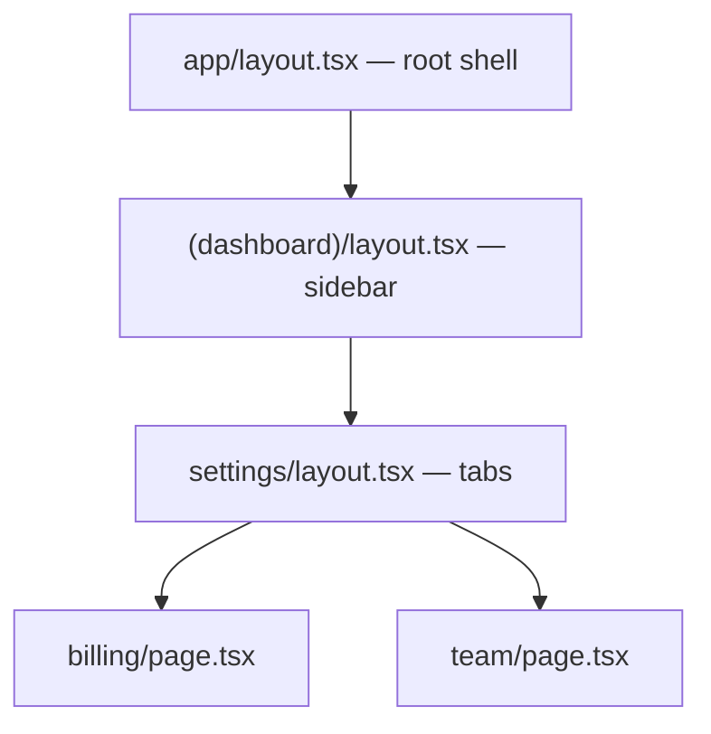

# App Router Mental Model {#ch-app-router-mental-model}

> Read a URL off the file tree, know which parts of the screen survive a navigation, and place a modal without breaking the back button.

**In this chapter:** files as routes · layouts against templates · route groups · dynamic segments · parallel and intercepting routes

## 💡 The Core Idea

In the App Router the file system is not just a routing table. It is **the component tree**. A URL is a
path down through folders, and every `layout.tsx` on that path wraps everything below it. Rendering
`/dashboard/settings/billing` means composing four components that were never imported anywhere.

That single fact explains most of the behaviour people find surprising. Layouts persist across
navigation because they are the same node in the tree. State in a layout survives a route change for the
same reason a parent's state survives a child's re-render. Nothing special is happening; it is React
composition with folders instead of imports.

> Stop asking "which page am I on" and start asking "which segments are in this path". A navigation
> replaces the segments that differ and leaves the rest mounted.

## How It Works

### The files that mean something

Filenames inside `app/` are the API. A file is only special if it is named exactly right.

| File               | What it is                                                        |
| ------------------ | ------------------------------------------------------------------ |
| `page.tsx`         | The route's own UI. A folder without one is not a route             |
| `layout.tsx`       | Wraps this segment and everything below it — persists on navigation |
| `template.tsx`     | Like a layout, but remounted on every navigation                    |
| `loading.tsx`      | A Suspense fallback wrapped around the segment automatically        |
| `error.tsx`        | An error boundary for the segment                                   |
| `not-found.tsx`    | The UI for `notFound()` and unmatched paths                         |
| `route.ts`         | An HTTP endpoint instead of UI — cannot sit beside a `page.tsx`     |
| `default.tsx`      | The fallback for a parallel route slot that has no match            |

`layout` and `template` are the pair worth being precise about. A layout keeps its state, its scroll
position and its effects across navigations within it. A template gets a fresh instance every time — use
it when an enter animation must replay, or an effect must re-run on each route change. The default
answer is `layout`; `template` is the exception with a reason.

### A path is a tree



**Navigating from `/settings/billing` to `/settings/team` replaces one node.** The root, the sidebar and
the tabs stay mounted, keep their state, and are never re-fetched.

### Route groups organise without routing

A folder in parentheses — `(marketing)` — is invisible to the URL. It exists to give a set of routes a
shared layout, or to keep a team's routes together.

```text
app/
  (marketing)/layout.tsx    →  wraps /about and /pricing
  (marketing)/about/page.tsx    →  /about
  (shop)/layout.tsx         →  wraps /cart
  (shop)/cart/page.tsx          →  /cart
```

Two rules come with them. Routes in different groups must not resolve to the same URL —
`(marketing)/about` and `(shop)/about` is a build error. And moving between two **root** layouts
triggers a full page load rather than a client navigation, because there is no shared tree to diff.

### Dynamic segments

| Folder            | Matches                            | `params`                    |
| ----------------- | ---------------------------------- | --------------------------- |
| `[id]`            | `/posts/1`                          | `{ id: '1' }`               |
| `[...slug]`       | `/docs/a/b/c` — one or more         | `{ slug: ['a','b','c'] }`   |
| `[[...slug]]`     | `/docs` and `/docs/a` — zero or more | `{ slug: undefined }` or an array |

```tsx
export default async function Page({ params }: { params: Promise<{ slug: string }> }) {
  const { slug } = await params; // a Promise since Next.js 15; synchronous access removed in 16
  return <Article slug={slug} />;
}
```

`params` and `searchParams` are promises. That is not decoration — it is what lets Next.js begin
rendering the static parts of a route before request data exists, which is the whole basis of
[Chapter ?? — Rendering in Next.js](#ch-rendering-in-nextjs).

### Parallel routes and intercepting routes

A **parallel route** is a second `children` slot. Name a folder `@modal` and the layout receives it as a
prop alongside `children`, so two independent subtrees render into one screen.

```tsx
// app/layout.tsx
export default function RootLayout({
  children,
  modal,
}: {
  children: React.ReactNode;
  modal: React.ReactNode;
}) {
  return <body>{children}{modal}</body>;
}
```

Every slot needs a `default.tsx` returning `null`. Without it, a hard refresh 404s, because Next.js
cannot work out what belongs in the slot when there is no navigation history to consult.

An **intercepting route** renders a different component for the same URL depending on where the user came
from. `(.)` intercepts at the same segment level, `(..)` one level up, `(...)` from the root — segments,
not folders, which is the part people get wrong.

Together they produce the photo-modal pattern: clicking a thumbnail opens `/photos/3` as a modal over the
gallery; pasting the same URL renders the full page. One caveat carries all the weight — **close the
modal with `router.back()`**, never `router.push()`. Pushing adds a history entry, so the back button
reopens the modal the user just dismissed.

### What actually happens on navigation

The client asks the server only for the segments that changed and receives an RSC payload for them.
Unchanged layouts are never re-rendered or re-fetched. This is why "why is my sidebar re-fetching on
every navigation" is nearly always the same bug: the fetch lives in a `page.tsx` that is being replaced,
or in a `template.tsx` that remounts by design.

> ⚠️ **Moving target:** Next.js 16 removed synchronous access to `params`, `searchParams`, `cookies()`
> and `headers()`, and renamed `middleware.ts` to `proxy.ts`. The durable principle is that a route is a
> composition of nested segments and that request data arrives asynchronously. The filenames move.

## When to Use It

| You want                                       | Reach for                                   |
| ---------------------------------------------- | ------------------------------------------- |
| A shell that survives navigation                | `layout.tsx`                                |
| An animation or effect that replays per route   | `template.tsx`                              |
| Two sections with different chrome, same URLs   | Route groups                                |
| A modal that is also a real, shareable URL      | A parallel slot plus an intercepting route  |
| A streaming skeleton for a slow segment         | `loading.tsx`                               |
| An HTTP endpoint rather than a page             | `route.ts` in its own folder                |
| Organising files with no routing effect         | A folder outside `app/`, or a route group   |

## Common Mistakes

**❌ A parallel slot with no `default.tsx`.** Everything works until someone refreshes the page, and then
the route 404s with nothing in the logs to explain it.

**❌ Closing a modal with `router.push('/')` or a `<Link>`.** It leaves the intercepted route in history,
so the back button reopens the modal and the user cannot escape without closing the tab.

**❌ `'use client'` on the root layout.** Every route in the application becomes a Client Component tree,
and the server rendering advantage disappears in one line. Push the directive down to the interactive
leaf — see [Chapter ?? — Server Components and Client Components](#ch-server-components-vs-client-components).

**❌ Using `template.tsx` because "it sounded like a layout".** It remounts, so state resets, effects
re-run and any expensive child re-renders on every navigation.

**❌ Fetching shared data in `page.tsx`.** It refetches on every navigation within the section. If the
data belongs to the shell, fetch it in the layout that owns the shell.

## 🔑 Key Takeaways

- The folder path *is* the component tree: every `layout.tsx` above a page wraps it.
- Layouts persist across navigation and keep their state; templates remount every time.
- Route groups organise files without touching the URL, and two root layouts mean a full page load between them.
- Every parallel slot needs a `default.tsx`, and intercepted modals must close with `router.back()`.
- `params`, `searchParams`, `cookies()` and `headers()` are all asynchronous in Next.js 16.

## Interview Questions

**Q: What is the difference between `layout.tsx` and `template.tsx`?**

Both wrap the segment below them, but a layout is one instance that persists across navigations within
it — state, scroll position and effects all survive — while a template is remounted on every navigation.
Layout is the default; template is for the narrow cases where remounting is the point, such as replaying
an enter animation or re-running an effect per route.

**Q: How do you build a modal that is also a shareable URL?**

A parallel route slot for the modal plus an intercepting route inside it. Clicking a link from within the
application matches the intercepting route and renders the modal over the current page; a direct visit or
a refresh bypasses the interception and renders the full page. The slot needs a `default.tsx` so refreshes
do not 404, and the modal must close with `router.back()` so history stays correct.

**Q: A sidebar refetches its data on every navigation. What is wrong?**

The fetch is somewhere that is being replaced. Either it lives in a `page.tsx` — which is exactly what a
navigation swaps out — or the shell is a `template.tsx` and remounting is doing what it says. Move the
fetch into the layout that owns the sidebar, and it renders once and stays mounted.

**Q: When would you not use a route group?**

When the two groups would produce the same URL, which is a build error, and when what you actually want is
a shared layout for routes that already nest — nesting gives you that for free. Route groups earn their
place when unrelated URL paths need the same chrome, or when a section needs its own root layout and you
accept the full page load at the boundary.

## What to Read Next

- [Chapter ?? — Data Fetching and Caching](#ch-nextjs-data-and-caching) — where the data for these segments comes from
- [Chapter ?? — Rendering in Next.js](#ch-rendering-in-nextjs) — what makes a segment static, cached or dynamic
- [Chapter ?? — Server Components and Client Components](#ch-server-components-vs-client-components) — the boundary every layout sits on
