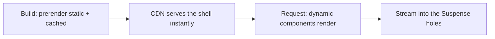

# Rendering in Next.js {#ch-rendering-in-nextjs}

> Stop choosing static or dynamic for a whole route, and start shipping a static shell with dynamic holes in it.

**In this chapter:** the three kinds of content · what makes a route dynamic · Partial Prerendering · Suspense as the boundary that permits it · reading the build output

## 💡 The Core Idea

The old question was "is this page static or dynamic?" and it had one answer per route. If any part of a
page needed the request — a name in the header, a cart count — the whole page became dynamic, and a
marketing hero that had not changed in six months was rendered again on every visit.

**Partial Prerendering removes the question.** One route is now a static shell, prerendered at build time
and servable from a CDN, with holes where the request-specific parts go. The shell arrives immediately;
the holes stream in when their data resolves. In Next.js 16 this is what the `cacheComponents` flag turns
on, and it makes three kinds of content coexist in a single response.

> The unit of the rendering decision moved from the route to the component. That is the whole idea; the
> API names are how this year spells it.

> ⚠️ **Moving target:** this shipped as `experimental.ppr`, then `dynamicIO`, and is `cacheComponents` in
> Next.js 16 — where the per-route `experimental_ppr` export has been removed entirely. The durable
> principle is that rendering is a per-component decision and a static shell can contain dynamic holes.

## How It Works

### Three kinds of content

| Kind        | What it is                                     | When it renders            | Where it comes from |
| ----------- | ---------------------------------------------- | -------------------------- | ------------------- |
| **Static**  | Markup with no async data — headers, nav, copy | Build time                  | The prerendered shell |
| **Cached**  | Async data marked `use cache`                   | Build or first request, then reused | The shell, too |
| **Dynamic** | Anything reading the request                    | Per request, streamed       | After the shell      |

The important line in that table is the second one. **Cached content is part of the static shell.** A
product list refreshed hourly is served from the CDN with the header, not fetched when the user arrives.

```tsx
export default function BlogPage() {
  return (
    <>
      <header><h1>Our Blog</h1></header>   {/* static */}
      <BlogPosts />                        {/* cached — in the shell */}
      <Suspense fallback={<PrefsSkeleton />}>
        <UserPreferences />                {/* dynamic — streams in */}
      </Suspense>
    </>
  );
}

async function BlogPosts() {
  "use cache";
  cacheLife("hours");
  return <PostList posts={await fetchPosts()} />;
}

async function UserPreferences() {
  const theme = (await cookies()).get("theme")?.value ?? "light";
  return <Prefs theme={theme} />;
}
```

### What makes something dynamic

Only one thing: reading data that exists solely because a request arrived.

- `cookies()`, `headers()`, `draftMode()`
- `searchParams` on a page
- `connection()` — the explicit way to say "wait for a request", needed for request-time randomness

Everything else is static or cacheable until proven otherwise. All of these are asynchronous in Next.js
16 precisely so that prerendering can start before they resolve.

### Suspense is what makes the shell possible

A dynamic component with no Suspense boundary around it has nowhere to be a hole, so the whole route has
to wait for it. **The boundary is not a loading nicety — it is the seam the prerenderer cuts along.**



**One route, two phases: the shell is built once, the holes are filled per request.**

Where you draw the boundary is a design decision. Too high and half the page waits behind one slow
query. Too low and the user reads a page of shimmering rectangles. The rule that holds up: **one boundary
per thing the user would wait for separately.**

### Dynamic segments and `generateStaticParams`

A route with a `[slug]` prerenders nothing unless you say which slugs exist.

```tsx
export async function generateStaticParams(): Promise<{ slug: string }[]> {
  const posts = await getPosts();
  return posts.map((post) => ({ slug: post.slug }));
}
```

Return the top few hundred, not all fifty thousand. Anything omitted renders on first request and is
cached from then on, which is the behaviour that used to be called incremental static regeneration.

### Mapping the old configuration

If you are reading an existing codebase, these are what the route segment exports became.

| Old                          | Now                                   |
| ---------------------------- | ------------------------------------- |
| `experimental.ppr` config     | `cacheComponents: true`               |
| `export const experimental_ppr` | Removed — the flag covers it        |
| `dynamic = "force-dynamic"`   | Nothing — that is the default          |
| `dynamic = "force-static"`    | `"use cache"` plus `cacheLife("max")` |
| `revalidate = 60`             | `cacheLife({ revalidate: 60 })`       |
| `unstable_cache(...)`         | `"use cache"`                         |

### Reading the build output

`next build` prints a symbol per route saying what it decided. Treat the list as a review artefact: a
route you expected to be a static shell that is marked fully dynamic is a bug you can see before any user
does. The usual cause is one `cookies()` call above every Suspense boundary, which turns the entire route
dynamic.

## When to Use It

| Route                                          | Shape                                                     |
| ---------------------------------------------- | --------------------------------------------------------- |
| Marketing or documentation page                 | Fully static; no boundaries needed                        |
| Product listing with an hourly refresh          | `use cache` with `cacheLife("hours")` — still in the shell |
| Product page with live stock                    | Static shell, stock inside a Suspense boundary            |
| Dashboard, all of it per-user                   | Static chrome, everything else streamed                   |
| Checkout                                        | Dynamic throughout — correctness beats first paint        |
| A route personalised above the fold             | Personalise in the request layer, not by going dynamic    |

## Common Mistakes

**❌ `cookies()` at the top of the page component.** Everything below it is now dynamic, the shell is
gone, and the page pays request-time cost for a theme preference. Read it in the smallest component that
needs it, inside a boundary.

**❌ Reaching for `force-dynamic` to fix stale data.** It is the largest hammer available and it removes
the static shell from a route to solve a problem that was one missing cache tag.

**❌ Dynamic content with no Suspense boundary.** There is no hole for it to stream into, so the entire
response waits. The symptom is a route that quietly stopped being prerendered.

**❌ `generateStaticParams` returning everything.** Fifty thousand pages at build time is a forty-minute
deploy for pages nobody requests. Prerender the popular ones and let the tail render on demand.

**❌ `Date.now()` or `Math.random()` inside `use cache`.** It runs once, at cache-fill time, and every
subsequent reader sees the same frozen value. For request-time randomness, `await connection()` first.

**❌ Assuming this is Vercel-only.** Partial Prerendering is a rendering strategy: build a shell, stream
the rest. Any host that can serve static files and run a Node.js server can do it; what differs between
platforms is where the shell is cached and how cold the server starts.

## 🔑 Key Takeaways

- A route is no longer static or dynamic — it is a static shell with dynamic holes streamed into it.
- Cached content is part of the shell; only request data is dynamic.
- Reading `cookies()`, `headers()` or `searchParams` is the only thing that makes something dynamic.
- Suspense boundaries are what allow the shell to exist, not just what shows a spinner.
- `cacheComponents: true` replaces `experimental.ppr`, and the per-route `experimental_ppr` export is gone.

## Interview Questions

**Q: What problem does Partial Prerendering solve?**

The all-or-nothing rendering decision. Before it, one personalised element anywhere on a page forced the
whole route to render per request, so a mostly-static page paid dynamic cost for a name in the header.
PPR prerenders everything that does not depend on the request into a shell that a CDN can serve
instantly, and streams the request-specific parts into holes marked by Suspense boundaries.

**Q: How do you decide where the Suspense boundaries go?**

One per piece of content the user would sensibly wait for on its own. Each boundary is a seam the
prerenderer can cut along, so too few means slow content blocks fast content, and too many means the
first paint is a grid of skeletons. Group by what arrives together, and keep the boundary below anything
that should be in the shell.

**Q: A route you expected to be prerendered is marked fully dynamic in the build output. What do you look
for?**

A request API called above every Suspense boundary — usually `cookies()` or `headers()` in a layout or at
the top of the page. Everything below such a call is dynamic, so a single line removes the shell for the
entire route. The fix is to push the read into the smallest component that needs it and wrap that
component in a boundary.

**Q: When is a fully dynamic route the right answer?**

When correctness outranks first paint and nothing on the page is shared between users — checkout, an
authenticated account settings screen, an admin tool. Prerendering a shell for a page whose every element
is per-user buys a skeleton and adds a caching surface to reason about. The senior version of the answer
names the tradeoff rather than the default.

## What to Read Next

- [Chapter ?? — The Rendering Spectrum](#ch-rendering-spectrum) — where PPR sits among CSR, SSR, SSG and islands
- [Chapter ?? — Data Fetching and Caching](#ch-nextjs-data-and-caching) — what puts content in the shell
- [Chapter ?? — Suspense and Streaming](#ch-suspense-and-streaming) — the React mechanism underneath the holes
