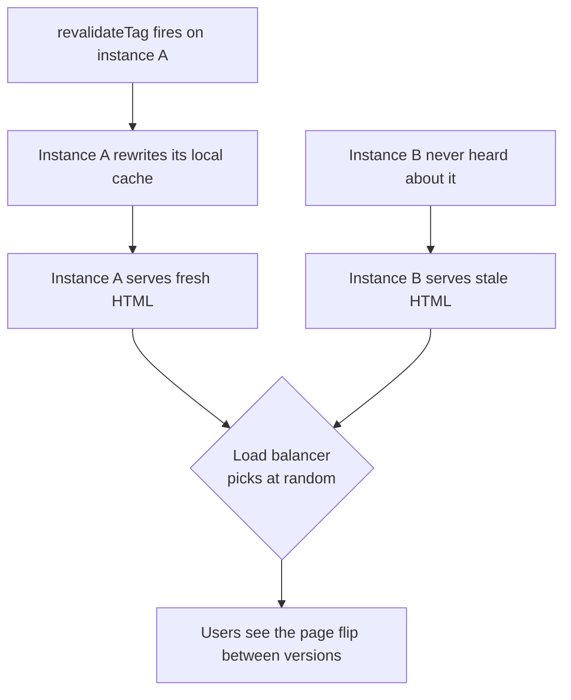

# Middleware, Runtimes and Deployment {#ch-nextjs-middleware-and-the-edge}

> Know where each piece of a Next.js app runs, keep the request layer small, and wire the build output so it survives a second server.

**In this chapter:** the rename to `proxy` · why auth checks here are optimistic · edge against Node.js · what `next build` emits · the cache that breaks on the second instance

## 💡 The Core Idea

A Next.js app runs in three places. **The request layer** runs before the router picks a route. **The
render** runs in a server runtime, usually Node.js and sometimes the edge. **The deployment target**
decides who serves the static files, who runs the server, and where the cache lives.

Most production bugs are work in the wrong place: an auth check nothing repeats, an edge query far
from the database, a local cache behind a load balancer. Each works in development and fails at scale.

> ⚠️ **Moving target:** Next.js 16 renamed `middleware.ts` to `proxy.ts` and the `middleware` export to
> `proxy`. `proxy` runs on Node.js only; code that needs the edge runtime stays in `middleware.ts` for
> now. 16 also adds a `cacheHandlers` map for `'use cache'`. The durable principle: routing decisions
> stay small, and a cache shared by several processes must live where all of them can reach it.

## How It Works

### The request layer

The request layer sees the URL, headers and cookies, and can redirect, rewrite or add a header. It runs
on **every request that matches its pattern**, so work put here is work multiplied by traffic.

**A locale rewrite in `proxy.ts`, with a matcher that skips static output**

```typescript
// proxy.ts — at the project root
import { NextResponse } from "next/server";
import type { NextRequest } from "next/server";

export function proxy(request: NextRequest): NextResponse {
  const locale = request.cookies.get("locale")?.value ?? "en";
  return NextResponse.rewrite(new URL(`/${locale}${request.nextUrl.pathname}`, request.url));
}

export const config = {
  matcher: ["/((?!_next/static|_next/image|favicon.ico).*)"],
};
```

The `matcher` is the cost control. Without one, the function runs for every image and every chunk.
The layer is good at redirects, locale rewrites, A/B bucketing and cheap cookie checks.

### Auth here is optimistic, and only optimistic

A cookie check here is a **presence check**, not session verification.

**An optimistic redirect for signed-out users**

```typescript
// ✅ Is there a session cookie at all? Cheap, and correct as a redirect.
export function proxy(request: NextRequest): NextResponse | undefined {
  const hasSession = request.cookies.has("session");
  if (!hasSession && request.nextUrl.pathname.startsWith("/dashboard")) {
    return NextResponse.redirect(new URL("/login", request.url));
  }
}
```

This cannot be the real check. A cookie can be present and invalid. A Server Action called directly
may not match the pattern. And proper verification costs a round trip on your hottest path.

**The real check belongs where the data is read**: in the Server Component, the Server Action, or a
data access layer both call. [Chapter ?? — Server Actions](#ch-server-actions) has the mutation half of
the same rule.

### Personalisation without going dynamic

The request layer can vary the *route* without making it dynamic. Rewrite by country header to
`/uk/pricing`, and every country page stays prerendered. Reading the header in the page would not.

> ⚠️ `NextResponse.next({ headers })` sends headers to the browser, not to your route. They can also
> override headers the framework sets. To pass a value downstream, set it on the **request** headers.

### Edge against Node.js

The edge runtime is a smaller JavaScript runtime that runs in many locations close to users. It is not
a faster Node.js; it is a different set of tradeoffs.

| Dimension        | Edge                                    | Node.js                              |
| ---------------- | --------------------------------------- | ------------------------------------ |
| Cold start       | Very small                              | Larger, and warm most of the time    |
| Distance to user | Close                                   | One or a few regions                 |
| Distance to data | Usually far — the database has one home | Usually co-located                   |
| API surface      | Web APIs only — no `fs`, limited crypto | Everything, and every npm package    |
| Best at          | Header and cookie decisions, redirects  | Rendering, database work, heavy logic |

The failure mode is a data-reading route at the edge while the database sits in one region. Every
query crosses a continent, so a function that started 20 ms sooner finishes 200 ms later. **Latency to
the user is half the number; latency to the data is the other half.** Node.js is the default.

### What `next build` emits

A build does not produce "an app". It produces three things with different hosting needs. The route
table it prints is the deployment contract.

| Output                     | Where it can live      | What it needs at runtime          |
| -------------------------- | ---------------------- | --------------------------------- |
| Static assets and pages    | A CDN or a bucket      | Nothing                           |
| Cached pages with a lifetime | A CDN, backed by a server | Somewhere to store and revalidate |
| Dynamic routes             | A server process       | The request, and your data        |

A managed platform wires these together silently. Self-hosted, you wire them, and you also own the
image optimiser's CPU. Stale pages and missing styles are one of the three handled wrongly.

For a container, set `output: 'standalone'`. It traces the files the server needs into one folder
with a `server.js` entry point. **It leaves out `.next/static` and `public/`**, because you may serve
those from a CDN. Copy both into the image yourself, or the app boots and looks unstyled.

### The cache breaks on the second instance

The incremental cache lives in each process, in memory and on disk. Two processes behind a load balancer break it:



**A per-instance cache turns one revalidation into a coin flip for every visitor.**

The fix is a shared cache handler, backed by Redis, S3, or anything every process can reach. Turn off
the in-memory copy so instances cannot disagree.

**A shared cache handler, with the per-instance memory cache disabled**

```typescript
// next.config.ts
import path from "node:path";
import type { NextConfig } from "next";

const config: NextConfig = {
  cacheHandler: path.resolve("./cache-handler.js"),
  cacheMaxMemorySize: 0, // no per-instance memory cache
};
export default config;
```

A handler implements `get`, `set` and tag invalidation. Teams skip the tag half, and it fails quietly.
`revalidateTag` has to reach **every** instance. Test it with two processes and one revalidation.

### Environment variables have two lifetimes

| Kind                   | Read at | Visible to  | Changing it needs |
| ---------------------- | ------- | ----------- | ----------------- |
| `NEXT_PUBLIC_ANYTHING` | Build   | The browser | A rebuild         |
| Any other variable     | Request | The server  | A restart         |

`NEXT_PUBLIC_` values are **inlined into the bundle** during `next build`. They are not secret, and
they are frozen into the artefact. A server variable is read at runtime only on a dynamic render.
Inside a prerendered route the build-time value is baked in; `await connection()` from `next/server`
moves that render to request time.

## When to Use It

| Situation                                       | Where it belongs                               |
| ----------------------------------------------- | ---------------------------------------------- |
| Redirect signed-out users away from `/dashboard` | The request layer — an optimistic cookie check |
| Confirm the user may read this record           | The Server Component or action that reads it   |
| Serve `/pricing` per country, still prerendered | A rewrite in the request layer                 |
| Anything that needs a database read             | Node.js, never the request layer               |
| A fully static marketing site                   | `output: 'export'` to a CDN                    |
| More than one server instance                   | A shared cache handler, always                 |

Previews, promotion and version skew are platform concerns, covered in [Chapter ?? — Platform Deploys](#ch-platform-deploys).

## Common Mistakes

**❌ Treating the request layer as the authorisation layer.** It runs before routing, not before every
data access. Check where the data is read.

**❌ No matcher, or one that catches static assets.** The function runs for every image and chunk. The
cost is invisible in development and obvious in the bill.

**❌ Scaling to two instances without a cache handler.** Revalidation reaches one process, and the same
URL serves two different pages.

**❌ Putting a secret behind `NEXT_PUBLIC_`.** It is compiled into the client bundle. The prefix declares
the value public.

## 🔑 Key Takeaways

- The request layer runs before routing on every matched request, so the `matcher` is its most important line.
- In Next.js 16 the file is `proxy.ts`, the export is `proxy`, and it runs on Node.js only.
- Auth in the request layer is an optimistic redirect; the real check belongs where the data is read.
- The edge is closer to users and further from your data, so Node.js is the default and the edge needs a reason.
- A build emits static assets, server code and a cache, and two instances need a shared cache handler.

## Interview Questions

**Q: Why is checking authentication in middleware not enough?**

A present cookie is not a valid session, and middleware may not run for every path to your data.
Verifying a token properly is also too costly for every request. It is a good redirect and a bad access
control decision, which belongs next to the query.

**Q: When is the edge runtime the wrong choice?**

When the work needs your data. Edge functions run near users and far from a database in one region, so
each query crosses the distance the function saved. With no filesystem and many npm packages
unavailable, Node.js is the sensible default for rendering and reads.

**Q: How would you serve different pricing pages by country without giving up prerendering?**

Read the country header in the request layer and rewrite to `/uk/pricing` or `/us/pricing`. Both stay
prerendered and CDN-servable. Reading the header in the page would make it dynamic for every visitor.

**Q: Why does incremental regeneration go wrong behind a load balancer?**

The default cache is per instance. A revalidation reaches whichever instance handled that request, and
the others keep serving the old page. Users see it flip depending on routing. The fix is a handler on
shared storage, `cacheMaxMemorySize` at zero, and tag invalidation that reaches every instance.

**Q: How would you deploy the same build to three environments?**

Build once and keep every environment-specific value server-side. No `NEXT_PUBLIC_` variable may differ,
because it is inlined at build time; the browser gets such values from an endpoint or server props.
Where a static route reads a server value, `connection()` moves that render to request time.

## What to Read Next

- [Chapter ?? — Rendering in Next.js](#ch-rendering-in-nextjs) — why a rewrite keeps a route prerendered
- [Chapter ?? — Data Fetching and Caching](#ch-nextjs-data-and-caching) — what the cache handler is storing
- [Chapter ?? — Platform Deploys](#ch-platform-deploys) — previews, promotion and version skew
