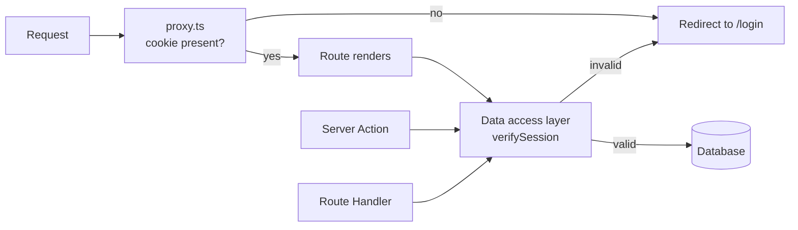

# Auth Patterns {#ch-nextjs-auth-patterns}

> Put the authoritative check next to the data, and treat everything in front of it as a convenience.

**In this chapter:** the three layers · session against token · the cookie that carries it · the data access layer · what `cookies()` will not let you do

## 💡 The Core Idea

An App Router application has many front doors. A page render, a Server Action, a Route Handler and a
client fetch can all reach the same database row, and they do not share a request pipeline. So the only
place a check is guaranteed to run is **the code that reads the row**.

That turns authentication into three layers with three different jobs. The proxy layer redirects people
who obviously should not be here. The render layer decides what to show. The data layer decides what is
allowed, every time, with no exceptions. Only the last one is security; the first two are user
experience.



**The three entry points converge on one check. The proxy is a shortcut past a wasted render, not a gate.**

> ⚠️ **Moving target:** `cookies()` and `headers()` are asynchronous from Next.js 15 and the synchronous
> forms are removed in 16. `middleware.ts` is now `proxy.ts`. `unauthorized()` and `forbidden()` still
> need `experimental.authInterrupts` in `next.config.ts`. The durable principle survives all three: the
> authoritative check belongs beside the query.

## How It Works

### Session or token

Both end up as an `httpOnly` cookie. What differs is whether the server can change its mind.

| | Database session | Signed token (JWT) |
| --- | --- | --- |
| Cookie holds | An opaque session id | The claims themselves |
| Verifying costs | One lookup per request | A signature check, no I/O |
| Revoking | Delete the row — immediate | Not possible before expiry |
| Claims change | Next request sees it | Next refresh sees it |
| Scales by | Your session store | Nothing to scale |

The senior answer is not "JWT because stateless". It is: **can you afford a stolen credential to stay
valid for its full lifetime?** For a public content site with 15-minute tokens, usually yes. For an
internal admin tool where an offboarded employee must lose access now, no. A common middle path stores
the session in the database and caches the lookup, keeping revocation while paying for it rarely.

Token mechanics — hashing a password, signing, rotation, refresh — belong to
[Chapter ?? — Credentials, Sessions and Tokens](#ch-credentials-and-sessions), and who may do what belongs to
[Chapter ?? — Authorisation](#ch-authorisation). This chapter is about where in an App Router
application those checks run.

### The cookie

```typescript
// lib/session.ts
import "server-only";
import { cookies } from "next/headers";

export async function createSession(sessionId: string, expiresAt: Date): Promise<void> {
  const store = await cookies(); // asynchronous since Next.js 15
  store.set("session", await encrypt({ sessionId, expiresAt }), {
    httpOnly: true, // JavaScript cannot read it, so XSS cannot steal it
    secure: true, // HTTPS only
    sameSite: "lax", // survives top-level navigation, blocks cross-site POSTs
    path: "/",
    expires: expiresAt,
  });
}
```

`httpOnly` is the line that matters. A token in `localStorage` is readable by any script that gets onto
the page, and the App Router gives you no reason to put it there — the server can read a cookie during
render, and the client component that needs the user's name can be handed it as a prop.

### Where cookies can and cannot be set

**`cookies().set()` only works where a response is being built:** a Server Action or a Route Handler.
Calling it while rendering a Server Component throws, because the headers have already gone. Rolling a
session forward on every page view therefore cannot happen during render — do it in the proxy, or in the
action the user is already triggering.

### The data access layer

Put every read behind one module, and put the check inside it. `import "server-only"` makes it a build
error for that file to reach a client bundle.

```typescript
// lib/dal.ts
import "server-only";
import { cache } from "react";
import { cookies } from "next/headers";
import { redirect } from "next/navigation";

export const verifySession = cache(async (): Promise<{ userId: string; role: string }> => {
  const token = (await cookies()).get("session")?.value;
  const session = token ? await decrypt(token) : null;
  if (!session) redirect("/login");
  return { userId: session.userId, role: session.role };
});

export async function getInvoice(id: string) {
  const { userId } = await verifySession();
  // Ownership is part of the query, not a check after it
  return db.invoice.findFirst({ where: { id, ownerId: userId } });
}
```

Two things are doing work here. React's `cache()` deduplicates `verifySession` **within a single
request**, so a layout, three components and an action all verify once rather than four times. And the
ownership condition lives in the `where` clause — a query that cannot return someone else's row cannot
be forgotten to check.

### Interrupting the render

```typescript
// app/admin/page.tsx
import { verifySession } from "@/lib/dal";
import { forbidden } from "next/navigation";

export default async function AdminPage() {
  const { role } = await verifySession();
  if (role !== "admin") forbidden(); // renders app/forbidden.tsx with a 403
  return <AdminDashboard />;
}
```

`unauthorized()` (401) and `forbidden()` (403) render `unauthorized.tsx` and `forbidden.tsx`, the way
`notFound()` renders `not-found.tsx`. Like `redirect()`, they work by throwing, so **never call them
inside a `try` block** you also use for error handling — the catch swallows the navigation.

## When to Use It

| Question                                          | Where it is answered                          |
| ------------------------------------------------- | --------------------------------------------- |
| Is there a session cookie at all?                 | `proxy.ts` — redirect, cheaply                 |
| Should this nav item be visible?                  | The layout or page, from `verifySession()`     |
| May this user read this record?                   | The data access layer, inside the query        |
| May this user perform this mutation?              | The Server Action, before it writes            |
| Who is the user, in a Client Component?           | A prop passed down from a Server Component     |
| Has this user's access just been revoked?         | Only a session lookup can answer that          |

## Common Mistakes

**❌ Protecting routes only in the proxy.** It does not run for every path that reaches your data, and a
present cookie is not a valid session. See
[Chapter ?? — Middleware and the Edge](#ch-nextjs-middleware-and-the-edge).

**❌ Checking auth in a layout and assuming children are safe.** Layouts do not re-render on every
navigation between their children, and they never run for a Server Action or Route Handler.

**❌ Fetching the row, then comparing `row.ownerId` in the component.** Correct today, and one refactor
away from being dropped. Put ownership in the `where` clause.

**❌ Storing a token in `localStorage` so the client can read it.** That is exactly what makes XSS
worth exploiting. Use an `httpOnly` cookie and pass the display data down as props.

**❌ Calling `cookies().set()` during render.** The response headers are gone. Set cookies in an action,
a Route Handler, or the proxy.

**❌ Wrapping `redirect()` or `forbidden()` in `try`/`catch`.** They signal by throwing; catching them
turns a redirect into a silent error.

## 🔑 Key Takeaways

- A page, a Server Action and a Route Handler are separate entry points, so the authoritative check must live where the data is read.
- Sessions can be revoked immediately, tokens cannot — that tradeoff, not statelessness, decides which you use.
- Keep the credential in an `httpOnly` cookie and hand the client component data instead of the token.
- Wrap session verification in React's `cache()` so one request verifies once.
- `cookies().set()` needs a response being built, so it belongs in an action, a Route Handler, or the proxy.

## Interview Questions

**Q: Where do you put the authentication check in an App Router application, and why not middleware?**

In the data access layer that every read and mutation goes through, wrapped in `cache()` so it runs once
per request. Middleware — `proxy.ts` in Next.js 16 — sees a cookie's presence, not its validity, and does
not necessarily run for the Server Actions and Route Handlers that can reach the same data. It is the
right place for a cheap redirect and the wrong place for a decision.

**Q: Session or JWT for a new internal dashboard?**

Sessions, almost always. The deciding question is revocation: an internal tool needs an offboarded
account to lose access immediately, and a signed token stays valid until it expires no matter what the
server thinks. The usual objection is the per-request lookup, which a cache in front of the session store
handles at a fraction of the cost of getting revocation wrong.

**Q: Why is `httpOnly` the important flag, rather than `secure` or `sameSite`?**

Because it is the one that defeats the attack you cannot fully prevent. `secure` stops interception on
the wire and `sameSite` blunts cross-site requests, but if any script runs on your page — a dependency,
an injected string — anything reachable from JavaScript is already gone. `httpOnly` puts the credential
somewhere the page cannot read at all, which is why the App Router's server-side session model is worth
the small inconvenience.

**Q: A layout checks the session and redirects. Is the page underneath protected?**

No. Layouts persist across navigations between their children, so the check may not re-run, and they do
not execute for Server Actions or Route Handlers at all. Treat that check as what decides the navigation
UI, and keep the real check beside the query.

## What to Read Next

- [Chapter ?? — Server Actions](#ch-server-actions) — the mutation half of the same rule
- [Chapter ?? — Middleware and the Edge](#ch-nextjs-middleware-and-the-edge) — why the optimistic check stops where it does
- [Chapter ?? — Authorisation](#ch-authorisation) — roles, permissions, and modelling who may do what
