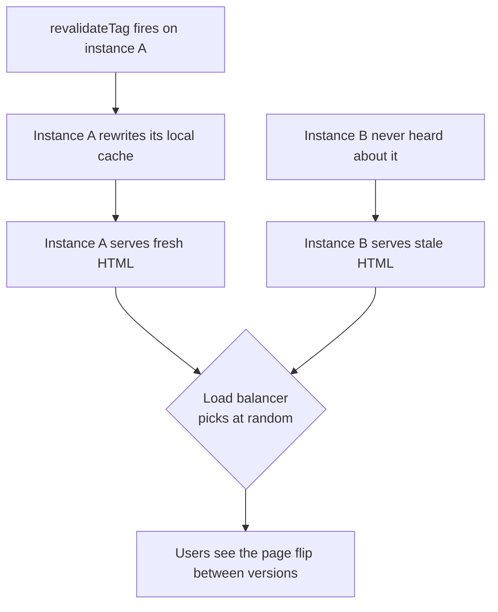

# Deployment and Runtime {#ch-nextjs-deployment-and-runtime}

> Read what `next build` produces, and every hosting decision after it becomes obvious.

**In this chapter:** the three things a build emits · `output: 'standalone'` · why ISR breaks on the second instance · the image optimiser you now own · build-time against runtime environment variables

## 💡 The Core Idea

`next build` does not produce "an app". It produces three different things with three different hosting
requirements: **static files** that any CDN can serve, **server code** that needs a Node.js process, and
**a cache** that both of them read and write.

A managed platform wires those three together and never mentions them. Self-hosting means you wire them
yourself, and every self-hosting problem people run into — stale pages, missing assets, an image
optimiser eating CPU — is one of the three being handled wrongly. Read the build output and you can
predict which one will bite.

> ⚠️ **Moving target:** the self-hosting surface has moved. `next.config` had a single `cacheHandler`;
> Next.js 16 adds a `cacheHandlers` map with `default` and `remote` entries to match Cache Components.
> Check which your version expects before copying a handler from a blog post. The durable principle is
> that a cache shared by several processes has to live somewhere all of them can reach.

## How It Works

### What the build emits

Run a build and read the route table it prints. Every route is classified, and the classification is the
deployment contract:

| Route type            | Where it can live      | What it needs at runtime          |
| --------------------- | ---------------------- | --------------------------------- |
| Prerendered (static)  | A CDN, a bucket        | Nothing                           |
| Cached with a lifetime | A CDN, backed by a server | Somewhere to store and revalidate |
| Dynamic               | A server process       | The request, and your data        |

Three directories matter. `.next/static` holds the hashed client assets — **immutable, and safe to cache
forever**. The server bundle runs the dynamic routes. And the cache directory holds prerendered output
that gets regenerated over time.

### `output: 'standalone'`

The default build leaves you needing `node_modules` and the whole repository. Standalone output traces
exactly which files the server needs and copies them into one folder with a `server.js` entry point.

```typescript
// next.config.ts
import type { NextConfig } from "next";
const config: NextConfig = { output: "standalone" };
export default config;
```

```dockerfile
FROM node:22-alpine AS runner
WORKDIR /app
ENV NODE_ENV=production HOSTNAME=0.0.0.0 PORT=3000
COPY --from=builder /app/.next/standalone ./
COPY --from=builder /app/.next/static ./.next/static
COPY --from=builder /app/public ./public
CMD ["node", "server.js"]
```

The two `COPY` lines after the first are the ones people forget. **Standalone does not include
`.next/static` or `public/`** — it assumes you may want to serve them from a CDN instead. Miss them and
the app boots, renders, and looks unstyled.

### The cache breaks on the second instance

Incremental regeneration writes to the local filesystem by default. One process, no problem. Two
processes behind a load balancer, and the problem is immediate:



**A per-instance cache turns one revalidation into a coin flip for every visitor.**

The fix is a shared cache handler — Redis, S3, or anything both processes can reach — plus disabling the
in-memory copy so instances cannot disagree:

```typescript
// next.config.ts
import path from "node:path";

const config: NextConfig = {
  cacheHandler: path.resolve("./cache-handler.js"),
  cacheMaxMemorySize: 0, // no per-instance memory cache
};
```

A handler implements `get`, `set` and tag invalidation. The tag half is the part that gets skipped and
then quietly fails, because `revalidateTag` has to reach **every** instance, not just the one that
handled the request. Test it by running two processes and revalidating against one.

### The image optimiser is CPU you now own

On a managed platform, resizing happens on someone else's machine and is cached at their edge. Self-hosted,
it happens in your Node process, in front of your users, on every new size. Three ways to keep it sane:
restrict `deviceSizes` and `imageSizes` so fewer variants exist, raise `minimumCacheTTL` so results are
reused, or point a custom loader at an image CDN and take the work out of your app entirely. The prop
mechanics are in [Chapter ?? — Images, Fonts, and Assets](#ch-nextjs-assets).

### Environment variables have two lifetimes

| Kind                     | Read at      | Visible to  | Changing it needs |
| ------------------------ | ------------ | ----------- | ----------------- |
| `NEXT_PUBLIC_ANYTHING`   | Build        | The browser | A rebuild         |
| Any other variable       | Request      | The server  | A restart         |

`NEXT_PUBLIC_` values are **inlined into the JavaScript bundle** during `next build`. They are not
secrets, and they are frozen into the artefact — which is why a Docker image built for staging cannot be
promoted to production if the API URL is public.

Server-side variables are read at runtime, but only on a dynamic render. Reading one inside a
prerendered route bakes the build-time value in. `connection()` forces the render to request time when
you genuinely need the value to follow the environment:

```tsx
import { connection } from "next/server";

export default async function Page() {
  await connection(); // opt this render out of prerendering
  const region = process.env.DEPLOY_REGION;
  return <Footer region={region} />;
}
```

**The rule for one artefact across environments:** keep everything environment-specific server-side, and
fetch anything the browser needs from an endpoint rather than inlining it.

## When to Use It

| Situation                                    | Choose                          | Why                                        |
| -------------------------------------------- | ------------------------------- | ------------------------------------------ |
| Small team, no platform engineers             | A managed Next.js platform      | The three build outputs are wired for you  |
| Data or workloads pinned to your own network  | Self-host in a container        | The runtime has to sit beside the data     |
| Compliance requires a named region            | Self-host, or a region-pinned plan | You must be able to prove where it runs  |
| Fully static marketing site                   | `output: 'export'` to a CDN     | No server, no cache, nothing to operate    |
| Serverless without a managed platform         | An adapter such as OpenNext     | It re-implements the wiring for your cloud |
| More than one server instance                 | A shared cache handler, always  | Otherwise ISR is a coin flip               |

Preview environments, promoting a build artefact, and version skew between a cached client and a new
server are platform concerns rather than Next.js ones — they are covered in
[Chapter ?? — Platform Deploys](#ch-platform-deploys).

## Common Mistakes

**❌ Copying `.next/standalone` and nothing else.** `public/` and `.next/static` are separate. The app
runs and looks broken.

**❌ Scaling to two instances without a cache handler.** Revalidation reaches one process, and the same
URL serves two different pages.

**❌ Putting a secret behind `NEXT_PUBLIC_`.** It is compiled into the client bundle. The prefix is a
declaration that the value is public, not a request for one.

**❌ Expecting a server variable to change without a redeploy.** If the route is prerendered, the value
was read at build time. `connection()` or another request API is what moves it to runtime.

**❌ Self-hosting the image optimiser at scale and not measuring it.** It is the CPU cost a managed
platform was absorbing for you.

**❌ Forgetting `HOSTNAME=0.0.0.0` in a container.** The server binds to localhost and the health check
never passes.

## 🔑 Key Takeaways

- A build emits static assets, server code and a cache — every hosting decision is about who owns each.
- `output: 'standalone'` traces the server's files, but you copy `public/` and `.next/static` yourself.
- The moment there are two instances, incremental regeneration needs a shared cache handler with working tag invalidation.
- `NEXT_PUBLIC_` variables are inlined at build time, so they are neither secret nor promotable between environments.
- Self-hosting means owning the image optimiser's CPU, which a managed platform was quietly paying for.

## Interview Questions

**Q: What changes when you move a Next.js application off a managed platform?**

You take ownership of three things the platform was wiring together: serving the static assets, running
the server process, and storing the incremental cache. The first two are routine. The third is where
teams get caught, because the default cache is per-instance and only shows its cracks once you scale
past one process.

**Q: Why does incremental regeneration go wrong behind a load balancer?**

Because the cache is written to local disk. A revalidation reaches whichever instance handled that
request, so it rewrites its own copy while the others keep serving the old one, and users see the page
flip depending on routing. The fix is a cache handler backed by shared storage, with `cacheMaxMemorySize`
at zero and tag invalidation that actually reaches every instance.

**Q: What is the difference between a `NEXT_PUBLIC_` variable and a normal one?**

Lifetime and audience. `NEXT_PUBLIC_` values are substituted into the client bundle during the build, so
they are readable by anyone and fixed in the artefact. Everything else stays on the server and can be
read per request during a dynamic render. That difference is what decides whether one built image can be
promoted from staging to production.

**Q: How would you deploy the same build to three environments?**

Build once, keep every environment-specific value server-side, and let the running process read it. That
means no `NEXT_PUBLIC_` variable that differs between environments — anything the browser needs comes
from an endpoint or from props rendered on the server. Where a server value is read inside an otherwise
static route, `connection()` moves that render to request time so the value follows the deployment.

## What to Read Next

- [Chapter ?? — Platform Deploys](#ch-platform-deploys) — previews, promotion and version skew
- [Chapter ?? — Data Fetching and Caching](#ch-nextjs-data-and-caching) — what the cache handler is storing
- [Chapter ?? — Deployment Strategies and Rollback](#ch-deployment-strategies) — getting the artefact out safely
