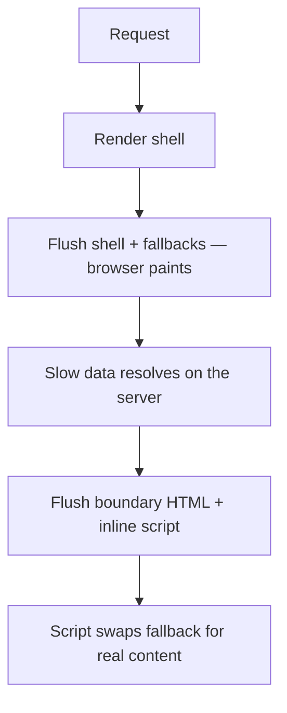

# Suspense and Streaming {#ch-suspense-and-streaming}

> Place a boundary where a user would accept waiting, and debug the hydration mismatch it exposes.

**In this chapter:** what a boundary declares · streaming SSR over the wire · where to put boundaries · hydration mismatches · fallbacks that do not shift the page

## 💡 The Core Idea

`<Suspense>` is a boundary, in the same sense as an error boundary. It does not fetch anything and it
does not make anything faster. It declares: **if this subtree is not ready, show this instead — and let
everything outside me carry on.**

That last clause is the whole value. Without a boundary, the slowest thing on the page decides when the
page appears. With one, the page appears immediately and the slow part fills in when it can.

> A boundary is a product decision written as code. You are choosing which part of the screen is
> allowed to be late, and what the user looks at while it is.

## How It Works

### Streaming server rendering

On the server, React renders as far as it can and sends that HTML straight away. Everything above and
around your boundaries is the **shell**. Each unresolved boundary goes out as its fallback, with a
placeholder.



**One response, several flushes. The browser paints after the first, not after the last.**

The swap happens with no client-side fetch and before React has hydrated — it is HTML and a tiny inline
script. This is why streaming improves what the user sees even on a slow device: the work is already
done by the time the JavaScript arrives.

The mechanics belong to the server renderer — `renderToPipeableStream` on Node, `renderToReadableStream`
on Web streams — and every meta-framework calls one of them for you.

### Boundaries are also code-split points

The same boundary catches `lazy()` components. A route that shows a heavy chart can send the shell, load
the chart bundle, and swap it in without the page ever being blank.

### Where to put them

This is the actual skill, and it is a design question more than a technical one.

| Placement                              | Result                                                     |
| -------------------------------------- | ----------------------------------------------------------- |
| One boundary around the whole page      | A spinner for the whole page — you have re-invented a loader |
| One per independent region              | ✅ The right default — nav, content, sidebar fill in separately |
| One per row in a list                   | A popcorn effect, and layout that jumps repeatedly           |
| None, with data awaited at the top      | Time to first byte becomes the slowest query on the page     |

Group by **what a user would accept waiting for together**. A comment count and a comment list belong in
one boundary. A comment list and the article do not.

### Hydration mismatches

Hydration attaches React to server-rendered HTML and expects the first client render to produce the same
tree. When it does not, React discards the server HTML for that subtree and re-renders it on the client
— slower, and visibly so.

| Cause                                        | Fix                                                     |
| --------------------------------------------- | -------------------------------------------------------- |
| `Date.now()`, `Math.random()`, `new Date()` in render | Compute it in an effect, or pass a fixed value as a prop |
| Locale or time-zone formatting                | Format on one side only, or send the formatted string    |
| `typeof window !== "undefined"` branching     | Render the server version, then switch in an effect       |
| Reading `localStorage` during render          | Read it in an effect, or inline a script before hydration |
| Invalid nesting — a `<div>` inside a `<p>`    | Fix the markup; the browser silently rewrote your tree     |

The last row catches people out. The browser repairs invalid HTML while parsing, so the DOM React finds
is not the DOM it sent, and the mismatch has nothing to do with your data.

> ⚠️ `suppressHydrationWarning` silences the message, not the mismatch. It is correct for exactly one
> case — a value that is *known* to differ, such as a rendered timestamp — and it applies to that one
> element only. Reaching for it to clear a console is how a re-rendered subtree ships unnoticed.

### Suspense on the client

The same boundary works after load. `use(promise)` in a Client Component suspends until the promise
resolves, and the nearest boundary shows its fallback.

```tsx
"use client";

export function Comments({ commentsPromise }: { commentsPromise: Promise<Comment[]> }) {
  const comments: Comment[] = use(commentsPromise);
  return <ul>{comments.map((c: Comment) => <li key={c.id}>{c.text}</li>)}</ul>;
}
```

One caution: a promise created *during* render is a new promise every render, which suspends forever.
The promise has to come from somewhere stable — a Server Component prop, a cache, or a query library.

## When to Use It

| Situation                                          | Boundary?                                    |
| --------------------------------------------------- | --------------------------------------------- |
| A slow query the rest of the page does not need     | ✅ Yes — this is the case it exists for       |
| A heavy component loaded with `lazy()`              | ✅ Yes                                        |
| Data the page is meaningless without                | ❌ No — await it in the shell                 |
| Filtering a list the user already sees              | ❌ No — a transition, so the old list stays   |

That last row is the distinction worth holding on to. Suspense is for content that **does not exist
yet**. A transition is for content that exists and is being **replaced**. Wrapping a re-filter in
Suspense throws away a good screen to show a spinner.

## Common Mistakes

**❌ One boundary at the root.** Everything is inside it, so everything waits together. The page-level
spinner is back, with extra ceremony.

**❌ A fallback of a different size to the content.** A 40-pixel spinner replaced by a 600-pixel list
shifts everything below it and costs you Cumulative Layout Shift. **✅ Make the skeleton the shape of
the thing.**

**❌ Awaiting everything in the server component to keep the code tidy.** Each `await` before the return
delays the shell. Start the promises together, await only what the shell needs, and pass the rest down.

**❌ Treating a hydration warning as noise.** It means a subtree was thrown away and re-rendered. On a
list of any size that is a real, measurable regression.

## 🔑 Key Takeaways

- A Suspense boundary declares what may be late and what the user sees meanwhile; it never fetches.
- Streaming SSR sends the shell first and swaps each boundary's HTML in as its data resolves, before hydration.
- Boundary placement is a product decision — group content a user would accept waiting for together.
- A hydration mismatch makes React discard and re-render the subtree, and invalid HTML nesting causes it as often as data does.
- Suspense is for content that does not exist yet; a transition is for content being replaced.

## Interview Questions

**Q: What does adding a Suspense boundary actually do to the response?**

It splits it. React renders and flushes everything outside the boundary immediately, with the fallback in
the boundary's place, so the browser can paint. When the boundary's data resolves, React streams that
HTML in the same response with a small inline script that swaps it into place. Nothing about the query
got faster; the page simply stopped waiting for it.

**Q: How would you debug a hydration mismatch?**

Start by reading which element React names, then check the three usual causes in order: non-deterministic
values in render such as dates and random numbers, branching on `typeof window`, and invalid HTML
nesting that the browser silently repaired while parsing. Only after ruling those out is it a data
problem, and `suppressHydrationWarning` is a fix for exactly one case — a value you know legitimately
differs on the two sides.

**Q: Suspense or a transition for a search filter?**

A transition. The user is looking at results already, and Suspense would replace a perfectly good list
with a skeleton on every keystroke. `useDeferredValue` or `useTransition` keeps the previous results on
screen, marked as stale, while the new ones render. Suspense is for the first load, when there is
nothing to keep.

**Q: Is there such a thing as too many boundaries?**

Yes. Every boundary is a piece of the page that can appear at a different moment, so a boundary per row
gives you content popping in for several seconds and layout shifting each time. Boundaries should follow
the regions a user perceives as separate — navigation, main content, a sidebar — not the shape of your
component tree.

## What to Read Next

- [Chapter ?? — Transitions and Concurrency](#ch-transitions-and-concurrency) — the tool for content that already exists
- [Chapter ?? — Server Components and Client Components](#ch-server-components-vs-client-components) — where the streamed promise comes from
- [Chapter ?? — Streaming HTML](#ch-streaming-html) — the same mechanism without React in the picture
