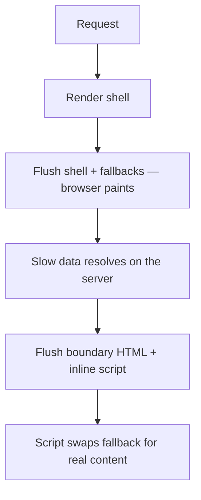

# Suspense, Streaming and Error Boundaries {#ch-suspense-and-streaming}

> Decide which parts of a page may be late and which may fail, and place one pair of boundaries for each.

**In this chapter:** two boundaries, two failure modes · streaming SSR over the wire · what an error boundary does not catch · where to put boundaries · hydration mismatches

## 💡 The Core Idea

React has two boundaries, and they are siblings. A **Suspense boundary** catches "not ready yet". An
**error boundary** catches "failed". Neither one fetches data or fixes a bug. Each one declares what the
user sees instead, and lets everything outside it carry on.

Without them, the slowest query decides when the page appears, and one error thrown during render
unmounts the whole React tree. With them, a slow panel shows a skeleton and a broken one a message.

> A boundary is a product decision written as code. You choose which part of the screen may be late,
> which part may fail, and what the user looks at in each case.

## How It Works

### Two boundaries, one region

A region that loads data can be loading, loaded or failed, so it usually gets both boundaries.

**One region, both boundaries:**

```tsx
<ErrorBoundary fallback={<ChartUnavailable />}>
  <Suspense fallback={<ChartSkeleton />}>
    <RevenueChart /> {/* suspends while loading, throws if the fetch fails */}
  </Suspense>
</ErrorBoundary>
```

The error boundary must sit above the component that throws. Put it outside the Suspense boundary, as
the React docs do, so the failure message replaces the whole region, skeleton included.

### Streaming server rendering

On the server, React renders as far as it can and sends that HTML at once. Everything above and around
your Suspense boundaries is the **shell**. Each unresolved boundary goes out as its fallback.



**One response, several flushes. The browser paints after the first, not after the last.**

The swap is HTML plus a tiny inline script, with no client fetch and no wait for hydration. So streaming
helps even on a slow device. The server renderer does this — `renderToPipeableStream` on Node, `renderToReadableStream` on Web streams —
and every meta-framework calls one of them for you.

React cannot un-send HTML. If a component throws after the shell is sent, React asks the client to
render that subtree again. Either it succeeds after a short delay, or the error boundary's fallback appears.

### The error boundary itself

An error boundary is still a class component. The two lifecycle methods it needs have no hook
equivalent. You write it once per codebase, or use the `react-error-boundary` package.

**A minimal boundary:**

```tsx
import React from "react";

type BoundaryProps = { fallback: React.ReactNode; children: React.ReactNode };

class ErrorBoundary extends React.Component<BoundaryProps, { hasError: boolean }> {
  state = { hasError: false };

  // Pure — decides what renders next. No side effects here.
  static getDerivedStateFromError(): { hasError: boolean } {
    return { hasError: true };
  }

  // The side-effect half: this is where reporting belongs.
  componentDidCatch(error: Error, info: React.ErrorInfo): void {
    reportError(error, info.componentStack); // componentStack, not error.stack
  }

  render(): React.ReactNode {
    return this.state.hasError ? this.props.fallback : this.props.children;
  }
}
```

`getDerivedStateFromError` runs during render and must stay pure. `componentDidCatch` runs after, and
only it may log or report. Capture `info.componentStack`. A JavaScript stack names the function that
threw. The component stack names the route, the layout and the list item, which usually finds the bug.

### What an error boundary does not catch

| Where the error happens               | Caught? | What catches it instead                |
| ------------------------------------- | ------- | -------------------------------------- |
| Rendering a child component           | ✅      | The nearest boundary above it          |
| A child's lifecycle or effect         | ✅      | The nearest boundary above it          |
| An event handler such as `onClick`    | ❌      | A `try`/`catch`, and state you render  |
| `setTimeout`, `requestAnimationFrame` | ❌      | A `try`/`catch` inside the callback    |
| The boundary's own render             | ❌      | A boundary above it                    |

The event handler case surprises people. React is not on the call stack when a click handler runs. If
a failed save should show a message, set that message as state in a `catch` block.

### Suspense on the client

Both boundaries work after load too. React 19's `use(promise)` suspends until the promise settles and
the nearest Suspense fallback shows. If the promise rejects, the nearest error boundary takes over.

**Reading a streamed promise:**

```tsx
"use client";

export function Comments({ commentsPromise }: { commentsPromise: Promise<Comment[]> }) {
  const comments: Comment[] = use(commentsPromise);
  return <ul>{comments.map((c: Comment) => <li key={c.id}>{c.text}</li>)}</ul>;
}
```

A promise created *during* render is new every render and suspends forever. Take it from somewhere
stable: a Server Component prop, a cache, or a query library.

### Hydration mismatches

Hydration expects the first client render to match the server HTML. When it does not, React throws
that subtree away and re-renders it on the client, which is slower and visible.

| Cause                                                 | Fix                                                   |
| ----------------------------------------------------- | ----------------------------------------------------- |
| `Date.now()`, `Math.random()`, `new Date()` in render | Compute it in an effect, or pass a fixed value down   |
| `typeof window !== "undefined"` branching             | Render the server version, then switch in an effect   |
| Invalid nesting — a `<div>` inside a `<p>`            | Fix the markup; the browser repaired it while parsing |

React 19 exposes three root options for a production error reporter: `onCaughtError`,
`onUncaughtError` and `onRecoverableError`. Wire up the last one early. Hydration mismatches surface
there, and React recovers silently, so without it the bug stays invisible.

> ⚠️ `suppressHydrationWarning` silences the message, not the mismatch. It is correct for one case: a
> value *known* to differ, such as a rendered timestamp. It applies to that one element only.

## When to Use It

| Situation                                      | Reach for                                        |
| ---------------------------------------------- | ------------------------------------------------ |
| A slow query the rest of the page does not need | ✅ Suspense around that region                  |
| A fetch that can fail, or third-party content   | ✅ Suspense inside, error boundary outside      |
| Data the page is meaningless without            | ❌ No boundary — await it in the shell          |
| Filtering a list the user already sees          | ❌ No Suspense — a transition keeps the old list |
| A failed form submission or a missing record    | ❌ No error boundary — render it as state       |

Suspense is for content that **does not exist yet**; a transition is for content being **replaced**.
An error boundary is for failures you did not plan for; an expected failure is state you render.

### Where to put them

| Level                    | Suspense fallback                | Error fallback                              |
| ------------------------ | -------------------------------- | ------------------------------------------- |
| Root of the application  | ❌ A page-wide spinner           | A full-page error with a reload — last resort |
| Per route                | The shell, with the page loading | The shell and navigation, with the page failed |
| Per independent region   | ✅ Nav, content, sidebar fill in separately | ✅ One card replaced with a retry  |
| Per row in a list        | ❌ Content pops in, layout jumps | ❌ Noise — the list is the unit            |

Group Suspense by **what a user would accept waiting for together**. A comment count and a comment list
share a boundary. A comment list and the article do not. Place an error boundary **wherever the page
still means something without the subtree below it**. If not, the boundary belongs higher.

In the Next.js App Router, `loading.tsx` becomes a route-level Suspense boundary and `error.tsx` a
route-level error boundary. The placement decision is still yours.

## Common Mistakes

**❌ One boundary at the root and nothing else.** Everything waits together and fails together.

**❌ A fallback of a different size to the content.** A small spinner replaced by a tall list shifts the
page and costs Cumulative Layout Shift. **✅ Make the skeleton the shape of the thing.**

**❌ An error fallback with no way forward.** **✅ Add a "try again" reset, and a key that changes on
navigation so leaving the route clears the error.**

**❌ Swallowing the error, or showing it raw.** An empty `componentDidCatch` means nobody ever finds out.
`error.message` can carry internal identifiers or a query. **✅ Report every caught error, and show the
user a sentence written for a human.**

## 🔑 Key Takeaways

- A Suspense boundary catches "not ready yet" and an error boundary catches "failed"; neither fetches or fixes anything.
- Streaming SSR sends the shell first and swaps each boundary's HTML in as its data resolves, before hydration.
- An error boundary catches errors in rendering, lifecycles and effects below it — never event handlers, timers or its own render.
- Place both boundaries around regions the user sees as separate, with the error boundary outside the Suspense boundary.
- A hydration mismatch makes React re-render the subtree on the client, and invalid HTML nesting causes it as often as data does.

## Interview Questions

**Q: What does adding a Suspense boundary actually do to the response?**

It splits it. React flushes everything outside the boundary at once, with the fallback in its place, so
the browser can paint. When the data resolves, React streams that HTML in the same response with an
inline script that swaps it in. The query got no faster; the page stopped waiting for it.

**Q: What does an error boundary catch, and what does it miss?**

It catches errors thrown while rendering its subtree, and in the lifecycles and effects below it. It
misses anything React is not on the call stack for: event handlers, timers, and errors in the boundary
itself. Those need an ordinary `try`/`catch` with the result put into state.

**Q: How do you place boundaries in a dashboard with a dozen independent widgets?**

Each widget gets an error boundary with a Suspense boundary inside it, plus one route-level boundary. A
failing third-party chart then costs the user that chart alone. The route boundary keeps navigation alive
so they can leave without reloading. A boundary per row goes too far.

**Q: Suspense or a transition for a search filter?**

A transition. The user already sees results, and Suspense would swap a good list for a skeleton on every
keystroke. `useTransition` or `useDeferredValue` keeps the old results on screen, marked stale, while the
new ones render. Suspense is for the first load, when there is nothing to keep.

**Q: When is an error boundary the wrong tool?**

When the failure is expected. Empty results, failed validation, an unauthorised response and a missing
record are states the interface should render on purpose. Throwing for them pushes normal flows down the
exception path and hides real crashes among the same alerts.

## What to Read Next

- [Chapter ?? — Performance, Transitions and the Compiler](#ch-react-performance-and-the-compiler) — the tool for content that already exists
- [Chapter ?? — Server Components and Client Components](#ch-server-components-vs-client-components) — where the streamed promise comes from
- [Chapter ?? — Actions and Forms](#ch-react-actions-and-forms) — where mutation failures belong instead
