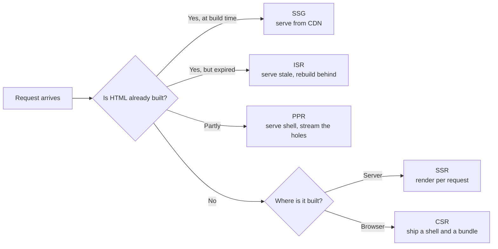

# The Rendering Spectrum and the Cost of Hydration {#ch-rendering-spectrum}

> Name every point on the spectrum from CSR to Server Components, and say what each one costs the browser before you pick one.

**In this chapter:** the two questions behind every strategy · CSR, SSR, SSG, ISR, PPR · what hydration rebuilds · islands, progressive hydration and resumability · the decision table

## 💡 The Core Idea

Every rendering strategy answers two questions, and only two.

**When is the HTML built?** At build time, at request time, or in the browser after the page loads.
**Where does the JavaScript run?** On a server, at a CDN edge location, or on the user's device.

Cross those two questions and you have the grid. SSG is build time on a server. SSR is request time on a
server. CSR is request time on the device. ISR is build time, then rebuilt and cached again. Partial
Prerendering is both at once, in one response.

Server HTML has a catch, though. It carries no listeners and no state. So the framework runs the same
components again in the browser to attach them. That second pass is **hydration**, and it costs as much
as the whole tree, not just the interactive parts.

That cost explains the spectrum. Each step from SSR towards islands and Server Components is one attempt
to ship and run less JavaScript. The acronyms change every few years. The grid and the cost do not.

> ⚠️ **Moving target:** the names on this spectrum move faster than the ideas. "ISR" is a Next.js term
> that SvelteKit, Nuxt and Astro all implement under their own names; Partial Prerendering left the
> `experimental` flag in Next.js 16 and now ships as part of Cache Components. The durable principle is
> **when the HTML is built, where the code runs, and how much of it the browser must re-run**.

## How It Works

### The spectrum in one picture

**Five strategies, told apart only by how much HTML exists before the request arrives.**

| Strategy | HTML built | Per-request server work | Data freshness |
| -------- | ---------- | ----------------------- | -------------- |
| **CSR** | In the browser, after the bundle runs | None | Live, once fetching finishes |
| **SSR** | On the server, on every request | Full render | Live |
| **SSG** | Once, at build | None | As of the last build |
| **ISR** | At build, then rebuilt in the background | One render per revalidation | Up to the revalidation window stale |
| **PPR** | Shell at build, holes per request | Partial render | Shell stale, holes live |

The third column decides most arguments. Server work is what you pay for, and what falls over under
load. A strategy with no per-request work cannot be overwhelmed by traffic. Only a cache miss can hurt it.

### ISR is a caching contract, not a rendering mode

ISR renders exactly like SSR. The difference is where the output goes. It is written to a durable cache
with a lifetime, and the next request reads the cache instead of rendering.

When the lifetime expires, two behaviours are possible. Confusing them causes real incidents:

- **Invalidate** — serve the stale copy at once and rebuild in the background. The user waits for
  nothing. This is *stale-while-revalidate*, the default in every framework that ships ISR.
- **Delete** — drop the entry, so the next request blocks while the page rebuilds. Right for a price;
  a latency spike everywhere else.

> ⚠️ Invalidation is usually keyed by a **tag**, and a coarse tag has a large blast radius. One
> `products` tag on 40,000 pages means one catalogue import rebuilds all of them. Tag by identity —
> `product:${id}` — and add a roll-up tag only where you want the sledgehammer.

### PPR: one response, two origins

Partial Prerendering splits a single route. The static parts are prerendered and cached. The dynamic
parts are marked as holes. On a request, the cached shell goes out at once, and a function streams the
holes into the same response. There is no second request and no client-side fetch waterfall.

The part candidates get wrong: **PPR does not remove the server invocation.** A route with holes runs a
function on every request. What PPR removes is the *wait*.

### What hydration actually costs

Everything above describes the HTML. Hydration is what the browser pays after that HTML lands. The page
looks ready, but it cannot respond until four steps finish:

| Cost | Scales with | Typical fix |
| ---- | ----------- | ----------- |
| **Download** | Bytes over the wire | Code splitting, compression |
| **Parse and compile** | Bytes of JavaScript | Fewer bytes; there is no other lever |
| **Execute** | Number of components in the tree | Hydrate less of the tree |
| **Attach and restore state** | Number of listeners and props | Send smaller props |

People underestimate the execute step. In most frameworks it is one long task. That long task is what
[Chapter ?? — Core Web Vitals](#ch-core-web-vitals) measures as blocking time. The user sees a painted
page and clicks, and nothing happens, because the main thread is re-running components.

That window is the **uncanny valley**: the page looks finished and behaves like a screenshot. The gap
between first paint and first response is the time-to-interactive (TTI) gap.

Hydration also needs the data the server rendered with. Frameworks serialise it into the document, as a
`<script>` block of JSON or the React Server Components payload. A page that renders a 200 KB product
list ships it twice: once as HTML, once as JSON. Pass only the fields the component renders.

### Hydration mismatch

Hydration assumes the client render produces the same markup as the server. When it does not, the
framework has a **mismatch**. The usual causes are a date, a random value, or a `typeof window` check.

React does not patch the difference quietly. It discards the server HTML for that subtree and renders it
again on the client. You paid for server rendering, shipped the HTML, then rendered it a second time.

### Four ways to hydrate less

This is where the right-hand end of the spectrum comes from.

**Partial hydration (islands)** renders the page as static HTML and hydrates only marked components.
Astro made this mainstream, with per-island directives: `client:load` for immediate, `client:idle` for
when the browser goes quiet, `client:visible` for when the component scrolls into view. The rest of the
page ships no JavaScript. Its execute cost is not reduced. It is **absent**.

**Progressive and selective hydration** keeps one application but breaks the long task into many.
React does this around Suspense boundaries. Each boundary hydrates on its own, and a click on a boundary
not yet hydrated makes React hydrate that one first. The total work is the same. Interactivity arrives in
the order the user needs it.

**Server Components**, stable since React 19, attack the cost from the framework side. A component that
never runs on the client adds nothing to the bundle and nothing to hydration. Islands are static until you
opt in. React is client until you stay on the server side of the boundary.

**Resumability** is the contrast case: it removes the second pass instead of shrinking it. Qwik
serialises listener references and state into the HTML, so the browser attaches nothing up front. The
first click fetches the handler's chunk and carries on from where the server stopped.

| Approach | Execute cost | Best for | Cost you accept |
| -------- | ------------ | -------- | --------------- |
| Full hydration | Whole tree, one task | Apps interactive throughout | Blocked main thread on load |
| Islands | Marked components only | Content sites with a few widgets | Islands cannot easily share client state |
| Progressive | Whole tree, many tasks | Large single-page apps | Complexity, and no byte savings |
| Server Components | Client components only | React apps with a static majority | A serialisation boundary to design |
| Resumability | Near zero at startup | Very large pages, low-powered devices | Bigger HTML, fetches on first interactions |

### Measuring it, not guessing

Check **Total Blocking Time** in a lab run, and **INP** from the field for interactions soon after load.
In the flame chart, one wide block labelled with your framework's root render is hydration. If TBT is
small and INP is bad, hydration is not the problem. Look for an expensive event handler instead.

## When to Use It

| Route | Choose | Because |
| ----- | ------ | ------- |
| Marketing page, docs, changelog | **SSG** | Content changes on a deploy cadence; zero server cost |
| Product listing, article index | **ISR** | Fresh enough at a fixed interval, priced like static |
| Logged-in dashboard | **CSR** or **SSR shell**, split by route | No crawler cares, and there is no static majority to save |
| Public page with a personalised strip | **PPR** | The shell is shared, the strip is not |
| Search results, anything driven by query parameters | **SSR** | The cache key is unbounded, so caching buys nothing |
| Content site with a few interactive widgets | **SSG + islands** | Most of the page never needed JavaScript |
| Large app, slow devices in the field | **Server Components** or resumability | The tree size is the cost |

Two rules survive every case. **Cache what is shared; render what is personal.** And **the more distinct
cache keys a route has, the less caching is worth.** A page keyed by user identity has a hit rate near zero.

## Common Mistakes

**❌ Picking one strategy for the whole application.**
✅ A marketing site, a dashboard and a search page in one codebase have three correct answers. This is
the whole argument of [Chapter ?? — Choosing a Rendering Strategy per Route, with SEO](#ch-choosing-per-route).

**❌ Reaching for SSR to fix a slow page.**
✅ SSR moves work to the server; it does not delete it. If the page ships 900 KB of JavaScript, SSR adds
a server bill and still hydrates the 900 KB. First paint gets faster; first response does not.

**❌ Marking every island `client:load` because it is the easy directive.**
✅ That is full hydration with extra steps. Default to `client:visible` or `client:idle`; justify each `client:load`.

**❌ Fixing hydration mismatch warnings by suppressing them.**
✅ The warning hides a second render of that subtree. Find the value that differs and make it agree.
[Chapter ?? — Suspense, Streaming and Error Boundaries](#ch-suspense-and-streaming) covers the diagnosis.

## 🔑 Key Takeaways

- Every strategy answers two questions: when the HTML is built, and where the code runs.
- ISR is SSR plus a cache with a lifetime, and PPR still runs a function for every request with holes.
- Hydration re-runs the whole component tree, and its execute step is the long task that blocks the first click.
- Islands and Server Components remove client work, progressive hydration only reschedules it, and resumability skips the second pass.
- If Total Blocking Time is healthy, hydration is not why the page feels slow.

## Interview Questions

**Q: What is the difference between SSR and SSG in terms of what the server does?**

SSG runs the render once, at build, and afterwards the server is a file host. SSR renders on every
request, so the server needs the data source, the render budget and the capacity to survive a spike. The
HTML can be byte-identical. The difference is cost and freshness.

**Q: A page uses ISR with a 60-second revalidation. A user reports data five minutes old. Is this a bug?**

Not necessarily. Stale-while-revalidate serves the cached copy and rebuilds behind it, so the *next*
visitor gets fresh data. If the page gets one visit every five minutes, every visitor sees a stale page.
Low-traffic routes need on-demand invalidation, not a shorter interval.

**Q: The page paints in 800 ms but does not respond to clicks for another two seconds. What is happening?**

The HTML painted, but the framework is still downloading, parsing and executing the bundle to attach
listeners. The fix is to hydrate less: split by route, move components to the server, or turn the static
majority into islands. More server rendering widens the gap, because the page paints sooner.

**Q: Why does a hydration mismatch cost more than a console warning?**

React trusts the server HTML and patches only what it must. When the client render disagrees, it discards
the server output for that subtree and rebuilds it. You paid for server rendering, sent the HTML, then
rendered it again. On the root, that can mean re-rendering the whole page.

**Q: How does resumability differ from progressive hydration?**

Progressive hydration still runs every component on the client, in smaller pieces and a better order.
Resumability does not run them: the server serialises state and listener references into the HTML, and
code arrives on the first interaction that needs it. One reschedules the work; the other deletes most of it.

**Q: When are islands the wrong architecture, and when is CSR the right one?**

Islands are wrong when the interactive parts share state. They are separate roots, so a filter and its
results need a store outside both, a URL parameter, or one larger island. CSR is right when there is no
crawler and no shared HTML to cache, such as an authenticated dashboard. Server rendering there buys a
slightly faster paint and an uncacheable server bill.

## What to Read Next

- [Chapter ?? — Streaming HTML](#ch-streaming-html) — how the markup arrives before hydration can start
- [Chapter ?? — Choosing a Rendering Strategy per Route, with SEO](#ch-choosing-per-route) — turning this table into a decision you can defend
- [Chapter ?? — Server Components and Client Components](#ch-server-components-vs-client-components) — where the React boundary sits and what crosses it
