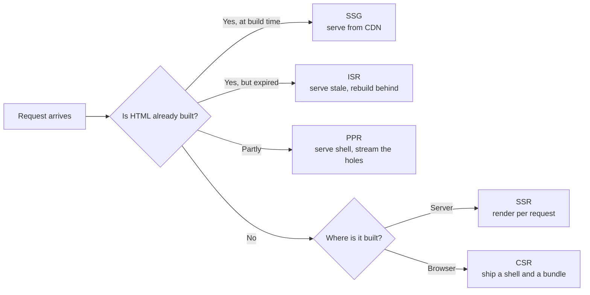

# The Rendering Spectrum {#ch-rendering-spectrum}

> Name every point on the spectrum from CSR to islands, and say what each one costs before you pick one.

**In this chapter:** the two questions behind every strategy · CSR, SSR, SSG, ISR, PPR · islands · the decision table · what the acronyms hide

## 💡 The Core Idea

Every rendering strategy is an answer to two questions, and only two.

**When is the HTML built?** At build time, at request time, or in the browser after the page loads.
**Where does the JavaScript run?** On a server, at a CDN edge location, or on the user's device.

Cross those two questions and you have the whole spectrum. SSG is build time on a server. SSR is request
time on a server. CSR is request time on the device. ISR is build time, then request time, then cached
again. Partial Prerendering is both at once in a single response.

The acronyms are the industry's shorthand for cells in that grid. They change names every few years.
The grid does not.

> ⚠️ **Moving target:** the names on this spectrum move faster than the ideas. "ISR" is a Next.js term
> that SvelteKit, Nuxt and Astro all implement under their own names; Partial Prerendering shipped on
> one platform first and is spreading. The durable principle is the grid — **when the HTML is built and
> where the code runs** — and every new acronym lands in one of its cells.

## How It Works

### The spectrum in one picture

**Five strategies, distinguished only by how much HTML exists before the request arrives.**

### What each one actually does

| Strategy | HTML built | Per-request server work | Data freshness |
| -------- | ---------- | ----------------------- | -------------- |
| **CSR** | In the browser, after the bundle runs | None | Live, once fetching finishes |
| **SSR** | On the server, on every request | Full render | Live |
| **SSG** | Once, at build | None | As of the last build |
| **ISR** | At build, then rebuilt in the background | One render per revalidation | Up to the revalidation window stale |
| **PPR** | Shell at build, holes per request | Partial render | Shell stale, holes live |

The column that decides most arguments is the third one. Server work is what you pay for, and it is what
falls over under load. A strategy that does no per-request work cannot be overwhelmed by traffic — it can
only be overwhelmed by a cache miss.

### ISR is a caching contract, not a rendering mode

ISR renders exactly like SSR. The difference is what happens to the output: it is written to a durable
cache with a lifetime, and the next request reads the cache instead of rendering.

When the lifetime expires, two behaviours are possible, and confusing them is a real production incident:

- **Invalidate** — serve the stale copy immediately and rebuild in the background. The user waits for
  nothing. This is *stale-while-revalidate*, and it is the default in every framework that ships ISR.
- **Delete** — drop the entry, so the next request blocks in the foreground while the page rebuilds.
  Correct when stale data is genuinely unacceptable — a price, a stock level — and a self-inflicted
  latency spike everywhere else.

> ⚠️ Invalidation is usually keyed by a **tag**, and a tag that is too coarse has a large blast radius.
> One `products` tag on 40,000 pages means a single catalogue import rebuilds all of them. Tag by
> identity — `product:${id}` — and add a roll-up tag only where you really want the sledgehammer.

### PPR: one response, two origins

Partial Prerendering splits a single route rather than a single application. The static parts of the page
are prerendered and cached. The dynamic parts are marked as holes. On a request, the cached shell goes
out immediately and a function fills the holes into the same streaming response.

The shell arrives at CDN speed and the personalised part arrives when it can. There is no second request
and no client-side fetch waterfall.

The part candidates get wrong: **PPR does not remove the server invocation.** A route with holes runs a
function on every request by definition. What it removes is the *wait* — the user sees layout, navigation
and content while the hole is still resolving.

### Islands and resumability are a different axis

CSR through PPR all describe *the HTML*. Islands describe *the JavaScript*.

An islands architecture renders the whole page to static HTML, then hydrates only the components you mark
as interactive — a search box, a cart widget — and ships no JavaScript at all for the rest. Astro made
this the default, with per-island loading directives such as `client:visible`, which defers a component's
JavaScript until it scrolls into view.

You can put islands on top of any of the five strategies above. That is why they belong on their own axis,
and why [Chapter ?? — Hydration and Its Costs](#ch-hydration-and-its-costs) covers them properly.

## When to Use It

| Route | Choose | Because |
| ----- | ------ | ------- |
| Marketing page, docs, changelog | **SSG** | Content changes on a deploy cadence; zero server cost |
| Product listing, article index | **ISR** | Fresh enough at a fixed interval, priced like static |
| Logged-in dashboard | **CSR** or **SSR shell** | No crawler cares; the data is per-user anyway |
| Public page with a personalised strip | **PPR** | The shell is shared, the strip is not |
| Search results, anything driven by query parameters | **SSR** | The cache key is unbounded, so caching buys nothing |
| Content site with a few interactive widgets | **SSG + islands** | Most of the page never needed JavaScript |

Two rules survive every specific case. **Cache what is shared; render what is personal.** And **the more
distinct cache keys a route has, the less caching is worth** — a page keyed by user identity has a hit
rate of roughly zero.

## Common Mistakes

**❌ Picking one strategy for the whole application.**
✅ A marketing site, a dashboard and a search page inside one codebase have three correct answers. This is
the whole argument of [Chapter ?? — Choosing Per Route, Not Per App](#ch-choosing-per-route).

**❌ Reaching for SSR to fix a slow page.**
✅ SSR moves work to the server; it does not delete it. If the page is slow because it loads 900 KB of
JavaScript, SSR adds a server bill and leaves the 900 KB in place.

**❌ Using SSG for content that changes hourly.**
✅ That is what ISR exists for. Rebuilding a 30,000-page site to change one price is a build-pipeline
problem you invented.

**❌ Multiplying cache variants without noticing.**
✅ Feature flags, experiments and locale prefixes each multiply the number of prerendered variants. Four
flags across three locales is twelve copies of every page, most of them cold. Retire finished experiments.

**❌ Treating "static" as a promise of speed.**
✅ Static HTML with a render-blocking font and a 2 MB hero image is slow. Rendering strategy sets the floor
for time to first byte. It has almost no effect on
[Chapter ?? — Core Web Vitals](#ch-core-web-vitals) beyond that.

## 🔑 Key Takeaways

- Every strategy answers two questions: when the HTML is built, and where the code runs.
- ISR is SSR plus a cache with a lifetime — the rendering is identical, the economics are not.
- PPR streams a cached shell and a per-request hole in one response; it does not remove the server call.
- Islands are about which JavaScript ships, so they combine with any of the other strategies.
- A route with an unbounded cache key gains nothing from caching, whatever you call the strategy.

## Interview Questions

**Q: What is the difference between SSR and SSG in terms of what the server does?**

SSG runs the render once, at build, and the server afterwards is a file host. SSR runs the render on
every request, so the server needs the data source, the render budget and the capacity to survive a
traffic spike. The output HTML can be byte-identical — the difference is entirely in cost and freshness.

**Q: A page uses ISR with a 60-second revalidation. A user reports seeing data that is five minutes old. Is this a bug?**

Not necessarily. Stale-while-revalidate serves the cached copy and rebuilds behind it, so the *next*
visitor gets fresh data, not this one. If the page gets one visit every five minutes, every visitor sees
a stale page. Low-traffic routes need on-demand invalidation, not a short interval.

**Q: When is client-side rendering the right answer in 2026?**

When there is no crawler to satisfy and no shared HTML to cache — an authenticated dashboard, an internal
tool, an editor. The data is per-user, so server rendering produces a page that can never be cached and
still needs the client bundle. You pay for the server and get a marginally faster first paint.

**Q: Why would you not use Partial Prerendering everywhere?**

Because a route with no shared static content has no shell worth caching, so PPR is plain SSR with more
moving parts. It also splits a page into two rendering contexts, which makes error handling and layout
shift harder to reason about. It earns its complexity on public pages with a personalised region.

## What to Read Next

- [Chapter ?? — Hydration and Its Costs](#ch-hydration-and-its-costs) — what the browser pays after the HTML lands
- [Chapter ?? — Choosing Per Route, Not Per App](#ch-choosing-per-route) — turning this table into a decision you can defend
- [Chapter ?? — Rendering in Next.js](#ch-rendering-in-nextjs) — the same spectrum as one framework implements it
