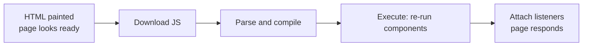

# Hydration and Its Costs {#ch-hydration-and-its-costs}

> Explain what the browser is doing between "the page looks ready" and "the page responds", and name four ways to shrink it.

**In this chapter:** what hydration actually rebuilds · the four costs · partial, progressive and lazy hydration · islands · resumability · how to measure it

## 💡 The Core Idea

Server rendering sends HTML. HTML has no event listeners, no component instances and no state. So the
framework runs the same components again in the browser, walks the existing DOM instead of creating it,
and attaches everything the markup could not carry. That second pass is **hydration**.

The important consequence is that hydration is **not proportional to what is interactive**. It is
proportional to the whole tree. A page with one button and four hundred paragraphs still hydrates four
hundred paragraphs, because the framework has to re-run the components that produced them to find out
that they are inert.

Every technique in this chapter attacks that one sentence.

## How It Works

### The four costs, in order

**The gap between "looks ready" and "responds" is where hydration lives.**

| Cost | Scales with | Typical fix |
| ---- | ----------- | ----------- |
| **Download** | Bytes over the wire | Code splitting, compression |
| **Parse and compile** | Bytes of JavaScript | Fewer bytes; there is no other lever |
| **Execute** | Number of components in the tree | Hydrate less of the tree |
| **Attach and serialise state** | Number of listeners and props | Send smaller props |

The execute step is the one people underestimate. It is a single long task in most frameworks, and a long
task is exactly what
[Chapter ?? — Core Web Vitals](#ch-core-web-vitals) measures as blocking time. The page is painted, so
the user clicks — and nothing happens, because the main thread is busy re-running components.

That window has a name in the literature: the **uncanny valley**. It looks finished and behaves like a
screenshot.

### The state has to travel too

Hydration needs the same data the server rendered with. Refetching it in the browser would be slower and
could disagree with the HTML, so frameworks serialise it into the document — a `<script>` block of JSON,
or the React Server Components payload.

That payload is real weight, and it is easy to double-count. A page that server-renders a 200 KB product
list ships that list twice: once as HTML the user can see, once as JSON so the component can re-render
it. Sending the whole API response into a component that displays three fields of it is the most common
version of this mistake.

### Four ways to hydrate less

**Full hydration** is the default: one bundle, one pass, the entire tree.

**Partial hydration (islands)** renders the page as static HTML and hydrates only marked components.
Astro made this the mainstream form, with per-island directives — `client:load` for immediate,
`client:idle` for after the browser goes quiet, `client:visible` for when the component scrolls into
view. The rest of the page ships zero JavaScript, so its execute cost is not reduced, it is **absent**.

**Progressive and selective hydration** keeps one application but breaks the single long task into many.
React does this around Suspense boundaries: each boundary hydrates independently, and a click on a
not-yet-hydrated boundary makes React hydrate that one first. The total work is the same; the
*interactivity* arrives in the order the user needs it.

**Resumability** removes the second pass instead of splitting it. Qwik serialises the listener references
and the application state into the HTML — a button carries an attribute pointing at the chunk containing
its handler — so the browser attaches nothing up front. The first click fetches that chunk and continues
from where the server stopped. Startup cost is roughly constant regardless of application size; the price
is a larger, denser HTML document and a network request on some first interactions.

| Approach | Execute cost | Best for | Cost you accept |
| -------- | ------------ | -------- | --------------- |
| Full | Whole tree, one task | Applications that are interactive throughout | Blocked main thread on load |
| Islands | Marked components only | Content sites with a few widgets | Islands cannot share client state easily |
| Progressive | Whole tree, many tasks | Large single-page applications | Complexity, and no byte savings |
| Resumability | Near zero | Very large pages, low-powered devices | Bigger HTML, per-interaction fetches |

### Server Components are the fourth option in disguise

React Server Components attack the same cost from the framework side: a component that never runs on the
client contributes nothing to the bundle and nothing to hydration. The difference from islands is the
direction of the default — islands are static until you opt in, React is client until you stay on the
server side of the boundary. [Chapter ?? — Server Components and Client Components](#ch-server-components-vs-client-components)
covers the mechanics.

### Measuring it, not guessing

Three numbers tell you whether hydration is your problem:

- **Total Blocking Time** in a lab run. Hydration shows up as one long task shortly after first paint.
- **INP** from field data, filtered to interactions in the first few seconds after load.
- **The performance panel's main-thread flame chart.** A single wide block labelled with your framework's
  root render is hydration, and its width is the answer.

If TBT is small and INP is bad, the problem is not hydration — it is an expensive event handler or a
layout thrash, and none of this chapter helps.

## When to Use It

| Situation | Reach for | Why |
| --------- | --------- | --- |
| Content site, a handful of widgets | Islands | Most of the page never needed JavaScript |
| Dashboard, interactive throughout | Full hydration, split by route | There is no static majority to save |
| Long page, interactivity below the fold | Lazy or visibility-triggered hydration | Nobody has clicked what they cannot see |
| Large application, slow devices in the field | Server Components or resumability | The tree size is the cost |
| INP is fine, TBT is fine | Nothing here | You do not have a hydration problem |

## Common Mistakes

**❌ Assuming server rendering makes a page fast.**
✅ Server rendering improves first paint and does nothing for interactivity. A server-rendered page with a
1 MB bundle is slower to respond than a client-rendered page with a 100 KB one.

**❌ Serialising the whole API response into props.**
✅ Select the fields the component renders. The payload is shipped, parsed and held in memory, and nobody
sees the ninety fields you did not use.

**❌ Marking everything `client:load` because it is the easy directive.**
✅ That is full hydration with extra steps. Default to `client:visible` or `client:idle`, and justify
`client:load` per island.

**❌ Fixing hydration mismatch warnings by suppressing them.**
✅ A mismatch means the server and client disagreed — usually a date, a random value or a `window` check.
React discards the server HTML for that subtree and re-renders it, which costs more than the warning
suggests. [Chapter ?? — Suspense and Streaming](#ch-suspense-and-streaming) covers the diagnosis.

**❌ Comparing frameworks on hydration cost alone.**
✅ Resumability wins the startup benchmark and pays it back on interactions that fetch. Choose on the
workload you actually have, not the graph on the homepage.

## 🔑 Key Takeaways

- Hydration re-runs the whole component tree, not just the interactive parts of it.
- Its execute step is usually one long task, which is what blocks the first click.
- Islands remove the cost for unmarked components; progressive hydration only reschedules it.
- Resumability replaces hydration with serialised listeners and per-interaction code fetches.
- If Total Blocking Time is healthy, hydration is not the reason the page feels slow.

## Interview Questions

**Q: The page paints in 800 ms but does not respond to clicks for another two seconds. What is happening?**

The HTML arrived and painted, but the framework is still downloading, parsing and executing the bundle so
it can attach listeners. The fix is to hydrate less — split the bundle by route, move components to the
server, or convert the static majority of the page to islands. Adding more server rendering makes the gap
wider, not narrower, because the page paints sooner.

**Q: How does resumability differ from progressive hydration?**

Progressive hydration still runs every component on the client, just in smaller pieces and a better
order. Resumability does not run them at all: the server serialises state and listener references into
the HTML, and code is fetched on the first interaction that needs it. One reschedules the work; the other
deletes most of it and moves the remainder onto the interaction.

**Q: When are islands the wrong architecture?**

When the interactive parts need to share state. Islands are separate roots, so a filter island and a
results island cannot simply share a hook — you need a store outside both, or a URL parameter, or one
larger island. An application that is interactive end to end is not a set of islands, it is a continent.

**Q: Why does a hydration mismatch cost more than a console warning?**

React trusts the server HTML and only patches what it must. When the client render disagrees, it throws
away the server output for that subtree and rebuilds it from scratch — so you paid for server rendering,
sent the HTML, and then rendered it a second time anyway. On the root, it can mean re-rendering the page.

## What to Read Next

- [Chapter ?? — Streaming HTML](#ch-streaming-html) — how the markup arrives before hydration can start
- [Chapter ?? — Reactivity Compared](#ch-reactivity-compared) — why the diffing model needs a rerun in the first place
- [Chapter ?? — Core Web Vitals](#ch-core-web-vitals) — the numbers this chapter is trying to move
