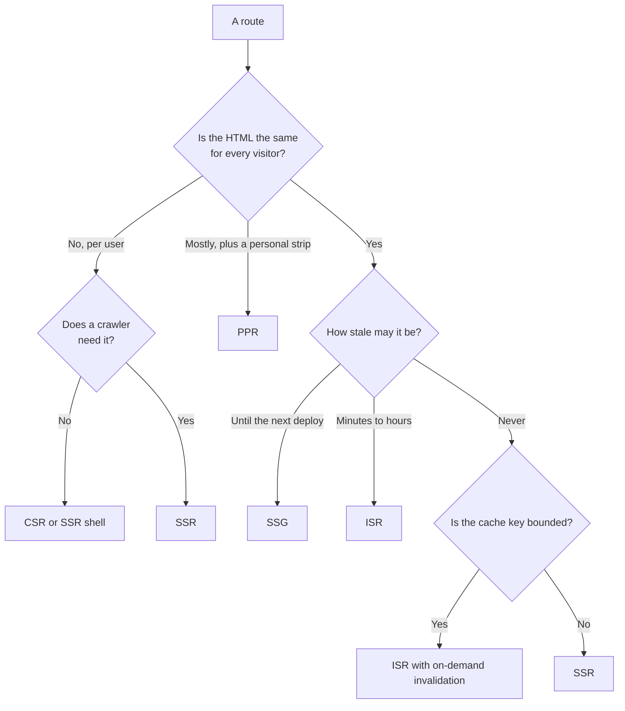

# Choosing a Rendering Strategy per Route, with SEO {#ch-choosing-per-route}

> Build a route inventory, give each row a strategy from its properties and its crawlers, and defend every row.

**In this chapter:** the four questions · what a crawler actually reads · the route inventory · status codes, metadata and canonicals · how to tell a route was assigned wrongly

## 💡 The Core Idea

"Is this a server-rendered app or a client-rendered app?" is the wrong unit. Applications do not have a
rendering strategy. **Routes do.**

One enterprise product has a marketing page, a docs site, a search page, a dashboard and a checkout. The
right answer differs for all five. Choose once, at the top, and four of them are wrong. They are usually
expensively wrong, because the one strategy that fits every route is the costliest one.

Search and social crawlers are one input to that choice, not a separate topic. The question is not "can a
crawler run my JavaScript?" It is: **what does the raw HTML of this URL contain, and is that enough?**

The senior answer is a **procedure**: list the routes, ask each four questions, read off the strategy.

> ⚠️ **Moving target:** crawler behaviour changes without notice, and the crawler population has changed
> more since 2023 than in the decade before. Any claim about what one bot renders ages fast. The durable
> principle: HTML in the first response is indexed reliably, and everything else is indexed on someone
> else's schedule.

## How It Works

### The four questions

**Four properties decide the strategy; opinions do not enter.**

1. **Who is the HTML for?** Everyone, a segment, or one person. Shared HTML can be cached. Personal HTML
   cannot, and pretending otherwise is how caches leak data between users.
2. **How stale may it be?** Not how often it changes, but how much lag is *acceptable*. A price and a blog
   post may change at the same rate and tolerate very different lag.
3. **Which crawler needs it?** If nothing indexes or previews it, server rendering only buys first paint.
   Price it that way.
4. **Is the cache key bounded?** A route keyed by a slug has thousands of variants. A free-text search has
   infinite variants, so its hit rate is near zero and caching is theatre.

### What a crawler actually reads

The major search engines do run JavaScript, but in a **second pass**. They fetch the HTML, index what they
can see, and queue the page for a headless render later. Later means minutes or days, on their timetable.

Two things follow. Links that only exist after JavaScript runs are found late, so a client-rendered
category page delays every product under it. Content that only exists after JavaScript runs is indexed
late, which is fatal for a news story, a job post or a live price.

| Consumer | Runs JavaScript? | What it needs in the raw HTML |
| -------- | ---------------- | ----------------------------- |
| Major search engines | Yes, in a second pass | Content and links, for timely indexing |
| Smaller search engines | Usually not | Everything |
| Social and chat preview scrapers | No | Title, description and image tags in `<head>` |
| AI answer-engine crawlers | Generally not | The article body as text |

A page whose `<head>` is set by JavaScript gets a blank preview card in every chat app, because the
scraper never runs the script. Docs that appear only after hydration are missing from answer engines.

| Strategy | In the first response | Verdict for indexed routes |
| -------- | --------------------- | -------------------------- |
| **SSG** | All content and links | Ideal |
| **ISR** | All content and links | Ideal; staleness is the only question |
| **SSR** | All content and links | Fine, and dearer than the two above |
| **PPR** | The shell, then streamed regions | Fine, if indexable text stays in the shell |
| **CSR** | An empty shell | Only for routes nothing should index |

For indexed content, the cheapest strategy that puts the text in the response wins. That is almost always
static or ISR. **Reaching for SSR "for SEO" when a static build would do is the most common overspend.**

### The route inventory

The artefact is a table. Build it once, keep it in the repository, and review it when latency or the
hosting bill moves.

| Route | Audience | Staleness allowed | Crawlers | Cache key | Strategy |
| ----- | -------- | ----------------- | -------- | --------- | -------- |
| `/` | Everyone | Until deploy | Search, social | One | **SSG** |
| `/docs/[slug]` | Everyone | Until deploy | Search, AI | Bounded, ~400 | **SSG** |
| `/products/[id]` | Everyone + a "recently viewed" strip | 10 minutes | Search, social | Bounded, ~40k | **PPR** |
| `/search?q=` | Per query | None | Excluded on purpose | Unbounded | **SSR**, no cache |
| `/dashboard` | Per user | None | None | Per user | **CSR** behind auth |
| `/reports/[id]` | Per tenant | None | None | Per tenant | **SSR** |
| `/status` | Everyone | 30 seconds | None | One | **ISR**, 30 s |

Interviewers pull on two rows. `/search` is not cached at all: an unbounded key means every request
misses, so a cache adds cost for nothing. `/dashboard` is client-rendered *on purpose*. With no crawler
and no shared HTML, SSR costs a function call per view for a page that can never be reused.

### What crawlers need beyond the body

**A real status code.** A crawler reads the status before the body. A client-rendered app returns `200`
for every URL, even ones that show "Page not found" a second later. That is a **soft 404**. The search
engine indexes a near-empty page, and the site piles up thousands of low-quality URLs.

> ⚠️ The status must be decided **before the first byte is flushed**, as
> [Chapter ?? — Streaming HTML](#ch-streaming-html) explains. A `notFound()` call inside a streamed
> region cannot change a status that has already been sent.

**Metadata before the flush.** The `<head>` is in the first chunk. A title or preview image that depends
on data must resolve before the shell goes out. Frameworks await the metadata function on its own, so it
blocks only the head. **Keep the metadata query small and separate from the page query.** A title that
needs a full product aggregate turns a streaming route back into a buffered one.

**A canonical URL.** Trailing slashes, locale prefixes, tracking parameters and experiment paths all
create variants. Each one that returns `200` may be indexed separately and split the ranking signal. Set
the canonical link in the server-rendered head, from the route's own definition. Setting it from
`window.location` on the client fails, because the crawler that mattered never read it.

### What mixing actually costs

Per-route strategies are not free, and pretending they are is the weak version of this answer.

- **Two data-fetching shapes in one codebase.** Static routes fetch at build; dynamic routes fetch per
  request. Shared components must work in both, so data usually arrives as props, not from a hook.
- **Cache correctness becomes a review item.** The bug that matters is a personalised value leaking into
  a cached page. Anything that reads a cookie, header or session must sit inside the dynamic region.

Neither outweighs the alternative, but naming them beats "just use PPR everywhere".

### Reading a route inventory back from production

A strategy assignment is a hypothesis. These signals tell you a row is wrong:

| Signal | Likely mis-assignment |
| ------ | --------------------- |
| High miss rate on a route you called static | The key is wider than you thought: flags, locales or a cookie |
| Rebuild volume close to request volume | The revalidation window is shorter than the traffic; move to on-demand |
| SSR on a route with no crawler and no shared HTML | Pay for CSR instead |
| Blank preview cards or pages missing from search | Content or head tags only exist after JavaScript runs |
| Stale complaints on a low-traffic route | Time-based revalidation never fires; it needs invalidation on write |

> ⚠️ Stale-while-revalidate rebuilds on the *next request*. A page visited twice a day with a 60-second
> window is always hours stale. Low traffic needs invalidation on write, not a shorter timer.

## When to Use It

| You are… | Do this |
| -------- | ------- |
| Starting a new application | Write the inventory before the first route. It takes twenty minutes |
| Inheriting a fully server-rendered app | Inventory it, then convert the top three routes by traffic |
| Asked this in a system design round | Draw the table. It is the answer, and it fits on a whiteboard |
| Facing a hosting bill that grew faster than traffic | Find per-request routes that could be cached |
| Told "we need SSR for SEO" | Ask which routes are indexed, then check whether a static build covers them |

## Common Mistakes

**❌ Choosing on "how often does the data change".**
✅ Choose on how much lag the business accepts. A stock level may be allowed ten seconds of lag. A
regulatory notice that changes yearly may be allowed none.

**❌ Reading a cookie inside a route you declared static.**
✅ In every framework, touching a per-request input makes the route dynamic, usually without a warning.
Audit the boundary rather than trusting the label.

**❌ Caching a page whose key includes the search query.**
✅ Cache the *data* instead. The query is the expensive part, and a short-lived shared data cache does what
a page cache cannot.

**❌ Setting the title and preview tags from a client effect.**
✅ Scrapers never see them. Put metadata in the server-rendered head, resolved before the flush.

**❌ Putting indexable body text inside a streamed dynamic hole.**
✅ It may arrive after the crawler stops reading. Keep the article in the shell and stream the
recommendations.

## 🔑 Key Takeaways

- Rendering strategy is a property of a route, not of an application.
- Four questions decide it: audience, allowed staleness, which crawlers read it, and whether the cache key is bounded.
- Search engines render JavaScript on their own queue, while social scrapers and AI crawlers generally do not render it at all.
- For indexed routes, the cheapest strategy that puts text, status and metadata in the first response wins, usually static or ISR.
- An unbounded cache key means caching cannot help, and a low-traffic route needs invalidation on write, not a shorter timer.

## Interview Questions

**Q: Walk me through how you would pick a rendering strategy for an e-commerce site.**

Inventory the routes first. Home and category pages are shared and tolerate minutes of lag, so ISR. Product
pages are shared plus a personal strip, so a static shell with a dynamic hole. Search is keyed by free
text, so SSR and uncached. Cart and account are per user and unindexed, so CSR behind authentication.
Then defend each row on audience, staleness, crawlers and cache key.

**Q: Is client-side rendering bad for SEO?**

For indexed content, yes, but not because crawlers cannot run JavaScript. Search engines can, in a
deferred second pass, so content and links are found late. Social scrapers and AI crawlers never run it.
For routes nothing indexes, client rendering has no SEO cost at all.

**Q: When would you deliberately choose client-side rendering in 2026?**

For an authenticated surface with no crawler and no shared HTML: a dashboard, an admin tool, an editor.
SSR there produces a page that can never be cached, costs a function call per view, and ships the same
bundle. The exception is when first paint on slow devices matters enough to pay for a server shell.

**Q: A product page ranks, but its social preview card is blank. What is wrong?**

The preview tags are set on the client. Scrapers fetch the URL once and read the raw HTML without running
scripts, so they never see those tags. Move them into the server-rendered head. The ranking is fine
because the search crawler did its second pass.

**Q: A page is declared static but the platform reports it as dynamic on every request. Where do you look?**

Something in the render reads a per-request input: a cookie, a header, a search parameter, or the current
time. Most frameworks drop a route out of static rendering the moment it touches one, even from a shared
component several levels down. Search the whole component tree the route pulls in, not just the route file.

**Q: A streaming route's metadata depends on a slow query. What do you do?**

Split the query. Fetch only what the head needs, such as title, description and image, in the metadata
function, and let the body stream. Await the full aggregate for the head and the whole response buffers.
You lose streaming for the sake of a title tag.

## What to Read Next

- [Chapter ?? — The Rendering Spectrum and the Cost of Hydration](#ch-rendering-spectrum) — the definitions this chapter assigns
- [Chapter ?? — Edge Versus Origin Rendering](#ch-edge-vs-origin-rendering) — the second half of the decision, once the strategy is chosen
- [Chapter ?? — SEO and Analytics](#ch-seo-and-analytics) — the structured data and sitemap detail this chapter leaves out
