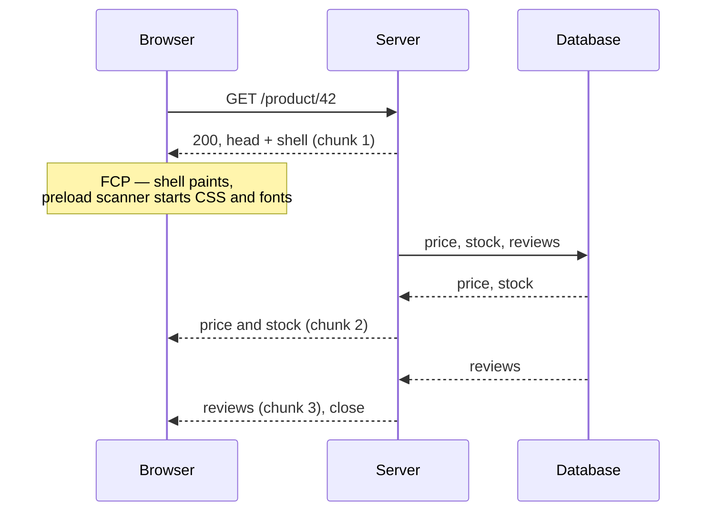

# Streaming HTML {#ch-streaming-html}

> Send the top of the page before the bottom of it exists, and know which metric that actually moves.

**In this chapter:** chunked responses on the wire · out-of-order streaming · TTFB against FCP against LCP · what silently disables streaming · the headers you can no longer set

## 💡 The Core Idea

An HTTP response does not have to be assembled before it is sent. The server can write the first bytes,
keep the connection open, and write more as it goes. Browsers have parsed HTML incrementally since the
1990s — they render what has arrived and keep going.

Streaming is that old capability used deliberately. Instead of waiting for the slowest query on the page,
the server flushes the shell — `<head>`, layout, navigation — immediately, then flushes each region as
its data resolves.

The user sees the page in the order the *server* can produce it, not in the order of the slowest thing on
it. Nothing about the page got faster. The waiting was rearranged so that most of it happens behind
something the user can already read.

## How It Works

### On the wire

A non-streamed response carries `Content-Length` and arrives in one piece. A streamed response uses
`Transfer-Encoding: chunked` (HTTP/1.1) or a stream of DATA frames (HTTP/2 and HTTP/3), and its length is
unknown until it ends.



**The first chunk pays for the paint; the rest pays for the content.**

The first chunk matters out of proportion to its size. It contains the `<head>`, so the browser's preload
scanner can start fetching CSS, fonts and the JavaScript bundle while the server is still waiting on the
database. Those downloads now overlap the query instead of queueing behind it.

### Out-of-order streaming

A naive stream is document order: the server cannot send the footer before the middle. That is a problem
when the middle is the slow part.

Frameworks solve it with a placeholder-and-swap trick. The slow region is emitted as an empty placeholder
with an identifier. When its data resolves, the server appends the real markup at the *end* of the
document plus a tiny inline script that moves it into place.

**What actually goes over the wire:**

```html
<main>
  <div id="reviews"><!--fallback skeleton--></div>
</main>
<!-- ...later in the same response... -->
<template id="chunk:reviews"><ul><li>Great product</li></ul></template>
<script>document.getElementById('reviews').replaceWith(
  document.getElementById('chunk:reviews').content)</script>
```

This is what React does behind a `<Suspense>` boundary, and it is why regions can arrive in completion
order rather than document order. [Chapter ?? — Suspense and Streaming](#ch-suspense-and-streaming)
covers the React-side API; this chapter is about the transport underneath it.

### Producing a stream in TypeScript

Every server runtime exposes the same shape — a stream you write into and the framework flushes.

**A hand-rolled streaming response with the Web Streams API:**

```typescript
export async function handler(): Promise<Response> {
  const encoder = new TextEncoder();

  const stream = new ReadableStream<Uint8Array>({
    async start(controller: ReadableStreamDefaultController<Uint8Array>) {
      // Chunk 1 — flush immediately. The preload scanner starts work here.
      controller.enqueue(encoder.encode('<!doctype html><head>...</head><body><nav>...</nav>'));

      const reviews: string = await renderReviews(); // the slow part
      controller.enqueue(encoder.encode(`<main>${reviews}</main></body>`));
      controller.close();
    },
  });

  return new Response(stream, {
    headers: { 'content-type': 'text/html; charset=utf-8' },
  });
}
```

The rule the example demonstrates: **do not `await` anything before the first `enqueue`.** One awaited
call above that line converts a streamed response back into a buffered one, and no error is reported.

### Which metric moves

| Metric | What it measures | Does streaming help? |
| ------ | ---------------- | -------------------- |
| **TTFB** | First byte of the response | Yes, dramatically — the shell no longer waits for data |
| **FCP** | First pixel of content | Yes, if the shell contains visible content and its CSS |
| **LCP** | The largest element paints | Only if the largest element is in the shell |
| **INP** | Response to interaction | No — that is hydration, not streaming |

This table is the answer to the most common rendering interview question. Streaming is a **time to first
byte** technique that also helps first paint. It does nothing for the hero image, which is a
[Chapter ?? — Image Optimisation](#ch-image-optimisation) problem, and nothing for interactivity, which
is a [Chapter ?? — Hydration and Its Costs](#ch-hydration-and-its-costs) problem.

> ⚠️ **Streaming can make LCP worse.** If the largest element is inside a streamed region, the browser
> paints a skeleton first, then the real content — and LCP is measured at the second paint, after the
> data arrived. A page that buffered would have painted once, later, but with a better LCP. Keep the
> LCP element out of the slow region.

### The headers you gave up

Once the first byte is out, the response status and headers are fixed. That has three consequences worth
saying out loud in a design round:

- **A failure after the flush cannot become a 500.** The best you can do is stream an error message into
  the page, which is exactly why streaming frameworks push you towards error boundaries.
- **A redirect after the flush is not possible.** Authentication checks and redirects must happen before
  the shell goes out — this is the real reason they live in middleware.
- **`Set-Cookie` after the flush is ignored.** Session rotation belongs above the render.

### What silently disables it

Streaming is unusually easy to break without an error, because a buffered response is a valid response.

| Cause | Symptom |
| ----- | ------- |
| An `await` before the first flush | TTFB equals the slowest query |
| A proxy or WAF that buffers the body | Works locally, buffered in production |
| Compression configured to buffer whole responses | Same, and often blamed on the CDN |
| A framework middleware that reads the response body | Buffered, and hard to find |
| Serving through a platform that caches whole responses | Correct output, no streaming |

The check is one command: `curl -N` the route and watch whether bytes arrive in groups. If everything
lands at once, something between your code and the terminal is buffering.

## When to Use It

| Situation | Stream? | Why |
| --------- | ------- | --- |
| Page with one slow region and a fast shell | **Yes** | The textbook case |
| Every query is fast (under ~50 ms) | **No** | The complexity buys nothing measurable |
| Fully static or ISR-cached page | **No** | There is nothing to wait for |
| Page whose largest element depends on the slow query | **Careful** | You may trade LCP for TTFB |
| API returning JSON to a client | **Different problem** | See [Chapter ?? — Real-Time Streaming](#ch-realtime-streaming) |

## Common Mistakes

**❌ Awaiting data in the layout.**
✅ A layout that awaits blocks the shell, so nothing streams. Push the await down into the component that
needs it, behind a boundary.

**❌ Putting a boundary around the whole page.**
✅ One boundary containing everything is a buffered page with a spinner. Boundaries should wrap the parts
that are actually slow.

**❌ Streaming without a fallback that reserves space.**
✅ A zero-height skeleton means the content pushes the page down when it arrives, and you have converted a
latency win into a layout shift.

**❌ Assuming crawlers cannot read a streamed page.**
✅ They can; chunked transfer is ordinary HTTP. The caveat is different and is covered in
[Chapter ?? — SEO and Rendering](#ch-seo-and-rendering).

**❌ Declaring streaming works because it works locally.**
✅ Local has no CDN, no WAF and no reverse proxy. Verify against the deployed URL.

## 🔑 Key Takeaways

- Streaming flushes the shell before the data resolves, so downloads overlap queries instead of queueing.
- Out-of-order delivery uses a placeholder plus an inline script, which is why regions can land early.
- It moves TTFB and usually FCP; it moves LCP only if the largest element is in the shell.
- After the first byte, the status, redirects and cookies are already decided.
- A single `await` above the first flush, or one buffering proxy, silently turns it off.

## Interview Questions

**Q: Your TTFB is 1.8 seconds on a server-rendered page. What do you do?**

Find out what the server is waiting for before its first byte. Usually one query in a layout blocks the
whole render. Flush the shell first and move the slow region behind a boundary, so TTFB becomes the cost
of rendering the layout rather than the cost of the slowest query on the page.

**Q: Can streaming make a page worse?**

Yes, in two ways. If the largest contentful element is in a streamed region, LCP is measured after the
swap and gets worse. And a fallback that does not reserve the right space converts the wait into
cumulative layout shift. Streaming pays off when the shell is worth looking at.

**Q: Why can't a streamed response redirect when authentication fails halfway through?**

The status line and headers were sent with the first chunk and cannot be recalled. Anything that changes
the response as a whole — status, redirect, `Set-Cookie` — has to be decided before the shell is flushed,
which is why authentication checks sit in middleware above the render.

**Q: How would you prove that streaming is actually happening in production?**

Request the deployed URL with `curl -N` and watch for bytes arriving in distinct groups, and check that
the response carries chunked transfer rather than a `Content-Length`. Compare TTFB in field data against
the duration of the slowest query — if they match, the response is buffered somewhere in the path.

## What to Read Next

- [Chapter ?? — Suspense and Streaming](#ch-suspense-and-streaming) — the React API that drives the boundaries
- [Chapter ?? — Choosing Per Route, Not Per App](#ch-choosing-per-route) — where streaming fits among the alternatives
- [Chapter ?? — Core Web Vitals](#ch-core-web-vitals) — the definitions behind the metric table
