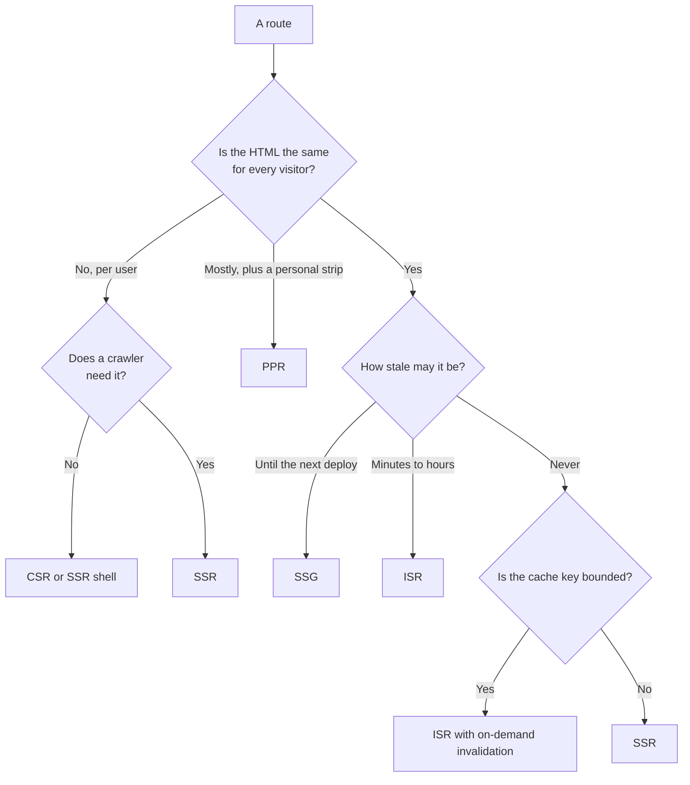

# Choosing Per Route, Not Per App {#ch-choosing-per-route}

> Run a route inventory, assign a strategy to each row from its properties, and defend every row.

**In this chapter:** the four questions · the route inventory · a worked example · what mixing costs · how to tell a route was assigned wrongly

## 💡 The Core Idea

"Is this a server-rendered app or a client-rendered app?" is the wrong unit. Applications do not have a
rendering strategy. **Routes do.**

A single enterprise product has a marketing page, a documentation site, a search page, a report
dashboard and a checkout flow, and the correct answer differs for all five. Choosing once, at the top,
means four of them are wrong — usually expensively wrong, because the one strategy that fits every route
is the most costly one.

The senior version of this answer is not a preference. It is a **procedure**: list the routes, ask each
one four questions, and read the strategy off the answers.

## How It Works

### The four questions

**Four properties decide the strategy; opinions do not enter.**

The questions in prose, because you will be asked them in that form:

1. **Who is the HTML for?** Everyone, a segment, or one person. Shared HTML can be cached; personal HTML
   cannot, and pretending otherwise is how caches leak data between users.
2. **How stale may it be?** Not "how often does it change" — how much staleness is *acceptable*. A price
   and a blog post may change at the same rate and tolerate wildly different lag.
3. **Does a crawler need it?** If nothing indexes it, server rendering is only buying first paint, and
   you should price it accordingly.
4. **Is the cache key bounded?** A route keyed by a slug has thousands of variants. A route keyed by
   free-text search has infinite variants, so its cache hit rate is near zero and caching is theatre.

### The route inventory

The artefact is a table. Build it once, keep it in the repository, and review it when latency or the
hosting bill moves.

| Route | Audience | Staleness allowed | Indexed | Cache key | Strategy |
| ----- | -------- | ----------------- | ------- | --------- | -------- |
| `/` | Everyone | Until deploy | Yes | One | **SSG** |
| `/docs/[slug]` | Everyone | Until deploy | Yes | Bounded, ~400 | **SSG** |
| `/products/[id]` | Everyone + a "recently viewed" strip | 10 minutes | Yes | Bounded, ~40k | **PPR** |
| `/search?q=` | Per query | None | No | Unbounded | **SSR**, no cache |
| `/dashboard` | Per user | None | No | Per user | **CSR** behind auth |
| `/reports/[id]` | Per tenant | None | No | Per tenant | **SSR** |
| `/status` | Everyone | 30 seconds | No | One | **ISR**, 30 s |

Two rows in that table are the ones interviewers pull on. `/search` is not cached at all, and saying so
confidently is a strong signal — an unbounded key means every request is a miss, so a cache adds
infrastructure and latency for nothing. And `/dashboard` is client-rendered *on purpose*: no crawler, no
shared HTML, so server rendering costs a function invocation per view and returns a page that can never
be reused.

### What mixing actually costs

Per-route strategies are not free, and pretending they are is the weak version of this answer.

- **Two data-fetching shapes in one codebase.** A static route fetches at build; a dynamic route fetches
  per request. Shared components have to work in both, which usually means data comes in as props rather
  than from a hook.
- **Cache correctness becomes a review item.** The bug that matters is a personalised value leaking into
  a cached page. Anything that reads a cookie, a header or a session must be inside the dynamic region,
  and that is a thing reviewers have to look for.
- **The mental model gets harder for newcomers.** "Why did my change not appear?" has five possible
  answers instead of one. A route inventory in the repository is the mitigation.

None of these outweigh the alternative, but they are the cost, and a candidate who names them is a level
above one who says "just use PPR everywhere".

### Reading a route inventory back from production

A strategy assignment is a hypothesis. Three signals tell you a row is wrong:

| Signal | Likely mis-assignment |
| ------ | --------------------- |
| High cache miss rate on a route you called static | The key is wider than you thought — flags, locales or a cookie in the mix |
| Rebuild volume close to request volume | The revalidation interval is shorter than the traffic; move to on-demand |
| Server rendering a route with no crawler and no shared HTML | Pay for CSR instead |
| Stale complaints on a low-traffic route | Time-based revalidation never fires; it needs invalidation on write |

That last one catches people. Stale-while-revalidate rebuilds on the *next request*, so a page visited
twice a day with a 60-second window is always stale by hours. Low traffic needs event-driven
invalidation, not a shorter timer.

## When to Use It

| You are… | Do this |
| -------- | ------- |
| Starting a new application | Write the inventory before the first route. It takes twenty minutes |
| Inheriting a fully server-rendered app | Inventory it, then convert the top three by traffic. Do not convert all of it |
| Asked this in a system design round | Draw the table. It is the answer, and it fits on a whiteboard |
| Facing a hosting bill that grew faster than traffic | Look for routes rendering per request that could be cached |
| Told to "make the site faster" | Find out which metric. Rendering strategy moves TTFB, not much else |

## Common Mistakes

**❌ Converting a whole application at once.**
✅ Convert the routes with the most traffic and the worst numbers. Most routes are fine as they are, and a
big-bang migration has no way to attribute a regression.

**❌ Choosing on "how often does the data change".**
✅ Choose on how much staleness the business will accept. A stock level that changes every second may be
allowed to lag ten seconds. A regulatory notice that changes yearly may not be allowed to lag at all.

**❌ Reading a cookie inside a route you declared static.**
✅ Every framework has a rule for this, and every framework's rule is that touching a per-request input
makes the route dynamic — quietly, in most cases. Audit the boundary rather than trusting the label.

**❌ Caching a page whose key includes the search query.**
✅ Cache the *data* instead. The expensive part is the query, not the render, and a shared data cache with
a short window does the work a page cache cannot.

**❌ Treating the inventory as a one-off document.**
✅ Traffic moves and features change. A route that was static gains a personalised banner and nobody
re-checks. Review it with the same cadence as the dependency audit.

## 🔑 Key Takeaways

- Rendering strategy is a property of a route, not of an application.
- Four questions decide it: audience, allowed staleness, indexing, and whether the cache key is bounded.
- An unbounded cache key means caching cannot help; say so rather than adding a layer.
- Mixing strategies costs review discipline around per-request inputs, and that cost is worth naming.
- Low-traffic routes are not fixed by a shorter revalidation window — they need invalidation on write.

## Interview Questions

**Q: Walk me through how you would pick a rendering strategy for an e-commerce site.**

Inventory the routes first. Home and category pages are shared and tolerate minutes of staleness, so ISR.
Product pages are shared plus a personalised strip, so a static shell with a dynamic hole. Search is
keyed by a free-text query, so server-rendered and uncached. Cart and account are per user and unindexed,
so client-rendered behind authentication. Then defend each row on audience, staleness, indexing and cache
key.

**Q: A page is declared static but the platform reports it as dynamic on every request. Where do you look?**

Something in the render is reading a per-request input — a cookie, a header, a search parameter, or a
non-deterministic value such as the current time. Most frameworks opt a route out of static rendering the
moment such a value is touched, including from a shared component several levels down. Search the
component tree the route pulls in, not just the route file.

**Q: When would you deliberately choose client-side rendering in 2026?**

For an authenticated surface with no crawler and no shared HTML — a dashboard, an admin tool, an editor.
Server rendering there produces a page that can never be cached, costs a function invocation per view,
and still ships the same bundle. The exception is when first paint on slow devices matters enough to pay
for a server-rendered shell.

**Q: What is the risk of mixing rendering strategies within one application?**

Cached pages containing personalised data. When some routes cache and others do not, a component that
reads a session works correctly in one context and leaks in the other. The mitigation is to keep
per-request reads inside clearly marked dynamic regions and to make that a review checklist item.

## What to Read Next

- [Chapter ?? — The Rendering Spectrum](#ch-rendering-spectrum) — the definitions this chapter assigns
- [Chapter ?? — Edge Versus Origin Rendering](#ch-edge-vs-origin-rendering) — the second half of the decision, once the strategy is chosen
- [Chapter ?? — Data Fetching and Caching](#ch-nextjs-data-and-caching) — how one framework enforces the boundaries above
