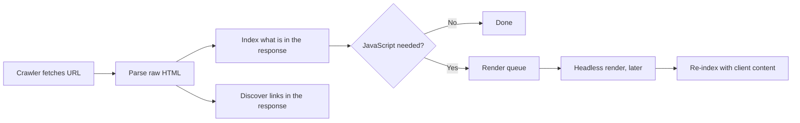

# SEO and Rendering {#ch-seo-and-rendering}

> Decide which routes genuinely need server-rendered HTML for discovery, and stop paying for the ones that do not.

**In this chapter:** what a crawler does with JavaScript · the render queue · crawlers that never execute it · status codes and soft 404s · metadata and the flush

## 💡 The Core Idea

"Client-side rendering is bad for SEO" was true in 2015, became false around 2019, and is now true again
for a different reason.

The major search engines do execute JavaScript. But they do it in a **second pass**: the crawler fetches
the HTML, indexes what it can see, and puts the page in a queue to be rendered later — minutes, or days,
depending on how much the site is worth to them. Meanwhile a growing share of the crawlers that matter —
social preview scrapers, and the answer engines behind AI assistants — do not execute JavaScript at all.
They read the response body and leave.

So the question is not "can a crawler run my JavaScript". It is: **what does the raw HTML of this URL
contain, and is that enough?**

> ⚠️ **Moving target:** crawler capability changes without announcement, and the population of crawlers
> has changed more since 2023 than in the decade before it. Any specific claim about what one bot renders
> has a short shelf life. The durable principle is that HTML present in the first response is indexed
> reliably and everything else is indexed on someone else's schedule.

## How It Works

### The two-pass pipeline

**Everything after the render queue happens on the crawler's timetable, not yours.**

Two consequences follow directly. **Links that only exist after JavaScript runs are discovered late** —
so a client-rendered category page delays the discovery of every product under it. And **content that
only exists after JavaScript runs is indexed late**, which is fatal for anything time-sensitive: a news
article, a job posting, a live price.

### The crawlers that never render

| Consumer | Executes JavaScript? | What it needs in the raw HTML |
| -------- | -------------------- | ----------------------------- |
| Major search engines | Yes, in a second pass | Content and links, for timely indexing |
| Smaller search engines | Usually not | Everything |
| Social preview scrapers | No | Title, description, image tags in `<head>` |
| Chat and messaging unfurlers | No | The same |
| AI answer-engine crawlers | Generally not | The article body as text |

The social row is the one that produces a bug report from a marketing team. A client-rendered page whose
`<head>` is populated by JavaScript gets a blank preview card in every chat application on earth, because
the scraper never runs the script that would have set the tags.

The last row is newer and increasingly the reason a content site invests in server rendering at all. If
your documentation is only visible after hydration, it is missing from the corpus that answer engines
summarise.

### What each strategy gives a crawler

| Strategy | Content in first response | Links in first response | Verdict for indexed routes |
| -------- | ------------------------- | ----------------------- | -------------------------- |
| **SSG** | All of it | All of them | Ideal |
| **ISR** | All of it | All of them | Ideal; staleness is the only question |
| **SSR** | All of it | All of them | Fine, and more expensive than the two above |
| **PPR** | Shell plus streamed regions | Yes, if in the shell | Fine — keep indexable content out of dynamic holes |
| **CSR** | An empty shell | None | Only for routes nothing should index |

The pattern: for indexed content, the cheapest strategy that puts the text in the response wins. That is
almost always static or ISR, not SSR. **Reaching for server rendering "for SEO" when a static build would
do is the most common overspend in this area.**

### Status codes, and the soft 404

A crawler reads the HTTP status before it reads a word of the body. A client-rendered application returns
`200 OK` for every URL, including the ones that will render "Page not found" a second later.

That is a **soft 404**: the search engine sees a successful response, indexes a near-empty page, and the
site accumulates thousands of low-quality URLs. The same problem applies to error states and to expired
content.

Real status codes require a server that knows the URL is invalid before it responds — which, as
[Chapter ?? — Streaming HTML](#ch-streaming-html) explains, means deciding it **before the first byte is
flushed**. A `notFound()` call from inside a streamed region cannot change a status that has already been
sent.

### Metadata has to beat the flush

Page metadata lives in `<head>`, which is in the first chunk. Metadata that depends on data — a product
name in the title, an image in the preview tags — must therefore resolve before the shell goes out.

This is the one place where streaming and SEO genuinely conflict, and every framework resolves it the
same way: the metadata function is awaited separately and blocks only the head, while the body streams.
The practical rule is to **keep the metadata query small and separate from the page query**. A title that
needs a full product aggregate has just turned your streaming route back into a buffered one.

### Canonical URLs and duplicate variants

Rendering choices create URL variants — trailing slashes, locale prefixes, tracking parameters,
experiment paths. Each variant that returns `200` is a page the crawler may index separately, splitting
the ranking signal.

The fix is a canonical link in the head, set from the route's own definition rather than from the request
URL. Setting it from `window.location` on the client is the bug: the crawler that mattered never read it.

## When to Use It

| Route | Needs server-rendered HTML? | Why |
| ----- | --------------------------- | --- |
| Marketing, docs, blog, product pages | **Yes — static or ISR** | Indexed, shared, cheap to cache |
| Anything shared in chat or on social | **Yes, for the head at least** | Scrapers do not run JavaScript |
| Search results page | **Usually not** | Most sites deliberately exclude these from indexing |
| Dashboard, settings, admin | **No** | Behind authentication; nothing indexes it |
| An interactive tool with no content | **No** | There is nothing to index but the shell |

## Common Mistakes

**❌ "We use React, so we need SSR for SEO."**
✅ You need HTML in the response. A static build produces that with no server at all, and is faster and
cheaper than server rendering it per request.

**❌ Setting title and preview tags from a client effect.**
✅ Scrapers never see them. Metadata belongs in the server-rendered head, resolved before the flush.

**❌ Returning 200 for a page that renders "not found".**
✅ Return 404 from the server. A soft 404 is indexed, and thousands of them damage the whole site's
assessment.

**❌ Blocking the render queue with a robots rule, then wondering why the page is not indexed.**
✅ Disallowing the JavaScript bundle in `robots.txt` prevents the second pass from ever running. If the
content is client-rendered, the bundle is content.

**❌ Putting indexable body text inside a streamed dynamic hole.**
✅ It may arrive after the crawler stops reading. Keep the article in the shell and stream the
recommendations.

## 🔑 Key Takeaways

- Search engines render JavaScript, but on their own queue — raw HTML is indexed reliably, the rest is not.
- Social scrapers and AI answer crawlers generally do not execute JavaScript at all.
- For indexed routes, the cheapest strategy that puts text in the first response wins — usually static or ISR.
- A client-rendered "not found" returns 200 and becomes a soft 404 in the index.
- Metadata must resolve before the first flush, so keep its query separate from the page's.

## Interview Questions

**Q: Is client-side rendering bad for SEO?**

For indexed content, yes — but not because crawlers cannot run JavaScript. They can, in a deferred second
pass, so content and links are discovered late. And several consumers that matter — social preview
scrapers and AI answer crawlers — never execute it. For routes nothing indexes, client rendering has no
SEO cost at all.

**Q: A product page ranks, but its social preview card is blank. What is wrong?**

The preview tags are being set on the client. Scrapers fetch the URL once and read the raw HTML without
executing scripts, so a head populated by JavaScript is invisible to them. Move the tags into the
server-rendered head. The search ranking is unaffected because the search crawler did the second pass.

**Q: What is a soft 404 and how does a rendering choice cause one?**

It is a URL that returns 200 while showing "not found" content. A client-rendered application returns 200
for every path because the server does not know the route is invalid, so every mistyped or expired URL
becomes an indexable empty page. Fixing it needs a server that resolves the URL before responding.

**Q: You have a streaming route and the metadata depends on a slow query. What do you do?**

Split the query. Fetch only the fields the head needs — title, description, image — in the metadata
function, and let the page body stream separately. If you await the full aggregate for the head, the
whole response buffers and you lose the streaming benefit for a title tag.

## What to Read Next

- [Chapter ?? — SEO and Analytics](#ch-seo-and-analytics) — the metadata, structured data and sitemap detail this chapter defers
- [Chapter ?? — Semantic HTML](#ch-semantic-html) — the markup crawlers and assistive technology both read
- [Chapter ?? — Choosing Per Route, Not Per App](#ch-choosing-per-route) — where "is it indexed?" sits among the four questions
