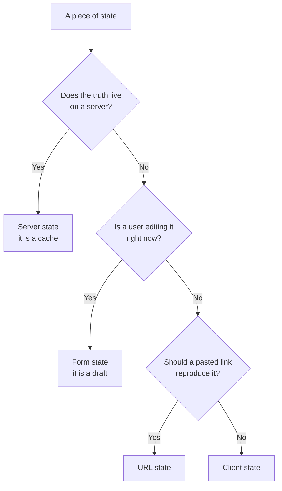

# The Four Kinds of State {#ch-four-kinds-of-state}

> Classify any piece of state as server, client, form or URL before you choose a tool for it.

**In this chapter:** why the library question is the wrong question · the four categories · the test that separates them · what happens when you get it wrong · the decision table

## 💡 The Core Idea

"Which state library should we use?" assumes there is one kind of state. There are four, and they have
almost nothing in common.

**Server state** is a copy of data that lives somewhere else. It can be stale, it can fail to load, and
it can change without you doing anything.

**Client state** is data your application owns outright. A sidebar is open. A theme is dark. Nothing else
in the world has an opinion about it.

**Form state** is a draft. It is invalid most of the time, on purpose, because the user is still typing.

**URL state** is state you have promised to a link — a filter, a page number, a selected tab. It has to
survive a refresh and a paste into a chat window.

Each category has different rules about staleness, validity, sharing and persistence. **A tool built for
one of them handles the others badly**, which is why "we standardised on one store" produces a codebase
that is fighting itself.

## How It Works

### Telling them apart



**Three questions, in order, classify almost everything.**

The first question is the one that matters most, and it has a sharp form: **if two browser tabs
disagreed, which one would be wrong?** If the answer is "whichever one is out of date", the server owns
it and you are holding a cache. If the answer is "neither, they are independent", it is client state.

### What each category demands

| | Server state | Client state | Form state | URL state |
| --- | --- | --- | --- | --- |
| **Source of truth** | The API | The application | The input elements | The address bar |
| **Can be stale** | Always | Never | Not applicable | Never |
| **Can be invalid** | No | No | **Yes, by design** | Yes — users edit URLs |
| **Needs loading and error states** | Yes | No | On submit | No |
| **Survives a refresh** | Refetched | Only if persisted | No | Yes |
| **Shared between tabs** | Eventually | No | No | Only by sharing the link |
| **Typical tool** | TanStack Query | Zustand, Jotai, `useState` | React Hook Form | Search params |

The row that decides the architecture is "can be stale". Server state is a cache whether or not you call
it one. Caches need a staleness policy, deduplication, invalidation, retries and background refresh. If
you put server data in a general-purpose store, you have committed to writing all of that by hand.

### The mistake this framing prevents

Here is the shape of the problem, using a plain store:

**❌ Server data in a client store — the cache you did not mean to write:**

```typescript
interface UserStore {
  users: User[];
  loading: boolean;
  error: string | null;
  fetchUsers: () => Promise<void>;
}
```

Four fields, and every one of them is a decision you have now made badly. There is no staleness policy,
so the data is refetched on every mount or never. There is no request deduplication, so three components
mounting together fire three requests. There is no invalidation, so a mutation elsewhere leaves this
stale. There is no retry and no cancellation.

**✅ The same thing as what it is — a cache:**

```typescript
const { data: users, isPending, error } = useQuery({
  queryKey: ['users'],
  queryFn: fetchUsers,
  staleTime: 30_000, // an explicit, reviewable staleness policy
});
```

The point is not the library. It is that naming the category made the missing policies visible.

### Where each one goes wrong

| Category | Put in the wrong place | What breaks |
| -------- | ---------------------- | ----------- |
| Server state → a global store | A hand-rolled cache | Stale reads, duplicate requests, no invalidation |
| Client state → the server | A round trip to open a menu | Latency and needless API surface |
| Form state → a global store | Every keystroke re-renders the app | Input lag, and undo becomes impossible |
| URL state → component state | A dashboard nobody can link to | Back button breaks, links do not reproduce the view |
| Server state → the URL | The whole result set in a query string | URL length limits, and stale links |

The last row is the one people trip on after learning the fourth category. The URL holds the *inputs* —
the filter, the sort, the page. It does not hold the results.

### Server state has a second home now

React Server Components and server-side data loading change the arithmetic for the first category. If a
route fetches on the server and renders the result, some server state never becomes client state at all.

That does not remove the category, it removes the *cache* for a subset of it. Anything refetched,
mutated, polled or updated optimistically still needs a client cache.
[Chapter ?? — Server State with TanStack Query](#ch-server-state) covers where the line falls.

## When to Use It

| The state is… | Category | Reach for |
| ------------- | -------- | --------- |
| A list of records from an API | Server | A query cache — [Chapter ?? — Server State with TanStack Query](#ch-server-state) |
| A theme, a sidebar toggle, a wizard step | Client | `useState`, then a store — [Chapter ?? — Client State](#ch-client-state) |
| A half-typed form | Form | A form library — [Chapter ?? — Form State](#ch-form-state) |
| A filter, a sort, a page number, an open tab | URL | Search params — [Chapter ?? — URL as State](#ch-url-as-state) |
| Derived from any of the above | None | Compute it. Do not store it |

That last row deserves its own sentence. **Derived values are not state.** A filtered list, a total, a
"has unsaved changes" flag — all of these are functions of state that people store as state, and every
copy is a chance to go out of sync.

## Common Mistakes

**❌ Choosing the library first.**
✅ Classify the state, then pick. "We use Redux" answers a question nobody asked; "this is server state,
so it needs a cache with an invalidation policy" answers the real one.

**❌ Treating the four categories as four libraries.**
✅ They are four *problems*. A small application may solve client, form and URL state with React and the
platform, and only pull in a library for server state.

**❌ Copying server data into local state so it can be edited.**
✅ That fork goes stale the moment anything invalidates the query. Keep the cached value as the truth and
hold only the *edits* locally, then mutate and invalidate.

**❌ Putting everything in the URL because URL state is fashionable.**
✅ A scroll position or a hover state in the address bar is noise, and it pollutes browser history. The
test is whether a pasted link should reproduce it.

**❌ Storing derived values "for performance".**
✅ Recomputing is cheap and correct. A stored derivation is a second source of truth with no policy for
keeping it honest.

## 🔑 Key Takeaways

- Server, client, form and URL state are four different problems with four different rules.
- Server state is a cache; if you store it in a general-purpose store, you have hand-written a bad one.
- Form state is invalid on purpose, which is why it does not belong in application state.
- URL state holds the inputs to a view, never the results.
- Derived values are not state — compute them.

## Interview Questions

**Q: How do you decide where a piece of state should live?**

Ask whether the truth lives on a server. If it does, it is a cache and needs staleness, deduplication and
invalidation. If not, ask whether a user is editing it — that is form state, and it is invalid by design.
If not, ask whether a pasted link should reproduce it — that is URL state. What is left is client state,
and most of that is local to one component.

**Q: What is actually wrong with putting API data in Redux or Zustand?**

Nothing syntactically — the problem is what you have to build next. Server data needs a staleness policy,
request deduplication, cache invalidation on mutation, retries, cancellation and background refetching. A
general-purpose store gives you none of those, so you write them by hand, per slice, and they drift.

**Q: Which state belongs in the URL, and how do you decide?**

Anything a user would reasonably expect to share, bookmark or reach with the back button: filters, sort
order, pagination, the selected tab, the open row of a table. The test is whether pasting the link into a
message should reproduce what the sender is looking at. Transient things — hover, scroll, a menu — should
not be there.

**Q: Is the four-category model still useful when the framework fetches on the server?**

Yes, but the first category shrinks. Data fetched and rendered on the server never becomes a client cache
at all. What remains is anything refetched, polled, mutated or updated optimistically — and that still
needs the full set of cache policies, so the distinction still does the work.

## What to Read Next

- [Chapter ?? — Server State with TanStack Query](#ch-server-state) — the largest of the four categories
- [Chapter ?? — URL as State](#ch-url-as-state) — the category most teams forget exists
- [Chapter ?? — Frontend Architecture Patterns](#ch-frontend-architecture-patterns) — where these decisions sit in a larger structure
