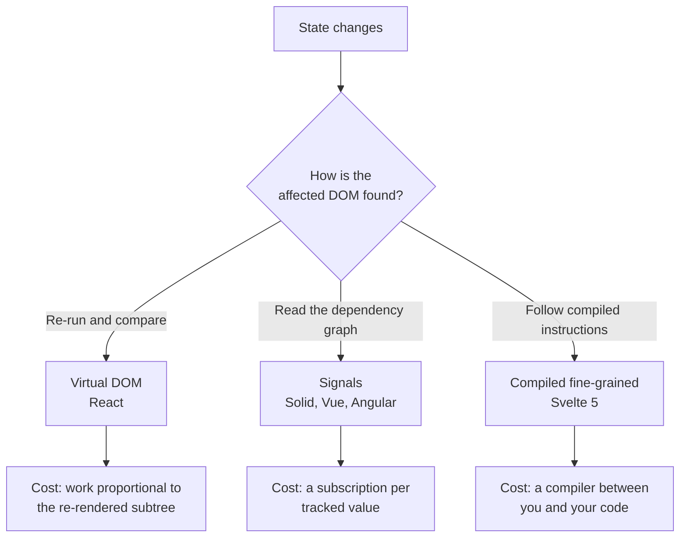

# Reactivity Compared {#ch-reactivity-compared}

> Answer "which DOM nodes change when this value changes?" three different ways, and be able to defend each.

**In this chapter:** the three strategies · what the diff actually buys · what a dependency graph costs · the table to reach for in a design round · why React has not adopted signals

## 💡 The Core Idea

Every UI framework solves one problem: **a value changed, so which parts of the document are now wrong?**
There are only three families of answer, and each one moves the bookkeeping somewhere different.

Re-run the component and compare the output — the runtime does the work. Track reads at the level of each
value, so the framework already knows which nodes depend on it — the *graph* does the work, built as your
code runs. Or have a compiler read your source and emit update instructions ahead of time — the *build*
does the work.

None of these is faster in the abstract. They trade a different resource, and a senior answer names the
resource rather than declaring a winner.

> ⚠️ **Moving target:** the field is converging. Vue and Angular have both adopted signals, Svelte 5
> replaced its compiler-only model with them, and React shipped a compiler rather than following. Any
> sentence of the form "framework X does not have Y" has a short shelf life. The durable part is the
> tradeoff itself — granularity against replayability — which has not moved in a decade.

## How It Works

### The three strategies

**Three answers to one question, each paying for it somewhere else.**

### The virtual DOM: what the diff buys

React re-runs the component function, builds a tree of plain objects, and compares it to the previous
one. The comparison is pure overhead — but it buys three things that are easy to undervalue:

- **A rendering model with no special syntax.** Components are functions; `if` is `if`, and a list is
  `map`. There is no template language, so the ecosystem is ordinary JavaScript.
- **A schedulable unit of work.** Because rendering is re-running a function and *not* touching the DOM,
  React can start, abandon and restart a render — which is what concurrency and Suspense are built on.
- **Renderer independence.** The same component tree can be applied to a DOM, a native view, or a
  serialised payload.

The cost is that work is proportional to what re-rendered, not to what changed. Getting that boundary
right is what `memo`, `useMemo` and the React Compiler exist to do.

### Fine-grained: what the graph buys

A signal is a value plus a list of things that read it. Reading inside a tracked scope registers the
dependency; writing notifies the readers. There is no component re-run and no diff — the update goes
straight to the text node or attribute that read the value.

Svelte 5's runes are this model with a compiler in front. The compiler already knows which expression
feeds which node, so it emits the subscription rather than discovering it. Solid does the same at
runtime; Vue and Angular have both converged on signals for the same reason.

The costs are real, and they are the ones interviewers probe:

| Cost                          | Why it shows up                                                    |
| ----------------------------- | ------------------------------------------------------------------ |
| Per-value bookkeeping          | Thousands of signals means thousands of subscriptions to maintain   |
| Leaky abstraction at the edges | Passing a value out of the graph loses reactivity — hence `$state.snapshot` |
| No natural place to interrupt  | Updates are synchronous and targeted, which is exactly why they are hard to make interruptible |
| Compiler-dependent (Svelte)    | The mental model includes what the build step does to your code     |

### The table to reach for

| Dimension              | Virtual DOM (React 19)         | Compiled fine-grained (Svelte 5)     |
| ---------------------- | ------------------------------ | ------------------------------------ |
| Update granularity      | Component subtree              | Individual DOM node                  |
| When dependencies are known | Every render, by re-running | At compile time, refined at runtime  |
| Runtime shipped         | Larger — the reconciler        | Small — most logic compiles away     |
| Bundle growth           | Flat-ish; runtime dominates    | Grows with component count           |
| Interruptible rendering | Yes — the basis of concurrency | Not in the same sense                |
| Ecosystem size          | The largest in the field       | Smaller, though it covers the common ground |
| Hiring pool             | Very large                     | Small, and enthusiastic              |
| Where mistakes cost you | Re-render boundaries           | Effects that write state             |

The bundle row is the one that gets stated backwards. Svelte ships less framework and **more per
component**, because each component compiles to its own update code. For a small application Svelte wins
comfortably; the crossover point is real, and it arrives later than React advocates claim and sooner than
Svelte advocates do.

### Why React has not adopted signals

This is the interesting half of the question, and "inertia" is the wrong answer. Signals make updates
synchronous and precisely targeted. React's architecture is built on the opposite property: rendering is
a pure function of state that produces no side effects until commit, which is what lets React *not*
finish a render — start it, throw it away when a more urgent update arrives, or suspend it while data
loads.

React's answer to the performance problem was to keep the model and remove the manual bookkeeping. The
React Compiler memoises what a developer would have memoised by hand, so the diff is still there, and
what disappears is the effort — see
[Chapter ?? — React Performance and the Compiler](#ch-react-performance-and-the-compiler). That is a
different bet from Svelte's, not a slower one.

## When to Use It

| Situation                                       | Choose        | Why                                                    |
| ----------------------------------------------- | ------------- | ------------------------------------------------------ |
| Hiring at volume, many teams, long-lived product | React         | The ecosystem and the hiring pool are the deciding factor |
| Highly interactive dashboard, small team         | Either        | Both handle it; team familiarity decides                |
| Data-dense UI with thousands of live cells       | Fine-grained  | Per-node updates avoid re-rendering the subtree         |
| Strict bundle budget, modest component count     | Svelte        | Little runtime to ship                                 |
| Heavy dependence on a specific ecosystem library | React         | Availability beats architecture                         |
| A design system consumed by other frameworks     | Web Components, from either | The framework becomes an implementation detail |

The honest version, and the one worth saying out loud: **for most products the reactivity model is not
the constraint.** Data fetching, rendering strategy and team familiarity decide more. Reach for the
model argument when the workload is genuinely update-heavy, and for the ecosystem argument otherwise.

## Common Mistakes

**❌ Claiming one model is "faster".** Faster at what? Initial load, update throughput and memory pull in
different directions, and the answer flips with component count.

**❌ Saying Svelte "has no runtime".** It has a small one. What it does not have is a reconciler.

**❌ Treating signals as a React feature waiting to land.** React has evaluated them and chosen
compiler-driven memoisation instead, because interruptible rendering depends on renders being replayable.

**❌ Comparing a hello-world bundle.** That measurement is dominated by runtime size and tells you
nothing about an application with three hundred components.

**❌ Ignoring the second-order costs.** Ecosystem depth, hiring, upgrade cadence and library
compatibility outlive any benchmark you can run this afternoon.

## 🔑 Key Takeaways

- Every framework answers the same question; the difference is whether the runtime, a dependency graph, or the compiler does the bookkeeping.
- The virtual DOM's diff buys plain-JavaScript components, renderer independence, and renders that can be interrupted.
- Fine-grained reactivity buys per-node updates and pays for it in per-value bookkeeping and leaky edges.
- Svelte ships a smaller runtime and more code per component, so the bundle comparison depends on how many components you have.
- React declined signals to protect interruptible rendering, and answered the ergonomics problem with a compiler instead.

## Interview Questions

**Q: Signals or a virtual DOM — what is the tradeoff?**

Signals track dependencies per value, so an update goes straight to the node that reads it with no diff
at all; the cost is bookkeeping for every tracked value and reactivity that leaks when a value crosses out
of the graph. A virtual DOM re-runs the component and compares, which is more work per update but keeps
components as plain functions and makes a render replayable — which is what interruptible rendering and
Suspense need. Neither is faster in general; they optimise different things.

**Q: Why has React not adopted signals?**

Because its concurrency model depends on rendering being a pure, replayable function of state. Signals
push updates synchronously and precisely, which is the opposite property — good for throughput, hard to
interrupt. React's answer to the same ergonomics problem is the compiler: memoise automatically, keep the
diff, and remove the manual dependency management that made the model unpleasant.

**Q: Is a Svelte bundle always smaller?**

No. Svelte ships very little framework runtime but compiles each component into its own update code, so
bundle size grows with component count in a way a React bundle largely does not. Small and medium
applications come out ahead; a very large one narrows the gap and can cross it. Comparing hello-world
builds measures only the runtime and answers a different question.

**Q: How would you choose between them for a new product?**

I would treat reactivity as the last input, not the first. Team familiarity, hiring, the libraries the
product needs and the rendering strategy decide more of the outcome. The model argument earns its place
when the workload is genuinely update-heavy — live tables, editors, visualisations — where per-node
updates avoid re-rendering a large subtree many times a second.

## What to Read Next

- [Chapter ?? — Svelte 5 and the Runes Model](#ch-svelte-runes) — the fine-grained model in practice
- [Chapter ?? — React Mental Model](#ch-react-mental-model) — the other side of the comparison
- [Chapter ?? — React Performance and the Compiler](#ch-react-performance-and-the-compiler) — React's answer to the same problem
