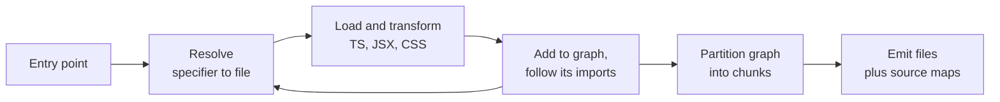

# Modules and Bundling {#ch-modules-and-bundling}

> Describe what a bundler does in four steps, and explain why one import pulled in half a library.

**In this chapter:** the four steps · resolution and bare specifiers · the module graph · chunking as graph partitioning · why ESM made this possible · source maps

## 💡 The Core Idea

A bundler does four things, in order:

**Resolve** — turn every import specifier into a file on disk. **Load and transform** — read each file and
convert it to something a browser understands. **Build a graph** — follow the imports until nothing new
is reachable. **Emit chunks** — partition that graph into files and write them out.

Almost every bundler problem is one of those four steps failing in a way whose error message names a
different step. "Module not found" is resolution. "Unexpected token" is transformation. "Why is this in my
bundle?" is the graph. "Why are there forty chunks?" is emission.

Naming the step first is what turns a two-hour build investigation into a ten-minute one.

## How It Works

### The four steps



**Resolution and loading loop until the graph closes; emission happens once.**

### Resolution, and why bare specifiers are hard

`./utils` is a relative path — the resolver appends extensions until it finds a file. `react` is a **bare
specifier**, and browsers have no rule for it. The bundler has to walk up the directory tree looking in
`node_modules`, then read that package's `package.json` to decide which file it actually means.

That last part is the source of most resolution surprises, because a package can declare several entry
points for one import:

| Field | Chosen when |
| ----- | ----------- |
| `exports` | Modern resolvers, and it **overrides everything else** |
| `main` | Legacy fallback, usually CommonJS |
| `module` | Older convention for an ESM build |
| `browser` | A browser-specific substitution |
| Conditions inside `exports` | `import` / `require` / `node` / `browser` / `development` |

An `exports` map is also a **wall**: files it does not list cannot be imported at all, which is why a deep
import that worked last year now fails after a dependency upgrade. That is not a bug in your build; it is
the package author closing a door they never meant to leave open.

### The graph decides what ships

Once resolution succeeds, the bundler follows imports transitively. Everything reachable from an entry
point is in the bundle. **Reachable, not used** — those are different, and the difference is where bundle
weight comes from.

A barrel file is the usual culprit:

```typescript
// components/index.ts — re-exports forty components
export * from './Button';
export * from './DataGrid'; // pulls in a charting dependency
// ...

// Somewhere else — this reaches the whole barrel before anything is eliminated.
import { Button } from '../components';
```

Removing what is reachable but unused is tree shaking, and it needs static imports and honest
side-effect metadata to work. The mechanics are in
[Chapter ?? — Bundle Optimisation](#ch-bundle-optimisation); what matters here is that the graph is built
first and pruned second, so a graph that reaches too far limits how much pruning can help.

### Why ESM changed what was possible

CommonJS is resolved at runtime. `require()` is a function call, its argument can be computed, and
exports can be reassigned while the program runs. A bundler cannot know what a CommonJS module exports
without executing it.

ES modules are **statically analysable**. Imports and exports are declarations, hoisted, with fixed names,
resolved before any code runs. That is what makes tree shaking, safe cross-module inlining and reliable
chunking possible at all — and it is the reason every tool in this section assumes ESM and treats
CommonJS as a compatibility case. The runtime semantics behind that difference are in
[Chapter ?? — The Module System](#ch-module-system).

### Chunking is graph partitioning

Emitting one file per module means hundreds of requests. Emitting one file means downloading the whole
application to see the login page. Chunking is the compromise, and it is a real optimisation problem with
three competing goals:

| Goal | Pulls towards |
| ---- | ------------- |
| Fewer requests | Larger chunks |
| Less unused code per route | Smaller chunks |
| Better cache reuse across deploys | Stable boundaries between rarely- and frequently-changing code |

The third goal is the one people forget. If a shared chunk contains both your dependencies and your
application code, every deploy invalidates the dependencies too, and returning users re-download a
library that did not change.

Two chunk boundaries exist without you asking. A **dynamic import** — `import('./Editor')` — is always a
split point, because its target is not needed until it is called. And most bundlers separate
`node_modules` from source for the caching reason above. Everything beyond that is configuration, covered
as a performance technique in [Chapter ?? — Code Splitting](#ch-loading-and-code-splitting).

### Source maps, and what they cost

A source map maps positions in the emitted file back to your source. Without one, a production stack trace
points at column 41,209 of `main-a3f9.js`.

The decision is not whether to generate them but where they live:

| Option | Debuggable in production | Source visible to users |
| ------ | ------------------------ | ----------------------- |
| Inline in the bundle | Yes | **Yes** — and the bundle is much larger |
| Separate file, publicly served | Yes | **Yes**, to anyone who looks |
| Separate file, uploaded to error tracking only | Yes, in the error tool | No |
| None | No | No |

The third row is the answer for most products: generate maps, upload them to the error reporter during
the build, and do not deploy them to the CDN.

## When to Use It

You do not choose whether to bundle any more — every framework ships one. What you do choose:

| Decision | Guidance |
| -------- | -------- |
| Barrel files in application code | Avoid. Import from the module that defines the thing |
| Barrel files in a published package | Only with `sideEffects: false` and per-file exports |
| Manual chunk configuration | Only after reading a bundle report. Defaults are good now |
| Bundling a library you publish | Ship ESM, declare `exports` and `sideEffects`, do not bundle dependencies |
| Source maps | Always generate; upload to error tracking, do not serve publicly |

## Common Mistakes

**❌ Importing from a barrel to keep import lines tidy.**
✅ It reaches the whole barrel. Import from the defining module.

**❌ Assuming an unused import is free.**
✅ It is free only if the module has no side effects and the package says so. Otherwise it ships.

**❌ Deep-importing into a package's internals.**
✅ An `exports` map can remove that path in a patch release. Use the public entry points.

**❌ Reading a bundle size total and stopping there.**
✅ The total says nothing about which route pays for what. Read the per-chunk report and the module
attribution inside the largest chunk.

**❌ Publishing source maps to the CDN because the build produced them.**
✅ That publishes your source. Upload them to the error tracker instead.

## 🔑 Key Takeaways

- A bundler resolves, transforms, builds a graph, and emits chunks — and errors usually name the wrong step.
- A package's `exports` map decides which file an import means, and forbids everything it does not list.
- Everything reachable from an entry point ships; reachable is not the same as used.
- ES modules are statically analysable, which is what makes tree shaking and reliable chunking possible.
- Chunking trades request count against unused code against cache reuse across deploys.

## Interview Questions

**Q: What does a bundler actually do?**

Four steps. It resolves each import specifier to a file, applying the package's `exports` conditions for
bare specifiers. It loads and transforms each file — TypeScript, JSX, CSS. It follows imports to build a
module graph. Then it partitions that graph into chunks and emits them with source maps. Most build
failures are one of those four steps, and the error message often names a different one.

**Q: A single import added 300 KB to the bundle. How do you find out why?**

Read the bundle report for module attribution inside the chunk that grew, and trace the import path back
to your source. The usual answer is a barrel file: importing one component from an index that re-exports
forty reaches all forty, and tree shaking cannot remove modules the package has not declared
side-effect-free. The fix is to import from the defining module.

**Q: Why did tree shaking only become practical with ES modules?**

CommonJS resolves at runtime — `require()` takes an arbitrary expression and exports can be reassigned —
so a bundler cannot know what a module exports without running it. ESM imports and exports are static
declarations with fixed names, resolved before execution, so the tool can prove a binding is never read
and delete it.

**Q: How would you decide where to split chunks?**

Start from the defaults: dynamic imports and a vendor split. Then look at what a returning user
re-downloads after a deploy — if application code and dependencies share a chunk, every release
invalidates both. Separate code by change rate, not by feature. Only tune further with a bundle report in
front of you.

## What to Read Next

- [Chapter ?? — Vite and the Dev Loop](#ch-vite-and-the-dev-loop) — how these four steps behave differently in development
- [Chapter ?? — Bundle Optimisation](#ch-bundle-optimisation) — tree shaking, minification and compression in detail
- [Chapter ?? — The Module System](#ch-module-system) — ESM and CommonJS at runtime rather than at build
