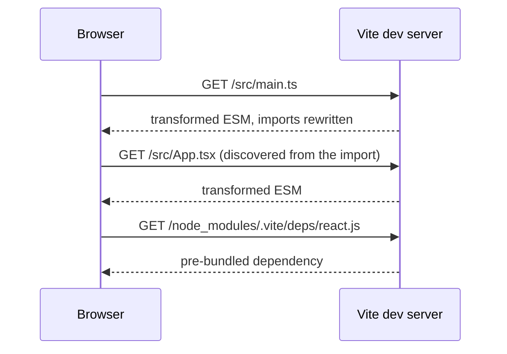

# Vite and the Dev Loop {#ch-vite-and-the-dev-loop}

> Explain why the dev server starts instantly and the build does not, and stop the two from disagreeing.

**In this chapter:** two programs, one config · the unbundled dev server · dependency pre-bundling · how HMR decides what to reload · the plugin hooks · environment variables are inlined

## 💡 The Core Idea

A dev server and a production build are solving opposite problems.

The dev server serves one developer over localhost, where a request costs almost nothing and the code
changes every few seconds. It should do the **least possible work per change**.

The build serves every user over a real network, where each request costs a round trip and the output is
written once and read a million times. It should do the **most possible work up front**.

Vite's original insight was to stop pretending these are the same program. In development it does not
bundle at all: the browser asks for modules over native ESM and Vite transforms them one at a time, on
demand. Startup cost becomes independent of how large the application is.

> ⚠️ **Moving target:** Vite's internals changed substantially in version 8. Versions 2–7 used esbuild in
> development and Rollup for the build — two bundlers with different semantics, which is where the classic
> "it works in dev, breaks in the build" bugs came from. Vite 8 unifies both on **Rolldown**, a Rust
> bundler with Rollup-compatible plugins. Check your version before trusting any article about Vite's
> internals, this one included. The durable idea — do less in development, more in the build — has not
> changed.

## How It Works

### The unbundled dev server



**The browser drives the graph walk, so only what a page actually imports is ever transformed.**

Two consequences. Cold start does not grow with application size, because nothing is processed until
something asks for it. And a change to one file invalidates one module, not a bundle — which is what makes
the update feel instant.

### Dependency pre-bundling, and why it exists

Source files are served raw, but `node_modules` is not. Dependencies are pre-bundled once and cached
under `node_modules/.vite`, for two reasons.

Some packages still ship CommonJS, which a browser cannot import. And an ESM package that ships hundreds
of small files — the classic case being a utility library with one function per file — would trigger
hundreds of requests for a single import.

Pre-bundling is a **development-only** step. The production build handles dependencies as part of the
normal graph.

The failure mode is a dependency the scanner did not find, because it is imported dynamically or from
inside a virtual module. The page then reloads mid-session as Vite discovers and re-bundles it. Listing it
in `optimizeDeps.include` fixes it permanently.

### How HMR decides what to reload

Hot Module Replacement is a small protocol, not magic. When a file changes, the server finds the modules
affected and walks **up** the import graph looking for one that has declared it can accept an update.

- If a module accepts its own update, only that module is replaced.
- If not, the search continues to its importers.
- If it reaches an entry point with nothing accepting, the page does a full reload.

Framework plugins register those accept handlers for you — that is all React Fast Refresh and Svelte's
HMR integration are.

**Declaring one by hand, for a module holding a value:**

```typescript
export const config: AppConfig = { theme: 'dark', locale: 'en-GB' };

if (import.meta.hot) {
  // Accept this module's own updates; without this the page reloads instead.
  import.meta.hot.accept();
  // Hand state to the replacement module rather than losing it.
  import.meta.hot.dispose(() => saveScrollPosition());
}
```

This explains the two complaints people bring to a bundler. "HMR reloads the whole page" means nothing in
the chain accepted — usually because the changed file exports something a framework plugin cannot
hot-swap, such as a non-component value from a component file. "State is lost on every save" means the
module was replaced and its state went with it.

### The plugin model

Vite plugins are Rollup plugins with extra hooks. That compatibility is the reason the ecosystem is as
large as it is: a plugin written for Rollup usually works unchanged.

| Hook | Runs | Used for |
| ---- | ---- | -------- |
| `resolveId` | Resolution | Virtual modules, aliases |
| `load` | Loading | Generating a module's contents |
| `transform` | After load | Compiling a syntax, injecting code |
| `configureServer` | Dev only | Middleware, custom endpoints |
| `transformIndexHtml` | Both | Injecting tags into the HTML shell |
| `handleHotUpdate` | Dev only | Controlling what HMR invalidates |

Two fields control ordering, and getting them wrong is the usual reason a plugin "does nothing":
`enforce: 'pre' | 'post'` places a plugin relative to the core plugins, and `apply: 'serve' | 'build'`
restricts it to one of the two programs.

### Environment variables are inlined, not read

Variables prefixed `VITE_` are exposed to client code as `import.meta.env.VITE_*`. The prefix is a safety
gate — everything else in the environment stays out of the bundle.

What matters is that these are **replaced at build time**, not read at runtime. `import.meta.env.VITE_API_URL`
becomes a string literal in the emitted JavaScript.

Two consequences follow. **A secret in a `VITE_` variable is published**, in plain text, to anyone who
opens the bundle — this is a real and recurring incident, not a theoretical one. And **changing the
variable requires a rebuild**, so one artefact cannot be promoted across environments. If you need that,
the value has to come from a runtime endpoint or an injected script tag instead.

## When to Use It

| Situation | Guidance |
| --------- | -------- |
| New single-page application, any framework | Vite is the default. There is no live argument |
| A meta-framework project | Whatever it ships with — SvelteKit and Nuxt are Vite-based, Next.js is not |
| A large existing Webpack build | Migration is worth it for dev speed; budget for the loader and plugin gap |
| A library | Vite's library mode, or a dedicated bundler. Ship ESM and declare `exports` |
| Something needs a Webpack-only plugin | Check for a Vite equivalent first; a small number still have none |

## Common Mistakes

**❌ Putting a secret in a `VITE_` variable.**
✅ It is inlined into the client bundle. Anything with that prefix is public.

**❌ Assuming a value read from the environment is read at runtime.**
✅ It was replaced at build time. One artefact cannot serve two environments this way.

**❌ Ignoring a mid-session page reload as "just Vite being Vite".**
✅ It is a dependency discovered after the initial scan. Add it to `optimizeDeps.include`.

**❌ Exporting a non-component value from a component file, then complaining HMR reloads.**
✅ Fast Refresh can only hot-swap components. Move constants and helpers to their own module.

**❌ Trusting that dev behaviour equals build behaviour.**
✅ Before Vite 8 they ran different bundlers, and even now dev serves unbundled while the build does not.
Run the production build in continuous integration on every change, not before a release.

## 🔑 Key Takeaways

- The dev server and the build are different programs: least work per change against most work up front.
- Development serves unbundled native ESM, so cold start does not grow with application size.
- Dependencies are pre-bundled for development only, to handle CommonJS and hundred-file packages.
- HMR walks up the import graph for a module that accepts the update; if none does, the page reloads.
- `VITE_` variables are inlined at build time — they are public, and they need a rebuild to change.

## Interview Questions

**Q: Why does the Vite dev server start instantly on a large application?**

Because it does not bundle. It serves source files as native ES modules and transforms each one only when
the browser requests it, so startup cost depends on what the first page imports rather than on the size of
the codebase. Dependencies are pre-bundled once and cached, which is the only up-front work.

**Q: What is dependency pre-bundling for?**

Two problems. Some packages still ship CommonJS, which browsers cannot import, so they must be converted.
And an ESM package split into hundreds of files would cause hundreds of requests for one import. Vite
bundles `node_modules` once into cached artefacts. It is a development-only step; the production build
treats dependencies as part of the normal graph.

**Q: Why does saving one file sometimes reload the whole page?**

HMR looks for a module that has declared it accepts updates, walking up from the changed file. If nothing
in that chain accepts — usually because the file exports something the framework plugin cannot hot-swap,
like a constant next to a component — the search reaches the entry point and Vite falls back to a full
reload. Splitting the non-component export into its own module fixes it.

**Q: Something works in development and breaks in the production build. Where do you start?**

At the dev/build asymmetry. Development serves unbundled modules with no tree shaking and no minification;
the build does all three, and before Vite 8 it used a different bundler with different CommonJS interop.
The usual causes are a dependency only resolvable in one mode, a side effect removed by tree shaking, or
code relying on module evaluation order that bundling changed.

## What to Read Next

- [Chapter ?? — Turbopack, Rspack and Rolldown](#ch-rust-bundlers) — why the layer underneath was rewritten
- [Chapter ?? — Modules and Bundling](#ch-modules-and-bundling) — the four steps this chapter splits in two
- [Chapter ?? — Vitest Basics](#ch-vitest-basics) — the test runner that reuses this pipeline
