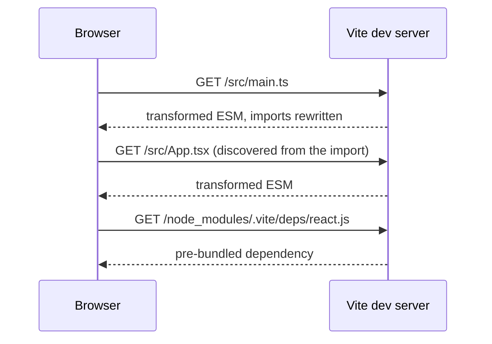
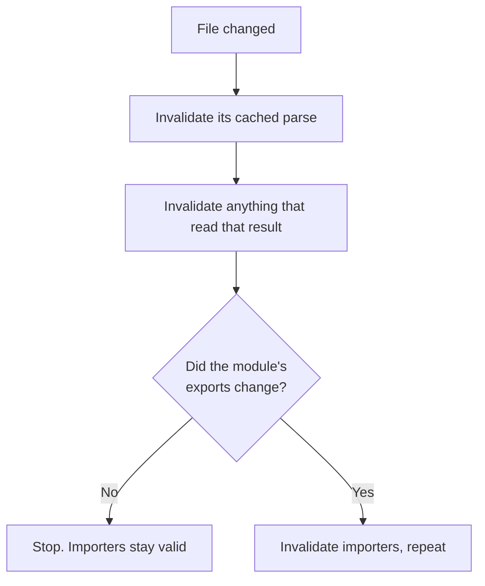

# Vite, Rust Bundlers and the Dev Loop {#ch-vite-and-the-dev-loop}

> Explain why the dev server starts instantly and the build does not, and pick a bundler on compatibility rather than benchmarks.

**In this chapter:** two programs, one config · the unbundled dev server and HMR · environment variables are inlined · why the bundlers were rewritten in Rust · what a faster bundler does not fix

## 💡 The Core Idea

A dev server and a production build solve opposite problems.

The dev server serves one developer over localhost. A request costs almost nothing, and the code changes
every few seconds. It should do the **least possible work per change**.

The build serves every user over a real network. Each request costs a round trip, and the output is
written once and read a million times. It should do the **most possible work up front**.

Vite's original insight was to stop pretending these are the same program. In development it does not
bundle at all. The browser asks for modules over native ESM, and Vite transforms them on demand. The Rust
rewrites underneath push further: a rebuild costs what _changed_, not what exists.

> ⚠️ **Moving target:** this is the fastest-moving corner of the book. Vite 2–7 used esbuild in
> development and Rollup for the build. Vite 8 unifies both on **Rolldown**, a Rust bundler with
> Rollup-compatible plugins. Turbopack is the default inside Next.js, and Rspack targets Webpack builds.
> Defaults, stability status and benchmarks will change again, so check your version. The durable ideas:
> do less in development and more in the build, and choose a bundler by **which ecosystem it preserves**.

## How It Works

### The unbundled dev server



**The browser drives the graph walk, so only what a page actually imports is ever transformed.**

Cold start does not grow with application size, because nothing is processed until something asks for
it. A change to one file invalidates one module, not a bundle. That is why the update feels instant.

Source files are served raw, but `node_modules` is not. Dependencies are **pre-bundled** once and cached
under `node_modules/.vite`. Some packages still ship CommonJS, which a browser cannot import. And an ESM
package split into hundreds of small files would trigger hundreds of requests for one import.

Pre-bundling is development-only. A dependency the scanner missed, because it is imported dynamically,
makes the page reload mid-session. Listing it in `optimizeDeps.include` fixes it.

### How HMR decides what to reload

Hot Module Replacement (HMR) is a small protocol, not magic. When a file changes, the server walks **up**
the import graph. It looks for a module that has declared it can accept the update.

- If a module accepts its own update, only that module is replaced.
- If not, the search continues to its importers.
- If it reaches an entry point with nothing accepting, the page does a full reload.

Framework plugins register those accept handlers for you. That is all React Fast Refresh and Svelte's HMR
integration are.

**Declaring one by hand, for a module holding a value:**

```typescript
export const config: AppConfig = { theme: 'dark', locale: 'en-GB' };

if (import.meta.hot) {
  // Accept this module's own updates; without this the page reloads instead.
  import.meta.hot.accept();
  // Hand state to the replacement module rather than losing it.
  import.meta.hot.dispose(() => saveScrollPosition());
}
```

"HMR reloads the whole page" means nothing in the chain accepted. The usual cause is a component file
that also exports a plain value, which the framework plugin cannot hot-swap.

### Plugins and environment variables

Vite plugins are Rollup plugins with extra hooks, so a plugin written for Rollup usually works unchanged.
The core hooks are `resolveId`, `load` and `transform`. Two fields control ordering, and getting them
wrong is the usual reason a plugin "does nothing". `enforce: 'pre' | 'post'` places a plugin relative to
the core plugins. `apply: 'serve' | 'build'` restricts it to one of the two programs.

Variables prefixed `VITE_` are exposed to client code as `import.meta.env.VITE_*`. The prefix is a
safety gate: everything else in the environment stays out of the bundle. These values are **replaced at
build time**, not read at runtime. `import.meta.env.VITE_API_URL` becomes a string literal in the output.

> ⚠️ **A secret in a `VITE_` variable is published** in plain text to anyone who opens the bundle. And
> because the value is inlined, one artefact cannot be promoted across environments. For that, read the
> value from a runtime endpoint or an injected script tag.

### Why the layer underneath was rewritten in Rust

There are two reasons, and the interesting one is not "Rust is faster than JavaScript".

**Parallelism.** Parsing and transforming modules is embarrassingly parallel, since each file is
independent. A single-threaded JavaScript process cannot use the other cores on the machine.

**Incrementality.** The old model is a pipeline: read, transform, link and emit every file. The new model
memoises single operations, such as parsing one file or resolving one specifier. It records what each
one depended on. That takes a lot of memory and bookkeeping, which is hard in a garbage-collected language.



**The cache is invalidated by what actually changed, not by which file was touched.**

Hot updates stop slowing down as the application grows. A cache persisted to disk also makes a restart
nearly as cheap as a hot update. **Making the same architecture faster gets you a constant factor.
Changing the architecture changes what build time is proportional to.**

### The three projects

| | Turbopack | Rspack | Rolldown |
| --- | --- | --- | --- |
| **From** | Vercel | ByteDance | VoidZero |
| **Preserves** | Next.js configuration | **Webpack config, loaders and plugins** | **Rollup plugins** |
| **Its job** | The bundler inside Next.js | A drop-in Webpack replacement | The bundler inside Vite |

The "preserves" row is the whole decision. Teams do not choose these tools on throughput. They choose
them for what they do not have to rewrite. Usually you do not choose at all: you pick a framework, and
the framework has chosen. Knowing the differences matters for migration and diagnosis.

The transform layer moved the same way. **SWC** (Rust) replaces Babel in Next.js and Turbopack. **Oxc**
(Rust) powers Rolldown's parsing and the Oxlint linter. **esbuild** (Go) is still widely used.

> ⚠️ **These tools strip types; they do not check them.** They delete TypeScript annotations without
> building a type graph, which is why they are fast. A green build proves nothing about type correctness.
> [Chapter ?? — Type-Checking and Linting at Scale](#ch-type-checking-and-linting) covers where the check goes.

### What a faster bundler does not fix

| Still your problem | Why the bundler cannot help |
| ------------------ | --------------------------- |
| A barrel file reaching an entire component library | The graph is what you wrote |
| A 900 KB dependency for one date format | Nothing removes what you imported |
| A twenty-minute continuous integration run | Bundling is one job among many |
| Loader and plugin gaps after a migration | Compatibility is high, not total |

## When to Use It

| Situation | Guidance |
| --------- | -------- |
| New single-page application, any framework | Vite is the default. There is no live argument |
| A meta-framework project | Whatever it ships with. SvelteKit and Nuxt use Vite; Next.js uses Turbopack |
| Large Webpack build, slow dev loop | Evaluate Rspack. The configuration mostly carries over |
| Webpack build with exotic plugins | Check parity before committing, and keep the fallback path |
| Choosing a framework on bundler benchmarks | Don't. Choose on the framework |

## Common Mistakes

**❌ Putting a secret in a `VITE_` variable.**
✅ It is inlined into the client bundle. Anything with that prefix is public.

**❌ Trusting that dev behaviour equals build behaviour.**
✅ Dev serves unbundled modules; the build bundles, tree-shakes and minifies. Run the production build in
continuous integration on every change, not just before a release.

**❌ Believing the build validates your types.**
✅ It strips them. Run `tsc --noEmit` in continuous integration or type errors ship.

**❌ Migrating the bundler to fix a slow pipeline without measuring.**
✅ If the twenty minutes is tests and linting, a faster bundler changes almost nothing.

**❌ Copying configuration between Rust bundlers.**
✅ They preserve _different_ ecosystems. A Webpack loader is not a Rollup plugin.

## 🔑 Key Takeaways

- The dev server and the build are different programs: least work per change against most work up front.
- Development serves unbundled native ESM, and HMR walks up the import graph for a module that accepts the update.
- `VITE_` variables are inlined at build time, so they are public and need a rebuild to change.
- Rust bought real parallelism and an incremental cache that makes rebuild cost follow the size of the change.
- Turbopack, Rspack and Rolldown differ mainly in which ecosystem they preserve, and none of them checks types.

## Interview Questions

**Q: Why does the Vite dev server start instantly on a large application?**

It does not bundle. It serves source files as native ES modules and transforms each one only when the
browser asks for it. Startup cost depends on what the first page imports, not on the size of the
codebase. Dependencies are pre-bundled once and cached, which is the only up-front work.

**Q: Why does saving one file sometimes reload the whole page?**

HMR walks up from the changed file, looking for a module that accepts updates. If nothing in the chain
accepts, the search reaches the entry point and Vite does a full reload. The usual cause is a constant
exported next to a component. Moving it to its own module fixes it.

**Q: Something works in development and breaks in the production build. Where do you start?**

At the dev/build asymmetry. Development serves unbundled modules with no tree shaking and no
minification; the build does all three. Before Vite 8 it also used a different bundler with different
CommonJS interop. Look for a dependency that resolves in only one mode, a side effect removed by tree
shaking, or code that relies on module evaluation order.

**Q: Why were the bundlers rewritten in Rust rather than optimised?**

Bundling is embarrassingly parallel, and a single-threaded process cannot use the other cores. An
incremental cache fine-grained enough to make rebuilds follow the change needs memory control that is
impractical in a garbage-collected runtime. Optimisation buys a constant factor. The architecture change
alters what build time is proportional to.

**Q: Your production build succeeds but the application crashes on a type error. How?**

The bundler's transformer strips TypeScript annotations without checking them. That is a large part of
why it is fast. Nothing in the build path builds a type graph, so type-checking must run as its own step,
usually `tsc --noEmit` in continuous integration, as a gate on merging.

**Q: Your team wants to migrate off Webpack for build speed. What do you ask first?**

Where the time actually goes. If cold dev start and hot updates hurt, Rspack helps directly and keeps
most of the configuration. If the twenty-minute pipeline is mostly tests, type-checking and linting, the
bundler is a small slice. Then the answer is task caching and affected-package detection. Measure first.

## What to Read Next

- [Chapter ?? — Modules and Bundling](#ch-modules-and-bundling) — the four steps this chapter splits in two
- [Chapter ?? — Monorepos](#ch-monorepos) — the other half of a slow pipeline
- [Chapter ?? — Type-Checking and Linting at Scale](#ch-type-checking-and-linting) — the step no bundler performs
