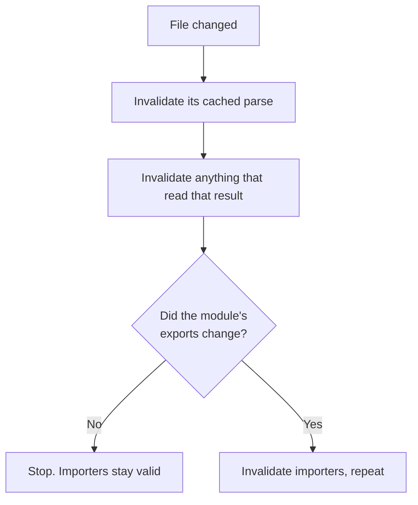

# Turbopack, Rspack and Rolldown {#ch-rust-bundlers}

> Say what the rewrite actually bought beyond speed, and pick between three tools on compatibility rather than benchmarks.

**In this chapter:** the two reasons for Rust · incremental computation · the three projects and what each preserves · SWC and Oxc · what none of them fixes

## 💡 The Core Idea

There are two reasons the bundlers were rewritten, and the interesting one is not "Rust is faster than
JavaScript".

**Parallelism.** Parsing and transforming modules is embarrassingly parallel — each file is independent —
and a single-threaded JavaScript process cannot use the other seven cores on the machine.

**Incrementality.** A rebuild should cost what *changed*, not what exists. That needs a persistent,
fine-grained cache of intermediate results and a dependency graph over them, which is an enormous amount
of memory and bookkeeping to do in a garbage-collected language.

The second reason is the architectural one, and it is why a rewrite was needed rather than an
optimisation pass. **Making the same architecture faster gets you a constant factor. Changing the
architecture changes what the build time is proportional to.**

> ⚠️ **Moving target:** this is the fastest-moving corner of the ecosystem in the book. Default bundlers,
> stability status and benchmark claims all changed during 2025 and 2026 and will change again. Treat
> every version fact here as needing a check. The durable part is the axis: these tools differ mainly by
> **which existing ecosystem they preserve**, not by speed.

## How It Works

### Incremental computation, concretely

The old model is a pipeline: read every file, transform every file, link, emit. A watch mode makes that
cheaper with coarse caches, but the unit of invalidation stays large.

The new model memoises at the level of individual operations — parse this file, resolve this specifier,
transform this module — and records what each one depended on. Changing a file invalidates that file's
results and whatever transitively read them. Everything else is reused.

**The cache is invalidated by what actually changed, not by which file was touched.**

Two behaviours follow. Hot updates stop degrading as the application grows, because the work per change is
proportional to the change. And a cache persisted to disk makes a *restart* nearly as cheap as a hot
update, which is what turns a two-minute morning start into a few seconds.

### The three projects

| | Turbopack | Rspack | Rolldown |
| --- | --- | --- | --- |
| **From** | Vercel | ByteDance | VoidZero |
| **Preserves** | Next.js configuration | **Webpack config, loaders and plugins** | **Rollup plugins** |
| **Its job** | The bundler inside Next.js | A drop-in Webpack replacement | The bundler inside Vite |
| **Choose it when** | You use Next.js | You have a large Webpack build to migrate | You use Vite |

Read that "preserves" row again, because it is the whole decision. None of these tools is chosen on
throughput in practice. They are chosen because of what you do not have to rewrite.

Rspack exists so that a five-year-old Webpack configuration with twenty loaders and a Module Federation
setup can go faster without being rewritten. Rolldown exists so that Vite can have one bundler for
development and the build without abandoning the Rollup plugin ecosystem. Turbopack exists because
Next.js needed a bundler that understands Server Components, multiple environments and its own
conventions natively.

The corollary is that **you rarely choose one directly.** You choose a framework, and the framework has
chosen. The reason to understand the differences is migration and diagnosis.

### The transform layer moved too

Underneath the bundlers, the tools that turn TypeScript and JSX into JavaScript were rewritten on the same
logic.

| Tool | Language | Replaces | Notes |
| ---- | -------- | -------- | ----- |
| **SWC** | Rust | Babel | Used by Next.js and Turbopack; has a plugin API |
| **Oxc** | Rust | Babel, and parts of ESLint | Powers Rolldown's parsing and the Oxlint linter |
| **esbuild** | Go | Babel, terser | Still widely used; increasingly a dependency of other tools |

**These strip types; they do not check them.** SWC, Oxc and esbuild all delete TypeScript annotations
without ever building a type graph — that is exactly why they are fast. A build that succeeds proves
nothing about type correctness, which is why type-checking has to be a separate step in continuous
integration. [Chapter ?? — Type-Checking and Linting at Scale](#ch-type-checking-and-linting) covers
where it goes.

### What the rewrite does not fix

A faster bundler makes a bad build faster. It does not make it good.

| Still your problem | Why the bundler cannot help |
| ------------------ | --------------------------- |
| A barrel file reaching an entire component library | The graph is what you wrote |
| A 900 KB dependency for one date format | Nothing removes what you imported |
| Type errors reaching production | The bundler never type-checked |
| A twenty-minute continuous integration run | Bundling is one job among many — see [Chapter ?? — Monorepos](#ch-monorepos) |
| Loader and plugin gaps after a migration | Compatibility is high, not total |

## When to Use It

| Situation | Do |
| --------- | -- |
| Starting a Next.js project | Nothing. Turbopack is the default |
| Starting a Vite project | Nothing. Rolldown is the bundler from Vite 8 |
| Large Webpack build, slow dev loop | Evaluate Rspack — the configuration mostly carries over |
| Webpack build with exotic plugins | Check parity before committing; keep the fallback path |
| Choosing a framework on bundler benchmarks | Don't. Choose on the framework |

## Common Mistakes

**❌ Treating a benchmark number as the reason to migrate.**
✅ The number is real and it is not the constraint. Measure your own cold start, hot update and continuous
integration time before and after.

**❌ Assuming full plugin compatibility.**
✅ Rspack covers most of Webpack's ecosystem and Rolldown most of Rollup's — most, not all. Identify the
plugins with no equivalent before starting, and keep an escape hatch to the old bundler.

**❌ Believing the build validates your types.**
✅ It strips them. Run `tsc --noEmit` in continuous integration or type errors ship.

**❌ Migrating the bundler to fix a slow pipeline without measuring.**
✅ If the twenty minutes is tests and linting, a faster bundler changes almost nothing.

**❌ Copying configuration between these tools.**
✅ They preserve *different* ecosystems. A Webpack loader is not a Rollup plugin, and neither is a
Turbopack rule.

## 🔑 Key Takeaways

- Rust bought two things: real parallelism, and an incremental cache fine-grained enough to make rebuild cost proportional to the change.
- Turbopack, Rspack and Rolldown differ mainly in which existing ecosystem they preserve.
- You usually inherit one by choosing a framework rather than choosing it directly.
- SWC, Oxc and esbuild strip types without checking them, so type-checking is always a separate step.
- A faster bundler does not fix a bad module graph, a heavy dependency, or a slow test suite.

## Interview Questions

**Q: Why were the bundlers rewritten in Rust rather than optimised?**

Two things a JavaScript implementation could not do well. Bundling is embarrassingly parallel and a
single-threaded process cannot use the other cores. And an incremental cache fine-grained enough to make
rebuilds proportional to the change requires memory control and bookkeeping that is impractical in a
garbage-collected runtime. Optimisation buys a constant factor; the architecture change alters what build
time is proportional to.

**Q: How would you choose between Turbopack, Rspack and Rolldown?**

Usually you do not — the framework chooses. When it is a genuine decision, choose on compatibility.
Rspack preserves Webpack configuration, loaders and plugins, so it is the migration path for a large
Webpack build. Rolldown preserves Rollup plugins and is Vite's bundler. Turbopack is the one built into
Next.js. Speed differences are real and are almost never the deciding factor.

**Q: Your production build succeeds but the application crashes on a type error. How is that possible?**

The bundler's transformer strips TypeScript annotations without checking them — that is a large part of
why it is fast. Nothing in the build path ever constructs a type graph. Type-checking has to run as its
own step, usually `tsc --noEmit` in continuous integration, and be a gate on merging.

**Q: Your team wants to migrate off Webpack for build speed. What do you ask first?**

Where the time actually goes. If the cold dev start and hot updates are the pain, a Rust bundler helps
directly. If the twenty-minute pipeline is mostly tests, type-checking and linting, the bundler is a small
slice and the answer is task caching and affected-package detection instead. Measure before migrating.

## What to Read Next

- [Chapter ?? — Monorepos](#ch-monorepos) — the other half of a slow pipeline
- [Chapter ?? — Type-Checking and Linting at Scale](#ch-type-checking-and-linting) — the step none of these tools performs
- [Chapter ?? — Vite and the Dev Loop](#ch-vite-and-the-dev-loop) — what Rolldown sits underneath
