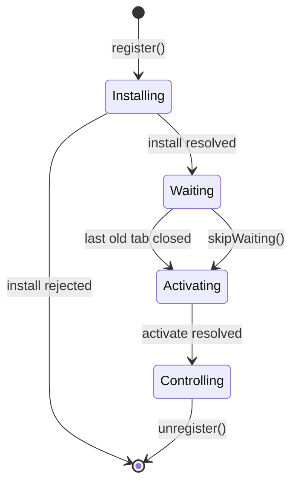

# Service Workers {#ch-service-workers}

> Ship a service worker you can update, and explain to a reviewer exactly when the new one takes over.

**In this chapter:** the lifecycle · scope and control · intercepting `fetch` · shipping an update without stranding a tab · the escape hatch

## 💡 The Core Idea

A service worker is a script the browser keeps outside your page. It sits between the application and
the network like a proxy you wrote yourself, it survives every tab being closed, and it decides what a
request returns. That last power is what makes it useful and what makes it dangerous: once a worker is
installed, the browser asks it first, so a bad worker can serve a broken build to a user who has no way
to clear it.

> The service worker is code you deploy once and then cannot easily take back. Design the update path
> before you design the caching.

## How It Works

Registration happens from the page. Everything after that happens in the worker's own global scope,
which has no DOM, no `window`, and no synchronous storage.

**Registering, and only where it can work:**

```typescript
// Service workers need HTTPS. localhost is exempt so development still works.
if ('serviceWorker' in navigator) {
  window.addEventListener('load', (): void => {
    // Registration competes with page startup for bandwidth — wait for load.
    void navigator.serviceWorker.register('/sw.js', { scope: '/' });
  });
}
```

A worker moves through four states, and the third one is where most production incidents live.

| Stage | Event | What you do in it |
| ----- | ----- | ----------------- |
| Installing | `install` | Precache the shell. If the handler rejects, the worker is discarded |
| Waiting | — | Nothing. The worker sits idle while any tab is still controlled by the old one |
| Activating | `activate` | Delete caches from previous versions. Nothing else is safe to do here |
| Controlling | `fetch`, `message`, `push` | Answer requests |



**The lifecycle, including the two ways out of `waiting`.**

**Install and activate, the shape they always take:**

```typescript
declare const self: ServiceWorkerGlobalScope;

const CACHE = 'shell-v3'; // Bump this string on every deploy that changes the shell.

self.addEventListener('install', (event: ExtendableEvent): void => {
  // waitUntil keeps the worker alive; without it the browser may kill it mid-cache.
  event.waitUntil(caches.open(CACHE).then((c: Cache) => c.addAll(['/', '/offline.html', '/app.css'])));
});

self.addEventListener('activate', (event: ExtendableEvent): void => {
  event.waitUntil(
    caches
      .keys()
      .then((names: string[]) => Promise.all(names.filter((n) => n !== CACHE).map((n) => caches.delete(n))))
      // claim() must sit inside waitUntil — the worker can be killed the moment the handler returns.
      .then((): Promise<void> => self.clients.claim()),
  );
});
```

### Scope decides what it can intercept

A worker controls the directory it is served from and everything below it. `/js/sw.js` controls
`/js/*` and nothing else, which is the single most common reason a service worker "does not work".
Serve it from the origin root, or send `Service-Worker-Allowed: /` and widen the scope explicitly.

### Intercepting fetch

`respondWith` commits you to producing a response. Anything you do not call it for falls through to
the network untouched, which is the right default for requests you have no opinion about.

```typescript
declare const self: ServiceWorkerGlobalScope;

self.addEventListener('fetch', (event: FetchEvent): void => {
  const url = new URL(event.request.url);

  // Only same-origin GETs. Cross-origin and POSTs are left to the network.
  if (event.request.method !== 'GET' || url.origin !== self.location.origin) return;

  event.respondWith(
    fetch(event.request).catch(
      // A navigation that fails offline is the one case worth a hand-written fallback.
      async (): Promise<Response> =>
        (await caches.match('/offline.html')) ?? new Response('Offline', { status: 503 }),
    ),
  );
});
```

## When to Use It

| Scenario | Choose | Why |
| -------- | ------ | --- |
| Static hashed assets | Precache in `install` | The filename changes when the content does, so it can never go stale |
| The HTML document | Network with a cache fallback | A stale document pins users to an old build |
| Update must reach users today | `skipWaiting()` in `install` | The new worker activates without waiting for tabs to close |
| Long-lived tabs, mixed old and new code | Wait, then prompt | Swapping code under a running page breaks in-flight requests |
| Read-only marketing site | No service worker | A CDN with sane cache headers does the same job with no update risk |

> ⚠️ `skipWaiting()` activates a new worker under a page that is still running the old JavaScript. If
> the new worker serves a new asset manifest, a lazy chunk the old page requests may no longer exist.
> Pair it with a reload, or prompt instead.

**The prompt-then-reload update, which is the safe default:**

```typescript
type SWMessage = { type: 'SKIP_WAITING' };

// main.ts
const reg: ServiceWorkerRegistration = await navigator.serviceWorker.register('/sw.js');

reg.addEventListener('updatefound', (): void => {
  reg.installing?.addEventListener('statechange', (): void => {
    // A worker in `installed` while one is already controlling means an update is ready.
    if (reg.waiting && navigator.serviceWorker.controller) showUpdateBanner();
  });
});

function applyUpdate(): void {
  reg.waiting?.postMessage({ type: 'SKIP_WAITING' } satisfies SWMessage);
}

// One reload, not a loop — controllerchange fires once per takeover.
let reloading = false;
navigator.serviceWorker.addEventListener('controllerchange', (): void => {
  if (reloading) return;
  reloading = true;
  window.location.reload();
});
```

## Common Mistakes

**❌ Wrong — caching the document forever:**

```typescript
// Every navigation now returns the build that happened to be live on first visit.
event.respondWith(caches.match(event.request).then((c) => c ?? fetch(event.request)));
```

**✅ Right — network first for navigations:**

```typescript
if (event.request.mode === 'navigate') {
  event.respondWith(fetch(event.request).catch(async () => (await caches.match('/offline.html'))!));
}
```

Cache-first on HTML is how a site gets stuck. The document is the file that names every other file, so
serving it from cache pins the whole application to an old version.

**❌ Wrong — no way out:**

Shipping a worker with no unregister path means a caching bug can only be fixed by every user clearing
site data. Keep a kill switch you can deploy: a worker whose `install` handler calls
`self.registration.unregister()`, deletes all caches, and reloads its clients. Being able to name that
before an interviewer asks is a strong senior signal.

## 🔑 Key Takeaways

- A service worker is a proxy you deploy, and it keeps serving the old version until you deliberately replace it.
- A new worker sits in `waiting` until every tab controlled by the old one closes, which is why a fix can appear not to ship.
- Scope is the directory the worker file is served from, so a worker under `/js/` controls only `/js/`.
- `skipWaiting()` buys speed and spends consistency: new worker, old page, mismatched assets.
- Every production service worker needs an unregister path you can deploy in one commit.

## Interview Questions

**Q: You shipped a fix an hour ago and users still report the bug. What happened?**

Their tab is still controlled by the previous worker, so the new one is stuck in `waiting`. The browser
re-checks the worker script on navigation and roughly every 24 hours, but activation waits for every
controlled client to close — and a pinned tab never does. The fix is an update prompt that posts
`SKIP_WAITING` and reloads on `controllerchange`.

**Q: What is the difference between `skipWaiting()` and `clients.claim()`?**

`skipWaiting()` moves the new worker out of `waiting` into `activate` early. `clients.claim()` makes an
already-active worker take over pages that are currently controlled by nobody or by the old worker.
You usually want both, and you usually want a reload after them, because the pages that just got
claimed are still running the previous build's JavaScript.

**Q: Why is cache-first wrong for HTML but right for `/assets/app.a91f3c.js`?**

The hashed asset's name changes when its content changes, so a cached copy can never be wrong. The
document has a stable URL and names those hashed assets, so a cached document keeps pointing at builds
that may no longer be deployed.

**Q: When would you not use a service worker at all?**

When there is no offline requirement and no install requirement. A service worker adds a deploy path
that is harder to roll back than anything else in the frontend, and HTTP caching at the CDN gives you
most of the performance with none of the staleness risk. Offline-first, installable, or push-driven
products earn it; a content site does not.

## What to Read Next

- [Chapter ?? — Caching Strategies and Offline UX](#ch-caching-and-offline) — which strategy each request type gets, and what happens to writes
- [Chapter ?? — Installability and Push Notifications](#ch-install-and-push) — the manifest and the permission flow that sit on top of the worker
