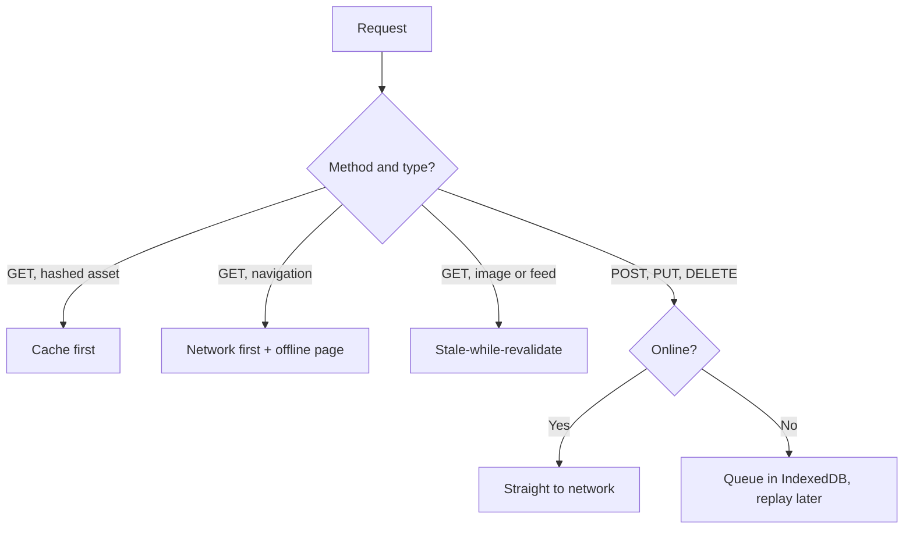

# Caching Strategies and Offline UX {#ch-caching-and-offline}

> Choose a caching strategy per request type, and accept a write from a user who has no connection.

**In this chapter:** the five strategies · which one each request gets · Cache API against IndexedDB · queuing writes offline · what Background Sync adds

## 💡 The Core Idea

There is no correct caching strategy, only a correct pairing of strategy to request. Every strategy is
a position on one axis: how much staleness you will accept in exchange for how much speed. Hashed
assets can be infinitely stale because their names change when they change. A document cannot be stale
at all. A social feed can be a few seconds old and nobody notices. Reads are the easy half — the hard
half is writes, because a write that fails offline has to be remembered somewhere until the network
comes back.

> One strategy for every request is the mid-level answer. Route by request type and say why.

## How It Works

Five strategies, and in practice three of them do all the work.

| Strategy | Reads | Serves offline | Use for |
| -------- | ----- | -------------- | ------- |
| **Cache first** | Cache, network only on a miss | Yes | Hashed assets, fonts, versioned images |
| **Network first** | Network, cache on failure | Last good copy | HTML documents, anything that must be current |
| **Stale-while-revalidate** | Cache now, refresh behind it | Yes | Avatars, thumbnails, feeds, non-critical API reads |
| **Cache only** | Cache, never network | Yes | The precached offline page and app shell |
| **Network only** | Network, no cache | No | Analytics, payments, anything with a side effect |



**Routing a request to a strategy. Method first, then destination.**

**Stale-while-revalidate — the one worth memorising:**

```typescript
declare const self: ServiceWorkerGlobalScope;

async function staleWhileRevalidate(request: Request, cacheName: string): Promise<Response> {
  const cache: Cache = await caches.open(cacheName);
  const cached: Response | undefined = await cache.match(request);

  // Start the refresh but do not await it — the point is to answer now.
  const refresh: Promise<Response> = fetch(request).then(async (fresh: Response): Promise<Response> => {
    // A Response body can be read once, so cache the clone, return the original.
    if (fresh.ok) await cache.put(request, fresh.clone());
    return fresh;
  });

  // No cached copy means there is nothing to be stale, so wait for the network.
  return cached ?? refresh;
}
```

**Network first needs a timeout.** A request that hangs for thirty seconds is worse than a copy that is
five minutes old, and offline detection by `navigator.onLine` does not catch a captive portal or a
connection that resolves DNS and then stalls.

```typescript
async function networkFirst(request: Request, cacheName: string, timeoutMs = 3000): Promise<Response> {
  const cache: Cache = await caches.open(cacheName);

  try {
    // AbortSignal.timeout gives a real cancellation, not just an ignored promise.
    const fresh: Response = await fetch(request, { signal: AbortSignal.timeout(timeoutMs) });
    if (fresh.ok) await cache.put(request, fresh.clone());
    return fresh;
  } catch {
    return (await cache.match(request)) ?? (await cache.match('/offline.html'))!;
  }
}
```

### Cache API or IndexedDB

Both store data offline and they are not interchangeable.

| | Cache API | IndexedDB |
| - | --------- | --------- |
| Stores | `Request`/`Response` pairs | Structured objects |
| Queried by | URL | Key, index, range, cursor |
| Transactions | No | Yes |
| Right for | HTTP responses you will replay to the browser | Application data and the write queue |

The rule is short: responses go in the Cache API, records go in IndexedDB. Storing a JSON payload in
the Cache API works until you need to find one record by field, at which point you are writing a query
engine by hand.

### Offline writes

A write cannot be cached, so it has to be queued. The queue lives in IndexedDB — it needs
transactions, because losing half a replay is worse than not replaying at all.

```typescript
interface PendingWrite {
  readonly id: string;
  readonly url: string;
  readonly body: string;
  readonly queuedAt: number;
}

async function replayQueue(db: IDBDatabase): Promise<void> {
  const pending: readonly PendingWrite[] = await readAll(db, 'writes');

  for (const write of pending) {
    const response: Response = await fetch(write.url, { method: 'POST', body: write.body });

    // A 4xx will never succeed on retry — drop it and surface the failure to the user.
    // A 5xx or a thrown error might, so stop and leave the rest of the queue intact.
    if (response.ok || (response.status >= 400 && response.status < 500)) {
      await remove(db, 'writes', write.id);
    } else {
      break;
    }
  }
}
```

Two things make this correct rather than nearly correct. Replay is **sequential**, because a queue
flushed in parallel reorders the user's edits. And every queued write carries an idempotency key — the
`id` above, sent as a header — so a replay after an ambiguous timeout cannot create the record twice.

### What Background Sync adds

The `online` event only fires while a page is open. The Background Sync API lets the worker ask the
browser to wake it when connectivity returns, even with every tab closed, and the browser retries with
its own backoff.

```typescript
declare const self: ServiceWorkerGlobalScope;

// From the page, after queuing the write.
const reg: ServiceWorkerRegistration = await navigator.serviceWorker.ready;
if ('sync' in reg) await (reg as unknown as { sync: SyncManager }).sync.register('flush-writes');

// In the worker.
self.addEventListener('sync', (event: SyncEvent): void => {
  // Rejecting tells the browser to schedule another attempt.
  if (event.tag === 'flush-writes') event.waitUntil(flushWrites());
});
```

> ⚠️ **Moving target:** Background Sync ships in Chromium and has never shipped in Safari or Firefox,
> and Periodic Background Sync is Chromium-only and installed-PWA-only. The durable principle is that
> the queue is the feature and the wake-up is the optimisation: put the queue in IndexedDB, flush it on
> `online` and at page load, and register a sync tag only as a bonus where it exists.

## When to Use It

| Scenario | Choose | Why |
| -------- | ------ | --- |
| `/assets/app.a91f3c.js` | Cache first, never expire | The hash in the name is the cache key |
| Any navigation request | Network first, 3s timeout, offline page | A stale document pins users to an old build |
| Avatars, thumbnails | Stale-while-revalidate | Instant paint, and nobody notices yesterday's crop |
| `GET /api/dashboard` | Stale-while-revalidate plus a "last updated" label | Show something; be honest about its age |
| `POST /api/orders` | Network only, or a queue with an idempotency key | Silent retries on a payment are a defect |

## Common Mistakes

**❌ Wrong — caching a response you have already read:**

```typescript
const fresh = await fetch(request);
await cache.put(request, fresh); // Body is now consumed.
return fresh; // Throws: body already used.
```

**✅ Right — clone before caching:**

```typescript
const fresh = await fetch(request);
await cache.put(request, fresh.clone()); // The clone goes to the cache.
return fresh;
```

**❌ Wrong — an unbounded cache.** Every `cache.put` with no eviction grows until the browser evicts
the whole origin, taking the queued writes with it. Cap each cache by entry count or age, and check
`navigator.storage.estimate()` before precaching anything large.

**❌ Wrong — trusting `navigator.onLine`.** It reports whether a network interface exists, not whether
requests succeed. Treat a failed or timed-out fetch as the signal, and use `onLine` only as a hint for
the UI.

## 🔑 Key Takeaways

- Caching strategy is a per-request decision, and routing by method and destination is the whole answer.
- Cache first is safe only when the URL changes with the content, which is why hashed filenames exist.
- Responses belong in the Cache API and records belong in IndexedDB, because only IndexedDB has transactions and queries.
- An offline write needs a durable queue, sequential replay, and an idempotency key — the queue is the feature, not the sync event.
- A cache with no eviction policy will eventually cost you the whole origin's storage.

## Interview Questions

**Q: Walk me through the strategy you would pick for each request on a dashboard.**

Hashed JavaScript and CSS get cache-first with no expiry. The HTML document gets network-first with a
short timeout and a precached offline page. Widget data gets stale-while-revalidate with the timestamp
shown in the UI, because an instant render of slightly old numbers beats a spinner. Mutations go
straight to the network, or into an idempotent queue if the product promises offline editing.

**Q: How do you accept a form submission with no connection?**

Write the payload to IndexedDB inside a transaction, return optimistic UI marked as pending, and
register a Background Sync tag if the browser supports one. On replay, go sequentially, send an
idempotency key so a retry after a timeout cannot duplicate the record, and drop entries that come
back 4xx because those will never succeed.

**Q: Why is stale-while-revalidate not the default for everything?**

It guarantees the first render is stale whenever a cached copy exists. That is fine for an avatar and
wrong for an account balance, a stock level, or anything a user will act on. It also hides failures:
the background refresh can fail silently and the user keeps seeing an old value with no signal.

**Q: When would you not cache at the service worker layer at all?**

When HTTP caching already covers it. A CDN with correct `Cache-Control` and `ETag` headers gets you
most of the speed with none of the update risk, and it is far easier to invalidate. Reach for the
service worker when you need behaviour the HTTP cache cannot express: an offline page, a write queue,
or serving a response the network never returned.

## What to Read Next

- [Chapter ?? — Service Workers](#ch-service-workers) — the lifecycle these strategies run inside
- [Chapter ?? — IndexedDB](#ch-indexeddb) — the transaction and index model the write queue depends on
- [Chapter ?? — Web Storage APIs](#ch-storage-apis) — quotas, eviction, and what the browser can take back
