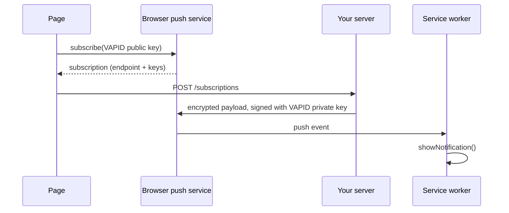

# Installability and Push Notifications {#ch-install-and-push}

> Make an application installable, and ask for notification permission at a moment the user will say yes to.

**In this chapter:** the manifest properties that matter · display modes and maskable icons · the install prompt you control · the three-party push system · permission timing

## 💡 The Core Idea

Installability and push are the two features that let a web application behave like an installed one,
and both are gated by trust the browser grants on the user's behalf. The manifest is a small JSON file
that tells the browser how to present your application once it leaves the tab. Push is a subscription
the browser mints for you, delivered by a service the browser chooses, and it only works if the user
agrees. In both cases the technical part is easy; the part that decides whether the feature works is
when and how you ask.

> A blocked notification permission is permanent for that origin. You get one request, so spend it on
> a moment the user already wanted something.

## How It Works

### The manifest

Link it from every page, because the browser reads it on whichever page the user happens to be on.

```html
<link rel="manifest" href="/manifest.webmanifest" />
```

Only six properties decide whether the browser will offer an install.

| Property | Why it matters |
| -------- | -------------- |
| `name`, `short_name` | The install dialogue and the home-screen label. `short_name` truncates at about 12 characters |
| `start_url` | Where a launch from the icon lands. Tag it, so analytics can tell installs from tab visits |
| `scope` | Which URLs stay inside the app window. Navigating outside it opens a browser chrome bar |
| `display` | How much browser UI to keep |
| `icons` | At least a 192px and a 512px PNG, plus one `maskable` |
| `theme_color` | The window and status-bar colour, applied before your CSS loads |

```json
{
  "name": "Emissions Registry",
  "short_name": "Registry",
  "start_url": "/dashboard?source=pwa",
  "scope": "/",
  "display": "standalone",
  "background_color": "#0b1220",
  "theme_color": "#0b1220",
  "icons": [
    { "src": "/icons/192.png", "sizes": "192x192", "type": "image/png" },
    { "src": "/icons/512.png", "sizes": "512x512", "type": "image/png" },
    { "src": "/icons/maskable.png", "sizes": "512x512", "type": "image/png", "purpose": "maskable" }
  ]
}
```

**Display modes**, from most browser UI to least: `browser` (an ordinary tab), `minimal-ui` (a title
bar and back button), `standalone` (no browser UI, the usual choice), `fullscreen` (nothing at all,
for games and kiosks). `standalone` is right for almost everything, because losing the back button
means you own navigation entirely.

**`theme_color` and `background_color` do different jobs.** `theme_color` paints the window frame and
status bar. `background_color` paints the splash screen while the application boots, so it should match
your first paint or the launch flashes.

**Maskable icons matter more than they sound.** Android crops icons to whatever shape the launcher
uses. An icon without `purpose: "maskable"` gets a white box around it or has its edges cut off. A
maskable icon keeps its content inside the middle 80% — the safe zone — and lets the rest be cropped.

### Controlling the install prompt

The browser fires `beforeinstallprompt` when its own criteria are met: HTTPS, a valid manifest with the
required icons, and a registered service worker with a `fetch` handler. Capture the event and decide
when to use it.

```typescript
let deferred: BeforeInstallPromptEvent | null = null;

window.addEventListener('beforeinstallprompt', (event: Event): void => {
  // Suppress the browser's own mini-infobar so the prompt fires on your terms.
  event.preventDefault();
  deferred = event as BeforeInstallPromptEvent;
  showInstallButton();
});

async function install(): Promise<void> {
  if (!deferred) return;
  const { outcome } = await deferred.prompt();
  // The event is single-use — a second prompt() throws.
  deferred = null;
  hideInstallButton();
  track('pwa_install', { outcome }); // 'accepted' | 'dismissed'
}

// Already installed: no prompt will fire, so hide the button.
const installed: boolean = window.matchMedia('(display-mode: standalone)').matches;
```

> ⚠️ **Moving target:** iOS Safari still has no `beforeinstallprompt`. Installing means Share → Add to
> Home Screen, done by hand. The durable principle is that install is a browser decision you can only
> influence: detect support, offer your button where it exists, and show short platform instructions
> where it does not.

### Push, and the three parties

Push has no direct connection between your server and the browser. The browser picks a push service —
FCM for Chrome, Mozilla's for Firefox, Apple's for Safari — and gives you an endpoint on it.



**A push message reaches the worker, never the page. The page may not exist.**

**VAPID** is how the push service knows the message is from you. You generate one key pair per
application: the public key goes to the browser at subscribe time, the private key signs every send.
Without it any server that learned an endpoint could push to it.

```typescript
const reg: ServiceWorkerRegistration = await navigator.serviceWorker.ready;

const subscription: PushSubscription = await reg.pushManager.subscribe({
  // Chromium refuses silent push, so this must be true.
  userVisibleOnly: true,
  applicationServerKey: urlBase64ToUint8Array(VAPID_PUBLIC_KEY),
});

await fetch('/api/subscriptions', {
  method: 'POST',
  headers: { 'content-type': 'application/json' },
  body: JSON.stringify(subscription),
});
```

**Handling the push in the worker:**

```typescript
declare const self: ServiceWorkerGlobalScope;

interface PushPayload {
  readonly title: string;
  readonly body: string;
  readonly url: string;
}

self.addEventListener('push', (event: PushEvent): void => {
  const data = event.data?.json() as PushPayload;

  event.waitUntil(
    self.registration.showNotification(data.title, {
      body: data.body,
      icon: '/icons/192.png',
      // A tag replaces an earlier notification instead of stacking a second one.
      tag: 'registry-update',
      data: { url: data.url },
    }),
  );
});

self.addEventListener('notificationclick', (event: NotificationEvent): void => {
  event.notification.close();
  const target = (event.notification.data as { url: string }).url;

  event.waitUntil(
    (async (): Promise<void> => {
      const clients = await self.clients.matchAll({ type: 'window', includeUncontrolled: true });
      // Focus an existing tab rather than opening a fourth copy of the app.
      const open = clients.find((c) => c.url.includes(target));
      if (open) await (open as WindowClient).focus();
      else await self.clients.openWindow(target);
    })(),
  );
});
```

**Subscriptions expire.** A push that returns 404 or 410 from the push service means the subscription
is dead — delete it from your database rather than retrying. Handle `pushsubscriptionchange` in the
worker to re-subscribe and re-register when the browser rotates one.

## When to Use It

| Scenario | Choose | Why |
| -------- | ------ | --- |
| Users return daily to a workflow tool | Offer install after two or three sessions | An icon on the home screen is worth real retention |
| A content site visited once from search | No install prompt | An install banner on first visit is the classic dismissed prompt |
| Time-critical alerts the user asked for | Push, requested at the moment they opt in | The context makes the permission an obvious yes |
| Marketing re-engagement | Email | Push permission is one request per origin; do not spend it here |
| Anything you want on iOS reliably | Plan for no push and no prompt | Support arrived late and only for installed web apps |

## Common Mistakes

**❌ Wrong — asking on page load:**

```typescript
// Fires before the user knows what the app is. Most users click Block, permanently.
await Notification.requestPermission();
```

**✅ Right — asking after an explicit opt-in:**

```typescript
async function enableAlerts(): Promise<void> {
  // Called from a button labelled "Notify me when this report is ready".
  const permission: NotificationPermission = await Notification.requestPermission();
  if (permission === 'granted') await subscribeToPush();
  else showInAppFallback(); // Denied is final for this origin.
}
```

The permission dialogue is not the ask. Your own UI is the ask, and the browser dialogue only confirms
it. Check `Notification.permission` first — if it is already `denied`, never call
`requestPermission()`, because it resolves immediately with no dialogue and your fallback never runs.

**❌ Wrong — `start_url` outside `scope`.** The application opens, immediately navigates out of scope,
and the user gets a browser bar in what was meant to be an app window. Keep `start_url` inside `scope`
and set `scope` to the narrowest path that contains the whole application.

## 🔑 Key Takeaways

- The manifest is how the browser presents your application after it leaves the tab, and six properties decide whether it will offer an install at all.
- Maskable icons exist because Android crops to the launcher's shape, so keep the artwork inside the middle 80%.
- `beforeinstallprompt` gives you the timing of the install prompt, and the event is single-use.
- Push involves three parties, and VAPID keys are what prove a message came from your server.
- Notification permission is one request per origin and a denial is permanent, so ask only after the user has asked for something.

## Interview Questions

**Q: What makes a web application installable?**

HTTPS, a linked manifest with `name`, `start_url`, a `display` other than `browser`, and at least 192px
and 512px icons, plus a registered service worker with a `fetch` handler. Meeting those makes the
browser fire `beforeinstallprompt`; browsers layer their own engagement heuristics on top, so meeting
the criteria is necessary but does not guarantee a prompt.

**Q: Why does push need a third-party push service at all?**

Because your server cannot hold an open connection to a device that is asleep, and the platform will
not let it. The browser vendor's push service already has that connection for the whole device, so the
browser hands you an endpoint on it. Your payload is encrypted with keys from the subscription, so the
push service relays it without being able to read it.

**Q: A user reports they never see the notification permission dialogue. What do you check?**

`Notification.permission` first — if it is `denied`, `requestPermission()` resolves instantly with no
UI, and only the user can reverse that in site settings. Then check that the call is inside a user
gesture, that the origin is secure, and on iOS that the app is actually installed to the home screen,
because Safari only grants push to installed web apps.

**Q: When would you skip push entirely?**

When the message is not time-critical or not something the user explicitly asked for. Push has a hard
budget of one permission request, a high dismissal cost, and inconsistent platform support. If email or
in-app messaging carries the message, they are the cheaper channel and they do not burn the request.

## What to Read Next

- [Chapter ?? — Service Workers](#ch-service-workers) — the worker that receives every push event
- [Chapter ?? — Browser Permissions](#ch-browser-permissions) — the permission model this sits inside
- [Chapter ?? — Caching Strategies and Offline UX](#ch-caching-and-offline) — what an installed app does with no connection
