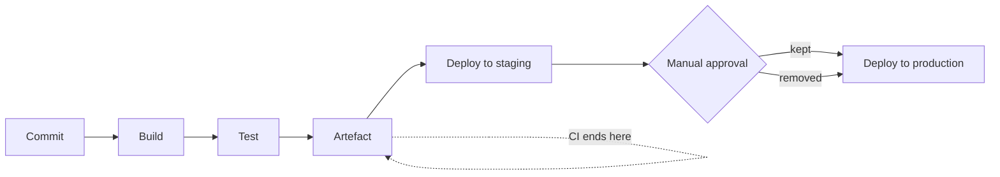

# CI/CD Fundamentals {#ch-cicd-fundamentals}

> Separate integration, delivery and deployment in one sentence, then design a pipeline that builds its artefact once and tells you within ten minutes whether it is safe.

**In this chapter:** the three terms · build once, promote many · ordering stages so failures come cheap · quality gates · DORA metrics

## 💡 The Core Idea

A pipeline is a machine that turns a commit into one promotable artefact, then spends the rest of its
time trying to prove that artefact is unsafe. Both halves matter. If it builds a different artefact
for each environment, the thing you tested is not the thing you shipped. If it takes forty minutes to
tell you the answer, developers batch their commits and stop reading the result — which is the same
as having no pipeline, only more expensive.

## How It Works

Interviewers open with the three terms to check you do not blur them together.

| Term | What it automates | Where it stops |
| ---- | ----------------- | -------------- |
| **Continuous Integration** | Build and test on every commit | Produces a tested artefact |
| **Continuous Delivery** | Everything up to deploy | Production deploy is a **manual approval** |
| **Continuous Deployment** | Deploy included | Every green build reaches production automatically |



**The three terms are one pipeline with the approval gate in different places.**

> **Continuous Delivery** means you _can_ deploy at any time. **Continuous Deployment** means you _do_,
> on every merge. Most enterprise teams run Continuous Delivery: automated everything, human gate
> before production.

### The CI Contract

Before CI, teams merged weeks of work at once and called the result integration hell. CI replaces that
with one rule — integrate small changes often, and prove they work automatically.

- Every commit triggers a build.
- The build runs the same way on every machine.
- A red build blocks the merge.
- The main branch is always releasable.

❌ A nightly build that emails a report nobody reads.
✅ Every pull request runs the tests, and a failure blocks merging.

## Build Once, Promote Many

This is the most important principle in the chapter and the most common interview question in it.

❌ **Rebuilt per environment — different bytes each time:**

```yaml
deploy-staging:
  script:
    - docker build -t app:staging .   # build #1
deploy-prod:
  script:
    - docker build -t app:prod .      # build #2 — a different image
```

Transitive dependencies, base images and build tools all move between two builds. The image you
validated in staging is not the image serving users.

✅ **Built once, promoted:**

```yaml
build:
  script:
    - docker build -t $REGISTRY/app:$GIT_SHA .
    - docker push $REGISTRY/app:$GIT_SHA     # built exactly once
deploy-staging:
  script: [deploy $REGISTRY/app:$GIT_SHA]    # same bytes
deploy-prod:
  script: [deploy $REGISTRY/app:$GIT_SHA]    # same bytes, already tested
```

An **artefact** is the packaged output of the build — a container image, a zipped function bundle, a
compiled front-end. Tag it by commit SHA, add a human-readable release tag that points at the same
digest, and never deploy `latest`.

> If you cannot point at what is running in production and trace it to a commit, you do not have a
> pipeline. You have a build script.

⚠️ Turn on **tag immutability** in the registry. Without it, a tag you deployed last week can be
repointed at a different image today and nothing in your audit trail will show it.

## Ordering Stages So Failures Come Cheap

Order stages by cost ascending. The cheapest check that can fail should fail first.

| Order | Stage | Typical | Catches |
| ----- | ----- | ------- | ------- |
| 1 | Lint and type-check | ~20s | Typos, unused code, type errors |
| 2 | Unit tests | ~90s | Logic errors |
| 3 | Build the artefact | ~2m | Compile and packaging errors |
| 4 | Integration tests | ~4m | Wiring, SQL, serialisation |
| 5 | Security scans | ~2m | CVEs, leaked secrets, misconfiguration |
| 6 | Deploy to staging | ~2m | Config and infrastructure drift |
| 7 | Smoke tests | ~5m | Broken critical flows |

Stages 4 and 5 are independent, so they run in parallel. **The target is under ten minutes of
feedback on a pull request** — past that, developers batch changes and route around the pipeline.

**Which tier runs where is a pipeline decision, not a testing decision:**

| Tier | Count | Runs on |
| ---- | ----- | ------- |
| Unit | Hundreds to thousands | Every commit |
| Integration | Tens to hundreds | Every commit |
| End-to-end | 10–30 critical flows | Merge to `main`, against a deployed environment |

The full argument for what belongs in each tier is [Chapter ?? — Testing Fundamentals](#ch-testing-fundamentals).
What the pipeline adds is the ordering and the placement.

⚠️ The inverted pyramid — mostly end-to-end tests — is slow, flaky, and its failures say *"checkout
broke"* rather than naming the function. Push coverage down the tiers and the same bug costs seconds
to diagnose instead of an hour.

## Quality Gates

A gate fails the build when a measurable threshold is not met. Pick ones with no room to argue.

| Gate | Reasonable threshold |
| ---- | -------------------- |
| Coverage on **changed** lines | 80% — measure the diff, not the repository |
| Total coverage | Must not decrease |
| High or critical vulnerabilities | Zero new ones |
| Type errors | Zero |
| Performance budget | Bundle size or p99 within limit |

⚠️ **Coverage is a floor, not a goal.** A team chasing 100% writes tests that assert implementation
details and break on every refactor. Measuring the diff catches untested new code without forcing
tests onto legacy files nobody is changing.

## When to Use It

| Situation | Choose | Why |
| --------- | ------ | --- |
| Regulated domain, release windows | Continuous Delivery | The gate is the audit record |
| Strong tests, fast rollback, good metrics | Continuous Deployment | The gate adds latency, not safety |
| Unfinished work you still want merged | Feature flag, deploy disabled | Keeps the branch short |
| A pipeline nobody trusts | Fix the flakes first | New gates on a red pipeline get ignored |

## Common Mistakes

❌ **Treating a flaky test as a cost of doing business.** A test that passes and fails on identical
code is worse than no test, because it teaches the team to re-run red builds without reading them.
✅ Track pass and fail history per test, quarantine the flaky one into a non-blocking suite with a
ticket and a deadline, and delete it if nobody claims it. Common causes are timezone dependence, test
order dependence, real network calls and racing on asynchronous UI.

❌ **Blanket retries.** `retry: 3` on assertion failures hides the race condition that will surface
in production instead.
✅ Retry only infrastructure failures — a runner dying, a registry timing out. Most CI platforms let
you name the failure classes that qualify.

❌ **Configuring the pipeline by clicking through a UI.** It is invisible, unreviewable, and
unrecoverable when the CI server dies.
✅ Pipeline as code, in the repository next to what it builds. Changes go through review, and an old
commit still builds the old way.

❌ **A staging environment that shares nothing with production.** One small instance behind a
different load balancer tells you nothing about behaviour under load.
✅ Same infrastructure shape and same config mechanism; only the values and the data differ.

## DORA Metrics

The four industry-standard measures of delivery performance. Expect at least one question.

| Metric | What it measures | Elite |
| ------ | ---------------- | ----- |
| **Deployment frequency** | How often you ship to production | On demand, multiple times a day |
| **Lead time for changes** | Commit to running in production | Under one hour |
| **Change failure rate** | Share of deploys causing incidents | Under 15% |
| **Time to restore** | How fast you recover | Under one hour |

> Speed and stability are not a trade-off. Teams that deploy more often also fail less, because small
> changes are easier to review, test and roll back.

CI works best with short-lived branches merged daily, and feature flags are what make that possible
when the work is not finished. Which branching model demands what from a pipeline is argued out in
[Chapter ?? — Branching and Review Workflow](#ch-branching-and-review-workflow).

## 🔑 Key Takeaways

- Continuous Delivery means you can deploy on demand; Continuous Deployment means every green build does.
- Build the artefact once, tag it by commit SHA, and promote the same bytes through every environment.
- Order stages cheapest-first and keep pull request feedback under ten minutes, or the pipeline gets bypassed.
- Gate on the diff — coverage on changed lines, no new high-severity findings, zero type errors.
- A flaky test is a pipeline defect. Quarantine it with a deadline rather than retrying past it.

## Interview Questions

**Q: What is the difference between Continuous Delivery and Continuous Deployment?**

Both automate the pipeline through to a deployable state. In Continuous Delivery the production
deploy needs a manual approval, so the team chooses when to release even though the process is fully
automated. Continuous Deployment removes that gate, so every commit passing all stages ships. The
second needs much stronger automated testing, monitoring and automatic rollback, because no human
sees the change before users do. Most enterprise and regulated teams choose Continuous Delivery.

**Q: Why should an artefact be built only once?**

Because rebuilding per environment produces different bytes. Transitive dependencies, base images and
build tools shift between two builds, so the artefact validated in staging is not the one in
production. Building once and promoting an immutable artefact tagged by commit SHA means the tests
actually apply to what ships, and it gives a clean trail from a running container back to a commit.
It is also faster, since you pay for the build once rather than per environment.

**Q: How do you keep a CI pipeline fast without deleting tests?**

Order stages cheapest-first so failures surface early, and run independent jobs in parallel rather
than in sequence. Cache dependencies and build layers keyed on the lockfile. Shard large suites
across runners. Move genuinely expensive suites off the pull request path — full end-to-end on merge
to `main` rather than on every push. Cancel superseded runs on the same branch. The number to defend
is ten minutes to pull request feedback; beyond that the pipeline stops changing behaviour.

**Q: Is code coverage a useful quality gate?**

Useful as a floor, misleading as a target. High coverage proves lines executed, not that behaviour
was verified, and teams pushed toward 100% write tests coupled to implementation details that break
on every refactor. The version worth having is coverage on the diff: changed lines meet a threshold
such as 80% and total coverage must not decrease. Pair it with gates that have no ambiguity — zero
type errors, no new high-severity vulnerabilities, a bundle size budget.

**Q: When would you not add another gate to the pipeline?**

When the pipeline is already flaky. Gates only work if a red build means something, and adding a
sixth check to a pipeline people re-run without reading makes the signal worse, not better. The
sequence is: make failures trustworthy, get feedback under ten minutes, then add the gate. The same
applies to a gate nobody can act on — a low-severity vulnerability report that cannot be fixed
because the fix is upstream trains the team to click past the whole category.

## What to Read Next

- [Chapter ?? — GitHub Actions](#ch-github-actions) — the same principles expressed in the tool most teams use
- [Chapter ?? — Deployment Strategies](#ch-deployment-strategies) — what stage 8 actually does with the artefact
- [Chapter ?? — Pipeline Security](#ch-cicd-security) — how the credentials reach the pipeline without being stored in it
