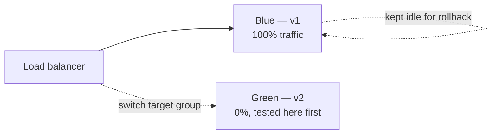
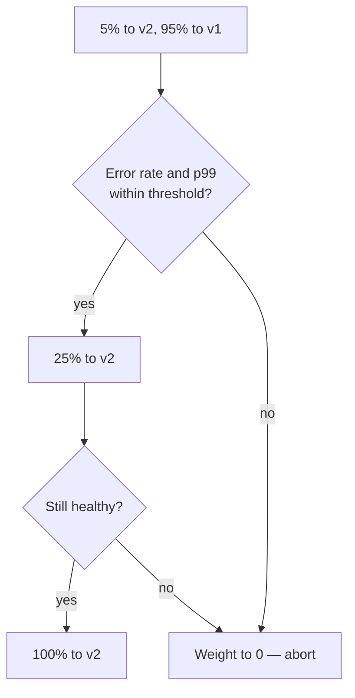

# Deployment Strategies {#ch-deployment-strategies}

> Choose between rolling, blue/green and canary for a given service, and say what each one costs.

**In this chapter:** the four strategies and their trade-offs · blue/green and canary in practice · expand/contract migrations · choosing one

## 💡 The Core Idea

Every deployment strategy answers the same question — **how many users see the new version before
you find out it is broken?** Recreate says all of them, after a gap. Rolling says a growing share,
with no way back except forward. Blue/green says all of them at once, but the old version is still
running so the way back is a pointer flip. Canary says five percent, measured. You are buying down
blast radius with money and time; that trade is the whole answer an interviewer is listening for.

## How It Works

| Strategy | Downtime | Extra cost | Rollback | Blast radius |
| -------- | -------- | ---------- | -------- | ------------ |
| **Recreate** | ❌ Yes | None | Redeploy — slow | All users |
| **Rolling** | ✅ None | Small | Roll forward — slow | Growing share |
| **Blue/green** | ✅ None | 2× during the deploy | Flip the pointer — seconds | All users at once |
| **Canary** | ✅ None | Small | Shift weight to zero — seconds | The canary share |

**Recreate** stops everything, then starts the new version. It is fine for batch jobs, development
environments, and applications that genuinely cannot run two versions at once. It is never right for
a user-facing service.

**Rolling** replaces instances a few at a time and is the default in Kubernetes and ECS. It needs no
extra infrastructure, but both versions serve traffic during the roll — so the API must be backward
compatible — and rollback means another slow roll.

```yaml
spec:
  replicas: 4
  strategy:
    type: RollingUpdate
    rollingUpdate:
      maxSurge: 1 # one extra pod above replicas during the roll
      maxUnavailable: 0 # never drop below 4 healthy pods
```

⚠️ `maxUnavailable: 0` is the setting people forget. The default of 25% removes a quarter of your
capacity mid-deploy, and at peak traffic that is how a deploy turns into an incident. A readiness
probe is equally non-optional: without one, traffic reaches a pod the moment the container starts
rather than when the application can serve it.

## Blue/Green

Run two complete environments and switch all traffic at once.



**One version serves traffic at a time; the other is the rollback.**

| Layer | How the switch happens |
| ----- | ---------------------- |
| Application load balancer | Change the listener's target group |
| DNS | Weighted records flipped 0/100 |
| ECS | CodeDeploy manages blue and green task sets |
| Serverless function | The alias points at a new version |

Instant rollback is the reason to choose it — you flip the pointer back to an environment that is
still warm. The costs are real: double infrastructure during the deploy, and every user moves at
once, so a subtle bug reaches 100% of traffic immediately. Stateful components — the database, the
session store, the cache — are shared and cannot be duplicated, which is where blue/green gets hard.

## Canary

Send a small share of traffic to the new version, measure, then increase.



**The gate between each step is what makes it a canary rather than a slow rolling update.**

```yaml
# Argo Rollouts — the analysis step is the point
strategy:
  canary:
    steps:
      - setWeight: 5
      - pause: { duration: 10m }
      - analysis:
          templates: [{ templateName: error-rate }]
      - setWeight: 25
      - pause: { duration: 10m }
      - setWeight: 100
```

Canary has the smallest blast radius and validates against real production traffic, which no staging
environment does. It is also the slowest strategy, and it needs metrics good enough to decide on —
error rate, p99 latency, saturation, and at least one business metric such as checkout completion.

> ⚠️ A canary with no automated analysis is a slow rolling update with extra steps. The value is in
> aborting automatically, because the failure usually appears after everyone has stopped watching
> the dashboard.

## Feature Flags Are the Fifth Option

The strategies above move **code** between instances. A feature flag controls **behaviour** per user,
inside code already deployed everywhere.

| | Canary deploy | Feature flag |
| - | ------------- | ------------ |
| **Unit of control** | Server or instance | User or request |
| **Rollback** | Shift traffic | Config change, seconds |
| **Targeting** | Random share of traffic | Specific users, regions, plans |

✅ Use both. The canary validates the **build** — no memory leak, no dependency breakage, no latency
regression. The flag validates the **feature**. Flag kinds, where to evaluate them and how to stop
them accumulating are in [Chapter ?? — Feature Flags](#ch-feature-flags).

## Expand/Contract — The Real Hard Part

Every zero-downtime strategy breaks if the schema change is not backward compatible, because both
versions run at once.

❌ **Breaking — the old version crashes the moment this applies:**

```sql
ALTER TABLE users RENAME COLUMN email TO email_address;
```

✅ **Expand/contract, four separate releases:**

1. **Expand** — add `email_address`, keep `email`. Deploy code that writes both, reads `email`.
2. **Backfill** — copy existing rows in batches.
3. **Migrate** — deploy code that reads `email_address`.
4. **Contract** — drop `email`, in a later release, once the rollback window has closed.

| Change | Safe? | Approach |
| ------ | ----- | -------- |
| Add a nullable column | ✅ Yes | Deploy directly |
| Add a column with a default | Conditional | Locks large tables — add nullable, backfill in batches |
| Rename a column | ❌ No | Expand/contract |
| Drop a column | ❌ No | Stop using it, drop a release later |
| Add an index | Conditional | Locks the table — use `CREATE INDEX CONCURRENTLY` in Postgres |
| Narrow a type | ❌ No | Expand/contract |

> **The rule:** the currently deployed release must work against both the old and the new schema. If
> it does not, you cannot roll back — and a strategy without a rollback path is not a strategy.

## When to Use It

| Situation | Choose | Why |
| --------- | ------ | --- |
| Internal tool, downtime acceptable | Recreate | Simplest and cheapest |
| Standard stateless service | Rolling | Built in, no extra infrastructure |
| Rollback speed matters most | Blue/green | The old environment is still running |
| High traffic, high-risk change | Canary | Smallest blast radius, measured |
| Risky change to existing logic | Feature flag plus canary | Per-user control on top of a safe build |

## Common Mistakes

❌ **Choosing a strategy without checking what the database is doing.** Blue/green with a breaking
migration is not zero downtime; it is downtime with two environments.
✅ Sequence the migration first, then pick the strategy.

❌ **A canary promoted by someone watching a graph.** Attention moves on before the failure shows up.
✅ Define thresholds relative to the baseline version — error rate no more than 0.1 points above,
p99 no more than 10% above — and wire the promotion and the abort to them.

❌ **Never testing the rollback.** The pointer flip is easy; what a rollback does *not* undo is not.
✅ Rehearse it. Applied migrations, consumed messages and sent email survive a rollback — the subject
of [Chapter ?? — Rollback and Recovery](#ch-rollback-and-recovery).

## 🔑 Key Takeaways

- Every strategy trades cost and complexity for a smaller blast radius; name the trade, not the definition.
- Blue/green buys instant rollback with double infrastructure; canary buys a small blast radius with time.
- A canary without automated metric analysis is just a slow rolling update.
- `maxUnavailable: 0` plus a readiness probe is what makes a rolling update safe.
- Expand/contract exists so that every deployed release works against both schemas — which is what makes rollback possible.

## Interview Questions

**Q: Explain blue/green versus canary.**

Blue/green runs two complete environments and switches all traffic at once, usually by changing a
load balancer target group or a DNS weight. Its benefit is instant rollback, because the old
environment is still running — you flip the pointer back. Its costs are double infrastructure during
the deploy and exposing every user to the new version at the same moment. Canary shifts a small
percentage of traffic to the new version, measures error rate and latency, then increases. Its
benefit is the small blast radius; its costs are time and a dependency on metrics good enough to
decide on automatically.

**Q: How do you do a zero-downtime deployment when the change includes a schema migration?**

Expand/contract. First an additive schema change — add the new column while leaving the old one — so
the running version is unaffected. Then deploy code that writes both locations and still reads the
old one. Backfill existing rows in batches to avoid long locks. Then deploy code that reads the new
location. Only in a later release, once you are confident you will not roll back, drop the old
column. The rule that makes it work is that every deployed version must function against both
schemas.

**Q: What is the difference between a canary deployment and a feature flag?**

A canary controls which **instances** serve traffic, so a share of requests reaches servers running
the new build. A feature flag controls which **users** see new behaviour, evaluated per request in
code that is already deployed everywhere. The canary validates the build — no memory leak, no
dependency breakage, no latency regression. The flag validates the feature and allows precise
targeting: internal staff, then one region, then everyone. Flags also roll back faster, because
turning one off is a configuration change rather than a deployment.

**Q: What settings make a Kubernetes rolling update safe?**

`maxUnavailable: 0` so you never drop below the desired replica count, with a small `maxSurge` to add
capacity temporarily. A readiness probe, without which traffic reaches a pod as soon as the container
starts rather than when the application can serve — that alone produces a burst of 502s on every
deploy. A liveness probe for crash recovery, a `preStop` hook and a termination grace period so
in-flight requests finish, and a PodDisruptionBudget so cluster maintenance cannot evict too many
pods at once.

**Q: When would you deliberately choose the strategy with the larger blast radius?**

When rollback speed matters more than exposure, which is the blue/green case: a change you are
confident in but which you must be able to undo in seconds, such as a release during a trading window
or a retail peak. Canary would spread that same risk over an hour, and an hour of a half-migrated
fleet is worse than a minute of a clean one that you can reverse instantly. The other case is a
change that cannot be partially deployed at all — a protocol or serialisation change where two
versions in the fleet at once is the actual failure mode.

## What to Read Next

- [Chapter ?? — Rollback and Recovery](#ch-rollback-and-recovery) — what a rollback does not undo
- [Chapter ?? — Feature Flags](#ch-feature-flags) — the per-user half of the pair
- [Chapter ?? — Kubernetes Essentials](#ch-kubernetes-essentials) — probes, `preStop` and the shutdown race in detail
