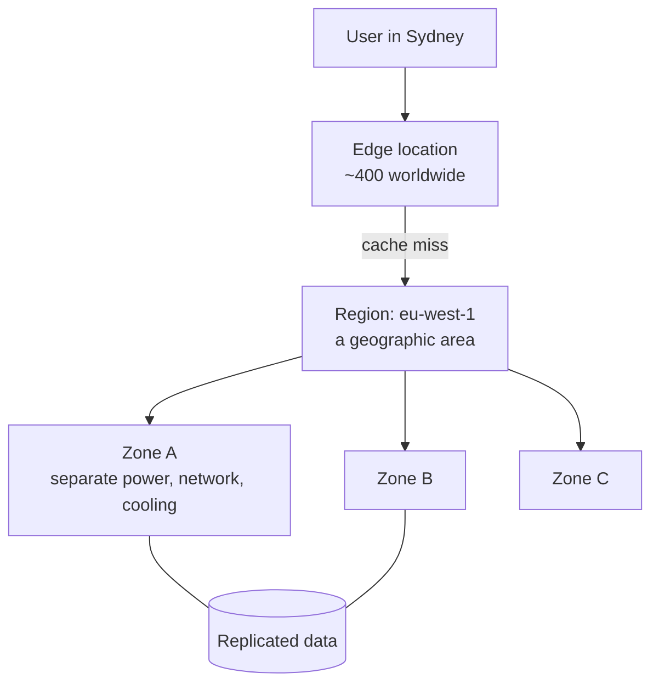
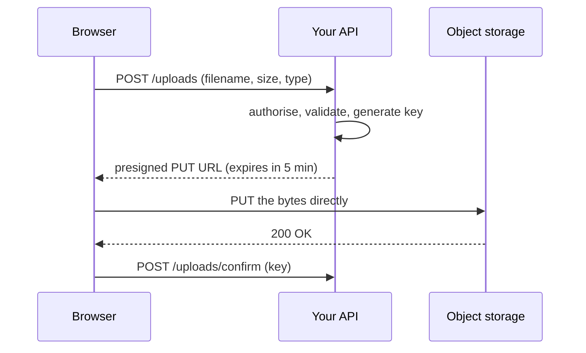

# Cloud Fundamentals, Storage and Delivery {#ch-cloud-fundamentals}

> Read any provider's menu as four primitives, say which half of running them is yours, and serve user files without your server in the byte path.

**In this chapter:** the four primitives and where they run · the managed-service ladder and the shared responsibility line · object storage and presigned uploads · a CDN in front of the bucket · cache keys, headers and invalidation

## 💡 The Core Idea

A cloud provider rents you four things: somewhere to run code, somewhere to keep bytes, a network
between them, and a way to say who may do what. Every service in the console is one of those four,
sold at a different level of _how much of the operating is yours_. The names differ; the primitives
do not.

Interviewers care about the primitives more than the names. "How would you serve user uploads?" wants
object storage, a signed URL and a cache in front of it. The shape is simple: your application never
carries the bytes. It issues a short-lived URL, the browser talks to storage directly, and the CDN
serves everyone after that. Your servers make permission decisions, not megabytes.

## How It Works

### The four primitives

| Primitive    | What you rent                         | Called, roughly                                              |
| ------------ | ------------------------------------- | ------------------------------------------------------------ |
| **Compute**  | Someone else's CPU, by the second     | EC2 · Lambda · Cloud Run · Azure Functions · Vercel Functions |
| **Storage**  | Durable bytes behind an HTTP API      | S3 · Cloud Storage · Azure Blob · R2 · Vercel Blob            |
| **Network**  | Routing, load balancing, edge caching | CloudFront · Cloud CDN · Front Door · Cloudflare              |
| **Identity** | Who may call what, and with which key | IAM · Cloud IAM · Entra ID                                    |

A managed database is compute and storage sold together — a pricing decision, not a fifth primitive.

### Geography: region, zone, edge



**How a request reaches your data: the edge serves it, or the region does.**

| Level      | Failure it survives              | What you do about it                                 |
| ---------- | -------------------------------- | ---------------------------------------------------- |
| **Zone**   | One data centre losing power     | Run in two or more zones — usually a checkbox        |
| **Region** | A whole geographic area failing  | A second region, replicated data, and a real DR plan |
| **Edge**   | Nothing — it is a cache          | Nothing. It is for latency, not availability         |

Most teams need multi-zone, not multi-region. Multi-region doubles the cost and makes every write a
distributed-systems problem.

### The managed-service ladder

The same application can run at five heights: a virtual machine, a container service, a managed
runtime, a function, or a managed product. Each rung up hands the provider more of the operating — the
OS, then the runtime, then scaling — and takes away more of your control. Billing moves too, from
paying for uptime to paying per invocation or per use.

> ⚠️ The rung changes _who fixes it_, never _who is accountable_. A managed database that runs out of
> connections is still your outage, your pager and your customer.

### The shared responsibility line

The provider secures **the cloud**: buildings, hardware, hypervisor, and the internals of its managed
services. You secure **what you put in it**: your data, your access control, your code, and any
operating system you chose to keep. Two things stay yours on every rung, and they are where nearly all
real breaches happen:

- **Your data** — what you classify, encrypt, retain and delete
- **Your access control** — who holds which key, and how narrow it is

### Identity: the part a frontend-heavy engineer touches

Identity is a list of policies: which principal may do which action on which resource. Three habits
cover most of what you will be asked:

- **Roles, not long-lived keys.** A deploy pipeline or a function assumes a role and gets a session
  that expires. A key pasted into CI lives until someone notices it.
- **Least privilege.** The upload API may `PutObject` under `users/*` in one bucket. It may not read,
  delete or list anything.
- **One account per environment.** Production in its own account means a mistake in development
  cannot reach it. The bill also splits by team without a tagging convention nobody maintains.

### Object storage: buckets, keys and objects

Object storage is a durable key-value store for large blobs, reached over HTTP. A **bucket** is the
container, pinned to one region. A **key** is the object's full identifier, such as
`users/42/avatar.png`. An **object** is the bytes plus metadata: content type, cache headers and tags.

The key **looks** like a path and is not one. The keyspace is flat, and `/` is an ordinary character
that tools draw as folders. Listing "a folder" is a prefix scan, and it slows down as the bucket grows.
Never build a feature on listing.

> ⚠️ Object storage has no partial writes and no append. You replace a whole object or you leave it
> alone. Anything edited in place belongs in a database, not a bucket.

### The upload path

The naive design sends the file through your application server. A 200 MB upload then costs 200 MB of
your bandwidth, your memory and your request timeout. The better design hands out a **presigned URL**.
It is a normal storage URL with a signature that allows one operation, on one key, for a few minutes.



**The bytes never touch your server; only the permission decision does.**

**Issuing a presigned upload URL (AWS SDK for JavaScript v3):**

```typescript
import { S3Client, PutObjectCommand } from "@aws-sdk/client-s3";
import { getSignedUrl } from "@aws-sdk/s3-request-presigner";

const s3 = new S3Client({ region: "eu-west-1" });

interface UploadTicket { url: string; key: string; expiresIn: number }

export async function createUploadTicket(userId: string, contentType: string): Promise<UploadTicket> {
  // The server chooses the key. Never let the client name its own — that is how one user
  // overwrites another user's avatar.
  const key = `users/${userId}/${crypto.randomUUID()}`;

  const url = await getSignedUrl(
    s3,
    new PutObjectCommand({
      Bucket: "app-user-uploads",
      Key: key,
      ContentType: contentType, // signed in, so the browser cannot upload something else
    }),
    { expiresIn: 300 },
  );

  return { url, key, expiresIn: 300 };
}
```

Private downloads work the same way: sign a short-lived `GET`, or a signed **cookie** when a whole set
of files must be readable at once, for example a video's manifest and its segments.

### A CDN in front of the bucket

[Chapter ?? — Content Delivery Network](#ch-cdn) covers how edges route and what they offload. Here the
question is what you configure, and who owns each setting. A miss costs one origin request; every
later user in that region is served from the edge.

**The origin.** Lock it so the CDN is the only thing that can read it. A publicly readable bucket lets
users find the direct URL, skip the cache, and skip your signed-URL rules. Every provider has an
origin-only mechanism — an origin access control, a signed origin request, or a shared secret header.
Turn one on and block public reads.

**The cache key.** The edge stores each response under a key. Everything you let into that key
multiplies the copies, and every extra copy is another miss. Always include the path and
`Accept-Encoding`. Include only the query parameters that change the response. Leave cookies out for
assets — one session cookie in the key means zero hits.

**Cache headers — the origin sets how long things live, in application code:**

```typescript
// A content-hashed asset: the filename changes when the bytes change, so it can be cached forever.
const immutableAsset = { "cache-control": "public, max-age=31536000, immutable" };

// An HTML page or API response: the browser revalidates, the CDN serves it for 60 seconds,
// and for 5 minutes after that it serves stale while it refreshes in the background.
const page = { "cache-control": "public, max-age=0, s-maxage=60, stale-while-revalidate=300" };

// Anything user-specific must never reach a shared cache.
const dashboard = { "cache-control": "private, no-store" };
```

`max-age` is for the browser. `s-maxage` is for the shared cache, and it overrides `max-age` there.
`stale-while-revalidate` removes the latency spike at expiry: the edge answers from the stale copy and
refreshes behind the request.

**Invalidation.** Purging is slow, usually metered and eventually consistent. "Invalidate everything"
on deploy empties the cache and floods the origin. Change the URL instead: with hashed filenames such
as `app.7f3c9a.js`, a new build asks for new URLs and the old copies are never requested again. Only
the small HTML entry point needs a short TTL or a purge.

## When to Use It

**Choosing a region:**

| Question                                | If the answer is…                           | Then                                               |
| --------------------------------------- | ------------------------------------------- | -------------------------------------------------- |
| Where are the users?                    | Concentrated in one continent               | Pick that continent and cache the rest at the edge |
| Is the data personal or regulated?      | Yes, under GDPR or a residency rule         | Residency wins — latency does not override it      |
| Does the workload need a niche service? | Yes                                         | Check availability first; not every region has it  |
| Is the workload cost-dominated?         | Yes, and latency-tolerant (batch, archives) | The cheapest region is a fair answer               |

**Choosing a rung:** start at the highest rung that does the job. Climb down only when something
concrete stops you, such as a runtime the platform lacks.

**Choosing where data lives:** uploads, images, video and exports go in object storage. Build output
goes in object storage behind a CDN, hashed and cached forever. Records you query belong in a database,
and anything personalised stays at the origin with a `private` cache header.

## Common Mistakes

❌ **Deploying into one availability zone.** A second zone costs close to nothing and is the largest
availability win there is. ✅ Run in at least two.

❌ **Choosing a region out of habit.** `us-east-1` is the tutorial default and the wrong answer for a
European product with a residency rule. ✅ Choose on users, then law, then price.

❌ **Using the root account or a long-lived key for daily work.** Policy cannot constrain root, and it
is the first credential an attacker looks for. ✅ Use a scoped role with an expiring session.

❌ **Proxying uploads through the application.** It burns bandwidth and memory and breaks on large
files. ✅ Presign, let the browser upload directly, and confirm afterwards.

❌ **Forwarding all cookies and query strings to the origin.** Every unique value becomes its own cache
entry, and the hit rate collapses. ✅ Include only what changes the response.

❌ **Putting `s-maxage` on a personalised response.** The CDN hands one user's dashboard to the next.
✅ `private, no-store` for anything behind a login.

## 🔑 Key Takeaways

- Every cloud service is compute, storage, network or identity, sold at some level of managed.
- A zone survives a data-centre failure, a region survives a geographic one, and the edge survives nothing.
- The managed-service ladder moves who fixes it, never who is accountable; data and access control stay yours.
- Presign uploads so the bytes go from browser to storage and your server only makes the permission decision.
- Lock the origin to the CDN, keep the cache key small, and hash filenames instead of invalidating.

## Interview Questions

**Q: What is the difference between a region and an availability zone?**

A region is a geographic area. A zone is one or more data centres inside it, with separate power,
cooling and network, close enough for fast replication. Spreading across zones protects against one
data centre failing and usually costs nothing. Spreading across regions costs a second copy of
everything plus a consistency problem.

**Q: Explain the shared responsibility model without naming a provider.**

The provider secures what it runs: buildings, hardware, network and the internals of managed services.
You secure what you put on it: data, identity and access, application code, and any OS you kept. The
line moves with how managed the service is, but data and access control never cross it.

**Q: When would you not use a managed service?**

When it cannot do what you need — an unsupported runtime, a process that outlives a request, or a
compliance rule that needs isolation you can show. Cost is a weaker reason than it sounds. The managed
price usually beats an engineer's time running it yourself, unless the workload is large, steady and
predictable.

**Q: How would you handle user file uploads in a web application?**

The browser asks the API for permission. The API authorises the user, builds the key on the server, and
returns a presigned URL that expires in minutes. The browser uploads straight to storage, then confirms
the key so the API can record it. Upload size stops being a timeout problem, and the signature limits
the operation to one key.

**Q: After a deploy, users are getting the old JavaScript. What went wrong and how do you fix it?**

Either the asset filenames did not change, so the edge still serves the old bytes, or the HTML that
references them is cached too long. Hash the content into asset filenames so each build produces new
URLs, and cache those forever. Give the HTML a short `s-maxage` and make it the only thing you purge.

## What to Read Next

- [Chapter ?? — Serverless Functions](#ch-serverless-functions) — the rung most frontend-heavy teams live on
- [Chapter ?? — Content Delivery Network](#ch-cdn) — how the edge routes, offloads and shields the origin
- [Chapter ?? — Platform and Edge Deployments](#ch-platform-deploys) — what a deploy does to everything cached in front of it
