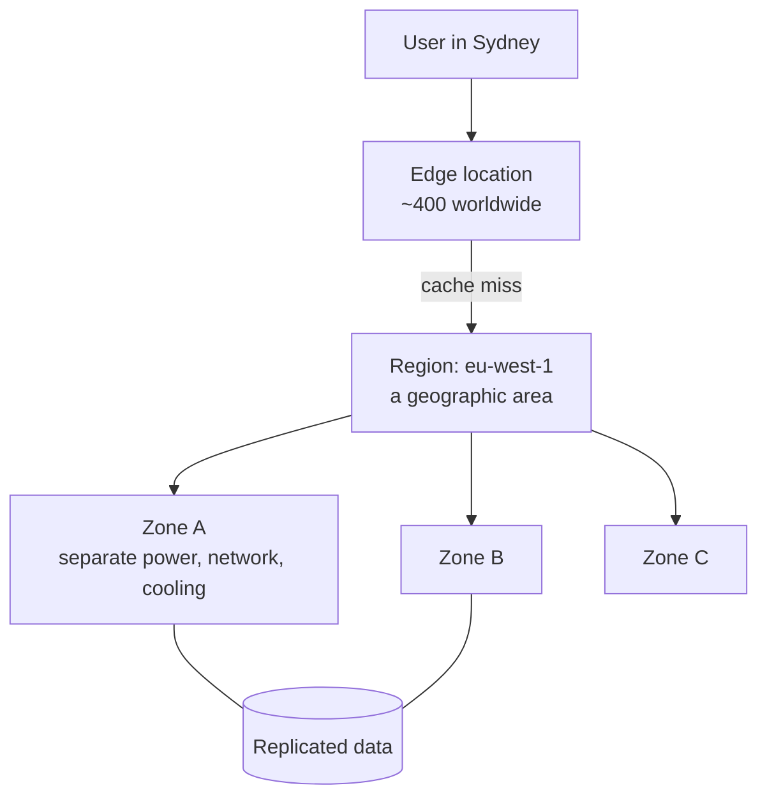

# Cloud Fundamentals {#ch-cloud-fundamentals}

> Read any provider's 300-item menu as four primitives, and say exactly which half of running them is yours.

**In this chapter:** the four primitives · regions, zones and edge locations · the managed-service ladder · the shared responsibility line · choosing where a workload lives

## 💡 The Core Idea

A cloud provider rents you four things: somewhere to run code, somewhere to keep bytes, a network
between them, and a way to say who may do what. Every service in the console is one of those four,
sold at a different level of _how much of the operating is yours_. The product names differ between
providers. The primitives do not.

This matters in an interview more than the names do. "How would you serve user uploads?" wants object
storage, a signed URL and a cache in front of it. An answer that opens with a bucket setting has
skipped the design.

## How It Works

### The four primitives

| Primitive    | What you rent                        | Called, roughly                                                  |
| ------------ | ------------------------------------ | ---------------------------------------------------------------- |
| **Compute**  | Someone else's CPU, by the second     | EC2 · Lambda · Cloud Run · Azure Functions · Vercel Functions      |
| **Storage**  | Durable bytes behind an HTTP API      | S3 · Cloud Storage · Azure Blob · R2 · Vercel Blob                 |
| **Network**  | Routing, load balancing, edge caching | CloudFront · Cloud CDN · Front Door · Cloudflare                   |
| **Identity** | Who may call what, and with which key | IAM · Cloud IAM · Entra ID                                         |

Databases, queues and search are compute and storage sold together with the operating included. That
is a pricing decision, not a fifth primitive.

### Geography: region, zone, edge



**How a request reaches your data: the edge serves it, or the region does.**

| Level    | Failure it survives              | What you do about it                                  |
| -------- | -------------------------------- | ----------------------------------------------------- |
| **Zone** | One data centre losing power      | Run in two or more zones — usually a checkbox          |
| **Region** | A whole geographic area failing | A second region, replicated data, and a real DR plan   |
| **Edge** | Nothing — it is a cache          | Nothing. It is for latency, not availability           |

Most teams need multi-zone and do not need multi-region. Multi-region doubles the cost and makes every
write a distributed-systems problem, so it is a decision about the money and the data, not a default.

### The managed-service ladder

The same application can run at five heights. Climbing one rung hands the provider more of the
operating and takes away more of your control.

| Rung                  | You operate                          | Provider operates              | You pay for      |
| --------------------- | ------------------------------------ | ------------------------------ | ---------------- |
| **Virtual machine**   | OS, patches, runtime, app, scaling    | Hardware, hypervisor           | Uptime           |
| **Container service** | Image, scaling policy, app            | OS, host, orchestration        | Uptime           |
| **Managed runtime**   | App and its config                    | OS, runtime, scaling           | Uptime           |
| **Function**          | The handler and its dependencies      | Everything else                | Invocations      |
| **Managed product**   | Configuration only                    | The whole service              | Usage            |

> ⚠️ The rung changes _who fixes it_, never _who is accountable_. A managed database that runs out of
> connections is still your outage, your pager, and your customer.

### The shared responsibility line

The provider secures **the cloud**: buildings, hardware, hypervisor, the internals of its managed
services. You secure **what you put in it**: your data, your access control, your application code,
and any operating system you chose to keep.

Two things stay yours on every rung of the ladder, and they are where nearly all real breaches happen:

- **Your data** — what you classify, encrypt, retain and delete
- **Your access control** — who holds which key, and how narrow it is

## When to Use It

**Choosing a region:**

| Question                              | If the answer is…                           | Then                                             |
| ------------------------------------- | ------------------------------------------- | ------------------------------------------------ |
| Where are the users?                  | Concentrated in one continent               | Pick that continent and cache the rest at the edge |
| Is the data personal or regulated?    | Yes, under GDPR or a residency rule          | Residency wins — it is not negotiable for latency  |
| Does the workload need a niche service? | Yes                                        | Check availability first; not every region has it |
| Is the workload cost-dominated?       | Yes, and latency-tolerant (batch, archives)  | The cheapest region is a legitimate answer         |

**Choosing a rung:** start at the highest rung that does the job, and climb down only when something
concrete stops you — a runtime the platform does not offer, a process that must outlive a request, a
compliance rule that demands a machine you can point at.

> Multiple accounts, projects or subscriptions are the cheapest blast-radius control there is.
> Production in its own account means a mistake in development cannot reach it, and the bill splits by
> team without a tagging convention nobody maintains.

**Pinning compute next to its data:**

```typescript
// Region belongs in typed config, not scattered through the code.
// Compute and its primary database in the same region; everything else is cached at the edge.
type Region = "eu-west-1" | "us-east-1" | "ap-southeast-2";

interface DeploymentConfig {
  readonly computeRegion: Region;
  readonly databaseRegion: Region;
  readonly replicaRegions: readonly Region[]; // read-only, for latency
}

export const production: DeploymentConfig = {
  computeRegion: "eu-west-1",
  databaseRegion: "eu-west-1", // same region — a cross-region query costs ~100 ms per round trip
  replicaRegions: ["us-east-1"],
};
```

## Common Mistakes

❌ **Deploying into one availability zone.** The cost of a second zone is close to nothing and it is
the single largest availability win available. ✅ Run in at least two.

❌ **Choosing a region out of habit.** `us-east-1` is the default in most tutorials and the wrong
answer for a European product with a residency obligation. ✅ Choose on users, law, then price.

❌ **Reading "serverless" as "no operations".** Concurrency limits, cold starts, timeouts and retry
semantics are all still yours. ✅ Treat a higher rung as _different_ operational work, not less.

❌ **Using the root or owner account for daily work.** It cannot be constrained by policy and it is the
first credential an attacker looks for. ✅ Day-to-day access goes through a scoped role with an
expiring session.

❌ **Answering an architecture question with product names.** "I'd use S3 and CloudFront" is a
half-answer. ✅ Say the shape — object storage, signed URL, CDN in front, origin locked to the CDN —
and name the products second.

## 🔑 Key Takeaways

- Every cloud service is compute, storage, network or identity, packaged at some level of managed.
- A zone survives a data-centre failure; a region survives a geographic one; the edge survives nothing.
- Climbing the managed-service ladder moves who fixes it, never who is accountable for it.
- Your data and your access control are yours on every rung — that is where breaches actually happen.
- Say the primitive first and the product second. It is the difference between design and recall.

## Interview Questions

**Q: What is the difference between a region and an availability zone?**

A region is a geographic area — a country or part of one. An availability zone is one or more data
centres inside that region with independent power, cooling and network, close enough for
single-digit-millisecond replication. Spreading across zones protects against a data centre failing
and usually costs nothing extra. Spreading across regions protects against a whole area failing, and
costs a second copy of everything plus the consistency problem that comes with it.

**Q: Explain the shared responsibility model without naming a provider.**

The provider is responsible for the infrastructure it runs — buildings, hardware, network, and the
internals of any managed service. You are responsible for what you put on it: your data, your identity
and access configuration, your application code, and the operating system if you kept one. The line
moves depending on how managed the service is, but data and access control never cross it.

**Q: When would you not use a managed service?**

When the managed version cannot do the thing you need — an unsupported runtime, a process that has to
outlive a request, a compliance rule that requires isolation you can demonstrate. Cost is a weaker
reason than it sounds: the managed price usually beats the loaded cost of an engineer operating the
self-hosted version, unless the workload is large, steady and predictable.

**Q: A product serves users across Europe and Australia from one region. How do you improve latency?**

First separate reads from writes. Static assets and cacheable responses go to a CDN, which fixes most
of the perceived latency without touching the architecture. Then look at what is left: if the
Australian users are doing dynamic reads, a read replica plus regional compute close to them helps. A
second write region is the last resort, because it turns every write into a conflict-resolution
problem.

**Q: Why do teams split workloads across multiple accounts?**

Blast radius and billing. A separate production account means a misconfigured policy in development
cannot reach production data, and organisation-level guardrails can forbid whole categories of action
in each account. The bill also splits along real boundaries without depending on a tagging convention
that people forget to apply.

## What to Read Next

- [Chapter ?? — Serverless Functions](#ch-serverless-functions) — the rung most frontend-heavy teams live on
- [Chapter ?? — Object Storage and Delivery](#ch-object-storage-and-delivery) — the storage and network primitives, in practice
- [Chapter ?? — Platform and Edge Deployments](#ch-platform-deploys) — how a build becomes a running deployment
