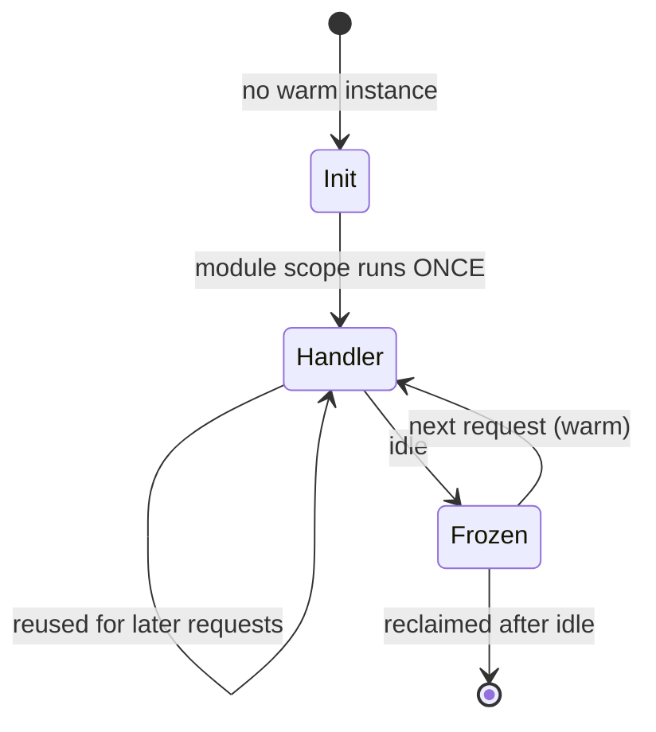

# Serverless Functions {#ch-serverless-functions}

> Know what the platform does between your deploy and your handler, and size a function so cold starts never reach a user.

**In this chapter:** the instance lifecycle · the three invocation shapes · cold starts and what actually causes them · concurrency and the bill · the mistakes that only appear under load

## 💡 The Core Idea

You hand the platform a handler and a trigger. It owns everything else: when a process starts, how
many run, when they are killed. That single trade buys you scaling you never configure and a bill that
goes to zero when nobody calls you.

It also takes away the thing a long-running server gives for free — a process that is _already
running_. Every serverless failure mode in this chapter comes from that one loss.

## How It Works

### The instance lifecycle

A function instance is not created per request. It is created, used for many requests, and eventually
killed. Where your code sits relative to that boundary decides almost everything about its
performance.



**One init, many handler calls — module scope is the only place a warm instance can keep anything.**

**Put expensive setup in module scope, not in the handler:**

```typescript
import { S3Client } from "@aws-sdk/client-s3";

// Module scope: runs once per instance, during init. Reused by every later request.
const s3 = new S3Client({ region: process.env.AWS_REGION });
let cachedApiKey: string | null = null;

export async function handler(event: { key: string }): Promise<Response> {
  // Handler scope: runs on every request. Keep it to the work only.
  cachedApiKey ??= await loadSecret("payments/api-key"); // fetched once, not per call
  const object = await s3.send(getObject(event.key));
  return Response.json({ ok: true, size: object.ContentLength });
}
```

> ⚠️ Module scope is a **cache, not storage**. The instance can be killed at any moment and a second
> instance never sees the first one's variables. Cache a client or a secret there; never a counter, a
> session, or anything you would be sad to lose.

### The three invocation shapes

The trigger decides who retries, and how many times. Getting this wrong is how events go missing.

| Shape                | Triggered by                       | Caller waits? | Retries                                | You must handle             |
| -------------------- | ---------------------------------- | ------------- | -------------------------------------- | --------------------------- |
| **Synchronous**      | HTTP request, direct SDK call       | Yes           | None — the error goes back to the caller | The error response          |
| **Asynchronous**     | Object upload, pub/sub, schedule    | No            | Automatic, usually twice, then dropped  | Idempotency and a dead-letter queue |
| **Queue-polled**     | A queue or change stream            | No            | Until acknowledged or the queue gives up | Partial batch failure       |

Asynchronous is the shape that surprises people. The platform retries your handler without telling the
original caller, so a handler that charges a card twice will charge a card twice.

**Report only the failed messages in a batch, not the whole batch:**

```typescript
interface QueueRecord { messageId: string; body: string }
interface BatchResponse { batchItemFailures: { itemIdentifier: string }[] }

export async function handler(event: { Records: QueueRecord[] }): Promise<BatchResponse> {
  const failures: { itemIdentifier: string }[] = [];

  for (const record of event.Records) {
    try {
      await process(JSON.parse(record.body));
    } catch {
      // Without this, one bad message re-delivers all ten and the good nine run twice.
      failures.push({ itemIdentifier: record.messageId });
    }
  }
  return { batchItemFailures: failures };
}
```

### Cold starts

A cold start is the init step above happening while a user waits. It is not one number — it is a sum,
and only some of it is yours.

| Part of the cold start        | Typical cost      | Can you change it?                              |
| ----------------------------- | ----------------- | ----------------------------------------------- |
| Platform provisions a sandbox  | 50–200 ms         | No — pre-warming avoids it, nothing shrinks it   |
| Runtime boots                  | 5 ms–1 s          | Yes: a lighter runtime, or an isolate-based one  |
| Your bundle is loaded          | Proportional to size | Yes: bundle, tree-shake, drop the heavy SDK   |
| Your module scope runs         | Whatever you wrote  | Yes: this is the part people forget            |
| Private network attachment     | Can dominate      | Yes: do not attach one unless you need it       |

**What actually helps, roughly in order of effect:**

- **Bundle the function.** A 40 MB `node_modules` tree costs more to load than the handler costs to run.
- **Do less in module scope.** Fetching three secrets serially at init adds that time to every cold start.
- **Do not put the function on a private network** unless it must reach something inside one.
- **Pre-warm instances** for a latency-sensitive path. It works, and you pay for idle capacity.

> ✅ Measure before you tune. Send the same request several times and compare the first with the rest —
> the gap is your cold start, and it is often smaller than the database query next to it.

### Concurrency and the bill

The classic model gives **one instance one request at a time**. Ten simultaneous requests means ten
instances, which means ten cold starts on the first spike and ten database connections.

Newer models change that. Isolate-based runtimes and the "fluid" style of function reuse an instance
across concurrent requests, so a handler that spends its time waiting on I/O costs far less. The
consequence is that in-flight work now overlaps, and module-scope state is shared between requests
that are running at the same time.

> ⚠️ **Moving target:** every published limit here moves — durations, memory ceilings, concurrency
> models and pricing units all changed within the last two years, and vendors disagree on all of them.
> AWS Lambda caps at 15 minutes and 10 GB; Vercel Functions set duration and memory per route in
> `vercel.json`; Cloudflare Workers bill CPU time, not wall time, and default to 30 seconds of it. The
> durable principle: **check the current limit for your platform before designing around one, and never
> design a request path that needs a number close to the ceiling.**

## When to Use It

| Workload                                     | Serverless function? | Why                                                     |
| -------------------------------------------- | -------------------- | ------------------------------------------------------- |
| Spiky or low-volume HTTP API                  | ✅ Yes                | You pay nothing at idle and never size a fleet           |
| Reacting to an event — upload, webhook, cron  | ✅ Yes                | The trigger is the whole design                          |
| Steady, high, predictable traffic             | ⚠️ Compare           | A reserved server is often cheaper past a crossover point |
| Long jobs — video encoding, large reports     | ❌ No                 | It will hit the duration ceiling; use a job runner        |
| Persistent connections at scale — WebSockets  | ❌ No                 | The model assumes a request ends                          |
| Anything needing a warm local cache           | ❌ No                 | Instances die without warning; use a shared cache         |

## Common Mistakes

❌ **Opening a database connection inside the handler.** A hundred concurrent instances open a hundred
connections and exhaust the database's pool. ✅ Create the client in module scope, and put a connection
pooler between the functions and the database.

❌ **Assuming an event arrives once.** Asynchronous and queue triggers retry, so at-least-once is the
guarantee. ✅ Make handlers idempotent — key the work on an event ID and ignore a repeat.

❌ **Leaving the timeout at the maximum.** A hung upstream call then bills for fifteen minutes and holds
concurrency the whole time. ✅ Set the timeout just above the realistic worst case, and set a shorter
one on the HTTP client inside it.

❌ **Storing secrets in plain environment variables.** They are readable by anyone with console access
and they end up in logs. ✅ Fetch from a secret store at init and cache in module scope.

❌ **Attaching the widest available role because the narrow one failed once.** ✅ Grant the specific
actions on the specific resources; a function that reads one bucket prefix should say so.

❌ **Logging plain strings.** Nothing can query them later. ✅ Log structured JSON with a request ID, so
one slow request can be traced across every function it touched.

## 🔑 Key Takeaways

- An instance runs its module scope once and its handler many times; that boundary is the whole performance model.
- The trigger decides the retry semantics, so it decides whether your handler must be idempotent.
- A cold start is a sum of platform time and your bundle — only the second half is yours to fix.
- One instance per concurrent request is what exhausts database connections; pool outside the function.
- Serverless removes server management, not operational thinking — timeouts, concurrency and retries are still yours.

## Interview Questions

**Q: What actually happens on a cold start, and which parts can you influence?**

The platform provisions a sandbox, starts the runtime, loads your bundle, and runs your module-scope
code before the handler is called. The first two are the platform's and only pre-warming avoids them.
The last two are yours: bundle size drives load time, and anything you do at module scope — fetching
secrets, building clients, reading config — is added to every cold start. Attaching a private network
often costs more than all of it together.

**Q: Why do serverless functions break databases, and what do you do about it?**

The classic model runs one request per instance, so concurrency and connection count rise together. A
spike to a few hundred instances opens a few hundred connections and the database refuses new ones.
The fixes stack: create the client in module scope so it is reused across requests, put a connection
pooler in front of the database, cap the function's concurrency, and prefer an HTTP-based data API
where the workload is bursty.

**Q: A function fires on file upload and sometimes processes the same file twice. Why?**

Asynchronous triggers retry on failure, and the delivery guarantee is at-least-once — a handler that
succeeded but timed out on the response still gets re-invoked. The fix is idempotency, not more
retries: derive a key from the event, record it before doing the work, and make a repeat a no-op.
Add a dead-letter queue so events that fail every retry are visible rather than silently dropped.

**Q: When would you choose a long-running server over functions?**

When the request does not end — WebSockets, server-sent events, a streaming session — or when the work
outlives a request, like video encoding or a large export. Also when traffic is steady and high enough
that reserved capacity beats per-invocation pricing, or when the process genuinely benefits from a warm
in-memory cache that survives between requests.

**Q: How do you keep secrets out of a function's environment variables?**

Store them in a managed secret store and grant the function's role permission to read only the specific
secret it needs. Fetch it once during init and hold it in module scope so it is not re-fetched per
request. Rotation then happens in the store rather than in a redeploy, and the value never appears in
the deployment configuration, the console, or a log line.

## What to Read Next

- [Chapter ?? — Cloud Fundamentals](#ch-cloud-fundamentals) — where functions sit on the managed-service ladder
- [Chapter ?? — Platform and Edge Deployments](#ch-platform-deploys) — choosing between edge and regional execution
- [Chapter ?? — Observability Fundamentals](#ch-monitoring-fundamentals) — what to log and measure when there is no server to inspect
