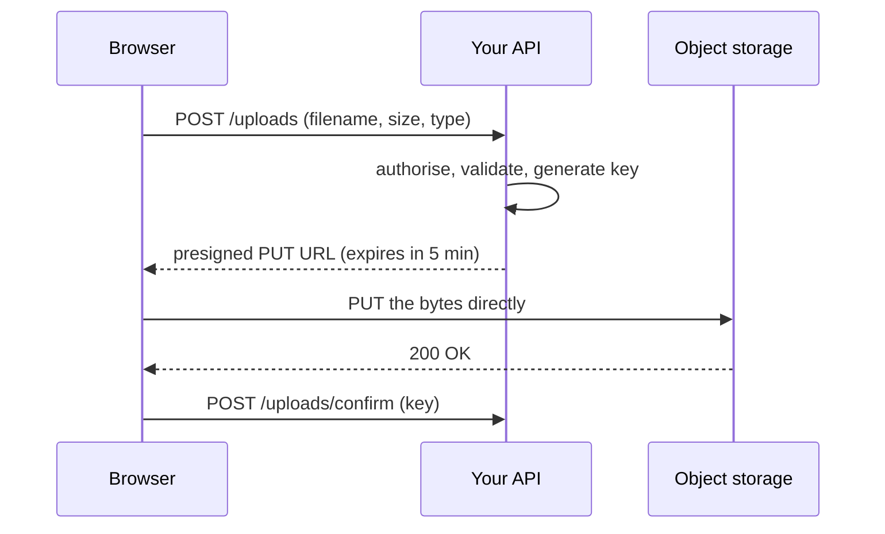
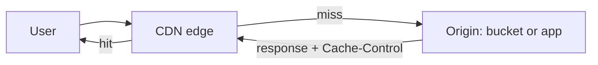

# Object Storage and Delivery {#ch-object-storage-and-delivery}

> Take user files off your server's disk, hand out signed URLs instead, and let a cache near the user serve the bytes.

**In this chapter:** buckets, keys and objects · the upload path · the read path through a CDN · cache keys and TTLs · why invalidation is the wrong default

## 💡 The Core Idea

Object storage is a durable key-value store for large blobs, reached over HTTP. A cache network — the
CDN — keeps copies of those blobs close to users. Together they replace the thing most applications
start with and regret: files written to the application server's disk.

The shift is not really about storage. It is about your application never being in the byte path. It
issues a short-lived URL, the browser talks to storage directly, and the CDN serves everyone after
that. Your servers handle permission decisions, not megabytes.

## How It Works

### Buckets, keys and objects

| Term       | What it is                                                                       |
| ---------- | -------------------------------------------------------------------------------- |
| **Bucket** | The container. Usually globally named, and pinned to one region                   |
| **Key**    | The object's full identifier — `users/42/avatar.png`                              |
| **Object** | The bytes plus metadata: content type, cache headers, custom tags                 |

The key **looks** like a path and is not one. There are no directories, only a flat keyspace where `/`
is an ordinary character that tools render as folders. This matters: listing "a folder" is a prefix
scan across the whole bucket, so it gets slower as the bucket grows. Never build a feature on listing.

> ⚠️ Object storage has no partial writes and no append. You replace a whole object or you do not
> change it. Anything that needs to be edited in place belongs in a database, not a bucket.

### The upload path

The naive design proxies the file through the application server, which turns a 200 MB upload into 200
MB of your bandwidth, your memory, and your request timeout. The correct design hands out a
**presigned URL** — a normal storage URL carrying a signature that grants one operation, on one key,
for a few minutes.



**The bytes never touch your server; only the permission decision does.**

**Issuing a presigned upload URL:**

```typescript
import { S3Client, PutObjectCommand } from "@aws-sdk/client-s3";
import { getSignedUrl } from "@aws-sdk/s3-request-presigner";

const s3 = new S3Client({ region: "eu-west-1" });

interface UploadTicket { url: string; key: string; expiresIn: number }

export async function createUploadTicket(userId: string, contentType: string): Promise<UploadTicket> {
  // The server chooses the key. Never let the client name its own — that is how one user
  // overwrites another user's avatar.
  const key = `users/${userId}/${crypto.randomUUID()}`;

  const url = await getSignedUrl(
    s3,
    new PutObjectCommand({
      Bucket: "app-user-uploads",
      Key: key,
      ContentType: contentType, // signed in, so the browser cannot upload something else
    }),
    { expiresIn: 300 },
  );

  return { url, key, expiresIn: 300 };
}
```

The same mechanism works in reverse for private downloads: sign a short-lived `GET` instead. Use a
signed **cookie** rather than a signed URL when a whole section of content must be readable at once —
a video's manifest and all of its segments, for example.

### The read path

Public assets go through a CDN, and the origin is locked so the CDN is the only thing that can read it.



**A miss costs one origin request; every later user in that region is served from the edge.**

Leaving the bucket publicly readable defeats the whole arrangement: users find the direct URL, bypass
the cache, and your signed-URL rules stop being enforced. Every provider has a mechanism for
origin-only access — an origin access control, a signed origin request, or a shared secret header.
Turn one on and block public reads.

### Cache keys and TTLs

The edge stores a response under a **cache key**. Everything you allow into that key multiplies the
number of copies, and every extra copy is another miss.

| Included in the key by default | Should it be?                                                |
| ------------------------------ | ------------------------------------------------------------ |
| Path                           | Always                                                        |
| Query string                   | Only the parameters that change the response                  |
| Cookies                        | Almost never for assets — one session cookie means zero hits  |
| `Accept-Encoding`              | Yes — you want the compressed and uncompressed forms separate |

The origin controls duration through response headers, and the two directives that matter are
different from each other:

**Cache headers that behave the way you want:**

```typescript
// A content-hashed asset: the filename changes when the bytes change, so it can be cached forever.
const immutableAsset = { "cache-control": "public, max-age=31536000, immutable" };

// An HTML page or API response: the browser revalidates, the CDN serves it for 60 seconds,
// and for 5 minutes after that it serves stale while it refreshes in the background.
const page = { "cache-control": "public, max-age=0, s-maxage=60, stale-while-revalidate=300" };

// Anything user-specific must never reach a shared cache.
const dashboard = { "cache-control": "private, no-store" };
```

`max-age` is the browser. `s-maxage` is the shared cache — the CDN — and it overrides `max-age` there.
`stale-while-revalidate` is the one that removes latency spikes at expiry: the edge answers instantly
from the stale copy and refreshes behind the request.

### Invalidation, and why it is a smell

Purging paths from an edge network is slow, usually metered, and eventually consistent. A deploy that
ends with "invalidate everything" throws away the entire cache and sends the next few minutes of
traffic to the origin.

The alternative is to make the URL change instead. Content-hashed filenames — `app.7f3c9a.js` — mean a
new build produces new URLs, so the old cached objects are simply never requested again. The only
thing left to invalidate is the small entry point that references them.

### Storage tiers

Every provider sells the same trade: cheaper storage in exchange for slower or costlier retrieval.
Assets your users fetch stay on the standard tier. Logs, backups and old exports move down on a
lifecycle rule after a fixed number of days, and expire entirely at the end. Automate it once; nobody
tidies a bucket by hand.

## When to Use It

| Data                                     | Where it goes         | Why                                              |
| ---------------------------------------- | --------------------- | ------------------------------------------------ |
| User uploads, images, video, exports      | Object storage        | Large, immutable, served over HTTP                |
| Build output — JS, CSS, fonts             | Object storage + CDN  | Content-hashed and cached forever                 |
| Records you query or filter on            | A database            | Buckets cannot query; listing is a prefix scan    |
| A file two servers must both write to     | A shared filesystem   | Object storage has no locking and no append       |
| Anything personalised per user            | Origin, `private` cache | A shared cache must never hold one user's data  |

## Common Mistakes

❌ **Proxying uploads through the application.** It spends your bandwidth and memory and breaks on large
files. ✅ Presign, let the browser upload directly, and confirm afterwards.

❌ **Letting the client choose the object key.** `avatar.png` from two users is one object, and `../`
in a key is a path-traversal bug. ✅ The server generates the key from the authenticated user's ID.

❌ **Leaving the bucket publicly readable behind a CDN.** The direct URL leaks and bypasses everything.
✅ Block public access and allow only the CDN's identity.

❌ **Forwarding all cookies and query strings to the origin.** Every unique value becomes its own cache
entry, so the hit rate collapses to near zero. ✅ Include only what changes the response.

❌ **Invalidating `/*` on every deploy.** It empties the cache and stampedes the origin. ✅ Hash the
filenames; invalidate only the entry point.

❌ **Serving user-specific data with a shared-cache directive.** One `s-maxage` on a personalised
response hands one user's dashboard to the next. ✅ `private, no-store` for anything behind a login.

## 🔑 Key Takeaways

- A key looks like a path but the keyspace is flat, so listing a prefix scales badly and is not a feature.
- Presign the upload so the bytes go browser-to-storage and your server only makes the permission decision.
- Lock the origin to the CDN — a publicly readable bucket makes every other control optional.
- Everything in the cache key multiplies the number of stored copies; cookies are the usual culprit.
- Content-hashed filenames replace invalidation, because a changed URL is never a stale one.

## Interview Questions

**Q: How would you handle user file uploads in a web application?**

The browser asks the API for permission; the API authorises the user, generates a server-side key, and
returns a short-lived presigned URL. The browser uploads directly to object storage, then tells the API
the key so it can be recorded against the user. The bytes never pass through the application, so upload
size stops being a request-timeout problem, and the signature limits the operation to one key for a few
minutes.

**Q: What is the difference between `max-age` and `s-maxage`?**

`max-age` applies to any cache, and in practice it is what the browser uses. `s-maxage` applies only to
shared caches — the CDN — and overrides `max-age` there. The pair lets you keep a page fresh in the
browser while still serving it from the edge: `max-age=0, s-maxage=60` means the browser revalidates
every time and the CDN absorbs the traffic for a minute.

**Q: After a deploy, users are getting the old JavaScript. What went wrong and how do you fix it?**

Either the asset filenames did not change and the edge is still serving the previous bytes, or the HTML
that references them is itself cached too long. The fix is structural: hash the content into the asset
filenames so a new build produces new URLs, and cache those forever. The HTML entry point gets a short
`s-maxage` and is the only thing ever invalidated.

**Q: When is a CDN not the answer?**

When the response is different for every user, or changes faster than it can be cached — a personalised
dashboard, an authenticated API returning that user's records. A shared cache holding personalised
content is a data leak, not a performance win. The right move is to cache the parts that are common and
leave the personalised part to the origin, close to its data.

**Q: How do you keep private files private when they are served from a bucket?**

Block public access on the bucket and allow only the CDN's identity to read it. Serve the files through
signed URLs or signed cookies with a short expiry, generated after your application has checked the
user is allowed the file. Because the signature encodes the key and the expiry, a leaked link stops
working on its own and cannot be edited into a link for someone else's file.

## What to Read Next

- [Chapter ?? — Cloud Fundamentals](#ch-cloud-fundamentals) — where storage and network sit among the primitives
- [Chapter ?? — Caching Strategies](#ch-web-performance-caching-strategies) — the same headers, from the browser's side
- [Chapter ?? — Platform and Edge Deployments](#ch-platform-deploys) — what the deploy does to everything cached in front of it
