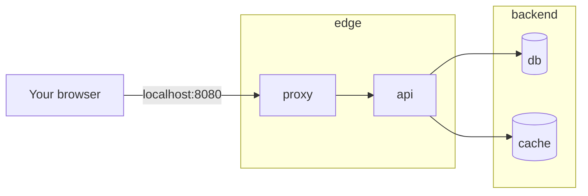

# Docker Compose {#ch-docker-compose}

> Describe a whole local stack in one file, start it with one command, and debug it when one service cannot reach another.

**In this chapter:** services, networks and volumes · startup order that actually waits · environment values · file watching · finding out why two services cannot talk

## 💡 The Core Idea

Compose is **one file describing a small private network of containers**, plus a command that makes reality
match it. Every service in the file joins a network Compose creates, and every service name becomes a
hostname on that network. That is the whole model, and it is why `postgres://db:5432/app` works with no
configuration: `db` is a service name, and Docker's embedded DNS resolves it.

What Compose is not is an orchestrator. There is no scheduler, no rescheduling onto a healthy host, no
rolling update, no autoscaling. It runs containers on one machine and restarts them if they die. Treat it
as **the development environment as code** — the thing that gets a new engineer from clone to running in
one command — and it is excellent. Treat it as production and you have reinvented a single point of failure.

> If a colleague cannot start your stack with `docker compose up`, the README is doing work the file should
> be doing.

## How It Works

### The Shape of the File

```yaml
services:              # the containers
  api:
  db:

volumes:               # storage that outlives a container
  db-data:

networks:              # who can reach whom
  backend:
```

⚠️ The top-level `version:` key is obsolete. Compose V2 ignores it and warns; delete it from any file that
still carries one.

### A Service, With the Parts That Matter

```yaml
services:
  api:
    build: { context: ., target: dev }
    ports: ["3000:3000"]            # host:container — only for what you open in a browser
    env_file: [.env.local]
    environment:
      DATABASE_URL: postgres://app:${DB_PASSWORD}@db:5432/app
    depends_on:
      db: { condition: service_healthy }
    develop:
      watch:
        - { action: sync, path: ./src, target: /app/src, ignore: [node_modules/] }
        - { action: rebuild, path: pnpm-lock.yaml }
    restart: unless-stopped
```

`docker compose watch` then syncs changed source into the running container and rebuilds when the lockfile
changes — which replaces bind-mounting the whole project and hoping the watcher inside the container copes.

### Startup Order Is About Readiness, Not Existence

Plain `depends_on` waits for the container to **start**, which for a database means the process exists and
is still reading its data directory. Your API connects, fails, and exits. The fix is a health check on the
dependency and a condition on the dependent:

```yaml
services:
  db:
    image: postgres:17-alpine
    environment:
      POSTGRES_PASSWORD: ${DB_PASSWORD}
    volumes: ["db-data:/var/lib/postgresql/data"]
    healthcheck:
      test: ["CMD-SHELL", "pg_isready -U app -d app"]
      interval: 5s
      timeout: 3s
      retries: 10
      start_period: 15s
```

| Condition | Waits until |
| ------------------------ | ----------------------------------------------- |
| `service_started` | The container is running (the default) |
| `service_healthy` | Its health check passes — what you almost always want |
| `service_completed_successfully` | It exited 0 — for migrations and seed jobs |

✅ Your application should still retry its first connection. Health checks reduce the window; they do not
remove it, and the same retry logic is what carries you through a database failover in production.

### Networks Decide What Is Reachable

```yaml
services:
  proxy:
    image: nginx:1.27-alpine
    ports: ["8080:80"]
    networks: [edge]
  api:
    networks: [edge, backend]      # the only service on both
  db:
    networks: [backend]
  cache:
    networks: [backend]

networks:
  edge:
  backend:
    internal: true                 # no route out to the internet
```



**Two networks, one bridge: only `api` can reach the database, and only `proxy` is published to the host.**

The distinction to keep straight: `ports` publishes to the host machine, `expose` documents a port for
other containers. A database needs neither — services on the same network reach each other on the
container port directly, and publishing 5432 to your laptop is how a local database ends up reachable from
the coffee shop's wifi.

### Values and Secrets

```bash
docker compose config          # the file with every variable resolved — read this before debugging
```

Compose interpolates `${VAR}` from your shell and from a `.env` file next to the Compose file, with
`${VAR:-default}` as the fallback form. `env_file` is different: it passes variables **into** the container
rather than substituting them in the file.

For anything genuinely secret, mount it as a file instead of an environment variable:

```yaml
services:
  db:
    environment:
      POSTGRES_PASSWORD_FILE: /run/secrets/db_password
    secrets: [db_password]

secrets:
  db_password:
    file: ./secrets/db_password.txt   # keep the directory out of version control
```

Environment variables leak: they appear in `docker inspect`, in crash reports, and in the environment of
every child process. A file at a known path does not.

### Dev and Production Variants

Compose reads `compose.yaml` and then `compose.override.yaml` if it exists, merging the second over the
first. Local-only settings — bind mounts, debug ports, a seeded database — belong in the override file, so
the base file stays honest about what the service needs.

```bash
docker compose up -d                                    # base + override
docker compose -f compose.yaml -f compose.ci.yaml up -d  # explicit, no override
```

### When Two Services Cannot Talk

Almost every "it works on my machine" Compose problem is one of four things, in this order:

```bash
docker compose ps                       # 1. is it running, and is it healthy?
docker compose logs --tail 50 api       # 2. what did it say as it failed?
docker compose exec api getent hosts db # 3. does the name resolve to an address?
docker compose exec api wget -qO- http://db:5432   # 4. is anything listening there?
```

| Symptom | Usual cause |
| ------------------------------ | ---------------------------------------------------------- |
| Name does not resolve | The two services are not on a shared network |
| Resolves, connection refused | Wrong port, or the process binds `127.0.0.1` inside the container |
| Works from the host, not the container | Using `localhost` in a container — that is the container itself |
| Intermittent at startup | `depends_on` without `condition: service_healthy` |

⚠️ `localhost` inside a container means that container. Use the service name from another container, and
`host.docker.internal` when a container genuinely needs something running on your machine.

## When to Use It

| Situation | Compose? | Why |
| --------------------------------------- | ------- | ------------------------------------------------ |
| Local database, cache, message broker | ✅ Yes | Production versions, one command, one delete |
| Integration tests in CI | ✅ Yes | Real dependencies instead of mocks |
| A demo or internal tool on one VM | Fine | Accept the single point of failure knowingly |
| A production service that must stay up | ❌ No | No rescheduling and no rolling update — use a platform or a scheduler |
| A frontend on a managed platform | ❌ No | Only the backing services need containers |

## Common Mistakes

❌ **`depends_on: [db]` with no condition.** The API starts while the database is still initialising and
exits on the first connection. ✅ Add a health check and `condition: service_healthy`.

❌ **Bind-mounting the project over `node_modules`.** The host directory hides the container's install, and
native modules built for the container disappear. ✅ Use Compose Watch, or add a named volume at
`/app/node_modules`.

❌ **Publishing every service's port.** `ports: ["5432:5432"]` on a database exposes it to your whole
network for no benefit. ✅ Publish only what a browser or client tool needs.

❌ **Committing the environment file.** It gets copied into the build context and pushed to a registry with
the image. ✅ Commit a template listing the variable names, ignore the real file in Git and Docker.

❌ **Running Compose in production because it already works.** One host, no rescheduling, and a restart
policy that cannot help when the machine dies. ✅ Ship the same image to a platform that can.

## 🔑 Key Takeaways

- Compose creates a private network where every service name is a hostname — that is why service discovery
  needs no configuration.
- `depends_on` waits for a container, not for readiness; only a health check plus `condition:
  service_healthy` waits for the thing you meant.
- `ports` publishes to the host, `expose` documents a container port, and a database needs neither.
- Compose is a development environment as code, not an orchestrator: no scheduler, no rolling update, one
  machine.

## Interview Questions

**Q: How does service discovery work in Compose?**

Compose creates a network for the project and attaches every service to it, and Docker's embedded DNS
resolves each service name to that container's current address. So a connection string can hard-code `db`
as the host and keep working after the container is recreated with a different IP. The corollary is that
two services on different networks cannot resolve each other at all, which is the first thing to check when
a connection fails by name.

**Q: Your API keeps crashing on startup because the database is not ready. What do you change?**

Two things, and the interviewer usually wants both. In Compose, give the database a health check —
`pg_isready` for Postgres — and change the dependent to `depends_on: db: condition: service_healthy` so it
is not started until that passes. In the application, retry the initial connection with backoff, because
the same failure happens in production during a failover or a rolling restart and no health check can
remove that window.

**Q: What is the difference between `ports` and `expose`?**

`ports` publishes a container port on the host, which is what lets you open `localhost:3000` in a browser
and also what makes the service reachable from your local network. `expose` is documentation for other
containers and publishes nothing. Containers on the same Compose network reach each other on the container
port whether or not either is declared, so internal services need neither — and publishing a database port
is a common accidental exposure.

**Q: When would you not use Compose?**

For anything that has to survive the machine it runs on. Compose has no scheduler, so if the host dies the
stack dies; it cannot roll out a new version without dropping the old container, and it cannot scale beyond
one host. It is the right tool for a local stack and for integration tests in CI, and the wrong tool the
moment availability is a requirement — at which point the image is still the artefact, and something else
runs it.

## What to Read Next

- [Chapter ?? — Docker Fundamentals](#ch-docker-fundamentals) — the container lifecycle each of these
  services goes through
- [Chapter ?? — Kubernetes Essentials](#ch-kubernetes-essentials) — the same ideas when something else
  decides where a container runs
