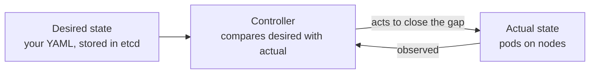
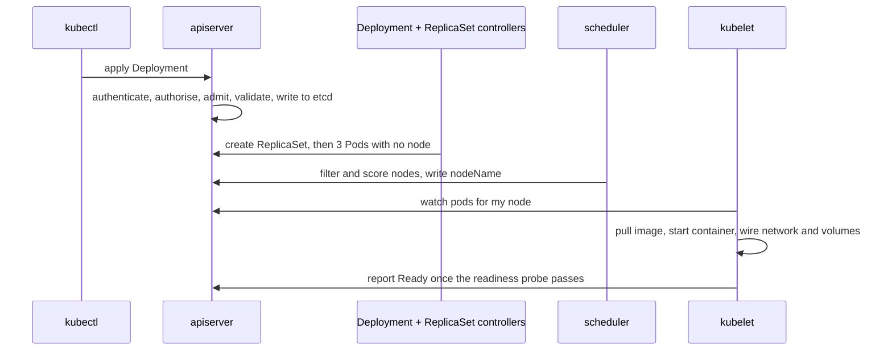

# Kubernetes Essentials {#ch-kubernetes-essentials}

> Own the parts of a pod spec that are yours — probes, resources and shutdown — and explain why your container restarted.

**In this chapter:** reconciliation loops · what happens on apply · health probes · requests and limits · rollout, rollback and the shutdown race

## 💡 The Core Idea

Kubernetes has no command that starts your application. You record the state you want, and **controllers
keep closing the gap** between that record and reality, forever. `replicas: 3` is not an instruction that
runs once; it is a fact several controllers keep making true.



**One loop, repeated by every controller in the system.**

That single pattern explains the behaviour people find surprising. Delete a pod a Deployment owns and a new
one appears. Hand-edit a managed resource and your edit is reverted. A node disappears and its pods are
recreated somewhere else with nobody involved.

> ⚠️ **Moving target:** Kubernetes ships three releases a year and deprecates APIs on a schedule, so field
> names and defaults move. The durable principle is the loop: something is always comparing a record of
> intent with the world and acting on the difference. Check the current API reference for exact fields.

## How It Works

**What happens when you apply,** and who did each part:



**Five actors, each doing one thing, coordinating only through the API server.**

| Question                    | Answer                                              |
| --------------------------- | --------------------------------------------------- |
| Who created the pod?         | The ReplicaSet controller, not you                  |
| Who chose the node?          | The scheduler — it only writes `nodeName`            |
| Who started the container?   | The kubelet, through the container runtime           |
| Who sends it traffic?        | The endpoints controller, once readiness passes      |

Nothing bypasses the API server — not the kubelet, not the scheduler, not `kubectl`. A pod stuck in
`Pending` therefore means no node passed the scheduler's filter, usually because its resource requests are
larger than any node's free capacity.

**Three objects, one purpose each — intent, revision, instance:**

```text
Deployment    → you edit this
  ReplicaSet  → one per image version; this is what makes rollback possible
    Pod       → replaced, never repaired
```

Pods are never repaired. A pod that fails is deleted and a new one created with a new name and address,
which is why you never hand out a pod address and always go through a Service.

## Health Probes Are the Highest-Value Thing Here

Missing or wrong probes cause most of the 502s people blame on the load balancer.

| Probe              | Asks                             | On failure                                                |
| ------------------ | -------------------------------- | --------------------------------------------------------- |
| **startupProbe**   | Has it finished booting?          | Restarts, and holds the other probes off until it passes   |
| **readinessProbe** | Can it serve traffic right now?   | Removed from the Service. **Not restarted**                |
| **livenessProbe**  | Is it permanently wedged?         | The container is **restarted**                             |

```yaml
containers:
  - name: api
    image: api:1.4.2
    startupProbe:                                  # 30 × 5s = up to 150s to boot
      httpGet: { path: /health, port: 3000 }
      failureThreshold: 30
      periodSeconds: 5
    readinessProbe:                                # may check dependencies
      httpGet: { path: /ready, port: 3000 }
      periodSeconds: 5
      failureThreshold: 3
    livenessProbe:                                 # must not check dependencies
      httpGet: { path: /health, port: 3000 }
      periodSeconds: 10
      failureThreshold: 3
```

❌ **The liveness probe checks the database.** The database hiccups for ten seconds, every pod fails
liveness at once, and Kubernetes restarts the entire fleet — turning a blip into an outage with cold caches.

✅ **Liveness asks "is this process wedged?" Readiness asks "should traffic come here?"** Only readiness may
depend on anything external.

## Requests, Limits, and Which One Kills You

```yaml
resources:
  requests: { memory: 256Mi, cpu: 100m }   # used for scheduling — a reservation
  limits:   { memory: 512Mi }              # enforced at runtime
```

| Resource   | Over the limit                                       |
| ---------- | ---------------------------------------------------- |
| **CPU**    | **Throttled** — slower, still alive                   |
| **Memory** | **OOMKilled** — no negotiation, the kernel kills it   |

Memory is incompressible: you cannot give a process less memory than it has already allocated, so the only
available action is to kill it. CPU is compressible, so the kernel hands out fewer slices.

A pod with no requests at all is the first thing evicted when a node runs short, because scheduling and
eviction both work from requests. The defensible senior position: set memory request and limit to the same
value so behaviour is predictable, set CPU requests accurately, and leave CPU limits off latency-sensitive
services — a CPU limit throttles the container even on an idle node and surfaces as p99 latency.

## Rollout, Rollback and the Shutdown Race

```yaml
spec:
  replicas: 4
  strategy:
    rollingUpdate: { maxSurge: 1, maxUnavailable: 0 }   # never dip below full capacity
```

```bash
kubectl rollout status deployment/api      # wait, and fail the pipeline if it stalls
kubectl rollout undo deployment/api        # back one ReplicaSet — seconds, no rebuild
```

The rollout is gated on readiness: with `maxUnavailable: 0` a new pod must pass readiness before an old one
is removed, so a broken image stalls the rollout instead of taking the service down. `rollout status` in
the pipeline is what turns that stall into a failed deployment rather than a silent one.

⚠️ **Endpoint removal and SIGTERM happen in parallel.** Removal has to reach every node's routing rules and
the external load balancer, which takes a few seconds; meanwhile the container already got SIGTERM and
stopped accepting connections. Requests still routed to it are refused. That is the 502 during an otherwise
perfectly configured rollout.

```yaml
lifecycle:
  preStop:
    exec: { command: ["sh", "-c", "sleep 5"] }   # let the removal propagate first
terminationGracePeriodSeconds: 30
```

The application still has to drain on SIGTERM — stop accepting connections, finish in-flight requests, close
the pool. That handler is the same one every container needs; see
[Chapter ?? — Docker Fundamentals](#ch-docker-fundamentals).

## When to Use It

The interview question is rarely "would you choose Kubernetes" — it is "what do you own when your service
runs on one".

| Concern                                      | Who owns it                              |
| -------------------------------------------- | ---------------------------------------- |
| Probes, resource requests, graceful shutdown  | **You**, in the pod spec                 |
| Image size, non-root user, scanning           | **You**, in the Dockerfile               |
| Rollout strategy and rollback                 | **You**, in the Deployment               |
| Node pools, autoscaling, cluster upgrades     | The platform or infrastructure team      |
| Ingress controllers, service mesh, policy     | The platform team                        |

⚠️ Everything in the right-hand column is a platform engineering career and is deliberately out of scope —
see `BOOK-SPEC.md` § 6. What you need is enough to reason about where your container ended up and why it
restarted.

## Common Mistakes

❌ **Liveness probing a dependency.** One slow database restarts every pod at once. ✅ Liveness checks the
process; readiness checks dependencies.

❌ **No resource requests.** The pod is scheduled anywhere, then evicted first under pressure. ✅ Always set
requests; set memory request equal to memory limit.

❌ **No `preStop` and no SIGTERM handler.** Every deploy drops in-flight requests. ✅ A short `preStop` sleep
plus a real drain in the application.

❌ **Fixing production with `kubectl edit`.** A controller reverts it, or the next apply does, and nothing
in Git describes what is running. ✅ Change the manifest, apply it, keep the cluster a function of the repo.

❌ **Treating a namespace as isolation.** A namespace scopes names, permissions and quotas — not network
traffic and not the kernel. ✅ Default-deny network policies, or separate clusters for anything untrusted.

## 🔑 Key Takeaways

- Nothing in Kubernetes runs your command; controllers close the gap between recorded intent and reality,
  continuously.
- Readiness controls traffic and liveness controls restarts — a liveness probe that checks a dependency can
  restart your whole fleet.
- Requests drive scheduling and eviction; memory over the limit is a kill, CPU over the limit is a slowdown.
- Zero-downtime rollout needs a readiness probe, `maxUnavailable: 0`, a short `preStop` delay and an
  application that drains on SIGTERM.

## Interview Questions

**Q: Walk me through what happens when you run `kubectl apply -f deployment.yaml`.**

The API server authenticates, authorises, admits and validates the object, then writes it to etcd. The
Deployment controller creates a ReplicaSet; the ReplicaSet controller creates three Pod objects with no node
assigned. The scheduler filters out nodes that cannot fit them, scores the rest and writes the winning node
name onto each pod. The kubelet on that node pulls the image, starts the container and wires networking.
Once readiness passes, the endpoints controller adds the pod to the Service. Worth saying out loud: no
component talks to another directly — they all watch the API server.

**Q: What is the difference between a liveness and a readiness probe?**

Readiness decides whether the pod receives traffic; on failure it is removed from the Service but left
running, so it can recover and rejoin. Liveness decides whether the container is beyond recovery; on failure
it is restarted. That drives what each may check. Readiness may check dependencies, because "cannot serve
right now" is a valid temporary state. Liveness must only check that the process itself responds — if it
checks the database, a brief database problem fails liveness on every pod at once and restarts the fleet.

**Q: A pod is in `CrashLoopBackOff`. How do you debug it?**

`CrashLoopBackOff` is not the error; it is Kubernetes backing off between restarts, so the first job is
finding the real exit. `kubectl logs <pod> --previous` shows the crashed instance rather than the one
starting now, and `kubectl describe pod` gives the exit code and events. 137 means killed, usually out of
memory. 1 usually means a startup failure — a missing variable, an unreachable dependency, a failed
migration. Also check whether a liveness probe is killing a slow boot, in which case the fix is a startup
probe rather than a longer liveness delay.

**Q: Why do you still get 502s during a rolling deployment with readiness probes configured?**

Because termination is not sequential. Endpoint removal and SIGTERM are issued at the same time, and removal
has to propagate to every node and to the load balancer's target group, which takes seconds. The container
has already stopped accepting connections, so requests still routed to it are refused. The fix has two
halves: a `preStop` hook that sleeps a few seconds so removal lands first, and an application that drains on
SIGTERM. `maxUnavailable: 0` keeps capacity up during the roll but does not address the race.

## What to Read Next

- [Chapter ?? — Deployment Strategies and Rollback](#ch-deployment-strategies) — the same question from the
  platform side, including what cannot be rolled back
- [Chapter ?? — Monitoring Fundamentals](#ch-monitoring-fundamentals) — the signals that tell you a rollout
  is going wrong before the pager does
