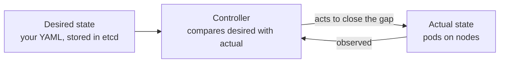
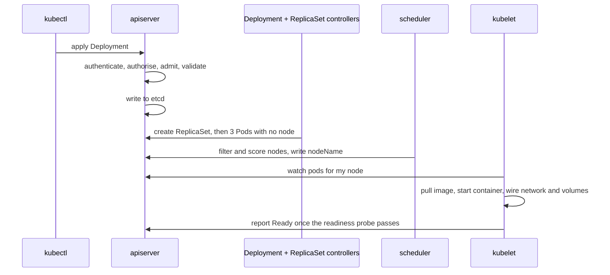

# Kubernetes Essentials {#ch-kubernetes-essentials}

> Explain what happens between `kubectl apply` and a serving pod, and keep your service available through a rollout, a restart and a node going away.

**In this chapter:** reconciliation loops · what happens on apply · why a pod · health probes · requests and limits · rollouts, rollback and graceful shutdown

## 💡 The Core Idea

Kubernetes has no command that starts your application. You record the state you want, and **controllers
keep closing the gap** between that record and reality, forever. `replicas: 3` is not an instruction that
runs once; it is a fact three separate controllers keep making true.



**One loop, repeated by every controller in the system.**

That single pattern explains the behaviour people find surprising. Delete a pod a Deployment owns and a new
one appears. Hand-edit a managed resource and your edit is reverted. A node disappears and its pods are
recreated somewhere else with nobody involved.

> ⚠️ **Moving target:** Kubernetes ships three releases a year and deprecates APIs on a schedule, so field
> names and defaults move. The durable principle is the loop: something is always comparing a record of
> intent with the world and acting on the difference. Check the current API reference for exact fields.

## How It Works

### The Parts, and What Each Decides

| Component | Decides |
| --------------------------- | -------------------------------------------------------------- |
| **kube-apiserver** | Whether a request is allowed, and whether the object is valid. The only component that talks to etcd |
| **etcd** | Nothing — it stores every object, and it holds your Secrets |
| **kube-scheduler** | Which node a pod runs on. It writes a name and starts nothing |
| **controller-manager** | Runs the built-in loops: Deployment, ReplicaSet, Node, Job |
| **kubelet** (per node) | Pulls images and tells the container runtime to start pods on its node |
| **kube-proxy** (per node) | Programs the node's routing so a Service address reaches a pod |

Nothing bypasses the API server — not the kubelet, not the scheduler, not `kubectl`. That is why access
control on the API server is effectively the entire security perimeter.

### What Happens When You Apply



**Five actors, each doing one thing, coordinating only through the API server.**

| Question | Answer |
| -------------------------- | -------------------------------------------------- |
| Who created the pod? | The ReplicaSet controller, not you |
| Who chose the node? | The scheduler — it only writes `nodeName` |
| Who started the container? | The kubelet, through the container runtime |
| Who sends it traffic? | The endpoints controller, once readiness passes |

A pod stuck in `Pending` means no node passed the scheduler's filter — usually resource requests larger
than any node's free capacity, or a taint nothing tolerates.

### Deployment, ReplicaSet, Pod

```text
Deployment    → you edit this
  ReplicaSet  → one per image version; this is what makes rollback possible
    Pod       → replaced, never repaired
```

**Three objects, one purpose each: intent, revision, instance.**

Pods are never repaired. A pod that fails is deleted and a new one is created with a new name and a new
address, which is why you never hand out a pod address and always go through a Service.

**Why a pod rather than a container?** Because a pod is a shared context: one network address, shared
volumes, and one lifecycle on one node. That is what a sidecar needs — a log shipper reading the app's
volume, a proxy intercepting its traffic — and what an init container needs to run a migration to
completion before the app starts. Since Kubernetes 1.29 a sidecar is written as an init container with
`restartPolicy: Always`, so it starts before the app and is shut down after it.

❌ Two independent services in one pod. They cannot scale or deploy separately, and one crash loop takes
both down.

### Health Probes Are the Highest-Value Thing Here

Missing or wrong probes cause most of the 502s people blame on the load balancer.

| Probe | Asks | On failure |
| ------------------ | -------------------------------- | -------------------------------------- |
| **startupProbe** | Has it finished booting? | Restarts, and holds the other probes off until it passes |
| **readinessProbe** | Can it serve traffic right now? | Removed from the Service. **Not restarted** |
| **livenessProbe** | Is it permanently wedged? | The container is **restarted** |

```yaml
containers:
  - name: api
    image: api:1.4.2
    startupProbe:                                  # 30 × 5s = up to 150s to boot
      httpGet: { path: /health, port: 3000 }
      failureThreshold: 30
      periodSeconds: 5
    readinessProbe:                                # may check dependencies
      httpGet: { path: /ready, port: 3000 }
      periodSeconds: 5
      failureThreshold: 3
    livenessProbe:                                 # must not check dependencies
      httpGet: { path: /health, port: 3000 }
      periodSeconds: 10
      failureThreshold: 3
```

❌ **The liveness probe checks the database.** The database hiccups for ten seconds, every pod fails
liveness at once, and Kubernetes restarts the entire fleet — turning a blip into an outage with cold caches.

✅ **Liveness asks "is this process wedged?" Readiness asks "should traffic come here?"** Only readiness may
depend on anything external.

### Requests, Limits, and Which One Kills You

```yaml
resources:
  requests: { memory: 256Mi, cpu: 100m }   # used for scheduling — a reservation
  limits:   { memory: 512Mi }              # enforced at runtime
```

| Resource | Over the limit |
| ---------- | ---------------------------------------------------- |
| **CPU** | **Throttled** — slower, still alive |
| **Memory** | **OOMKilled** — no negotiation, the kernel kills it |

Memory is incompressible: there is no way to give a process less memory than it has already allocated, so
the only available action is to kill it. CPU is compressible, so the kernel just hands out fewer slices.

A pod with no requests at all is the first thing evicted when a node runs short, because scheduling and
eviction both work from requests. Set them.

The defensible senior position on limits: set memory request and limit to the same value, so behaviour is
predictable and the pod is not evicted before it is killed; set CPU requests accurately; and leave CPU
limits off latency-sensitive services, because a CPU limit throttles the container even on an idle node and
shows up as p99 latency.

### Rolling Out and Rolling Back

```yaml
spec:
  replicas: 4
  revisionHistoryLimit: 5
  strategy:
    rollingUpdate: { maxSurge: 1, maxUnavailable: 0 }   # never dip below full capacity
  selector:
    matchLabels: { app: api }                            # immutable after creation
```

```bash
kubectl rollout status deployment/api      # wait, and fail the pipeline if it stalls
kubectl rollout history deployment/api
kubectl rollout undo deployment/api        # back one ReplicaSet — seconds, no rebuild
```

The rollout is gated on readiness: with `maxUnavailable: 0`, a new pod must pass its readiness probe before
an old one is removed. A broken image therefore stalls the rollout instead of taking the service down —
provided the readiness probe actually checks something. `rollout status` in the pipeline is what turns that
stall into a failed deployment rather than a silent one.

A PodDisruptionBudget covers the other kind of interruption. `minAvailable: 3` on a four-replica Deployment
tells the cluster it may evict one pod at a time during a node upgrade or a drain, rather than all four.
Set it below the replica count — a budget that can never be satisfied blocks node drains indefinitely.

### Shutdown Is Where Zero Downtime Quietly Fails

```text
Pod marked Terminating → removed from Service endpoints (propagating…)
                       → preStop hook → SIGTERM → grace period → SIGKILL
```

**Termination in order — except that the first line runs in parallel with the second.**

⚠️ **Endpoint removal and SIGTERM happen in parallel.** Removal has to reach every node's kube-proxy and
the external load balancer, which takes a few seconds; meanwhile the container already got SIGTERM and
stopped accepting connections. Requests still being routed to it are refused. That is the 502 during a
perfectly configured rollout.

```yaml
lifecycle:
  preStop:
    exec: { command: ["sh", "-c", "sleep 5"] }   # let the removal propagate first
terminationGracePeriodSeconds: 30
```

The application still has to drain on SIGTERM — stop accepting connections, finish in-flight requests, close
the pool. That handler is the same one every container needs; see
[Chapter ?? — Docker Fundamentals](#ch-docker-fundamentals).

### Namespaces Are Not a Security Boundary

A namespace scopes names, access-control rules and quotas. It does not isolate network traffic — by default
any pod can reach any other pod in the cluster — and it does not isolate the node or the kernel, because
pods from different namespaces run side by side on the same hosts. Real separation needs default-deny
network policies, and for untrusted workloads, separate node pools or separate clusters.

## When to Use It

The question in an interview is rarely "would you choose Kubernetes" — it is "what do you own when your
service runs on one".

| Concern | Who owns it |
| ------------------------------------------ | ---------------------------------------- |
| Probes, resource requests, graceful shutdown | **You**, in the pod spec |
| Image size, non-root user, scanning | **You**, in the Dockerfile |
| Rollout strategy and rollback | **You**, in the Deployment |
| Node pools, autoscaling, cluster upgrades | The platform or infrastructure team |
| Ingress controllers, service mesh, policy | The platform team |

⚠️ Everything in the right-hand column is a platform engineering career and is out of scope for this book —
see `BOOK-SPEC.md` § 6. What you need is enough to reason about where your container ended up and why it
restarted.

## Common Mistakes

❌ **Liveness probing a dependency.** One slow database restarts every pod at once. ✅ Liveness checks the
process; readiness checks dependencies.

❌ **No resource requests.** The pod is scheduled anywhere, then evicted first under pressure. ✅ Always set
requests; set memory request equal to memory limit.

❌ **No `preStop` and no SIGTERM handler.** Every deploy drops in-flight requests, and every stop takes the
full grace period. ✅ A short `preStop` sleep plus a real drain in the application.

❌ **Fixing production with `kubectl edit`.** A controller reverts it, or the next apply does, and nothing
in Git describes what is running. ✅ Change the manifest, apply it, keep the cluster a function of the repo.

❌ **Treating a namespace as isolation.** `dev` can call `production` by address unless something stops it.
✅ Default-deny network policies, or separate clusters for anything untrusted.

## 🔑 Key Takeaways

- Nothing in Kubernetes runs your command; controllers close the gap between recorded intent and reality,
  continuously.
- Readiness controls traffic and liveness controls restarts — a liveness probe that checks a dependency can
  restart your whole fleet.
- Requests drive scheduling and eviction; memory over the limit is a kill, CPU over the limit is a slowdown.
- Zero-downtime rollout needs a readiness probe, `maxUnavailable: 0`, a short `preStop` delay and an
  application that drains on SIGTERM.

## Interview Questions

**Q: Walk me through what happens when you run `kubectl apply -f deployment.yaml`.**

kubectl sends the object to the API server, which authenticates the caller, checks authorisation, runs
admission controllers, validates the object and writes it to etcd. The Deployment controller sees a new
object and creates a ReplicaSet; the ReplicaSet controller sees it needs three pods and none exist, so it
creates three Pod objects with no node assigned. The scheduler watches for unassigned pods, filters out
nodes that cannot fit them, scores the rest and writes the winning node name back to each pod. The kubelet
on that node sees a pod assigned to it, pulls the image, has the runtime start the container, and wires up
networking and volumes. Once the readiness probe passes, the endpoints controller adds the pod to the
Service and kube-proxy updates the node's routing rules. Worth saying out loud: no component talks to
another directly — they all watch the API server.

**Q: What is the difference between a liveness and a readiness probe?**

Readiness decides whether the pod receives traffic; on failure it is removed from the Service but left
running, so it can recover and rejoin. Liveness decides whether the container is beyond recovery; on failure
the container is restarted. That drives what each endpoint may check. Readiness may check dependencies,
because "cannot serve right now" is a valid temporary state. Liveness must only check that the process
itself responds — if it checks the database, a brief database problem fails liveness on every pod
simultaneously and Kubernetes restarts the whole fleet.

**Q: A pod is in `CrashLoopBackOff`. How do you debug it?**

`CrashLoopBackOff` is not the error; it is Kubernetes backing off between restarts, so the first job is
finding the real exit. `kubectl logs <pod> --previous` shows the crashed instance rather than the one
currently starting, and `kubectl describe pod` gives the exit code and events. 137 means it was killed,
usually out of memory, so check the memory limit. 1 usually means the application failed at startup — a
missing environment variable, an unreachable dependency, a failed migration. Also check whether a liveness
probe is killing a slow boot before it finishes, in which case the fix is a startup probe rather than a
longer liveness delay.

**Q: Why do you still get 502s during a rolling deployment with readiness probes configured?**

Because termination is not sequential. When a pod is marked Terminating, endpoint removal and SIGTERM are
issued at the same time, and removal has to propagate to every node's kube-proxy and to the load balancer's
target group, which takes seconds. The container has already stopped accepting connections, so requests
still being routed to it are refused. The fix has two halves: a `preStop` hook that sleeps a few seconds so
removal lands first, and an application that handles SIGTERM by draining in-flight requests. Setting
`maxUnavailable: 0` keeps capacity up during the roll but does not address the race on its own.

**Q: Should you set CPU limits?**

Memory limits, yes — memory is incompressible, so an unlimited leaking pod can trigger node-wide OOM kills
that take out unrelated workloads. CPU limits are more debatable. Exceeding a CPU request just means
competing for cycles, but a CPU limit makes the kernel throttle the container even when the node is idle,
which surfaces as p99 latency spikes. A defensible position: accurate CPU requests so scheduling and
autoscaling work, memory request equal to memory limit for predictable behaviour, no CPU limit on
latency-sensitive services, and CPU limits on batch work that should not be allowed to starve its
neighbours.

## What to Read Next

- [Chapter ?? — Rollback and Recovery](#ch-rollback-and-recovery) — the same question from the platform
  side, including what cannot be rolled back
- [Chapter ?? — Monitoring Fundamentals](#ch-monitoring-fundamentals) — the signals that tell you a rollout
  is going wrong before the pager does
