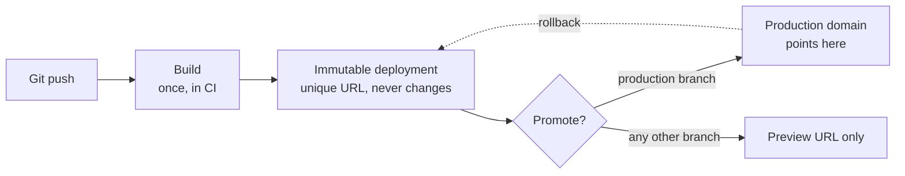

# Platform and Edge Deployments {#ch-platform-deploys}

> Explain what a platform deploy actually does to your traffic, and why the domain is a pointer rather than a server.

**In this chapter:** the immutable artefact · atomic promotion · where code runs · version skew · what the platform does not do for you

## 💡 The Core Idea

A platform deploy does not update a server. It **builds a new, immutable copy of your site and then
moves a pointer at it.** The old copy is still there, still reachable, still able to serve traffic.

That one design decision is where every other feature comes from. Rollback is fast because the old
build was never deleted. Preview environments are cheap because a build is just another copy. Deploys
have no downtime because the switch is a pointer change, not a restart.

If you understand deploys as *replacing files on a server*, none of the rest makes sense. If you
understand them as *publishing a new immutable version and re-aiming a domain*, all of it follows.

## How It Works

Four stages, in order. Only the last one changes what users see.



**A deploy produces an artefact; promotion is a separate, reversible act.**

| Stage | What happens | Reversible? |
| ----- | ------------ | ----------- |
| **Build** | Source is compiled into static assets plus server functions | No — build again |
| **Publish** | The output is stored under a unique, permanent deployment URL | No — but harmless |
| **Promote** | The production domain is re-aimed at that deployment | ✅ Yes, instantly |
| **Serve** | The CDN fills its caches from the newly promoted build | ✅ Yes, by promoting back |

**Every deployment keeps its own URL, for the life of the project:**

```bash
# The commit-specific URL — never changes, never re-points
https://acme-shop-9k2f3xq1p-acme.vercel.app

# The branch URL — always the latest build of that branch
https://acme-shop-git-checkout-rewrite-acme.vercel.app

# The production domain — a pointer, moved on promotion
https://acme-shop.com
```

> ⚠️ The commit URL is the one to paste into a bug report. A branch URL re-points on the next push,
> so a screenshot taken against it can stop being reproducible an hour later.

### Build once, promote the artefact

The single most important rule, and the one interviewers actually test. A pipeline that rebuilds per
environment is testing one artefact and shipping a different one — different dependency resolutions,
different build timestamps, sometimes a different lockfile state.

❌ **Rebuild per environment — the thing you tested is not the thing you shipped:**

```bash
vercel build --target=preview   && vercel deploy --prebuilt   # tested this
vercel build --target=production && vercel deploy --prebuilt --prod  # shipped this
```

✅ **Build once, promote the same deployment:**

```bash
vercel build                                  # one artefact
DEPLOY_URL=$(vercel deploy --prebuilt)        # published, preview only
# ... run the smoke tests against $DEPLOY_URL ...
vercel promote "$DEPLOY_URL" --yes            # re-aim production, no rebuild
```

The second form is what "promotion" means everywhere — container registries, S3 artefact buckets and
platform deploys all do the same thing under different names.

## Where the Code Runs

"Edge" is a location, not a technology. The same handler can run in three places, and the choice is a
latency-versus-capability trade-off.

| Location | Starts in | Can it reach a database? | Use it for |
| -------- | --------- | ------------------------ | ---------- |
| **CDN cache** | ~0 ms | No — it is a cached response | Anything that can be pre-rendered |
| **Edge runtime** | ~5 ms, near the user | Only over HTTP, and the round trip is long | Redirects, auth checks, A/B assignment, geo routing |
| **Regional function** | ~100 ms cold, once | ✅ Yes, over a pooled connection in the same region | Anything that queries your data |

**The mistake this table prevents:** moving a database-backed route to the edge makes it *slower*. The
handler starts 90 ms sooner and then spends 200 ms crossing the Atlantic for every query.

✅ **Put the function in the same region as the database, and cache in front of it:**

```typescript
// A route that reads the database — regional, not edge.
export const runtime = "nodejs";
export const preferredRegion = "fra1"; // same region as the Postgres primary

export async function GET(): Promise<Response> {
  const rows = await db.query<Product>("select id, name from products limit 20");
  return Response.json(rows, {
    // The CDN, not the function, is what makes this fast for a user in Sydney.
    headers: { "cache-control": "s-maxage=60, stale-while-revalidate=300" },
  });
}
```

> ⚠️ **Moving target:** runtime names, region identifiers and the config syntax for choosing them
> change with almost every major framework release. The durable principle does not: **compute belongs
> next to its data, and the CDN is what makes it feel local everywhere else.**

## Version Skew — The Failure Nobody Predicts

A user loads your site. Ten minutes later you deploy. The tab is still open, still running the old
JavaScript bundle, and it now requests a chunk that the new build renamed.

```text
Browser has: /_next/static/chunks/page-a1b2c3.js   (build N)
Server has:  /_next/static/chunks/page-d4e5f6.js   (build N+1)
                              ↓
                      404 → white screen
```

Because old deployments are never deleted, the fix is routing rather than caching: the client sends
the deployment ID it was served, and the platform routes that request back to the matching build.
Vercel calls this **skew protection**; the general term is **version pinning**.

| Approach | Handles | Cost |
| -------- | ------- | ---- |
| Pin requests to the client's deployment ID | Assets and server actions | Needs the platform to keep old builds routable |
| Version the API, never break a contract | API responses | Discipline, not infrastructure |
| Detect the new build and prompt a reload | Long-lived tabs, dashboards | One banner and a `visibilitychange` listener |

✅ Do the second one regardless. Skew protection has a retention window; a backward-compatible API
does not expire.

## Common Mistakes

❌ **Treating the preview URL as disposable and the production deploy as the "real" build.**
✅ They are the same artefact. If the preview passed, promote *it* — do not merge and rebuild.

❌ **Putting secrets in a build-time variable prefixed for the client.**
✅ Anything the bundler inlines ships to the browser. Read secrets at request time, in server code.

❌ **Assuming the CDN purges itself on deploy.**
✅ Static assets are content-hashed and safe. HTML and API responses hold their `s-maxage` until it
expires — a stale page after a deploy is usually a cache header, not a broken build.

❌ **One long build that runs tests, lints and type-checks before producing the artefact.**
✅ Run checks in parallel with the build, not in front of it. The artefact is cheap; the wait is not.

## 🔑 Key Takeaways

- A deployment is an immutable artefact, and a domain is a pointer at one — that is why rollback is instant.
- Build once and promote the same artefact; rebuilding per environment ships something you never tested.
- Edge execution wins on latency and loses on data access, so put database-backed routes in the database's region.
- Version skew breaks open tabs on every deploy, and a backward-compatible API is the fix that does not expire.

## Interview Questions

**Q: What actually happens when you promote a deployment to production?**

Nothing is rebuilt. The build already exists as an immutable deployment with its own permanent URL,
and promotion re-points the production domain at it. The switch is atomic, so no request sees a
half-updated site, and the previous deployment stays live on its own URL, which is what makes rollback
a pointer change rather than a redeploy.

**Q: Why can moving a route to the edge make it slower?**

Edge runtimes start close to the user but far from your data. A handler in Sydney that queries a
database in Frankfurt pays a round trip of roughly 250 ms per query, which dwarfs the 100 ms of cold
start it saved. Edge is right for work that needs no origin data — redirects, auth token checks,
geo routing, A/B assignment. Anything that reads your database belongs in the database's region, with
the CDN in front of it doing the geographic work.

**Q: A user reports a white screen right after a deploy, but you cannot reproduce it. What is happening?**

Almost certainly version skew. Their tab was loaded from the previous build and is requesting a
content-hashed chunk that the new build renamed, so the request 404s and the app fails to hydrate. The
platform-level fix is pinning requests to the deployment the client was served. The durable fix is
never breaking an API contract within a release, plus detecting a new build and offering a reload.

**Q: When would you not want an immutable-deployment model?**

When the unit of change is not the whole application. A large monolith with a 20-minute build gets a
worse feedback loop from full rebuilds than from patching a running instance, and stateful services
that hold long-lived connections — a WebSocket gateway, a job runner mid-batch — cannot be swapped
atomically because the state does not move with the pointer. Immutable deploys assume a cheap build
and a stateless serving tier.

**Q: How do you make sure the artefact you tested is the artefact you shipped?**

Produce one build, publish it as a deployment, run the smoke tests against that deployment's own URL,
then promote it by ID. The pipeline should have exactly one build step, and every later stage should
take a deployment identifier as input rather than a Git reference. If any stage can trigger a rebuild,
the guarantee is gone.

## What to Read Next

- [Chapter ?? — Preview Environments](#ch-preview-environments) — the same artefact model, one copy per pull request
- [Chapter ?? — Rollback and Recovery](#ch-rollback-and-recovery) — moving the pointer back, and the changes where you cannot
- [Chapter ?? — Content Delivery Networks](#ch-content-delivery-networks) — what the CDN caches in front of all of this
