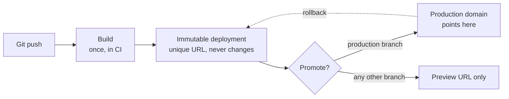

# Platform Deploys and Preview Environments {#ch-platform-deploys}

> Explain what a platform deploy actually does to your traffic, why the domain is a pointer rather than a server, and what it costs to give every pull request its own copy.

**In this chapter:** the immutable artefact · build once, promote once · where code runs · version skew · a preview per branch · the data problem · locking previews down

## 💡 The Core Idea

A platform deploy does not update a server. It **builds a new, immutable copy of your site and then
moves a pointer at it.** The old copy is still there, still reachable, still able to serve traffic.

That one design decision is where every other feature comes from. Rollback is fast because the old
build was never deleted. Preview environments are cheap because a build is just another copy. Deploys
have no downtime because the switch is a pointer change, not a restart.

If you understand deploys as *replacing files on a server*, none of the rest makes sense. If you
understand them as *publishing a new immutable version and re-aiming a domain*, all of it follows.

## How It Works

Four stages, in order. Only the last one changes what users see.



**A deploy produces an artefact; promotion is a separate, reversible act.**

| Stage        | What happens                                              | Reversible?          |
| ------------ | --------------------------------------------------------- | -------------------- |
| **Build**    | Source is compiled into static assets plus server functions | No — build again      |
| **Publish**  | The output is stored under a unique, permanent deployment URL | No — but harmless   |
| **Promote**  | The production domain is re-aimed at that deployment        | ✅ Yes, instantly     |
| **Serve**    | The CDN fills its caches from the newly promoted build      | ✅ Yes, by promoting back |

**Every deployment keeps its own URL, for the life of the project:**

```bash
# The commit-specific URL — never changes, never re-points
https://acme-shop-9k2f3xq1p-acme.vercel.app

# The branch URL — always the latest build of that branch
https://acme-shop-git-checkout-rewrite-acme.vercel.app

# The production domain — a pointer, moved on promotion
https://acme-shop.com
```

> ⚠️ The commit URL is the one to paste into a bug report. A branch URL re-points on the next push, so
> a screenshot taken against it can stop being reproducible an hour later.

### Build once, promote the artefact

The single most important rule, and the one interviewers actually test. A pipeline that rebuilds per
environment is testing one artefact and shipping a different one — different dependency resolutions,
different build timestamps, sometimes a different lockfile state.

✅ **Build once, promote the same deployment:**

```bash
vercel build                                  # one artefact
DEPLOY_URL=$(vercel deploy --prebuilt)        # published, preview only
# ... run the smoke tests against $DEPLOY_URL ...
vercel promote "$DEPLOY_URL" --yes            # re-aim production, no rebuild
```

This is what "promotion" means everywhere — container registries, S3 artefact buckets and platform
deploys all do the same thing under different names.

## Where the Code Runs

"Edge" is a location, not a technology. The same handler can run in three places, and the choice is a
latency-versus-capability trade-off.

| Location               | Starts in            | Can it reach a database?                        | Use it for                                        |
| ---------------------- | -------------------- | ----------------------------------------------- | ------------------------------------------------- |
| **CDN cache**          | ~0 ms                | No — it is a cached response                     | Anything that can be pre-rendered                 |
| **Edge runtime**       | ~5 ms, near the user | Only over HTTP, and the round trip is long       | Redirects, auth checks, A/B assignment, geo routing |
| **Regional function**  | ~100 ms cold, once   | ✅ Yes, pooled, in the same region                | Anything that queries your data                   |

**The mistake this table prevents:** moving a database-backed route to the edge makes it *slower*. The
handler starts 90 ms sooner and then spends 200 ms crossing the Atlantic for every query.

```typescript
// A route that reads the database — regional, not edge.
export const runtime = "nodejs";
export const preferredRegion = "fra1"; // same region as the Postgres primary

export async function GET(): Promise<Response> {
  const rows = await db.query<Product>("select id, name from products limit 20");
  return Response.json(rows, {
    // The CDN, not the function, is what makes this fast for a user in Sydney.
    headers: { "cache-control": "s-maxage=60, stale-while-revalidate=300" },
  });
}
```

> ⚠️ **Moving target:** runtime names, region identifiers and the config syntax for choosing them change
> with almost every major framework release. The durable principle does not: **compute belongs next to
> its data, and the CDN is what makes it feel local everywhere else.**

## Version Skew — The Failure Nobody Predicts

A user loads your site. Ten minutes later you deploy. The tab is still open, still running the old
JavaScript bundle, and it now requests a chunk that the new build renamed.

```text
Browser has: /_next/static/chunks/page-a1b2c3.js   (build N)
Server has:  /_next/static/chunks/page-d4e5f6.js   (build N+1)
                              ↓
                      404 → white screen
```

Because old deployments are never deleted, the fix is routing rather than caching: the client sends the
deployment ID it was served, and the platform routes that request back to the matching build. Vercel
calls this **skew protection**; the general term is **version pinning**.

✅ Version the API and never break a contract within a release, regardless. Skew protection has a
retention window; a backward-compatible API does not expire.

## A Preview Per Branch

A preview environment is **a full deployment of one branch, at its own URL, thrown away when the branch
merges.** It exists because the alternative — a single shared staging environment — has a queue. One
person's half-finished migration blocks everyone else's review, and the person who broke it is not
always the person who has to debug it.

Previews are cheap for the reason above: a deployment is an immutable build behind a pointer, so a
second copy costs a build rather than a second environment. Each preview gets its own environment
values, so the same code can point at a different database without a code change.

```typescript
type DeployEnv = "production" | "preview" | "development";

// Injected at build time by the platform; the names differ per provider.
export const deployEnv: DeployEnv =
  (process.env.VERCEL_ENV as DeployEnv | undefined) ?? "development";

// Use it to keep analytics, payments and email out of previews.
export const isRealTraffic: boolean = deployEnv === "production";
```

> ⚠️ Guarding on `NODE_ENV === "production"` does not work here. A preview **is** a production build —
> minified, optimised, `NODE_ENV=production`. Only the platform's own variable tells the two apart.

Previews replace staging for *review*. They do not replace it for *rehearsal* — a release that
coordinates three services still needs one place where all three sit at the candidate version.

## The Data Problem

This is where previews are actually hard, and where interviews go. The application copy is free. The
database copy is not.

| Strategy                     | What each preview gets                | Good for                      | The catch                                        |
| ---------------------------- | ------------------------------------- | ----------------------------- | ------------------------------------------------ |
| **Shared preview database**  | One database, all branches            | Small teams, read-heavy apps  | One branch's migration breaks every other preview |
| **Branched database**        | A copy-on-write clone per branch      | Anything with migrations      | Needs a provider that supports branching          |
| **Seeded ephemeral database**| A fresh empty database plus a seed script | Deterministic tests       | Seed data drifts from real shapes                 |
| **Production, read-only**    | The real data, writes blocked         | Debugging a data-shaped bug   | ❌ Only with anonymised data and an audit trail    |

✅ **Default to a branched or seeded database.** The shared one is fine right up until the first
migration, and the first migration always comes.

❌ **Never point a preview at the production database with writes enabled.** A preview is code that has
not been reviewed yet. That is the entire point of it.

Third-party services need the same treatment: test-mode payment keys, a catch-all inbox for email,
analytics disabled outright — preview traffic poisons funnels — and webhooks either registered per URL
or stubbed.

## Locking Previews Down

A preview URL is public by default on most platforms. It is a guessable, indexable copy of your
unreleased work.

| Control                     | Stops                                   | Use when                                        |
| --------------------------- | --------------------------------------- | ----------------------------------------------- |
| **Team-only access**        | Anyone outside the organisation          | Always, as the baseline                          |
| **Password protection**     | Anyone without the shared secret         | Sharing with a client or an external reviewer    |
| **Bypass token**            | Nothing — it *grants* access             | Letting CI and end-to-end tests through          |
| **`x-robots-tag: noindex`** | Search engines                           | Always. A leaked preview in search is an incident |

> ⚠️ **Moving target:** header names, protection tiers and bypass mechanisms differ by platform and get
> renamed. The durable principle: **previews are private by default, and CI is granted access with a
> revocable token — never by turning the protection off.**

## Common Mistakes

❌ **Treating the preview URL as disposable and the production deploy as the "real" build.**
✅ They are the same artefact. If the preview passed, promote *it* — do not merge and rebuild.

❌ **Putting secrets in a build-time variable prefixed for the client.**
✅ Anything the bundler inlines ships to the browser. Read secrets at request time, in server code.

❌ **Assuming the CDN purges itself on deploy.**
✅ Static assets are content-hashed and safe. HTML and API responses hold their `s-maxage` until it
expires — a stale page after a deploy is usually a cache header, not a broken build.

❌ **Every preview writing to the same database, so the review environment is broken more often than not.**
✅ Branch the database, or seed a fresh one. The cost of the fix is far below the cost of the queue.

❌ **Preview traffic in the analytics dashboard.**
✅ Gate every third-party client on the platform environment variable, not on `NODE_ENV`.

❌ **Sharing a preview link with a client and forgetting it stays live.**
✅ Password-protect it, or hand over a commit-specific URL that will never re-point at newer,
unreviewed work.

## 🔑 Key Takeaways

- A deployment is an immutable artefact and a domain is a pointer at one — that is why rollback is instant.
- Build once and promote the same artefact; rebuilding per environment ships something you never tested.
- Edge execution wins on latency and loses on data access, so database-backed routes belong in the database's region.
- A preview is a production build, so environment detection must use the platform variable, not `NODE_ENV`.
- The application copy is cheap and the data copy is not — branch or seed, and never write to production.

## Interview Questions

**Q: What actually happens when you promote a deployment to production?**

Nothing is rebuilt. The build already exists as an immutable deployment with its own permanent URL, and
promotion re-points the production domain at it. The switch is atomic, so no request sees a
half-updated site, and the previous deployment stays live on its own URL — which is what makes rollback
a pointer change rather than a redeploy.

**Q: Why can moving a route to the edge make it slower?**

Edge runtimes start close to the user but far from your data. A handler in Sydney querying a database
in Frankfurt pays roughly 250 ms per round trip, which dwarfs the 100 ms of cold start it saved. Edge
is right for work that needs no origin data — redirects, token checks, geo routing, A/B assignment.
Anything reading your database belongs in the database's region, with the CDN in front doing the
geographic work.

**Q: A user reports a white screen right after a deploy, but you cannot reproduce it. What is happening?**

Almost certainly version skew. Their tab was loaded from the previous build and is requesting a
content-hashed chunk the new build renamed, so the request 404s and the app fails to hydrate. The
platform-level fix is pinning requests to the deployment the client was served. The durable fix is
never breaking an API contract within a release, plus detecting a new build and offering a reload.

**Q: What does a preview environment give you that a staging environment does not?**

Isolation per branch. Staging is a shared resource with an implicit queue: one unfinished change blocks
everyone else's review, and diagnosing a failure means first working out whose change caused it.
Previews give each pull request its own URL built from that branch alone, so a reviewer sees exactly
one change. Staging still earns its place for release rehearsals spanning several services.

**Q: How do you make sure the artefact you tested is the artefact you shipped?**

Produce one build, publish it as a deployment, run the smoke tests against that deployment's own URL,
then promote it by ID. The pipeline should have exactly one build step, and every later stage should
take a deployment identifier as input rather than a Git reference. If any stage can trigger a rebuild,
the guarantee is gone.

## What to Read Next

- [Chapter ?? — Deployment Strategies and Rollback](#ch-deployment-strategies) — moving the pointer back, and the changes where you cannot
- [Chapter ?? — Feature Flags](#ch-feature-flags) — releasing to a share of users rather than a share of servers
- [Chapter ?? — Object Storage and Delivery](#ch-object-storage-and-delivery) — what the CDN caches in front of all of this
