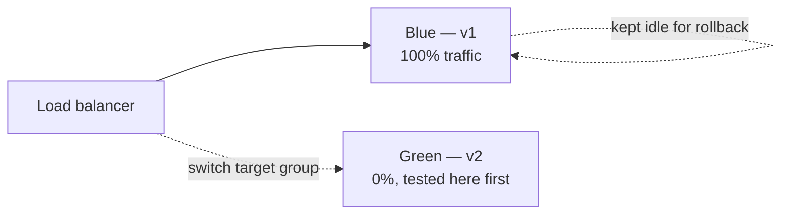
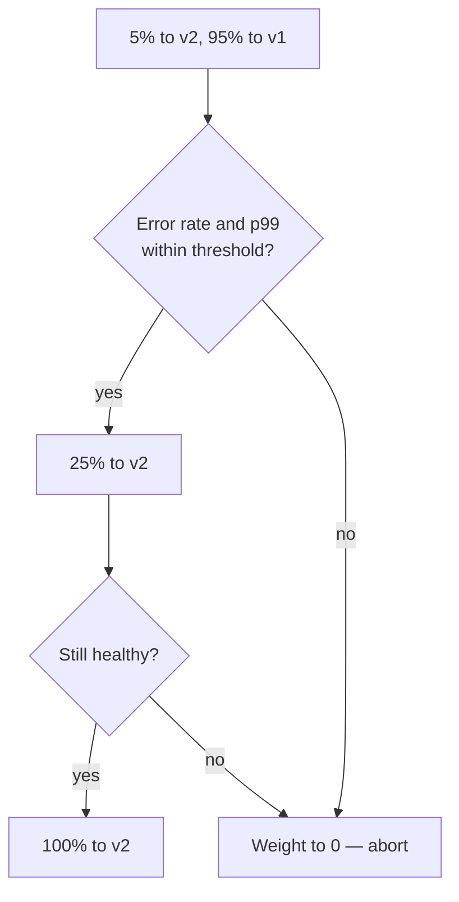
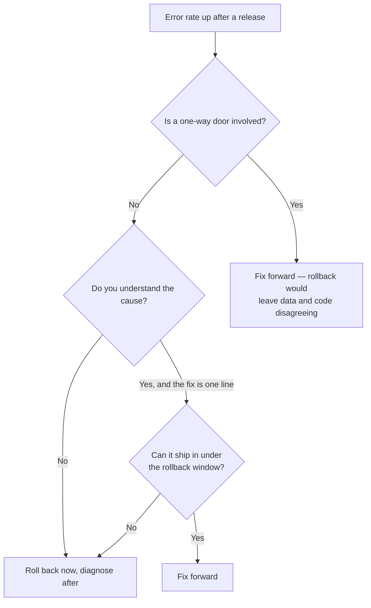

# Deployment Strategies and Rollback {#ch-deployment-strategies}

> Choose between rolling, blue/green and canary for a given service, and know in advance which parts of a release cannot be taken back.

**In this chapter:** the four strategies and their trade-offs · blue/green and canary in practice · expand/contract migrations · the one-way doors · roll back or fix forward · automating the trigger

## 💡 The Core Idea

Every deployment strategy answers the same question — **how many users see the new version before you
find out it is broken?** Recreate says all of them, after a gap. Rolling says a growing share, with no
way back except forward. Blue/green says all of them at once, but the old version is still running so
the way back is a pointer flip. Canary says five percent, measured. You are buying down blast radius
with money and time; that trade is the whole answer an interviewer is listening for.

The other half is the way back, and it is where seniority shows. Rolling back is easy. **Working out
what a rollback will not undo is the hard part.** Re-aiming a domain at the previous build takes
seconds; it does not un-run a migration, un-send an email, un-consume a queue message, or un-cache an
asset that a CDN in Sydney is serving for another eleven hours.

> The question during an incident is never "can we roll back?" — you can. It is **"what did this
> release already do that survives the rollback?"**

## How It Works

| Strategy         | Downtime  | Extra cost           | Rollback                  | Blast radius        |
| ---------------- | --------- | -------------------- | ------------------------- | ------------------- |
| **Recreate**     | ❌ Yes     | None                 | Redeploy — slow            | All users           |
| **Rolling**      | ✅ None    | Small                | Roll forward — slow        | Growing share       |
| **Blue/green**   | ✅ None    | 2× during the deploy | Flip the pointer — seconds | All users at once   |
| **Canary**       | ✅ None    | Small                | Shift weight to zero — seconds | The canary share |

**Recreate** stops everything, then starts the new version — fine for batch jobs, never for a
user-facing service. **Rolling** replaces instances a few at a time and is the default in Kubernetes
and ECS: no extra infrastructure, but both versions serve traffic during the roll, so the API must be
backward compatible and rollback means another slow roll.

```yaml
spec:
  replicas: 4
  strategy:
    type: RollingUpdate
    rollingUpdate:
      maxSurge: 1 # one extra pod above replicas during the roll
      maxUnavailable: 0 # never drop below 4 healthy pods
```

⚠️ `maxUnavailable: 0` is the setting people forget. The default of 25% removes a quarter of your
capacity mid-deploy, and at peak traffic that is how a deploy turns into an incident. A readiness probe
is equally non-optional: without one, traffic reaches a pod the moment the container starts rather than
when the application can serve it.

## Blue/Green

Run two complete environments and switch all traffic at once.



**One version serves traffic at a time; the other is the rollback.**

The switch itself is one line of configuration wherever it lives: a load balancer listener's target
group, a pair of weighted DNS records flipped 0/100, an ECS task set, or a function alias re-pointed.

Instant rollback is the reason to choose it — you flip the pointer back to an environment that is still
warm. The costs are real: double infrastructure during the deploy, and every user moves at once, so a
subtle bug reaches 100% of traffic immediately. Stateful components — the database, the session store,
the cache — are shared and cannot be duplicated, which is where blue/green gets hard.

## Canary

Send a small share of traffic to the new version, measure, then increase.



**The gate between each step is what makes it a canary rather than a slow rolling update.**

Canary has the smallest blast radius and validates against real production traffic, which no staging
environment does. It is also the slowest strategy, and it needs metrics good enough to decide on —
error rate, p99 latency, saturation, and at least one business metric such as checkout completion.

> ⚠️ A canary with no automated analysis is a slow rolling update with extra steps. The value is in
> aborting automatically, because the failure usually appears after everyone has stopped watching the
> dashboard.

**Feature flags are the fifth option.** The strategies above move **code** between instances; a flag
controls **behaviour** per user, inside code already deployed everywhere.

|                     | Canary deploy            | Feature flag                     |
| ------------------- | ------------------------ | -------------------------------- |
| **Unit of control** | Server or instance       | User or request                  |
| **Rollback**        | Shift traffic            | Config change, seconds           |
| **Targeting**       | Random share of traffic  | Specific users, regions, plans   |

✅ Use both. The canary validates the **build** — no memory leak, no dependency breakage, no latency
regression. The flag validates the **feature**. See [Chapter ?? — Feature Flags](#ch-feature-flags).

## Expand/Contract — The Real Hard Part

Every zero-downtime strategy breaks if the schema change is not backward compatible, because both
versions run at once. This is also the mechanism that keeps a rollback available.

❌ **Breaking — the old version crashes the moment this applies:**

```sql
ALTER TABLE users RENAME COLUMN email TO email_address;
```

✅ **Expand/contract, four separate releases:** add `email_address` and keep `email`, with code that
writes both and reads the old one; backfill existing rows in batches; deploy code that reads the new
column; drop `email` in a later release, once the rollback window has closed.

| Change                     | Safe?         | Approach                                                        |
| -------------------------- | ------------- | --------------------------------------------------------------- |
| Add a nullable column       | ✅ Yes         | Deploy directly                                                  |
| Add a column with a default | Conditional   | Locks large tables — add nullable, backfill in batches            |
| Rename a column             | ❌ No          | Expand/contract                                                  |
| Drop a column               | ❌ No          | Stop using it, drop a release later                              |
| Add an index                | Conditional   | Locks the table — use `CREATE INDEX CONCURRENTLY` in Postgres     |
| Narrow a type               | ❌ No          | Expand/contract                                                  |

> **The rule:** the currently deployed release must work against both the old and the new schema. If it
> does not, you cannot roll back — and a strategy without a rollback path is not a strategy.

⚠️ A migration that runs automatically on deploy couples the two together. Run migrations as a
separate, explicitly triggered step so the code can move back without the schema moving with it.

## The One-Way Doors

A one-way door is a change a code rollback does not reverse. Name them before the release, not during
the incident.

| Change                              | Survives rollback?                       | What to do instead                          |
| ----------------------------------- | ---------------------------------------- | ------------------------------------------- |
| Dropped column or table              | ❌ Data is gone                            | Expand/contract — drop a release later       |
| Narrowed a column type               | ❌ Truncated values stay truncated         | Add a new column, migrate, drop later        |
| Message consumed from a queue         | ❌ Already acknowledged                    | Dead-letter queue plus replay                |
| Email or webhook sent                 | ❌ It left the building                    | Idempotency keys, and a send gate behind a flag |
| Third-party record created            | ❌ Exists in their system                  | Idempotency keys so a retry does not duplicate |
| Cached asset with a long `max-age`    | ⚠️ Served until it expires                | Content-hashed filenames; short `s-maxage` on HTML |

**Rollback speed is a property of the deployment model, not of the incident response.** You cannot add
it while the pager is going off. A pointer flip, a target-group switch and a flag toggle are all
seconds; re-deploying a previous image tag is minutes; a migration has no automatic reverse at all.

## Roll Back or Fix Forward

Both are legitimate. Choosing badly under pressure is what turns a ten-minute incident into a two-hour
one.



**Decision path during an incident — the default branch is roll back.**

✅ **Roll back first, diagnose second.** Debugging in production while users are failing is a choice to
extend the outage. The bad deployment is immutable and still on its own URL — you can reproduce it
afterwards.

## Automating the Trigger

A rollback that waits for a human to notice has a floor of several minutes. Wire the trigger to the
metrics you already collect.

```typescript
interface Slo {
  metric: "error_rate" | "p99_latency_ms" | "checkout_success_rate";
  /** Compared against the previous release, not an absolute number. */
  maxRegression: number;
  /** Long enough to be more than noise. */
  windowMinutes: number;
}

// The gate a deployment must clear before it is left in place.
export const releaseGate: Slo[] = [
  { metric: "error_rate", maxRegression: 0.001, windowMinutes: 10 },
  { metric: "p99_latency_ms", maxRegression: 50, windowMinutes: 10 },
  { metric: "checkout_success_rate", maxRegression: -0.02, windowMinutes: 30 },
];
```

Three things make this work, and all three are commonly missed:

- **Compare against the previous release, not a fixed threshold.** Absolute numbers drift with traffic
  and produce alerts nobody trusts.
- **Include one business metric.** A service can be technically healthy while conversion falls off a
  cliff, and only the business metric catches a bad redirect or a broken button.
- **Make the window long enough to be significant and short enough to matter.** Ten minutes on error
  rate, longer on anything with a slow signal.

## When to Use It

| Situation                            | Choose                     | Why                                          |
| ------------------------------------ | -------------------------- | -------------------------------------------- |
| Internal tool, downtime acceptable    | Recreate                   | Simplest and cheapest                         |
| Standard stateless service            | Rolling                    | Built in, no extra infrastructure              |
| Rollback speed matters most           | Blue/green                 | The old environment is still running           |
| High traffic, high-risk change        | Canary                     | Smallest blast radius, measured                |
| Risky change to existing logic        | Feature flag plus canary   | Per-user control on top of a safe build        |

## Common Mistakes

❌ **Choosing a strategy without checking what the database is doing.** Blue/green with a breaking
migration is not zero downtime; it is downtime with two environments.
✅ Sequence the migration first, then pick the strategy.

❌ **A canary promoted by someone watching a graph.** Attention moves on before the failure shows up.
✅ Define thresholds relative to the baseline version and wire the promotion and the abort to them.

❌ **The rollback path has never been run.** The previous artefact was garbage-collected, or the
migration is irreversible, and you find out during the incident.
✅ Roll back deliberately once a quarter, in working hours, and time it.

❌ **Rolling back the application and leaving the migration applied.**
✅ Treat schema and code as one release with two reversible halves. If the schema half is not
reversible, say so in the pull request before it merges.

❌ **Measuring time-to-restore from "engineer starts fixing".**
✅ Measure from the first affected request. Detection is usually the larger half, which is why alerting
matters as much as the rollback.

## 🔑 Key Takeaways

- Every strategy trades cost and complexity for a smaller blast radius; name the trade, not the definition.
- Blue/green buys instant rollback with double infrastructure; canary buys a small blast radius with time.
- A canary without automated metric analysis is just a slow rolling update.
- A rollback restores your code, not the side effects it already caused — name the one-way doors first.
- Every deployed version must work against both the old and new schema, or you have no rollback at all.

## Interview Questions

**Q: Explain blue/green versus canary.**

Blue/green runs two complete environments and switches all traffic at once, usually by changing a load
balancer target group or a DNS weight. Its benefit is instant rollback, because the old environment is
still running. Its costs are double infrastructure during the deploy and exposing every user to the new
version at the same moment. Canary shifts a small percentage of traffic to the new version, measures
error rate and latency, then increases. Its benefit is the small blast radius; its costs are time and a
dependency on metrics good enough to decide on automatically.

**Q: Your deploy went out ten minutes ago and errors are climbing. Walk me through what you do.**

Roll back first, unless the release included a schema change that old code cannot read. Re-pointing at
the previous deployment takes seconds and the bad build is still on its own URL to debug against, so
nothing is lost by reversing before understanding. Then check what the release did that the rollback
does not undo — migrations applied, queue messages consumed, emails sent, third-party records created —
because those are the actual incident. Diagnosis comes after users stop failing.

**Q: How do you do a zero-downtime deployment when the change includes a schema migration?**

Expand and contract, across separate releases. First the additive change alone — a new nullable column
— which the running version ignores. Then code that writes both locations and still reads the old one,
with a batched backfill. Then code that reads the new location. Only in a later release, once the
rollback window has closed, drop the old column. The invariant that makes it work is that every
deployed version functions against both schemas.

**Q: What is the difference between a canary deployment and a feature flag?**

A canary controls which **instances** serve traffic, so a share of requests reaches servers running the
new build. A flag controls which **users** see new behaviour, evaluated per request in code already
deployed everywhere. The canary validates the build — no memory leak, no dependency breakage, no
latency regression. The flag validates the feature and allows precise targeting. Flags also roll back
faster, because turning one off is a configuration change rather than a deployment.

**Q: When would you deliberately choose the strategy with the larger blast radius?**

When rollback speed matters more than exposure, which is the blue/green case: a change you are
confident in but must be able to undo in seconds, such as a release during a retail peak. Canary would
spread that same risk over an hour, and an hour of a half-migrated fleet is worse than a minute of a
clean one you can reverse instantly. The other case is a change that cannot be partially deployed at
all — a protocol or serialisation change where two versions in the fleet is itself the failure mode.

## What to Read Next

- [Chapter ?? — Feature Flags](#ch-feature-flags) — the rollback that needs no deployment at all
- [Chapter ?? — Platform and Edge Deployments](#ch-platform-deploys) — the artefact model the pointer flip depends on
- [Chapter ?? — Alerting and On-Call](#ch-alerting) — the signal that tells you a rollback is needed
