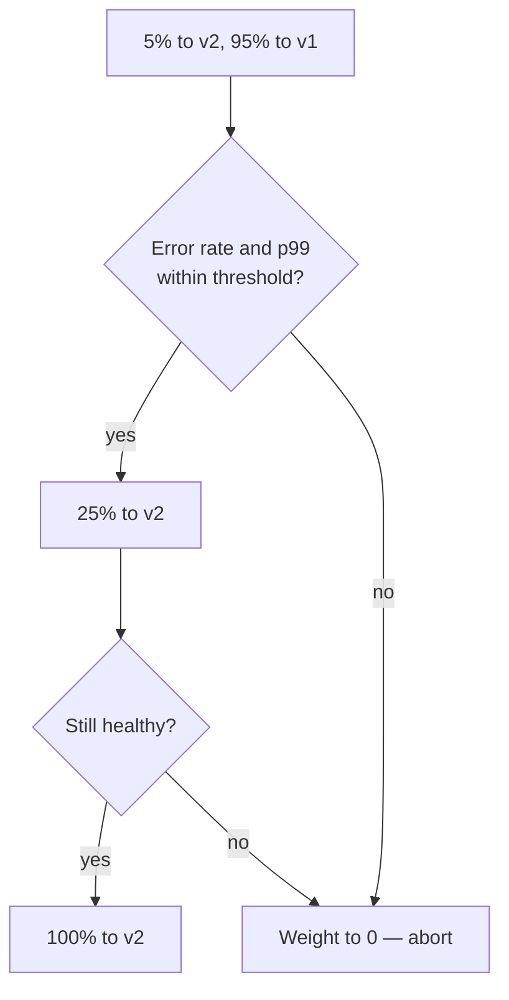

# Deployment Strategies, Rollback and Feature Flags {#ch-deployment-strategies}

> Choose between rolling, blue/green, canary and a feature flag for a release, and know in advance which parts of it cannot be taken back.

**In this chapter:** rolling, blue/green and canary and what each costs · deploy versus release with feature flags · flag kinds and flag debt · expand/contract and the one-way doors · roll back or fix forward

## 💡 The Core Idea

Every deployment strategy answers one question: **how many users see the new version before you find
out it is broken?** Rolling says a growing share. Blue/green says all of them at once, but the old
version still runs, so the way back is a pointer flip. Canary says five percent, measured. You buy a
smaller blast radius with money and time. That trade is the answer an interviewer wants.

A feature flag answers a different question. The strategies move **code** between servers. A flag
decides **behaviour** per user, inside code that is already deployed everywhere. That separates
**deploying**, an engineering event, from **releasing**, a product one.

The other half is the way back, and it is where seniority shows. Rolling back is easy. **Knowing what a
rollback will not undo is the hard part.** Re-aiming a domain at the previous build takes seconds. It
does not un-run a migration, un-send an email or un-consume a queue message.

## How It Works

| Strategy         | Downtime  | Extra cost           | Rollback                       | Blast radius      |
| ---------------- | --------- | -------------------- | ------------------------------ | ----------------- |
| **Recreate**     | ❌ Yes     | None                 | Redeploy — slow                 | All users         |
| **Rolling**      | ✅ None    | Small                | Roll forward — slow             | Growing share     |
| **Blue/green**   | ✅ None    | 2× during the deploy | Flip the pointer — seconds      | All users at once |
| **Canary**       | ✅ None    | Small                | Shift weight to zero — seconds  | The canary share  |
| **Feature flag** | ✅ None    | A flag service       | Config change — seconds         | Chosen users      |

**Recreate** stops everything, then starts the new version. It suits batch jobs, never a user-facing
service. **Rolling** replaces instances a few at a time and is the default in Kubernetes and ECS. It
needs no extra infrastructure. But both versions serve traffic during the roll, so the API must be
backward compatible, and rollback means another slow roll.

**A rolling update that never drops below full capacity:**

```yaml
spec:
  replicas: 4
  strategy:
    type: RollingUpdate
    rollingUpdate:
      maxSurge: 1 # one extra pod above replicas during the roll
      maxUnavailable: 0 # never drop below 4 healthy pods
```

People forget `maxUnavailable: 0`. The default of 25% removes a quarter of your capacity mid-deploy.
At peak traffic, that turns a deploy into an incident. A readiness probe is just as necessary. Without
one, traffic reaches a pod when the container starts, not when the application can serve.

### Blue/green

Run two complete environments and switch all traffic at once. One serves traffic; the other is the
rollback. The switch is one line of configuration: a load balancer's target group, weighted DNS records flipped
0/100, or a function alias re-pointed. Instant rollback is the reason to choose it, because the old
environment is still warm. The costs are double infrastructure during the deploy, and every user moves
at once, so a subtle bug reaches 100% of traffic immediately. The database, session store and cache
are shared and cannot be duplicated. That is where blue/green gets hard.

### Canary

Send a small share of traffic to the new version, measure, then increase.

**The gate between each step is what makes it a canary rather than a slow rolling update:**



Canary has the smallest blast radius and tests against real production traffic, which no staging
environment does. It is also the slowest strategy. It needs metrics good enough to decide on: error
rate, p99 latency, saturation, and one business metric such as checkout completion.

> ⚠️ A canary with no automated analysis is a slow rolling update with extra steps. Compare each step
> against the previous release and abort automatically, because the failure appears after people stop watching.

## When to Use It

| Situation                               | Choose                   | Why                                            |
| --------------------------------------- | ------------------------ | ---------------------------------------------- |
| Internal tool, downtime acceptable       | Recreate                 | Simplest and cheapest                           |
| Standard stateless service               | Rolling                  | Built in, no extra infrastructure               |
| Rollback speed matters most              | Blue/green               | The old environment is still running            |
| High traffic, high-risk change           | Canary                   | Smallest blast radius, measured                 |
| A feature spanning several sprints       | Release flag on trunk    | No long-lived branch and no painful merge       |
| Risky change to existing logic           | Feature flag plus canary | Per-user control on top of a safe build         |
| A dependency that can fail slowly        | Kill switch              | The fastest mitigation, with no deploy          |
| A one-line copy change                   | ❌ No flag                | The flag costs more than the change             |

## Feature Flags — Deploy Versus Release

A feature flag is **a runtime switch that decides which code path a request takes.** Both paths are
deployed on every server, and the flag picks one. An unfinished feature can sit in `main` for three
weeks with no long-lived branch. That is what makes trunk-based development workable. A bad feature
can be switched off in seconds by someone who is not on the engineering rota.

**A flag evaluation with a safe default:**

```typescript
interface EvaluationContext {
  userId: string;
  plan: "free" | "pro" | "enterprise";
}

interface FlagClient {
  /** Never throws. On any failure it returns the supplied default. */
  boolean(key: string, defaultValue: boolean, ctx: EvaluationContext): boolean;
}

function checkoutFlow(client: FlagClient, ctx: EvaluationContext): CheckoutFlow {
  // The default is the safe path. If the flag service is unreachable, users get the old flow.
  const useNewFlow: boolean = client.boolean("checkout-rewrite", false, ctx);
  return useNewFlow ? newCheckout(ctx) : legacyCheckout(ctx);
}
```

Two details carry most of the value. **The default is the safe path, and evaluation never throws**,
so a flag service outage costs a feature, not the site. **Evaluation takes a context**, so the flag can
target staff first, roll out by percentage, or run an experiment.

**The flag is the rollback that needs no deploy.** Turning it off is a configuration change, measured
in seconds. Use it with a canary, not instead of one. The canary validates the **build**: no memory
leak, no broken dependency, no latency regression. The flag validates the **feature**. Evaluate it on
the server, so the HTML arrives correct; in the browser, the page flips and scores as layout shift.

> ⚠️ A cached page plus a per-user flag is a correctness bug. Either put the flag value in the cache
> key, or do not cache the response at all.

### The four kinds of flag

They look the same in code and have very different lifetimes. Confusing them is how flag debt starts.

| Kind            | Lives for              | Who owns it     | Example                                         |
| --------------- | ---------------------- | --------------- | ----------------------------------------------- |
| **Release**     | Days to weeks          | Engineering     | Hide a half-built checkout until it is done      |
| **Kill switch** | Permanently            | On-call         | Turn off recommendations when their service is slow |
| **Experiment**  | The length of the test | Product or data | A/B test two pricing pages                       |
| **Permission**  | Permanently            | Product         | Enterprise-only audit log                        |

**Only release flags are debt.** A kill switch is meant to live forever. A permission flag is really
an entitlement and belongs in the domain model. Treat them as clean-up targets and you delete the
switch you wanted at 3 a.m.

### Flag debt

The problem is never the first flag. It is the fortieth, which nobody can name.

**Nested flags multiply paths; decide once instead:**

```typescript
// ❌ Nested release flags. Four code paths, two of which nobody has ever run.
if (flags.newCheckout) {
  if (flags.newPaymentProvider) { /* ... */ } else { /* ... */ }
} else {
  if (flags.newPaymentProvider) { /* ... */ } else { /* ... */ }
}

// ✅ One decision, made once, at the edge of the module.
type CheckoutVariant = "legacy" | "rewrite";
const variant: CheckoutVariant = flags.newCheckout ? "rewrite" : "legacy";
```

- **Give every release flag an expiry date when you create it**, and fail the build when it passes.
  A warning gets ignored; a red build does not.
- **Check the flag once per request, at the top of the handler**, so two halves of a request cannot disagree.
- **Remove the flag in the same sprint that ships the feature**, not in a backlog ticket.

> ⚠️ **Moving target:** flag vendors and their SDKs change shape often, and OpenFeature
> is the vendor-neutral interface most of them now implement. The durable principle: **wrap the vendor
> behind your own narrow interface**, so swapping providers is one file and tests can pass a plain object.

## Expand/Contract — The Real Hard Part

Every zero-downtime strategy breaks if the schema change is not backward compatible, because both
versions run at once. Expand/contract is also what keeps a rollback available.

❌ **Breaking — the old version crashes the moment this applies:**

```sql
ALTER TABLE users RENAME COLUMN email TO email_address;
```

✅ **Expand/contract, over four releases:** add `email_address` and keep `email`, with code that
writes both and reads the old one. Backfill existing rows in batches. Deploy code that reads the new
column. Drop `email` in a later release, once the rollback window has closed. A nullable column is
safe to add directly; a new index locks the table unless you use `CREATE INDEX CONCURRENTLY` in Postgres.

**The rule:** the deployed release must work against both the old and the new schema, or you cannot
roll back. Run migrations as a separate, explicit step, not automatically on deploy, so the
code can move back without the schema moving with it. A flag cannot help here: it switches which code
runs, but it cannot restore a dropped column.

## The One-Way Doors

A one-way door is a change a code rollback does not reverse. Name them before the release.

| Change                         | Survives rollback?              | What to do instead                               |
| ------------------------------ | ------------------------------- | ------------------------------------------------ |
| Dropped column or table         | ❌ Data is gone                  | Expand/contract — drop a release later            |
| Message consumed from a queue   | ❌ Already acknowledged          | Dead-letter queue plus replay                     |
| Email or webhook sent           | ❌ It has left                   | Idempotency keys, and a send gate behind a flag   |
| Third-party record created      | ❌ Exists in their system        | Idempotency keys so a retry does not duplicate    |
| Cached asset, long `max-age`    | Served until it expires         | Content-hashed filenames; short `s-maxage` on HTML |

**Rollback speed belongs to the deployment model, not the incident response.** You cannot add it while
the pager is going off. A pointer flip, a target-group switch and a flag toggle take seconds.
Re-deploying an old image tag takes minutes. A migration has no automatic reverse at all.

## Roll Back or Fix Forward

Both are legitimate. Fix forward when a one-way door is involved, because a rollback would leave data
and code disagreeing, or when you know the cause and the fix ships faster. Otherwise, roll back.
✅ **Roll back first, diagnose second.** The bad build is immutable and still on its own URL, so you can
reproduce it afterwards.

## Common Mistakes

❌ **Choosing a strategy without checking what the database is doing.** Blue/green with a breaking
migration is not zero downtime. It is downtime with two environments.
✅ Sequence the migration first, then pick the strategy.

❌ **The flag's default value is the new behaviour.** The flag service times out and every user gets
the unreleased path.
✅ The default is always the safe, current behaviour.

❌ **Tests run with the default flag values only.**
✅ Test both paths of every live release flag, or you ship an untested branch to whoever it turns on.

## 🔑 Key Takeaways

- Every strategy trades cost and complexity for a smaller blast radius, so name the trade rather than the definition.
- A canary without automated metric analysis is just a slow rolling update.
- A feature flag separates deploying code from releasing a feature, and turning it off is a rollback that needs no deploy.
- Only release flags are debt; give each one an expiry date, and never clean up kill switches or permission flags.
- A rollback restores your code, not its side effects, so every release must work against the old and new schema.

## Interview Questions

**Q: Explain blue/green versus canary.**

Blue/green runs two complete environments and switches all traffic at once, usually through a load
balancer target group or a DNS weight. It buys instant rollback, at the cost of double infrastructure
and every user meeting the new version together. Canary shifts a small share of traffic, measures error
rate and latency, then increases. It buys a small blast radius, at the cost of time and metrics good
enough to decide on automatically.

**Q: Your deploy went out ten minutes ago and errors are climbing. Walk me through what you do.**

Roll back first, unless the release included a schema change old code cannot read. Re-pointing at the
previous build takes seconds and the bad build stays available to debug. Then check what the release
did that the rollback does not undo: migrations, consumed messages, sent emails, third-party records.
Those are the real incident. Diagnosis comes after users stop failing.

**Q: How do you do a zero-downtime deployment when the change includes a schema migration?**

Expand and contract, across separate releases. First the additive change alone, which the running
version ignores. Then code that writes both places and reads the old one, with a batched backfill. Then
code that reads the new place, and only later a release that drops the old column. Every deployed
version must work against both schemas.

**Q: What is the difference between a canary deployment and a feature flag?**

A canary controls which **instances** serve traffic, so it validates the build: no memory leak, no
latency regression. A flag controls which **users** see new behaviour, evaluated per request in code
already deployed everywhere, so it validates the feature and allows precise targeting. Flags roll back
faster, because turning one off is a configuration change. They are complementary, not alternatives.

**Q: When would you deliberately choose the strategy with the larger blast radius?**

When rollback speed matters more than exposure, which is the blue/green case: a change you trust but
must undo in seconds, such as a release during a retail peak. Canary would spread that risk over an
hour of a mixed fleet. The other case is a protocol or serialisation change, where two versions in the
fleet is itself the failure.

## What to Read Next

- [Chapter ?? — Platform Deploys and Preview Environments](#ch-platform-deploys) — the artefact model the pointer flip depends on
- [Chapter ?? — Metrics, Dashboards and Alerting](#ch-metrics-and-dashboards) — the signal that tells you a rollback is needed
- [Chapter ?? — Branching, Review and Repository Strategy](#ch-branching-and-review-workflow) — the trunk-based workflow that release flags make possible
