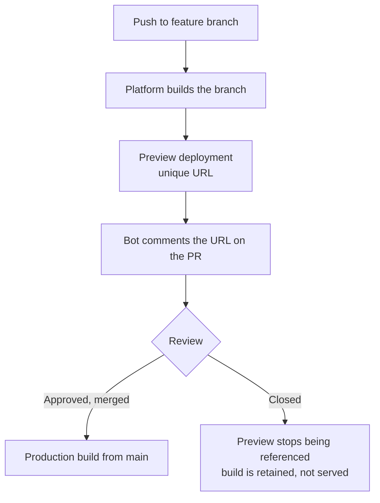

# Preview Environments {#ch-preview-environments}

> Give every pull request a real, running URL — and know which parts of it are safe to share and which are not.

**In this chapter:** why staging fails · what a preview is a copy of · the data problem · locking previews down · the cost you cannot ignore

## 💡 The Core Idea

A preview environment is **a full deployment of one branch, reachable at its own URL, thrown away when
the branch merges.** It exists because the alternative — a single shared staging environment — has a
queue. One person's half-finished migration blocks everyone else's review, and the person who broke it
is not always the person who has to debug it.

The insight that makes previews cheap is the one from the previous chapter: a deployment is just an
immutable build behind a pointer. Building a second copy costs a build, not a second environment.

## How It Works



**Every branch gets a deployment; only the production branch gets the production domain.**

Each preview build gets its own environment values, so the same code can point at a different database
or API without a code change:

```bash
# Applies to every preview deployment
vercel env add DATABASE_URL preview

# Applies only to previews built from one branch
vercel env add DATABASE_URL preview feature/checkout-rewrite
```

**Reading the deployment context in code:**

```typescript
type DeployEnv = "production" | "preview" | "development";

interface DeployContext {
  env: DeployEnv;
  branch: string | undefined;
  commit: string | undefined;
}

// Injected at build time by the platform; the names differ per provider.
export const deploy: DeployContext = {
  env: (process.env.VERCEL_ENV ?? "development") as DeployEnv,
  branch: process.env.VERCEL_GIT_COMMIT_REF,
  commit: process.env.VERCEL_GIT_COMMIT_SHA,
};

// Use it to keep analytics, payments and email out of previews.
export const isRealTraffic: boolean = deploy.env === "production";
```

> ⚠️ Guarding on `NODE_ENV === "production"` does not work here. A preview is a production **build** —
> minified, optimised, `NODE_ENV=production`. Only the platform's own environment variable tells the
> two apart.

## The Data Problem

This is where preview environments are actually hard, and where interviews go. The application copy is
free. The database copy is not.

| Strategy | What each preview gets | Good for | The catch |
| -------- | ---------------------- | -------- | --------- |
| **Shared preview database** | One database, all branches | Small teams, read-heavy apps | One branch's migration breaks every other preview |
| **Branched database** | A copy-on-write clone per branch | Anything with migrations | Needs a provider that supports branching |
| **Seeded ephemeral database** | A fresh, empty database plus a seed script | Deterministic tests | Seed data drifts from real shapes |
| **Production, read-only** | The real data, writes blocked | Debugging a data-shaped bug | ❌ Only with anonymised data and an audit trail |

✅ **Default to a branched or seeded database.** The shared one is fine right up until the first
migration, and the first migration always comes.

❌ **Never point a preview at the production database with writes enabled.** A preview is code that has
not been reviewed yet. That is the entire point of it.

**Third-party services need the same treatment:**

| Service | In production | In a preview |
| ------- | ------------- | ------------ |
| Payments | Live keys | Test-mode keys |
| Email | Real recipients | A catch-all inbox, or a logged no-op |
| Analytics | Real events | Disabled — preview traffic poisons funnels |
| Webhooks | Registered endpoint | ⚠️ Provider must support per-URL registration, or stub it |

## Locking Previews Down

A preview URL is public by default on most platforms. It is a guessable, indexable copy of your
unreleased work.

| Control | Stops | Use when |
| ------- | ----- | -------- |
| **Team-only access** | Anyone outside the organisation | Always, as the baseline |
| **Password protection** | Anyone without the shared secret | Sharing with a client or an external reviewer |
| **Bypass token** | Nothing — it *grants* access | Letting CI and E2E tests through the protection |
| **`x-robots-tag: noindex`** | Search engines | Always. A leaked preview in search results is a real incident |

**Letting CI through the protection, without disabling it:**

```typescript
// Playwright config — the token is a CI secret, never committed.
export default {
  use: {
    baseURL: process.env.PREVIEW_URL,
    extraHTTPHeaders: {
      "x-vercel-protection-bypass": process.env.PREVIEW_BYPASS_TOKEN ?? "",
    },
  },
};
```

> ⚠️ **Moving target:** header names, protection tiers and bypass mechanisms differ by platform and get
> renamed. The durable principle: **previews are private by default, and CI is granted access with a
> revocable token — never by turning the protection off.**

## When to Use It

| Situation | Choose | Why |
| --------- | ------ | --- |
| Reviewing a UI change | Preview per pull request | The reviewer clicks instead of imagining |
| Verifying a schema migration | Preview with a branched database | The migration runs against a real copy |
| A cross-team release rehearsal | One long-lived staging environment | Previews are per-branch; a rehearsal is per-release |
| Load testing | Neither — a dedicated environment | Previews share infrastructure and will mislead you |
| A change with no user-visible surface | Skip it | A preview URL for a logging refactor is noise |

Previews replace staging for *review*. They do not replace it for *rehearsal* — a release that
coordinates three services still needs one place where all three are at the candidate version.

## Common Mistakes

❌ **Every preview writes to the same database, so the review environment is broken more often than not.**
✅ Branch the database, or seed a fresh one. The cost of the fix is far below the cost of the queue.

❌ **Preview traffic in the analytics dashboard.**
✅ Gate every third-party client on the platform environment variable, not on `NODE_ENV`.

❌ **Previews never expire, and the bill grows quietly.**
✅ Delete previews on branch close, and set a retention window. The artefact is worth keeping; the
running database and the seeded storage bucket are not.

❌ **Sharing a preview link with a client and forgetting it stays live.**
✅ Password-protect it and rotate the password per release, or hand over a commit-specific URL that
will never re-point at newer, unreviewed work.

## 🔑 Key Takeaways

- A preview is a full deployment of one branch, and its value is removing the queue that a shared staging environment creates.
- A preview build is a production build, so environment detection must use the platform variable rather than `NODE_ENV`.
- The application copy is cheap and the data copy is not — branch or seed the database, never write to production.
- Previews are private by default and CI is let in with a revocable bypass token, not by disabling protection.

## Interview Questions

**Q: What does a preview environment give you that a staging environment does not?**

Isolation per branch. Staging is a shared resource with an implicit queue: one unfinished change on it
blocks everyone else's review, and diagnosing a failure means first working out whose change caused it.
Previews give each pull request its own URL built from that branch alone, so a reviewer is looking at
exactly one change. Staging still earns its place for release rehearsals that span several services,
which previews cannot model.

**Q: How do you handle the database for preview environments?**

The honest answer names the trade-off rather than one tool. A shared preview database is the cheapest
and survives until the first migration, at which point one branch's schema change breaks every other
preview. Branched databases — a copy-on-write clone per branch — solve that and are the default where
the provider supports them. A seeded ephemeral database is the most deterministic and the most likely
to drift from real data shapes. Pointing at production with writes enabled is not an option, because a
preview is unreviewed code by definition.

**Q: Why does `NODE_ENV === "production"` fail as a check inside a preview?**

Because a preview is a production build. It is minified, tree-shaken and built with `NODE_ENV` set to
production — that is the point, since a preview must behave like the real thing. The only reliable
signal is the platform's own deployment environment variable, which reports production, preview or
development independently of the build mode.

**Q: A preview URL for an unreleased feature turned up in a search result. What went wrong, and what do you change?**

Preview deployments were publicly reachable and served without a `noindex` directive, so a crawler
found the URL — usually from a link pasted into a chat tool with link previews, or from a referrer
header. The immediate fix is to enable team-level protection and add `x-robots-tag: noindex` to every
non-production deployment. The process fix is to make protection the platform default rather than a
per-project setting, and to hand external reviewers a password-protected or commit-pinned URL.

**Q: When is a preview environment not worth creating?**

When the change has no reviewable surface — a logging refactor, a dependency bump, a CI configuration
edit. Every preview costs a build, a database branch and a slot in the reviewer's attention, and a
pull request comment full of URLs nobody opens trains people to ignore all of them. Load testing is the
other case: previews share infrastructure with every other branch, so the numbers will be wrong.

## What to Read Next

- [Chapter ?? — Platform and Edge Deployments](#ch-platform-deploys) — the artefact model previews are built on
- [Chapter ?? — Feature Flags](#ch-feature-flags) — showing unfinished work to some users without a separate branch
- [Chapter ?? — Pipeline Security](#ch-cicd-security) — where the bypass token and the preview secrets come from
