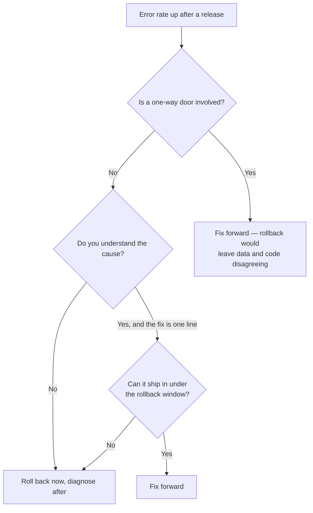

# Rollback and Recovery {#ch-rollback-and-recovery}

> Decide in under a minute whether to roll back or fix forward, and know in advance which changes cannot be undone.

**In this chapter:** rollback as a pointer move · the one-way doors · roll back or fix forward · automating the trigger · rehearsing it

## 💡 The Core Idea

Rolling back is easy. **Working out what a rollback will not undo is the hard part**, and it is the
whole of the senior signal here.

Re-aiming a domain at the previous build takes seconds. It does not un-run a migration, un-send an
email, un-consume a queue message, or un-cache an asset that a CDN in Sydney is serving for another
eleven hours. A rollback returns *your code* to a known state. Everything your code already touched
stays where it is.

So the question during an incident is never "can we roll back?" — you can. It is **"what did this
release already do that survives the rollback?"**

## How It Works

The mechanism, on any platform that keeps old builds:

```bash
# What is currently serving, and what served before it
vercel ls --prod

# Re-aim production at a known-good deployment. No rebuild, seconds not minutes.
vercel rollback https://acme-shop-7f3a91b2c-acme.vercel.app
```

| Layer | Rollback mechanism | Typical time |
| ----- | ------------------ | ------------ |
| Platform deployment | Re-point the domain at the previous build | Seconds |
| Blue/green | Switch the load balancer target group back | Seconds |
| Feature flag | Toggle off | Seconds |
| Container orchestrator | Deploy the previous image tag | Minutes |
| Database migration | ❌ Usually nothing automatic | Hours, or never |

**Fast rollback is a property of the deployment model, not of the incident response.** You cannot add
it while the pager is going off.

## The One-Way Doors

A one-way door is a change a code rollback does not reverse. Name them before the release, not during
the incident.

| Change | Survives rollback? | What to do instead |
| ------ | ------------------ | ------------------ |
| Dropped column or table | ❌ Data is gone | Expand/contract — drop a release later |
| Narrowed a column type | ❌ Truncated values stay truncated | Add a new column, migrate, drop later |
| New required column with a default | ⚠️ Old code ignores it, so usually fine | Make it nullable first |
| Message consumed from a queue | ❌ Already acknowledged | Dead-letter queue plus replay |
| Email or webhook sent | ❌ It left the building | Idempotency keys, and a send gate behind a flag |
| Cached asset with a long `max-age` | ⚠️ Served until it expires | Content-hashed filenames; short `s-maxage` on HTML |
| Third-party record created | ❌ Exists in their system | Idempotency keys so a retry does not duplicate |

**The rule that makes rollback possible:** every deployed version must work against both the old and
the new schema. If release N+1 requires a schema that release N cannot read, you have already given up
your rollback and should know that before you ship.

> ⚠️ A migration that runs automatically on deploy couples the two together. Run migrations as a
> separate, explicitly triggered step so the code can move back without the schema moving with it.

## Roll Back or Fix Forward

Both are legitimate. Choosing badly under pressure is what turns a ten-minute incident into a
two-hour one.



**Decision path during an incident — the default branch is roll back.**

| Prefer rollback when | Prefer fix-forward when |
| -------------------- | ----------------------- |
| The cause is unknown | The cause is understood and one line |
| Users are affected right now | The impact is internal or cosmetic |
| The previous version is known-good | A migration already ran that old code cannot read |
| It is out of hours and you are alone | The bad release also fixed something worse |

✅ **Roll back first, diagnose second.** Debugging in production while users are failing is a choice to
extend the outage. The deployment is immutable and still on its own URL — you can reproduce it after.

## Automating the Trigger

A rollback that waits for a human to notice has a floor of several minutes. Wire the trigger to the
metrics you already collect.

```typescript
interface Slo {
  metric: "error_rate" | "p99_latency_ms" | "checkout_success_rate";
  /** Compared against the previous release, not an absolute number. */
  maxRegression: number;
  /** Long enough to be more than noise. */
  windowMinutes: number;
}

// The gate a deployment must clear before it is left in place.
export const releaseGate: Slo[] = [
  { metric: "error_rate", maxRegression: 0.001, windowMinutes: 10 },
  { metric: "p99_latency_ms", maxRegression: 50, windowMinutes: 10 },
  { metric: "checkout_success_rate", maxRegression: -0.02, windowMinutes: 30 },
];
```

Three things make this work, and all three are commonly missed:

- **Compare against the previous release, not a fixed threshold.** Absolute numbers drift with traffic
  and produce alerts nobody trusts.
- **Include one business metric.** A service can be technically healthy while conversion falls off a
  cliff, and only the business metric catches a bad redirect or a broken button.
- **Make the window long enough to be significant and short enough to matter.** Ten minutes on error
  rate, longer on anything with a slow signal.

## Common Mistakes

❌ **The rollback path has never been run.** The previous artefact was garbage-collected, or the
migration is irreversible, and you find out during the incident.
✅ Roll back deliberately once a quarter, in working hours, and time it.

❌ **Measuring MTTR from "engineer starts fixing".**
✅ Measure from the first affected request. Detection is usually the larger half, which is why the
alerting matters as much as the rollback.

❌ **Rolling back the application and leaving the migration applied.**
✅ Treat schema and code as one release with two reversible halves. If the schema half is not
reversible, say so in the pull request before it merges.

❌ **Rollback as a shameful outcome.**
✅ It is the cheap option working as designed. A team that hesitates to roll back ships more slowly,
because every release carries more fear.

## 🔑 Key Takeaways

- A rollback restores your code, not the side effects your code already caused — name the one-way doors before the release.
- Every deployed version must work against both the old and new schema, or you have no rollback.
- Roll back first and diagnose afterwards; the immutable deployment is still there to debug against.
- Automate the trigger on regression against the previous release, including at least one business metric.
- A rollback path that has never been rehearsed is a plan, not a capability.

## Interview Questions

**Q: Your deploy went out ten minutes ago and errors are climbing. Walk me through what you do.**

Roll back first, unless the release included a schema change that old code cannot read. Re-pointing at
the previous deployment takes seconds and the bad build is still on its own URL to debug against, so
nothing is lost by reversing before understanding. Then check what the release did that the rollback
does not undo — migrations applied, queue messages consumed, emails sent, third-party records created
— because those are the actual incident. Diagnosis comes after users stop failing.

**Q: What is a one-way door, and give an example that catches teams out?**

A change a code rollback does not reverse. The classic is dropping a column: the schema migration runs
on deploy, the release goes bad, the code rolls back, and now the previous version queries a column
that no longer exists — so the rollback made things worse. Sent emails and consumed queue messages are
the same category and are easier to forget, because nothing in the deployment tooling shows them.

**Q: How do you make a schema change that keeps rollback possible?**

Expand and contract, across separate releases. First deploy the additive change alone — a new nullable
column — which the running version ignores. Then deploy code that writes both old and new while still
reading old, and backfill in batches. Then deploy code that reads new. Only in a later release, once
the rollback window has closed, drop the old column. The invariant is that every deployed version
works against both schemas, which is what gives you a version to roll back to.

**Q: When would you fix forward instead of rolling back?**

When rolling back is the more dangerous move. If a migration has already run that the previous version
cannot read, the old build will fail worse than the new one. If the cause is understood and the fix is
a single line that can ship faster than a rollback would take effect, forward is cheaper. And if the
bad release also fixed something more serious, going back reintroduces it. Outside those cases, the
default is to roll back.

**Q: How would you know a rollback is needed without someone watching a dashboard?**

Gate the release on metrics compared against the previous version rather than against fixed thresholds
— error rate, p99 latency, and at least one business metric such as checkout completion — evaluated
over a window long enough to be more than noise. Wire that gate to abort the rollout automatically.
The business metric is the one that matters most, because a broken checkout button produces a perfectly
healthy error rate.

## What to Read Next

- [Chapter ?? — Deployment Strategies](#ch-deployment-strategies) — blue/green and canary, the strategies that make the rollback cheap
- [Chapter ?? — Feature Flags](#ch-feature-flags) — the rollback that needs no deployment at all
- [Chapter ?? — Alerting](#ch-alerting) — the signal that tells you a rollback is needed
