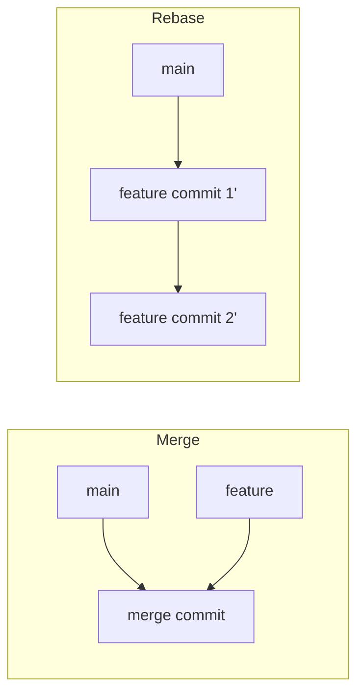

# Git Fundamentals {#ch-git-fundamentals}

> Predict what a Git command will do to your history before you run it, and undo any of them without losing work.

**In this chapter:** commits as snapshots · the three trees · merge versus rebase · remotes · the four ways to undo

## 💡 The Core Idea

A commit is a **snapshot of the whole project**, plus a pointer to the commit that came before it. It is
not a diff. Git shows you diffs because they are easier to read, but it stores complete trees of files
and works out the difference on demand. Chain those snapshots by their parent pointers and you have a
graph. Every Git command you will ever run is a way of adding to that graph, moving a label around it,
or reading it back.

A branch is one of those labels — a file containing forty hex characters. That is the whole
implementation. Creating a branch is cheap because there is nothing to copy, and deleting one throws
away a name rather than any work.

> Git almost never deletes a commit. It moves the labels that point at commits. Internalise that and
> recovery stops being frightening.

## How It Works

Three places hold a version of your files at any moment. Git calls them the **three trees**.

| Tree                | Also called      | What it holds                                    |
| ------------------- | ---------------- | ------------------------------------------------ |
| **Working tree**    | working directory | The files you are editing, right now             |
| **Index**           | staging area     | The exact content your next commit will contain  |
| **HEAD**            | current commit   | The snapshot at the tip of your current branch   |

```text
Working tree  ──git add──▶  Index  ──git commit──▶  HEAD  ──git push──▶  remote
```

The index is the part most people skip, and it is the part that makes Git worth learning. It lets you
commit a subset of what you changed, so one commit means one logical change even when your afternoon
did not.

**Stage by intent, not by directory:**

```bash
git add -p                    # Walk each hunk; choose what belongs in this commit
git diff                      # What is still unstaged
git diff --staged             # Exactly what the next commit will contain
git restore --staged file.ts  # Take something back out of the index
```

⚠️ `git commit --amend` rewrites the last commit. Safe before you push, a history rewrite for everyone
else afterwards.

### Merge and Rebase Do Different Things to the Graph

Both integrate one branch into another. They differ in what the graph looks like when they finish.



**Merge joins two lines of history; rebase replays your commits on top of a new base.**

| Aspect                  | Merge                          | Rebase                                  |
| ----------------------- | ------------------------------ | --------------------------------------- |
| **Commits created**     | One extra merge commit         | New copies of every commit replayed     |
| **Original commits**    | Kept exactly as they were      | Replaced — new hashes, new parents      |
| **History shape**       | Branching, shows what happened | Linear, shows a tidy story              |
| **Safe on shared work** | ✅ Yes                         | ❌ No — the old commits vanish for others |

Rebase is a rewrite. That is fine on a branch only you have, and destructive on a branch a colleague
has already pulled, because their copy of those commits no longer exists upstream.

> Rebase your own branch onto `main` as often as you like. Never rebase `main` itself.

**Resolving a conflict:**

```bash
git merge feature-xyz         # Git stops and marks the conflicting files
git diff                      # Only conflicted hunks are shown
# Edit the file: keep what belongs, delete the <<<<<<< ======= >>>>>>> markers
git add resolved-file.ts      # Staging the file is how you say "resolved"
git commit                    # Or: git merge --abort to get back to before
```

A conflict is not an error. It is Git saying two commits changed the same lines and it will not guess.

### Remotes

A remote-tracking branch such as `origin/main` is a local label recording where the remote was the last
time you spoke to it. It moves on `fetch`, never on its own.

| Command                    | What it does                                 | When to reach for it              |
| -------------------------- | -------------------------------------------- | --------------------------------- |
| `git fetch`                | Updates `origin/*`, touches nothing else     | You want to look before you leap  |
| `git pull`                 | `fetch` then `merge` into your branch         | You trust what is coming          |
| `git pull --rebase`        | `fetch` then replay your commits on top       | You want no merge commits         |
| `git push --force-with-lease` | Overwrites the remote **only if** it matches what you last fetched | Rewriting your own pushed branch |

⚠️ `--force-with-lease` refuses the push if someone else has pushed since your last fetch. Plain
`--force` does not check, which is how colleagues lose commits. Never use either on a shared branch.

## When to Use It

Four tools undo four different things. Picking the wrong one is how work disappears.

| You want to                          | Use                        | Rewrites history? |
| ------------------------------------ | -------------------------- | ----------------- |
| Throw away edits to a file           | `git restore file.ts`      | No                |
| Take a file back out of the index    | `git restore --staged file.ts` | No            |
| Undo commits nobody has pulled       | `git reset`                | ⚠️ Yes            |
| Undo a commit that is already pushed | `git revert`               | No — adds a commit |

**The three reset modes, which differ only in how far the reset reaches:**

| Mode               | Moves HEAD | Index     | Working tree | Use it to                        |
| ------------------ | ---------- | --------- | ------------ | -------------------------------- |
| `--soft`           | Yes        | Untouched | Untouched    | Recommit the same work differently |
| `--mixed` (default) | Yes       | Reset     | Untouched    | Unstage everything, keep the code |
| `--hard`           | Yes        | Reset     | Reset        | Discard the code as well          |

`git reset --hard` is the only one of the three that destroys uncommitted work, and uncommitted work is
the one thing Git cannot get back for you.

```bash
git reset --soft HEAD~1       # Last commit's changes are staged again
git revert HEAD               # A new commit that is the inverse of the last one
```

**Stashing, for the interruption you did not plan:**

```bash
git stash                     # Park working tree and index changes
git switch hotfix && git switch -   # Deal with the fire, come back
git stash pop                 # Reapply and drop the stash
```

**Annotated tags, for releases:**

```bash
git tag -a v1.2.0 -m "Release 1.2.0"   # Records author, date and message
git push origin v1.2.0
```

A lightweight tag (`git tag v1.2.0`) is just a label. Use annotated tags for anything a pipeline or a
release note will refer to later, so the tag itself says who cut it and when.

## Common Mistakes

**❌ Wrong — reaching for `reset` on pushed commits:**

```bash
git reset --hard HEAD~2
git push --force              # Everyone who pulled now has commits that no longer exist upstream
```

**✅ Right — undo forwards, not backwards:**

```bash
git revert HEAD~1..HEAD       # Two new commits that reverse the two bad ones
git push                      # No force, nobody's clone breaks
```

Rewriting shared history moves the cost onto every other clone. Reverting keeps the mistake visible,
which is honest and costs nothing.

**❌ Wrong — one commit per work session:**

```bash
git add .
git commit -m "fixed login and added tests and updated docs"
```

**✅ Right — one commit per logical change:**

```bash
git add -p                    # Stage only the login fix
git commit -m "fix(auth): stop redirect loop on expired session"
git add src/auth/login.test.ts
git commit -m "test(auth): cover expired session redirect"
```

The second version can be reverted, cherry-picked, and found by `git bisect` on its own. The first
cannot, because it is four changes wearing one hash.

## 🔑 Key Takeaways

- A commit is a full snapshot plus a parent pointer; a branch is a file holding one commit hash.
- The index exists so that one commit can mean one logical change — `git add -p` is how you use it.
- Merge preserves the commits it integrates; rebase replaces them with new ones, which is why it is
  unsafe on anything shared.
- `reset` for history nobody has seen, `revert` for history that has been pushed.
- `git reset --hard` is the one command that can destroy work Git cannot recover, because uncommitted
  changes were never in the object database.

## Interview Questions

**Q: What is the difference between `git fetch` and `git pull`?**

`fetch` updates your remote-tracking branches and stops there, so nothing in your working tree changes.
`pull` is `fetch` followed by a merge — or a rebase with `--rebase` — into the branch you are on. Fetch
first when you want to read `git log origin/main` before deciding how to integrate.

**Q: Someone force-pushed over your branch. What do you do?**

Nothing is gone yet. The commits are still in the local object database and the reflog still points at
them, so recover the tip from `git reflog` and push it back. Then talk about `--force-with-lease`, which
would have refused the push because the remote no longer matched what they last fetched.

**Q: What do the three `git reset` modes actually change?**

All three move the branch label. `--soft` stops there, so the work stays staged; `--mixed` also clears
the index, so the work is unstaged but still in your files; `--hard` also overwrites the working tree,
which is the only destructive one.

**Q: When would you not use rebase?**

On any branch someone else has pulled, and on `main` always. Rebase creates new commits with new hashes,
so anyone holding the originals gets a divergent history and a painful reconciliation. The tidy linear
log is not worth that.

**Q: Why is a merge conflict not a failure?**

Because it means two commits changed the same lines and Git refuses to invent an answer. The failure
mode to worry about is the opposite one — a clean automatic merge of two changes that are semantically
incompatible, which no version control system can detect for you.

## What to Read Next

- [Chapter ?? — Advanced Git](#ch-advanced-git) — the reflog, `bisect` and the recovery tools that make
  the object graph work for you
- [Chapter ?? — Branching and Review Workflow](#ch-branching-and-review-workflow) — how these commands
  turn into a policy a team can follow
