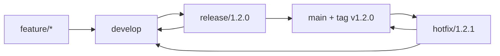
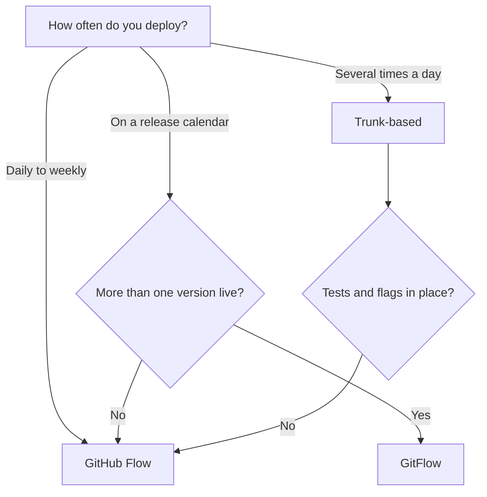

# Branching, Review and Repository Strategy {#ch-branching-and-review-workflow}

> Choose a branching model from how often your team deploys, set the commit and pull request rules that make it work, and draw repository boundaries where changes stop being coupled.

**In this chapter:** GitHub Flow, GitFlow and trunk-based · commit messages and pull request size · merge method and branch protection · monorepo or polyrepo

## 💡 The Core Idea

A branching model is a queue policy. Every branch is work waiting to join `main`. The longer it waits,
the more `main` moves underneath it. Git does not cause merge pain; the time between branching and
merging does. Every model in this chapter answers one question: **how long may a branch live?**

That answer decides the rest. If branches live for hours, you need little ceremony and a lot of
automated tests. If they live for weeks, you need release branches and someone who owns the merge. Pick
the ceremony that matches the interval your team can really keep to.

A repository boundary is the same idea one level up. Inside one repository, a change to shared code and
a change to its callers are one commit. Across two repositories, the same change becomes a version
number that each consumer upgrades on its own schedule.

## How It Works

Three models cover almost every team you will join.

| Model           | Permanent branches | Branch lifetime | Fits a team that deploys |
| --------------- | ------------------ | --------------- | ------------------------ |
| **Trunk-based** | `main`             | Hours           | Many times a day         |
| **GitHub Flow** | `main`             | 1–3 days        | Daily to weekly          |
| **GitFlow**     | `main` + `develop` | Days to weeks   | On a release calendar    |

### GitHub Flow

One permanent branch and one rule: `main` is always deployable. Branch, open a pull request, get a
review, merge, deploy. It is the default for a reason. Only one version of the product runs in
production, so a second permanent branch has nothing to hold.

### GitFlow

Two permanent branches and three kinds of temporary one. `develop` collects finished features.
`release/*` stabilises a version. `hotfix/*` branches from `main`, because `develop` holds work that is
not ready to ship.

**The GitFlow branch paths:**



**Every path that merges into `main` also merges back into `develop`.** Forget the second merge and the
hotfix is lost, then comes back as a regression in the next release.

GitFlow earns its cost when you really support more than one version in production, or when a release
needs a sign-off gate that takes days. Otherwise the second permanent branch is a queue nobody asked for.

### Trunk-Based Development

Everyone integrates into `main` at least once a day, and branches are hours old. Unfinished work ships
anyway, switched off behind a flag. An unfinished feature in `main` costs less than a three-week branch.

This works because deploy and release are separate events. The new component sits in `main` and in
production, but only the users the flag is on for can see it.

Trunk-based has a hard prerequisite. Without tests you trust and flags you can turn off, committing to
`main` several times a day is not a strategy. It is an outage schedule.

## When to Use It

**Choosing a branching model:**



**Deploy frequency picks the model; test coverage vetoes the fastest one.**

## Commits and Pull Requests

The model sets the shape of the queue. These rules decide whether anything in it can be reviewed.

### Conventional Commits

A machine-readable prefix on a human-readable subject. It costs nothing, and it buys generated
changelogs, automatic version bumps and a history you can filter.

**The commit message shape:**

```text
<type>(<scope>): <subject>

<body — why, not what>

<footer — issue refs, BREAKING CHANGE:>
```

The common types are `feat`, `fix`, `refactor`, `perf`, `test`, `docs`, `chore` and `ci`, for example
`fix(auth): stop redirect loop on expiry`. Only `feat` and `fix` move a semantic version. The
subject says what changed, in about fifty characters. The body says **why** — the part nobody can
rebuild from the diff a year later.

> ⚠️ Conventional commits are only worth enforcing if something reads them. A commit lint with no
> changelog generator behind it is ceremony.

### Branch Naming and Freshness

Use `<type>/<ticket>-<short-description>`, for example `feat/PLAT-412-oauth-callback`, so a branch list
reads as a work list. A branch older than a week is a warning sign, whatever its name. Rebase onto
`origin/main` every day and push with `--force-with-lease`, so conflicts arrive one at a time.

### Pull Request Size

Review quality drops long before reviewers admit it. Past about 400 changed lines, comments stop being
about design and start being about typos.

| Lines changed | What reviewers actually do          |
| ------------- | ----------------------------------- |
| Under 200     | ✅ Read every line, question design |
| 200–400       | Skim the middle                     |
| Over 400      | ❌ Approve on trust                 |

**Before you ask for a review:**

```bash
git diff origin/main...HEAD   # Read your own diff first — you will find something
pnpm lint && pnpm test        # Never make CI the first reader
git rebase origin/main        # Review the change against current main, not last week's
```

A pull request description should say *why now*, link the ticket and show evidence — a screenshot for a
UI change, a test name for a fix. Reviewers cannot guess intent from a diff.

### Merge Method

| Method           | What lands on `main`                    | Choose it when                                   |
| ---------------- | --------------------------------------- | ------------------------------------------------ |
| **Squash**       | One commit per pull request             | Branches carry work-in-progress commits          |
| **Rebase merge** | Every commit, replayed, no merge commit | The branch's commits are meaningful on their own |
| **Merge commit** | Every commit plus a merge commit        | You want to keep the branch topology             |

Squash gives the cleanest `main` and the cheapest `git bisect`, because every commit on `main` is one
reviewed change. It loses the intermediate commits. That is only a real cost if they were good.

### Branch Protection

The platform must enforce the policy; goodwill will not. Every host has the same few settings under
different names.

- ✅ Require a pull request, with at least one approving review
- ✅ Require status checks to pass, and the branch to be current with `main`
- ✅ Dismiss stale approvals when new commits land
- ❌ Do not allow force pushes or branch deletion on `main`

A code owners file sends each review to whoever knows the area. Once a repository holds more than one
team, that matters more than the number of approvals.

## Monorepo or Polyrepo

The question is never "one repository or many". It is **"should these two things be able to change in
one commit?"** Each answer moves a cost somewhere else.

| Cost               | Monorepo                                  | Polyrepo                                  |
| ------------------ | ----------------------------------------- | ----------------------------------------- |
| **Atomic changes** | One commit updates provider and callers   | Publish, then a pull request per consumer |
| **Versioning**     | None inside — one lockfile, no drift      | Every shared package has a version        |
| **CI scope**       | Needs affected-only builds to stay usable | Naturally scoped to one project           |
| **Ownership**      | Code owners per directory; read access is all-or-nothing | Permissions per repository  |

A monorepo's payoff is the atomic change. Rename a field on a shared API client and fix all three
consumers in one pull request. One CI run tells you whether the rename is complete. In a polyrepo, the
same rename is a major version, three upgrade pull requests and a period where consumers disagree.

The price is CI. "Run the tests" now means 40 packages, and nobody waits for that on every push. A
monorepo needs a build system that reads the dependency graph and skips unchanged work, plus a shared
remote cache. The tools — pnpm workspaces, Turborepo, Nx, Changesets — are covered in
[Chapter ?? — Monorepos](#ch-monorepos).

A polyrepo buys real autonomy. The billing team ships on Tuesday without knowing what the web team is
doing, and the billing repository can be locked down in a way a directory cannot. It pays in
coordination: a breaking change in a shared package becomes a migration with a long tail of old versions.

| Situation                                           | Choose   | Because                                        |
| --------------------------------------------------- | -------- | ---------------------------------------------- |
| Frontend, backend and shared types for one product  | Monorepo | Contract changes are one commit and one review |
| Design system plus the apps that consume it         | Monorepo | Otherwise every token change is a release      |
| Two products with separate roadmaps and on-call     | Polyrepo | Nothing gains from shared CI                   |
| An open-source library with outside consumers       | Polyrepo | External users need real semantic versions     |
| A regulated service most engineers must not read    | Polyrepo | Git permissions stop at the repository         |

Most organisations end up with several monorepos, not one of either. The boundary sits where change
coupling really stops, and that is not a compromise.

## Common Mistakes

❌ **A long-lived integration branch nobody deploys.** If `develop` is never deployed, it is a queue, and
it hides integration failures until the release.
✅ Branch from `main` and ship behind a flag. GitFlow accepts that cost on purpose for a calendar
release. Without the calendar, you pay the cost and get none of the benefit.

❌ **One pull request for a refactor and a feature** — 1,400 lines of "extract query builder + add
profile endpoint". The reviewer cannot tell which lines were meant to change behaviour, so neither half
gets checked properly.
✅ Two pull requests, the refactor first, so the second review is only about the feature.

❌ **A monorepo with a single pipeline** that runs every test on every push. This is the most common
reason teams decide "monorepos do not scale". The layout was never the problem; running unrelated tests
was.
✅ Scope CI to the change with affected-only builds and a remote cache.

❌ **A polyrepo that shares code by copying it.** Copied code has no version, so no consumer knows if it
holds the fixed copy. It takes the costs of both models and the benefits of neither.
✅ Publish and version the shared code, or move both projects into one repository.

## 🔑 Key Takeaways

- Branch lifetime is the variable that matters; a branching model is a policy for how long a branch may live.
- GitHub Flow is the default, trunk-based needs trusted tests and flags, and GitFlow needs a real release calendar or more than one live version.
- Past roughly 400 changed lines, reviewers approve on trust, so split the pull request instead.
- Squash merging keeps one reviewed change per commit on `main`, which is what makes `git bisect` cheap.
- A repository boundary is a coordination boundary: a monorepo swaps version drift for CI that must understand the dependency graph.

## Interview Questions

**Q: How would you choose a branching strategy for a new team?**

Start from deploy frequency and the number of versions in production. Several deploys a day, with good
tests and flags, means trunk-based. One version and a roughly daily cadence means GitHub Flow. Only a
release calendar or several supported versions justifies GitFlow's second permanent branch.

**Q: Squash, rebase, or merge commit — which and why?**

Squash by default, because it puts one reviewed change per commit on `main` and makes `git bisect` land
on something meaningful. Rebase merge when the individual commits were written to be read. Merge commit
when the branch topology itself is information worth keeping.

**Q: How do you keep pull requests reviewable?**

Keep them to a few hundred lines, and split behaviour changes from refactors so each review answers one
question. Rebase onto `main` first, so the reviewer sees the change against current code. Read your own
diff before anyone else does.

**Q: Monorepo or polyrepo for a product with a web app, an admin app and a shared design system?**

Monorepo. Those three change together all the time, so a token change and its consumers belong in one
review. The commitment is to own affected-only CI and a build cache. A single pipeline over the whole
graph will make the repository feel slow within months.

**Q: How do you make a breaking change to a shared library in a polyrepo?**

Ship it additively first, so both shapes work, and publish that as a minor version. Migrate consumers one
at a time, then remove the old shape in a major version. One breaking release and a coordinated flag day
needs every team free at once, which is rarely true.

**Q: When would you not recommend a monorepo?**

When teams need truly independent release cadence, when access to part of the code must be restricted,
or when nobody will own the build tooling. The last one decides it in practice. A monorepo with no cache
and no affected-only CI is worse than either option done properly.

## What to Read Next

- [Chapter ?? — CI/CD Fundamentals](#ch-cicd-fundamentals) — how each branching model shapes the pipeline
  that serves it
- [Chapter ?? — Deployment Strategies, Rollback and Feature Flags](#ch-deployment-strategies) — the feature flags that
  trunk-based development depends on
- [Chapter ?? — Monorepos](#ch-monorepos) — the workspace, task-graph and caching tools a monorepo needs
