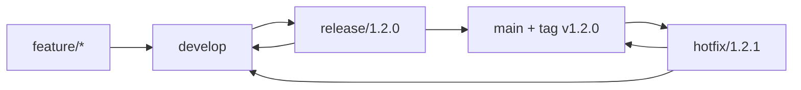
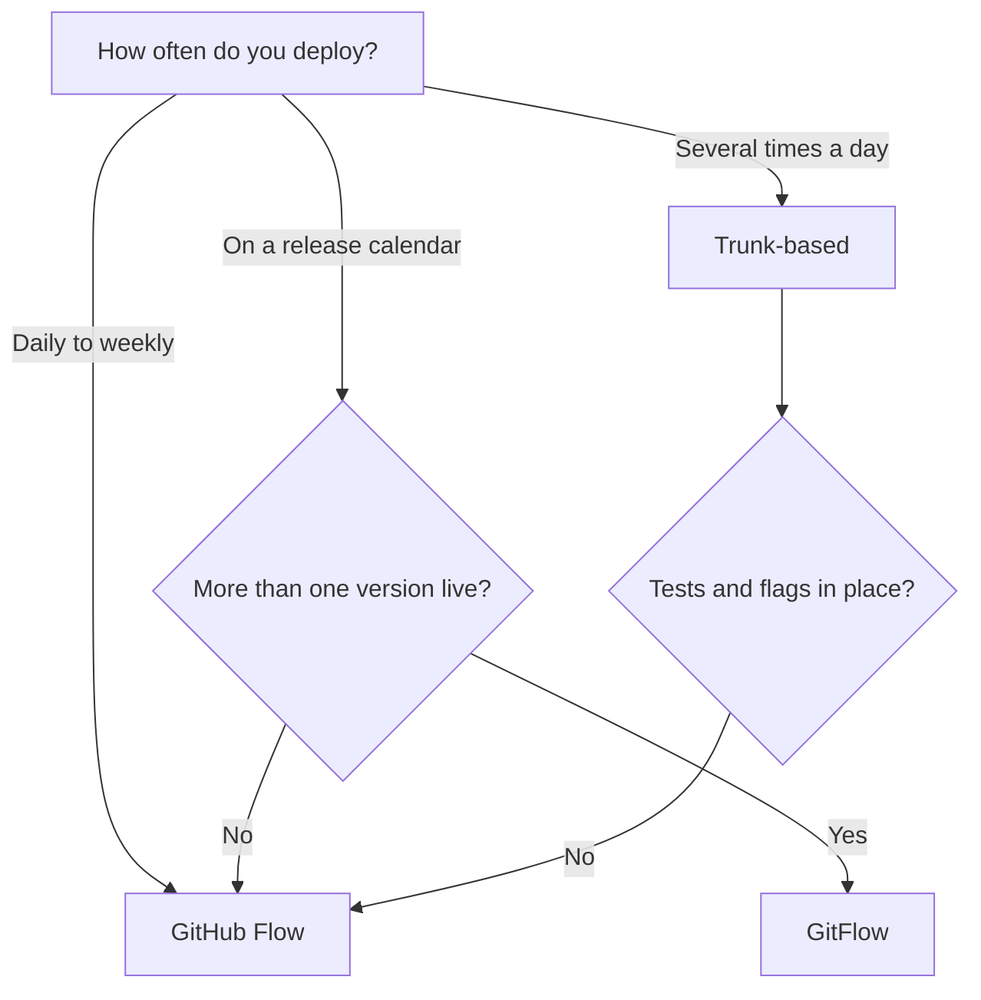

# Branching and Review Workflow {#ch-branching-and-review-workflow}

> Choose a branching model on your team's deploy frequency, and set the commit and pull request rules that make it work.

**In this chapter:** GitHub Flow, GitFlow and trunk-based · choosing on deploy frequency · commit messages · pull request size · merge method · branch protection

## 💡 The Core Idea

A branching model is a queue policy. Every branch is work waiting to join `main`, and the longer it
waits, the more `main` moves underneath it. Merge pain is not caused by Git; it is caused by the time
between branching and merging. Every model in this chapter is a different answer to one question: **how
long is a branch allowed to live?**

That framing decides the rest. If branches live hours, you need almost no ceremony and a lot of automated
tests. If they live weeks, you need release branches, integration branches, and someone to own the merge.
Pick the ceremony that matches the interval you can actually sustain.

> Argue about branch lifetime, not about branch names. The names are a consequence.

## How It Works

Three models cover almost every team you will join.

| Model            | Permanent branches | Branch lifetime | Fits a team that deploys |
| ---------------- | ------------------ | --------------- | ------------------------ |
| **Trunk-based**  | `main`             | Hours           | Many times a day         |
| **GitHub Flow**  | `main`             | 1–3 days        | Daily to weekly          |
| **GitFlow**      | `main` + `develop` | Days to weeks   | On a release calendar    |

### GitHub Flow

One permanent branch, one rule: `main` is always deployable. Branch, open a pull request, get a review,
merge, deploy.

```bash
git switch main && git pull
git switch -c feat/user-profile
# commit in small steps, push, open a PR
git push -u origin feat/user-profile
# review → merge to main → main deploys
```

It is the default for a reason. There is exactly one version of the product in production, so there is
nothing for a second permanent branch to hold.

### GitFlow

Two permanent branches and three kinds of temporary one. `develop` accumulates finished features,
`release/*` stabilises a version, `hotfix/*` branches from `main` because `develop` contains work that
is not ready to ship.



**Every path in GitFlow that merges into `main` also merges back into `develop`. Forgetting the second
merge is how a hotfix gets lost and reappears as a regression next release.**

GitFlow earns its complexity when you genuinely support more than one version in production, or when a
release needs a sign-off gate that takes days. Otherwise the second permanent branch is a queue nobody
asked for.

### Trunk-Based Development

Everyone integrates into `main` at least daily. Branches are hours old. Work that is not finished ships
anyway, disabled behind a flag, because an unfinished feature in `main` costs less than a three-week
branch.

```typescript
// The pattern that makes trunk-based possible: deploy and release are separate events
import { isEnabled } from '@/lib/flags';

export function Dashboard({ userId }: { userId: string }): JSX.Element {
  // The new code is in main and in production, off for everyone but the team
  return isEnabled('dashboard-v2', userId) ? <DashboardV2 /> : <DashboardV1 />;
}
```

Trunk-based has a hard prerequisite. Without tests you trust and flags you can turn off, committing to
`main` several times a day is not a strategy, it is an outage schedule.

### Choosing



**Deploy frequency picks the model; test coverage vetoes the fastest one.**

## Commits and Pull Requests

The model sets the shape of the queue. These rules decide whether anything in it is reviewable.

### Conventional Commits

A machine-readable prefix on a human-readable subject. It costs nothing and it buys automated
changelogs, semantic version bumps, and a history you can filter.

```text
<type>(<scope>): <subject>

<body — why, not what>

<footer — issue refs, BREAKING CHANGE:>
```

| Type       | For                            | Example                                    |
| ---------- | ------------------------------ | ------------------------------------------ |
| `feat`     | New behaviour                  | `feat(api): add user profile endpoint`     |
| `fix`      | A bug fix                      | `fix(auth): stop redirect loop on expiry`  |
| `refactor` | No behaviour change            | `refactor(db): extract query builder`      |
| `perf`     | Faster, same behaviour         | `perf(db): index orders on user_id`        |
| `test`     | Tests only                     | `test(auth): cover expired session`        |
| `docs`     | Documentation                  | `docs(readme): add local setup`            |
| `chore`    | Tooling, dependencies          | `chore(deps): upgrade react to 19.1`       |
| `ci`       | Pipeline changes               | `ci: cache pnpm store between jobs`        |

The subject says what changed and stays under about fifty characters. The body says **why**, which is the
part nobody can reconstruct from the diff a year later.

⚠️ Conventional commits are only worth enforcing if something consumes them. A commit lint with no
changelog generator behind it is ceremony.

### Branch Naming

`<type>/<ticket>-<short-description>`, so that a branch list reads as a work list.

| ✅ Readable                          | ❌ Guesswork  |
| ------------------------------------ | ------------- |
| `feat/PLAT-412-oauth-callback`       | `my-branch`   |
| `fix/PLAT-455-session-memory-leak`   | `fix-bug`     |
| `hotfix/xss-in-comment-render`       | `temp`        |

A branch older than a week is a warning sign whatever it is called. Rebase onto `main` daily so the
conflicts arrive in ones rather than all at the end:

```bash
git fetch origin
git rebase origin/main
git push --force-with-lease
```

### Pull Request Size

Review quality falls off a cliff long before reviewers admit it. Somewhere past 400 changed lines,
comments stop being about design and start being about typos.

| Lines changed | What reviewers actually do        |
| ------------- | --------------------------------- |
| Under 200     | ✅ Read every line, question design |
| 200–400       | ⚠️ Skim the middle                 |
| Over 400      | ❌ Approve on trust                |

**Before you ask for a review:**

```bash
git diff origin/main...HEAD   # Read your own diff first — you will find something
pnpm lint && pnpm test        # Never make CI the first reader
git rebase origin/main        # Review the change against current main, not last week's
```

A pull request description should answer *why now*, link the ticket, and show evidence — a screenshot for
a UI change, a test name for a fix. Reviewers cannot infer intent from a diff.

### Merge Method

| Method           | What lands on `main`                | Choose it when                                  |
| ---------------- | ----------------------------------- | ----------------------------------------------- |
| **Squash**       | One commit per pull request         | Branches carry wip commits — the common default |
| **Rebase merge** | Every commit, replayed, no merge commit | The branch's commits are individually meaningful |
| **Merge commit** | Every commit plus a merge commit    | You want the branch topology preserved          |

Squash gives the cleanest `main` and the cheapest `git bisect`, because every commit on `main` is one
reviewed change. It loses the intermediate commits, which is a real cost only if they were good.

### Branch Protection

The policy has to be enforced by the platform, not by goodwill. The same handful of settings exists under
different names on every host.

- ✅ Require a pull request, with at least one approving review
- ✅ Require status checks to pass, and require the branch to be current with `main`
- ✅ Dismiss stale approvals when new commits land
- ✅ Restrict who can push directly, including administrators
- ❌ Do not allow force pushes or branch deletion on `main`

A code owners file routes reviews to the people who know the area, which matters more than the review
count once a repository has more than one team in it.

## Common Mistakes

**❌ Wrong — a long-lived integration branch nobody deploys:**

```bash
git switch -c develop         # Features merge here and wait three weeks for a release
```

**✅ Right — if `develop` is not deployed, it is a queue, not a branch:**

```bash
git switch -c feat/PLAT-412-oauth-callback main   # Straight to main behind a flag
```

An integration branch that never ships hides integration failures until the release. That is the exact
cost GitFlow accepts on purpose, for a calendar release. Adopting it without the calendar buys the cost
with none of the benefit.

**❌ Wrong — one pull request for a refactor and a feature:**

```text
1,400 lines changed: extract query builder + add profile endpoint
```

**✅ Right — two pull requests, the refactor first:**

```text
PR 1:  312 lines — refactor(db): extract query builder (no behaviour change)
PR 2:  180 lines — feat(api): add profile endpoint
```

Splitting them means the second review is about the feature. Combined, the reviewer cannot tell which
lines were meant to change behaviour, so nobody checks either properly.

## 🔑 Key Takeaways

- Branch lifetime is the variable that matters; the model is just a policy for how long a branch may live.
- GitHub Flow is the default, trunk-based needs tests and flags to be safe, and GitFlow needs a real
  release calendar or more than one live version to be worth its second permanent branch.
- A commit subject says what changed and the body says why, because the diff already shows the what.
- Past roughly 400 changed lines, reviewers approve on trust — split the pull request instead.
- Squash merging keeps one reviewed change per commit on `main`, which is what makes `bisect` cheap.

## Interview Questions

**Q: How would you choose a branching strategy for a new team?**

Start from deploy frequency and the number of versions in production. Several deploys a day with good
tests and flag infrastructure means trunk-based; one version and a daily-ish cadence means GitHub Flow;
a release calendar or multiple supported versions is the only case that justifies GitFlow's second
permanent branch.

**Q: What is the difference between GitFlow and GitHub Flow?**

GitHub Flow has one permanent branch and short feature branches, so merging and deploying are the same
event. GitFlow adds `develop`, `release/*` and `hotfix/*` so that stabilising a version can happen
without blocking new feature work. GitFlow buys control at the cost of a longer path from commit to
production.

**Q: Squash, rebase, or merge commit — which and why?**

Squash by default, because it puts one reviewed change per commit on `main` and makes `git bisect` land
on something meaningful. Rebase merge when the individual commits were written to be read. Merge commit
when the branch topology itself is information you want to keep.

**Q: How do you keep pull requests reviewable?**

Cap them at a few hundred lines and split behaviour changes from refactors, so each review has one
question to answer. Rebase onto `main` before asking, so the reviewer sees the change against current
`main`. Read your own diff first — it catches most of what a reviewer would otherwise spend their
attention on.

**Q: When would you not enforce conventional commits?**

When nothing downstream reads them. The format pays for itself through generated changelogs and version
bumps; without that pipeline it is a lint rule that slows people down and produces no artefact. Adopt the
consumer first, then the convention.

## What to Read Next

- [Chapter ?? — CI/CD Fundamentals](#ch-cicd-fundamentals) — how each branching model shapes the pipeline
  that has to serve it
- [Chapter ?? — Feature Flags](#ch-feature-flags) — the mechanism trunk-based development depends on
- [Chapter ?? — Repository Strategies: Monorepo vs Polyrepo](#ch-repository-strategies) — the same
  autonomy-versus-coordination trade-off, one level up
