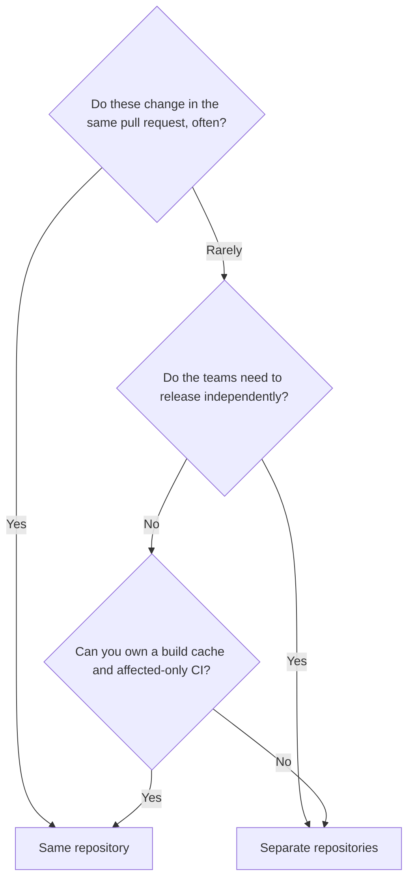

# Repository Strategies: Monorepo vs Polyrepo {#ch-repository-strategies}

> Argue the monorepo-versus-polyrepo trade-off from coordination cost, CI cost and team autonomy rather than from preference.

**In this chapter:** what a repository boundary actually costs · monorepo mechanics and tooling · polyrepo and published packages · a decision framework

## 💡 The Core Idea

A repository boundary is a **coordination boundary**. Inside one, a change to shared code and a change to
its callers are the same commit, reviewed together, merged together, impossible to get out of step.
Across two, the same change becomes a version number: publish, wait, upgrade, and live with the window
where different consumers are on different versions.

Neither is free. Putting everything in one repository removes the version negotiation and replaces it
with a build system that has to work out what changed. Splitting removes the build problem and replaces
it with dependency drift. You are choosing which of those two problems your team is better equipped to
own.

> The question is never "one repo or many". It is "should these two things be able to change in one
> commit?"

## How It Works

| Aspect              | Monorepo                              | Polyrepo                                  |
| ------------------- | ------------------------------------- | ----------------------------------------- |
| **Sharing code**    | Direct import from `packages/`        | Published package with a version          |
| **Breaking change** | One commit updates provider and callers | Publish, then a pull request per consumer |
| **CI cost**         | Needs affected-only builds to stay sane | Naturally scoped to one project          |
| **Access control**  | Broadly all-or-nothing                | Granular per repository                   |
| **Dependency drift** | Impossible — one lockfile            | Constant — every repo upgrades separately |
| **Onboarding**      | Clone once                            | Clone what you need, discover the rest    |

### The Monorepo

One repository holding several deployable things plus the code they share.

```text
platform/
├── apps/
│   ├── web/                 # Next.js customer app
│   └── admin/               # internal dashboard
├── services/
│   └── billing/             # Express API
├── packages/
│   ├── ui/                  # design system — imported, never published
│   └── api-client/          # generated types shared by all three apps
├── pnpm-workspace.yaml
└── turbo.json
```

The payoff is atomic change. Rename a field on the API client and fix all three consumers in one pull
request, and CI tells you in one run whether the rename is complete. In a polyrepo that rename is a
major version, three upgrade pull requests, and a period where consumers disagree about the field name.

The cost is that "run the tests" now means 40 packages, and nobody will wait for that on every push.
A monorepo needs a build system that understands the dependency graph well enough to skip work.

**Affected-only builds are the thing that makes a monorepo viable:**

```bash
# Build and test only what this branch actually touched, plus dependents
turbo run build test --filter='...[origin/main]'

# The same idea in Nx, which also draws the graph for you
nx affected --target=test --base=origin/main
nx graph
```

| Tool                  | Fits                              | The feature you adopt it for              |
| --------------------- | --------------------------------- | ----------------------------------------- |
| **pnpm workspaces**   | Any JS/TS monorepo — the baseline | Linking and one lockfile, nothing else    |
| **Turborepo**         | JS/TS, pipeline-shaped tasks      | Content-hash task cache, shared remotely  |
| **Nx**                | Larger graphs, mixed languages    | Dependency graph, affected-only targets, generators |
| **Changesets**        | A monorepo that also publishes    | Per-package versioning and changelogs     |

⚠️ Remote caching is what turns the cache from a local convenience into a team one — CI populates it,
everyone's first build hits it. A monorepo without it recompiles the same unchanged package on every
machine.

### The Polyrepo

Each deployable thing gets a repository, its own pipeline, and its own version. Shared code becomes a
published package.

```bash
# In the design system repo
pnpm changeset version && pnpm publish   # @acme/ui@3.0.0

# In each consumer, on its own schedule
pnpm up @acme/ui@^3.0.0
```

That version number is the whole trade. It buys real autonomy: the billing team ships on Tuesday without
knowing what the web team is doing, and access to the billing repository can be restricted in a way a
directory inside a monorepo cannot. It costs coordination: a breaking change in `@acme/ui` is now a
migration project with a long tail of consumers on old versions.

## When to Use It



**Change coupling decides first; the ability to own monorepo tooling is the veto.**

| Situation                                                | Choose    | Because                                        |
| -------------------------------------------------------- | --------- | ---------------------------------------------- |
| Frontend, backend and shared types for one product       | Monorepo  | Contract changes are one commit and one review |
| Design system plus the apps that consume it              | Monorepo  | Otherwise every token change is a release      |
| Two products with separate roadmaps and separate on-call | Polyrepo  | Nothing benefits from shared CI                |
| An open-source library with outside consumers            | Polyrepo  | External users need real semantic versions     |
| An acquired codebase, different stack and conventions    | Polyrepo  | Merging it buys you nothing yet                |
| Regulated service that most engineers must not read      | Polyrepo  | Git permissions stop at the repository         |

Most organisations of any size end up with several monorepos rather than one of either — a frontend
platform repository, a services repository, and separate repositories for anything with a genuinely
different release cadence or audience. That is not a compromise; it is the boundary drawn where change
coupling actually stops.

## Common Mistakes

**❌ Wrong — a monorepo with a single pipeline:**

```yaml
# Every push runs everything. 40 packages, 22 minutes, whatever you changed
jobs:
  test:
    steps:
      - run: pnpm install
      - run: pnpm -r test
```

**✅ Right — scope the run to the change:**

```yaml
jobs:
  test:
    steps:
      - run: pnpm install
      - run: pnpm turbo run test --filter='...[origin/main]'
```

Full-graph CI is the single most common reason teams conclude "monorepos do not scale". The repository
layout was never the problem; running unrelated tests was.

**❌ Wrong — a polyrepo that shares code by copying** (`cp -r ../design-system/src/components ./src/vendor/`).
**✅ Right — publish it, version it, consume it** (`pnpm add @acme/ui@^3.0.0`).

Copied code has no version, so no consumer knows whether it holds the fixed copy. Either publish the
shared code properly or move both projects into one repository. Copying is the option that has the costs
of both.

## 🔑 Key Takeaways

- A repository boundary is a coordination boundary — the real question is whether two things should be
  able to change in a single commit.
- A monorepo trades version negotiation for a build system that must understand the dependency graph.
- Affected-only builds and a shared remote cache are not optimisations in a monorepo; they are the
  entry fee.
- A polyrepo buys independent release cadence and granular access control, and pays in dependency drift.
- Copying shared code between repositories takes the costs of both models and the benefits of neither.

## Interview Questions

**Q: Monorepo or polyrepo for a product with a web app, an admin app and a shared design system?**

Monorepo. Those three change together constantly — a design system token change and its consumers belong
in one review. The commitment you are making is to own affected-only CI and a build cache, because a
single pipeline over the whole graph will make the repository feel slow within months.

**Q: What actually breaks first in a large monorepo?**

CI time, then Git operations. Teams usually meet the CI wall first and blame the layout; the fix is task
filtering plus a remote cache, not splitting up. Git slowness arrives much later and is mostly about
large binary history, which is a different problem with different tools.

**Q: How do you make a breaking change to a shared library in a polyrepo?**

Ship it additively first, so both shapes work, and publish that as a minor version. Migrate consumers one
at a time, then remove the old shape in a major version. The alternative — one breaking release and a
coordinated flag day — needs everyone free at the same time, which is rarely true.

**Q: When would you not recommend a monorepo?**

When the teams need genuinely independent release cadence, when access to part of the code must be
restricted, or when nobody will own the build tooling. The last one decides it in practice: a monorepo
with no cache and no affected-only CI is worse than either alternative done properly.

## What to Read Next

- [Chapter ?? — Branching and Review Workflow](#ch-branching-and-review-workflow) — the same
  coordination trade-off at the branch level
- [Chapter ?? — CI/CD Fundamentals](#ch-cicd-fundamentals) — what an affected-only pipeline looks like
  in practice
