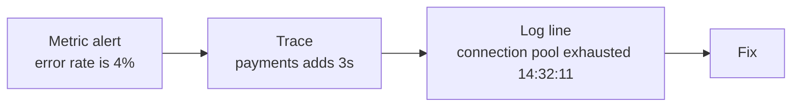

# Monitoring and Observability Fundamentals {#ch-monitoring-fundamentals}

> Tell monitoring and observability apart with a concrete example, and set an SLO that has a real error budget behind it.

**In this chapter:** monitoring versus observability · metrics, logs and traces · cardinality · the golden signals · SLOs and error budgets

## 💡 The Core Idea

Monitoring answers questions you thought of in advance. Observability is whether you can answer the
question you did not think of, from data you are already collecting.

The difference only shows up under pressure. "The disk filled up" is monitoring — someone knew to
watch the disk. "Checkout is slow, but only for users on Android, in Germany, with more than fifty
items in the basket" is observability. Nobody built that dashboard. You need data detailed enough to
slice by dimensions you chose after the incident started.

> Observability is a property of your **data**, not a product you buy. If you cannot ask a new
> question without shipping code, you do not have it.

## How It Works

Three kinds of data, used together.

| Pillar | Answers | Cost at volume | Detail allowed |
| ------ | ------- | -------------- | -------------- |
| **Metrics** | How many, how fast, how often? | Cheap | Must stay low |
| **Logs** | What exactly happened in this one case? | Expensive | Unlimited |
| **Traces** | Where did the time go across services? | Moderate, sampled | High |



**Metric → trace → log is the answer to "how do you debug a production incident?"** Each step narrows
the search. The thing that makes the chain work is a shared **trace ID** on every log line and every
span, so you move between the three instead of matching timestamps by hand.

### Metrics and the Cardinality Trap

Four types cover almost everything: a **counter** only goes up, a **gauge** moves both ways, a
**histogram** records a bucketed distribution, and a **summary** computes quantiles inside the process.

⚠️ **Use histograms, not summaries, for latency.** A summary's quantiles are already collapsed inside
each process and cannot be combined across a fleet. Histogram buckets add up.

**Cardinality** is the number of unique time series a metric produces — the product of every label's
distinct values. It drives memory and cost, and it is the most common way a metrics backend dies.

```text
http_requests_total{method, status, endpoint}
  method 5 × status 8 × endpoint 20      →         800 series   ✅ fine

http_requests_total{method, status, endpoint, user_id}
  ... × user_id 2,000,000                → 1,600,000,000 series  ❌ outage
```

**Never a metric label:** user ID, request ID, session ID, email, a full URL with query parameters, a
timestamp. Those belong in logs and traces, which are built for unbounded detail.

### Logs, Structured

❌ **Unstructured** — needs fragile regex to query:

```text
2026-08-03 14:32:11 ERROR Payment failed for user 8891 amount 42.50
```

✅ **Structured** — queryable, and correlated:

```json
{
  "timestamp": "2026-08-03T14:32:11Z",
  "level": "error",
  "message": "payment failed",
  "user_id": "8891",
  "trace_id": "1-5f9a2b3c-4d5e6f7a8b9c0d1e",
  "service": "payments"
}
```

Four levels, used properly: `ERROR` when a request failed and a human may need to act, `WARN` when
something degraded but was handled, `INFO` for significant business events, `DEBUG` off in production.

**If everything is `ERROR`, nothing is.** Teams that log successful retries as errors stop looking at
the error graph.

**Containers make one log rule non-negotiable: write to stdout and stderr, never to a file inside the
container.** By the time you want to read that file the container is gone. Something on the host
collects both streams and ships them off the machine.

### Traces and Sampling

A trace follows one request across every service. Each unit of work is a **span**.

```text
Trace: checkout (1,240ms total)
└── api-gateway              1,240ms
    ├── auth-service            45ms
    ├── cart-service            80ms
    └── payment-service      1,100ms   ← the slow component
        └── payment provider    960ms   ← the actual cause
```

Traces answer what metrics cannot: **which** component consumed the latency.

| Sampling | How | Tradeoff |
| -------- | --- | -------- |
| **Head-based** | Decide at the first span — keep 5%, say | Cheap; may throw away the rare error |
| **Tail-based** | Decide once the trace is complete | ✅ Keeps every error and slow request; needs a buffer |

✅ Sample fast successes hard, keep **100% of errors and slow requests**. Those are the only traces
anyone opens.

## When to Use It

### The Golden Signals

Four signals per service. If you measure nothing else, measure these.

| Signal | Question | Typical metric |
| ------ | -------- | -------------- |
| **Latency** | How slow? | p50, p95, p99 duration |
| **Traffic** | How much demand? | requests per second |
| **Errors** | How often does it fail? | 5xx rate as a percentage |
| **Saturation** | How full? | queue depth, pool usage, CPU |

⚠️ **Measure the latency of successes and failures separately.** A fast 500 makes average latency look
excellent while the service is completely broken.

Two related framings worth naming: **RED** for request-driven services, **USE** for resources.

### Percentiles, Not Averages

```text
1,000 requests: 990 take 50ms, 10 take 5,000ms

Average  →    99.5ms   looks fine
p99      → 5,000ms     ten users had a terrible experience
```

Read p50 as the typical experience, p95 as where pain begins, p99 as your worst-affected real users.
Alert on p99; report p50 to describe normal behaviour.

⚠️ **You cannot average percentiles.** The mean of two instances' p99 values is not the fleet p99.
Aggregate the histogram buckets first, then compute the quantile.

### SLIs, SLOs and Error Budgets

| Term | Definition | Example |
| ---- | ---------- | ------- |
| **SLI** | The measurement | Share of requests served under 300 ms |
| **SLO** | Your internal target | 99.9% under 300 ms over 30 days |
| **SLA** | A contract with penalties | 99.5% uptime or the customer gets credit |

✅ Always set the SLO **stricter** than the SLA. The gap is your safety margin — you want to be
fixing a problem long before anyone is owed money.

If the SLO is 99.9%, then 0.1% failure is *allowed*. That allowance is the **error budget**: over
thirty days, about 43 minutes. While budget remains, ship features and take risks. When it is
exhausted, reliability work takes priority.

Worth memorising per month: 99% is 7.2 hours of downtime, 99.9% is 43 minutes, 99.99% is 4.3 minutes,
99.999% is 26 seconds. Each extra nine costs roughly an order of magnitude more, and at 99.999% no
human can be in the recovery path at all.

> The error budget turns "how reliable should we be?" from an argument into a number. It also makes the
> case that 100% is the wrong target — chasing it means shipping nothing.

### Where the Frontend Fits

Everything above applies at the browser edge, with one difference: the measurement happens on devices
you do not control, so it arrives as **field data** rather than server metrics. Core Web Vitals are
SLIs. A p75 target for INP is an SLO. Sampling and cardinality limits apply the same way — a URL with
an ID in it is as dangerous a label in a real-user monitoring tool as it is in a metrics backend.

The mechanics of collecting it — `web-vitals`, `PerformanceObserver`, attribution builds, beacon
transport — belong to Part IV. See [Chapter ?? — Performance Monitoring](#ch-performance-monitoring).

## Common Mistakes

| Mistake | Consequence | Fix |
| ------- | ----------- | --- |
| User ID as a metric label | Cardinality explosion, huge bill | Put it in logs and traces |
| Alerting on averages | The tail is invisible | Alert on p99 |
| Unstructured logs, or no trace ID | Regex, and matching timestamps by hand | JSON carrying a `trace_id` |
| Logging to a file in a container | The file dies with the container | stdout and stderr, shipped off the host |
| `DEBUG` on in production | Enormous log bill | `INFO` default, change level dynamically |

## 🔑 Key Takeaways

- Monitoring checks known failure modes; observability answers questions nobody anticipated, and it is
  a property of your data rather than a tool you bought.
- Metrics tell you something is wrong, traces tell you where, and logs tell you what — the shared trace
  ID is what connects them.
- Metric labels must be bounded; a unique identifier in a label is the most common cause of a dead
  metrics backend.
- Percentiles cannot be averaged, which is why latency belongs in a histogram rather than a summary.
- An SLO without an error budget is a wish; the budget is what makes reliability a spending decision.

## Interview Questions

**Q: What is the difference between monitoring and observability?**

Monitoring is checking whether the things you already know can break are broken — you decide in
advance what to measure, build a dashboard, and set alerts. Observability is answering a question you
did not anticipate, without shipping code. The distinction only bites under pressure: monitoring
handles "the disk filled up", but only observability handles "checkout is slow for Android users in
Germany with large baskets", because nobody built that dashboard. It is a property of the data —
enough detail and enough dimensions to slice on — so pre-aggregating everything into a handful of
counters destroys it whichever vendor you use.

**Q: What is cardinality and why does it matter?**

Cardinality is the number of unique time series a metric generates — the product of the distinct
values of all its labels. It matters because storage cost and query performance scale with
cardinality rather than with request volume. A counter labelled by method, status, and endpoint might
produce a few hundred series, which is fine; add a `user_id` label and you get one series per user,
which exhausts the backend's memory and produces a large bill. So labels must be bounded, and unique
identifiers go into logs and traces instead, which are designed for unbounded detail.

**Q: Why alert on percentiles instead of averages?**

Because averages hide the tail, and the tail is where users suffer. If 990 requests take 50
milliseconds and ten take five seconds, the average is under 100 milliseconds and looks healthy, while
ten people had an experience bad enough to leave. The p99 tells the truth. The caveat that matters is
that you cannot average percentiles across instances, which is exactly why latency belongs in a
histogram — its buckets can be aggregated before the quantile is computed.

**Q: Explain SLI, SLO, SLA and error budgets.**

The SLI is the measurement, such as the share of requests served successfully under 300 milliseconds.
The SLO is your internal target for it, say 99.9% over a rolling thirty days. The SLA is a customer
contract with financial consequences, and it should be looser than the SLO so there is margin before
anyone is owed money. The error budget falls out of the SLO: 99.9% over thirty days permits about 43
minutes of failure, and that is a budget you may spend. Its value is as much political as technical —
while budget remains the team ships, and when it is gone reliability wins the argument without anyone
having to have it.

**Q: You are asked to add observability to a service that has none. Where do you start, and what do you deliberately not do?**

I start with the golden signals for that one service — latency split by success and failure, traffic,
error rate, one saturation metric — plus structured logs carrying a trace ID, because that combination
is what makes the metric-to-trace-to-log path possible later. Then one SLO somebody actually agrees
to, because it decides which of those numbers matters. What I deliberately do not do is instrument
everything: every metric carries a permanent cardinality and storage cost, and a hundred unused
dashboards are worse than three read ones because they imply coverage. Traces come next, sampled
tail-based so errors survive.

## What to Read Next

- [Chapter ?? — Metrics and Dashboards](#ch-metrics-and-dashboards) — how the numbers get collected, queried, and put on a screen
- [Chapter ?? — Alerting and On-Call](#ch-alerting) — turning these signals into pages a tired engineer can act on
- [Chapter ?? — Performance Monitoring](#ch-performance-monitoring) — the same thinking, measured in the browser
