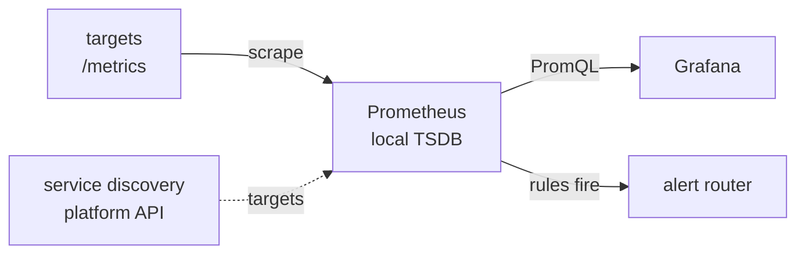

# Metrics, Dashboards and Alerting {#ch-metrics-and-dashboards}

> Write the queries that answer a real incident question, build a dashboard someone reaches for at 3am, and page only when a human must act.

**In this chapter:** metric types and the queries that matter · percentiles and cardinality · dashboards that answer a question · alerting on symptoms and burn rate · on-call that lasts

## 💡 The Core Idea

A metrics stack does three separate jobs. One system **collects and stores** numbers over time. A
second **queries and draws** them. A third **decides when a human must be woken**. The collector owns
the data; the dashboard and the alert rules only read it.

Prometheus is the collector most teams standardise on. Grafana is the drawing layer and stores nothing,
which is why one dashboard can put container, database and log data on one time axis. Alerts are PromQL
too, so a bad query makes both a bad graph and a bad page.

> ⚠️ **Moving target:** Prometheus 3.0 shipped native histograms and Grafana's alerting was rebuilt in
> version 8. The durable principles are pull-based collection over a text endpoint, storage cost that
> scales with cardinality, and a dashboard that is only a client. API names and defaults will change.

## How It Works

**Collectors, rules and alerts, and the direction data flows between them:**



**Prometheus pulls; it does not receive.** Every interval it fetches `/metrics` on each target and
stores the samples. The real gain is that **a failed scrape is itself a signal**: the `up` metric drops
to zero. With push, "no data" could mean a dead process, a broken collector or a lost packet. Pull only
works if the server knows what to scrape, so it **discovers** targets from the platform's API.

### Metric Types

| Type | What it holds | How to read it |
| ---- | ------------- | -------------- |
| **Counter** | A total that only goes up, reset on restart | Always through `rate()` |
| **Gauge** | A value that goes up and down — memory, queue depth | Directly |
| **Histogram** | Cumulative counters per latency bucket, plus a sum and a count | Through `histogram_quantile()` |

A target exposes these as plain text. A histogram bucket such as `le="0.5"` counts every request that
took 0.5 s **or less**. Percentiles are worked out from the buckets at query time; they are never stored.

❌ Graphing `http_requests_total` raw gives a line that only climbs and drops to zero on restart.
✅ `rate(http_requests_total[5m])` gives requests per second and handles the reset.

### The Queries That Matter

The `rate()` window must cover at least four scrape intervals. With 30-second scraping, `[1m]` gives
spiky output, so `[5m]` is the safe default.

**Error rate — the most-used query in production:**

```text
sum(rate(http_requests_total{status=~"5.."}[5m]))
  /
sum(rate(http_requests_total[5m]))
```

The denominator is the **total**, not the sum of non-5xx. Alert on this ratio, never on a raw error
count, because a count means something different at every traffic level.

**p99 latency across a fleet — aggregate the buckets first:**

```text
histogram_quantile(0.99,
  sum by (le) (rate(http_request_duration_seconds_bucket[5m]))
)
```

❌ `avg(histogram_quantile(0.99, ...))` — averaging percentiles gives a wrong number
✅ `histogram_quantile(0.99, sum by (le) (...))` — combine the distribution, then ask for the quantile

**Why percentiles, not averages.** An average of 120 ms can hide one user in a hundred waiting four
seconds. The p99 is the experience of your unhappiest regular users, and they are the ones who leave.

### Cardinality Is the Cost

Every unique combination of label values is its own series. The index for every active series lives
in memory, so series count — not request volume — decides the server's memory. One label holding a
user ID, a request ID or a full URL turns one metric into millions of series and an out-of-memory kill.

The emergency brake is relabelling at scrape time: `drop` the exploding metric, or `labeldrop` the bad
label. On a managed service the same mistake arrives as a bill instead of a crash.

### Recording Rules

Pre-compute an expensive expression on a schedule, then query the cheap result. Use one when a panel
is slow, when an expression repeats, or when an alert must evaluate fast.

**A recording rule that dashboards and alerts both read:**

```yaml
groups:
  - name: http
    interval: 30s
    rules:
      # Naming convention: level:metric:operation
      - record: job:http_errors:ratio5m
        expr: |
          sum by (job) (rate(http_requests_total{status=~"5.."}[5m]))
            /
          sum by (job) (rate(http_requests_total[5m]))
```

## When to Use It

| The question | The tool | Why |
| ------------ | -------- | --- |
| "Is it broken right now, and are users hurt?" | A page | A human must act now |
| "Will it break this week?" | A warning ticket | Urgent, but not at 3am |
| "Why is it broken?" | A dashboard | Exploration and diagnosis |
| "What did this one request do?" | Logs and traces | Metrics have no per-request detail |

### Dashboards That Answer a Question

A dashboard answers one stated question. "All the metrics" answers none.

**The layout for a service overview:**

```text
Row 1  SERVICE HEALTH   stat panels: error rate · p99 · RPS · SLO burn
Row 2  GOLDEN SIGNALS   latency percentiles · traffic and errors
Row 3  SATURATION       CPU and memory · pool usage · queue depth
Row 4  DEPENDENCIES     collapsed by default — database · cache · downstream
```

Keep three dashboards per service, not thirty: overview, deep-dive and business metrics. Put the most
important panel top-left, give every panel units and thresholds, and stay under twenty panels.

**Dashboards are code.** One clicked together in the UI has no review, no history and no recovery.
Build it in the UI, export the JSON model, commit it, and let provisioning apply it. In panels, use
`$__rate_interval` instead of a fixed `[5m]`, which gives a **blank graph** when someone zooms in.

### What Earns a Page

**Every page must be urgent, actionable and real.** If one of the three is missing, it is not a page.

| Test | If it fails |
| ---- | ----------- |
| **Urgent** — must be fixed now, not tomorrow | Make it a ticket |
| **Actionable** — a human can do something about it | Fix the system, or automate the response |
| **Real** — something is genuinely broken | Fix the threshold, or delete the alert |

Alert fatigue is the real failure mode of monitoring, not missing coverage. Once a team learns most
pages are noise, response to real incidents slows — and nobody sees it, because the dashboards still
look thorough. Above about two pages per on-call shift, the monitoring is broken, not the system.

**Page on symptoms, not causes:**

| ✅ Page on this (users affected) | ❌ Not this (a cause) |
| ------------------------------- | -------------------- |
| Error rate burning the SLO budget | CPU at 90% |
| p99 latency above one second | A container restarted |
| Zero successful logins in five minutes | Memory at 80% |

High CPU with happy users is not an incident. If a cause really hurts, the symptom alert fires anyway.
Cause metrics belong on dashboards and in runbooks — you need them to diagnose, not to wake anyone.
Keep three severities only: **critical** pages, **warning** opens a ticket, **info** goes to a log.

### Burn-Rate Alerting

A fixed threshold forces a bad choice. A short window pages on every blip. A long window is slow to
catch a real outage. Burn-rate alerting watches **how fast the error budget is being spent**, and
fires only when a short window *and* a long window both breach.

| Burn rate | Budget consumed | Detect within | Severity |
| --------- | --------------- | ------------- | -------- |
| **14.4×** | 2% in 1 hour | 2 min | Critical — page |
| **3×** | 10% in 1 day | 1 hour | Warning — ticket |

**A fast-burn alert against a 99.9% SLO:**

```yaml
# Fast burn — at this rate the whole month's budget is gone in about two days
- alert: ErrorBudgetBurnFast
  expr: |
    (job:http_errors:ratio5m{job="checkout"} > 14.4 * 0.001)
      and
    (job:http_errors:ratio1h{job="checkout"} > 14.4 * 0.001)
  for: 2m
  labels:
    severity: critical
  annotations:
    runbook: "https://runbooks.internal/checkout-errors"
```

The short window gives fast detection; the long one confirms it is sustained. A thirty-second spike
does not page, because the long window has not moved. The `for` duration stops flapping on one bad
scrape. Every page carries what is broken, the value against the threshold, user impact, a runbook
link and a dashboard link already filtered to the affected service.

### Silence Has to Mean Broken

The most common real alerting failure is an alarm that stayed quiet through a total outage. An alarm
on a counter the app emits has nothing to compare once the app dies — the metric stops existing
rather than breaching. Two fixes, and you want both:

- Configure the rule so **missing data breaches**. The default is rarely what you want.
- Also alert on something that lives **outside the app** — load balancer target health, 5xx at the
  edge, or an external prober. Those keep reporting when every instance is dead.

**Inhibition** cuts noise most: while `ClusterDown` fires, every critical alert inside it is held back.

### On-Call, Runbooks and the Post-Incident Review

A sustainable rotation has at least six people, a primary and a secondary, and escalation on
**acknowledgement**, not resolution. Handovers are written down, and a bad night earns time off.

> ⚠️ The person woken must have authority to delete or retune the alert that woke them. Without it,
> noise piles up forever, because nobody who suffers it can fix it.

The runbook link is the most valuable field on any alert: at 3am nobody reasons from first principles.

After a real incident, write a **blameless** review: a timeline, the impact, the contributing causes,
and a short list of owned actions with dates. Ask "why did the system allow this?", not "who did it?".
Once a month, review every alert that fired: was it real, was it actionable, did it need a human?

## Common Mistakes

| Mistake | Consequence | Fix |
| ------- | ----------- | --- |
| Averaging per-instance percentiles | A mathematically wrong number | `sum by (le)` first, then the quantile |
| A user ID or full URL as a label | Series explode; the server runs out of memory | Put it in logs or traces |
| Paging on causes | Constant noise, ignored pages | Page on symptoms |
| Missing data treated as healthy | Silent failure when the app dies | Missing data breaches |
| No runbook, or no owning team | Slow response, then nothing gets fixed | A runbook link and a `team` label on every alert |

## 🔑 Key Takeaways

- Collection, visualisation and alerting are separate jobs, and the dashboard tool stores nothing.
- Read a counter through `rate()`, and aggregate histogram buckets before computing a fleet percentile.
- Cardinality decides a metrics server's memory and cost, so unbounded values never become labels.
- A page must be urgent, actionable and real, and fire on user-visible symptoms such as SLO burn rate.
- Missing data must count as a breach, and the engineer woken must be able to delete the alert.

## Interview Questions

**Q: How do you calculate p99 latency across many instances, and what is the common mistake?**

Aggregate the histogram buckets first, then compute the quantile:
`histogram_quantile(0.99, sum by (le) (rate(..._bucket[5m])))`. The `sum by (le)` adds each bucket
across instances, so the quantile comes from one combined distribution. The mistake is computing it per
instance and averaging, which is wrong because percentiles are not linear.

**Q: A metrics server keeps getting killed for using too much memory. What is happening and what do you do?**

Memory follows cardinality, not traffic, because every active series is indexed in memory. Almost
always someone added a label holding a user ID, request ID or full URL. Relabel at scrape time to drop
the metric or `labeldrop` the label, then move that dimension into logs or traces.

**Q: What makes a good alert, and why alert on symptoms rather than causes?**

It is urgent, actionable and real; failing any one makes it a ticket, an automation or a deletion.
Symptoms are what users feel — error rate, p99, failed logins. Causes like high CPU create noise, and a
harmful cause shows up as a symptom anyway, so cause metrics stay on dashboards for diagnosis.

**Q: Explain burn-rate alerting.**

It alerts on how fast the error budget is being spent, not on a fixed error rate, and checks two
windows. A short window alone pages on blips; a long window alone is slow. Firing only when both
breach ignores a thirty-second spike but catches a sustained failure in minutes, with 14.4× paging
and 3× opening a ticket.

**Q: An alarm never fired even though the service was completely down. Why?**

Almost certainly missing-data handling. The alarm watched a metric the app itself emits, and when the
app died the metric vanished instead of breaching. Configure absence as a breach, and also alert on
something outside the app — load balancer health, edge 5xx or an external prober.

**Q: When is a dashboard the wrong tool?**

When the question has a known answer, because then it should be an alert rather than something a
human watches. Dashboards are for exploring and for diagnosis after an alert fires. The other case is
a dashboard built because the metrics existed — thirty unread dashboards suggest coverage while
quietly loading the collector.

## What to Read Next

- [Chapter ?? — Monitoring and Observability Fundamentals](#ch-monitoring-fundamentals) — the SLOs and error budgets these alerts are built on
- [Chapter ?? — Measuring in Production](#ch-measuring-in-production) — the same percentile thinking applied to real users' browsers
- [Chapter ?? — Deployment Strategies, Rollback and Feature Flags](#ch-deployment-strategies) — what happens after the page is acknowledged
