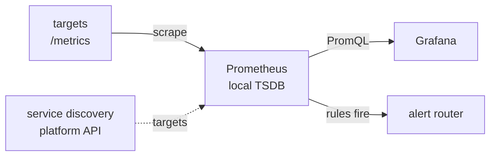

# Metrics and Dashboards {#ch-metrics-and-dashboards}

> Write the four queries that answer a real incident question, and build a dashboard someone reaches for at 3am.

**In this chapter:** scraping and service discovery · the exposition format · the queries that matter · recording rules · dashboards as code · dashboard design

## 💡 The Core Idea

A metrics stack is two separate jobs, and confusing them is the most common misunderstanding here. One
system **collects and stores** numbers over time; a different one **queries and draws** them. The
collector owns the data; the dashboard owns nothing.

Prometheus is the collector most teams standardise on, and Grafana is the drawing layer — it stores no
metrics at all. That separation is why one dashboard can put container metrics, database metrics, and
logs on a single time axis, which is exactly what you want during an incident.

> ⚠️ **Moving target:** Prometheus 3.0 shipped native histograms and Grafana's alerting was rebuilt
> in version 8, and both continue to move. The durable principle is that collection is pull-based over
> a text endpoint, storage cost scales with cardinality, and the dashboard is a client. API names and
> defaults will change.

## How It Works



**The scrape loop.** Prometheus pulls; it does not receive. Every interval it fetches an HTTP endpoint
on each target, usually `/metrics`, and appends the samples to a local time-series database.

### Why Pull, and Why Discovery Matters

| | Pull | Push |
| --- | --- | --- |
| **A dead target** | ✅ The scrape fails — you know | Silence, which is ambiguous |
| **Short-lived jobs** | ❌ May finish before a scrape | ✅ Natural fit |
| **Firewalls** | Needs inbound access to targets | ✅ Outbound only |

✅ Pull's real advantage is that **a failed scrape is itself a signal**. With push, "no data" could
mean the process died, the collector broke, or the network dropped packets, and you cannot tell which.

That only works if the server knows what to scrape, and once instances are short-lived and
interchangeable a static list cannot tell it. There is no box left to log into and the target list
changes every minute.

✅ This is why Prometheus dominates container platforms: it **discovers** targets from the platform's
API rather than from a config file you maintain.

### The Exposition Format

A target exposes plain text. Nothing more:

```text
# HELP http_requests_total Total HTTP requests
# TYPE http_requests_total counter
http_requests_total{method="GET",status="200",endpoint="/checkout"} 84021
http_requests_total{method="GET",status="500",endpoint="/checkout"} 37

# HELP http_request_duration_seconds Request duration
# TYPE http_request_duration_seconds histogram
http_request_duration_seconds_bucket{le="0.1"} 71204
http_request_duration_seconds_bucket{le="0.5"} 83100
http_request_duration_seconds_bucket{le="+Inf"} 84058
http_request_duration_seconds_count 84058
```

Notice what a histogram actually is: a set of **cumulative** counters, one per bucket, plus a sum
and a count. `le="0.5"` means "took 0.5 s **or less**". Percentiles are computed from these buckets at
query time — they are never stored.

**Never graph a counter directly.** ❌ `http_requests_total` is a cumulative total since process start,
so the line is meaningless and drops to zero on restart. ✅ `rate(http_requests_total[5m])` gives
requests per second and handles that reset, where a naive difference would produce a large negative
number.

### The Queries That Matter

⚠️ **The range must cover at least four scrape intervals.** With 30-second scraping, `rate(x[1m])` has
two samples and produces erratic output. `[5m]` is the safe default.

**Error rate — the single most-used query in production:**

```text
sum(rate(http_requests_total{status=~"5.."}[5m]))
  /
sum(rate(http_requests_total[5m]))
```

The denominator is the **total**, not the sum of non-5xx.

**p99 latency across a fleet — aggregate the buckets first:**

```text
histogram_quantile(0.99,
  sum by (le) (rate(http_request_duration_seconds_bucket[5m]))
)
```

❌ `avg(histogram_quantile(0.99, ...))` — averaging percentiles is meaningless
✅ `histogram_quantile(0.99, sum by (le) (...))` — combine the distribution, then ask for the quantile

**Aggregation, and the three container queries worth memorising:**

```text
sum by (status) (rate(http_requests_total[5m]))              # keep one dimension
topk(5, sum by (endpoint) (rate(http_requests_total[5m])))   # noisiest endpoints

# Predicts an out-of-memory kill before it happens
container_memory_working_set_bytes / container_spec_memory_limit_bytes > 0.9

# CPU throttling — latency with no errors and no failing health checks
rate(container_cpu_cfs_throttled_seconds_total[5m])

# Anything restarting is the clearest early sign of trouble
increase(container_restarts_total[1h]) > 0
```

⚠️ **CPU throttling is worth knowing by name.** A container held under its quota gets slower without
erroring, so latency rises while everything reports healthy.

### Recording Rules

Pre-compute an expensive expression on a schedule, then query the cheap result.

```yaml
groups:
  - name: http
    interval: 30s
    rules:
      # Naming convention: level:metric:operation
      - record: job:http_errors:ratio5m
        expr: |
          sum by (job) (rate(http_requests_total{status=~"5.."}[5m]))
            /
          sum by (job) (rate(http_requests_total[5m]))
```

✅ Use them when a dashboard query takes seconds, when the same expression appears in several places,
or when an alert needs to evaluate fast and reliably.

## When to Use It

### Keeping the Collector Alive

One server has real limits, and cardinality is the one that actually kills it: the index for every
active series is held in memory, so a user ID label causes an out-of-memory kill.

The emergency brake is relabelling during the scrape — `action: drop` on the exploding metric, or
`action: labeldrop` on the one offending label, which keeps the metric useful at lower resolution
while you fix the instrumentation. Past that point the answers are horizontal scale (Thanos, Mimir) or
a managed metrics service, where the same cardinality shows up as a bill instead of a crash. Both are
a platform team's problem rather than yours.

Where an application cannot expose `/metrics` itself, an **exporter** translates for it — host
metrics, container resource usage, database internals, or an external prober checking endpoints and
TLS expiry from outside.

### Dashboards as Code

❌ A dashboard clicked together in the UI has no review, no history, and no recovery when someone
deletes it.

✅ Provision from files in version control, and let the UI be a drafting tool only:

```yaml
apiVersion: 1
providers:
  - name: acme
    type: file
    allowUiUpdates: false # UI edits are discarded — Git is the source
    options:
      path: /var/lib/grafana/dashboards
```

The workflow that survives contact with a team: build it in the UI because the feedback loop is fast,
export the JSON model, commit it, let provisioning apply it. With `allowUiUpdates: false` those UI
edits are lost on the next reload — that is the point, but tell people first.

**Variables are what make one dashboard serve every service.** A query variable such as
`label_values(up, job)` becomes a dropdown, and a second variable can be chained to the first. The one
to remember is `$__rate_interval`:

```text
sum by (status) (
  rate(http_requests_total{job="$job", instance=~"$instance"}[$__rate_interval])
)
```

✅ A hard-coded `[5m]` produces a **blank graph** when someone zooms into a one-minute window during an
incident. `$__rate_interval` sizes the window from the selected range, so the query always has enough
samples. Multi-value variables become regexes, so match with `=~`, never `=`.

### Designing One Someone Reads

A dashboard answers a specific question. "All the metrics" answers none.

```text
Row 1  SERVICE HEALTH   stat panels: error rate · p99 · RPS · SLO burn
Row 2  GOLDEN SIGNALS   latency percentiles · traffic and errors
Row 3  SATURATION       CPU and memory · pool usage · queue depth
Row 4  DEPENDENCIES     collapsed by default — database · cache · downstream
```

| Rule | Why |
| ---- | --- |
| Three dashboards per service, not thirty | Overview, deep-dive, business metrics |
| Top-left is the most important panel | That is where the eye lands |
| Collapse the detail rows | Loads fast; expand only when diagnosing |
| Thresholds and units on every panel | A colour reads faster than a number, and "1.4" of what? |
| Link each panel to its runbook | Panel → runbook → the fix |
| Under 20 panels | Beyond that nobody reads it and it loads slowly |

✅ **The heatmap is the underused panel.** A p99 line hides the fact that you have two populations —
cache hits at 10 ms and misses at 800 ms. A heatmap makes that bimodality obvious immediately.

Twenty heavy queries auto-refreshing every ten seconds hammers the collector. Use recording rules for
the expensive ones and set refresh to a minute unless there is a reason not to.

## Common Mistakes

| Mistake | Consequence | Fix |
| ------- | ----------- | --- |
| Graphing a counter raw | A meaningless rising line | Wrap it in `rate()` |
| `rate(x[1m])` with 30 s scraping | Erratic, spiky output | A window over four scrape intervals |
| Averaging per-instance percentiles | A mathematically wrong number | `sum by (le)` first, then the quantile |
| Dashboards built only in the UI | No review, lost on deletion | Provision from version control |
| Hard-coded `[5m]` in a panel | Blank graph when zoomed in | `$__rate_interval` |

## 🔑 Key Takeaways

- Collection and visualisation are separate systems; the dashboard tool stores nothing and is only a
  client of whatever holds the data.
- Pull-based scraping makes a dead target detectable, and service discovery is what makes pull work
  when instances are ephemeral.
- A counter is only useful through `rate()`, and a fleet percentile is only correct if you aggregate
  histogram buckets before computing the quantile.
- Cardinality is the failure mode of a metrics server; relabelling at scrape time is the emergency
  brake.
- A dashboard is code — reviewed, versioned, and built to answer one stated question.

## Interview Questions

**Q: Why does Prometheus pull instead of push?**

The main benefit is that a failed scrape is itself a signal — the `up` metric goes to zero and you
know unambiguously that the target is down. With push, missing data could mean the process died, the
collector broke, or the network dropped packets, and you cannot distinguish those, which makes
alerting on absence unreliable. Pull also centralises configuration, so scrape intervals, relabelling,
and discovery live in one place rather than in every application. The real downsides are needing
network reachability to every target and short-lived jobs that finish before they are scraped.

**Q: How do you calculate p99 latency across many instances, and what is the common mistake?**

Aggregate the histogram buckets first and compute the quantile afterwards:
`histogram_quantile(0.99, sum by (le) (rate(..._bucket[5m])))`. The `sum by (le)` adds the per-bucket
counters across instances while preserving the boundaries, so the quantile comes from one combined
distribution. The mistake is computing the quantile per instance and averaging the results, which is
meaningless because percentiles are not linear. It is also the reason to prefer histograms over
summaries — a summary's quantiles are already collapsed inside each process.

**Q: A metrics server keeps getting killed for using too much memory. What is happening and what do you do?**

Memory use is driven by cardinality, not request volume, because the index for every active series is
held in memory. Almost always someone has added a label containing a user ID, a request ID, or a full
URL with query parameters, and the series count has exploded. The immediate fix is at scrape time:
relabelling to drop the offending metric outright, or `labeldrop` on the specific label, which keeps
the metric useful at lower resolution. Then fix the instrumentation so that dimension goes into logs
or traces. Structurally the answers are Thanos or Mimir, or a managed service — where the same
cardinality shows up as a bill rather than a crash.

**Q: When is a dashboard the wrong tool?**

When the question has a known answer, because then it should be an alert rather than something a human
watches. A dashboard is for exploration and for the diagnosis step after an alert fires; if someone is
staring at a screen waiting for a number to go red, that is an alert nobody wrote. The other case is a
dashboard built because the metrics existed rather than because anyone asked a question — worse than
having none, because thirty unread dashboards imply coverage while quietly loading the collector.

## What to Read Next

- [Chapter ?? — Monitoring and Observability Fundamentals](#ch-monitoring-fundamentals) — the vocabulary these queries are built on
- [Chapter ?? — Alerting and On-Call](#ch-alerting) — turning these expressions into pages worth waking someone for
- [Chapter ?? — Kubernetes Architecture](#ch-kubernetes-architecture) — where the container metrics in this chapter come from
