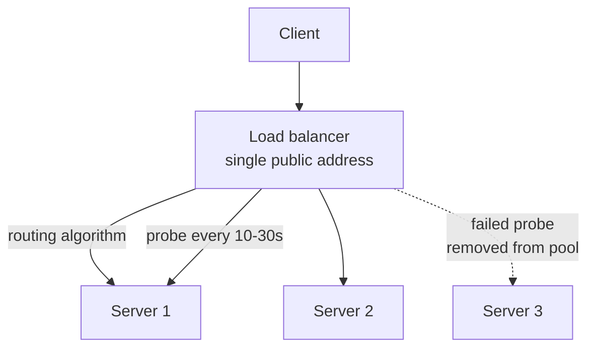
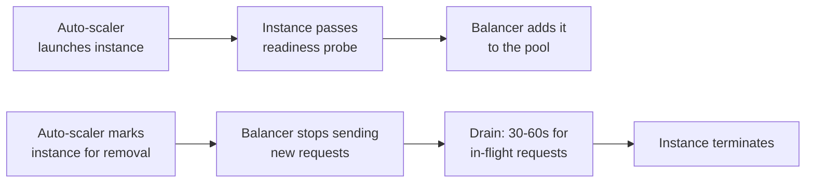

# Load Balancing {#ch-load-balancing}

> Choose a layer and an algorithm to match the traffic, and be able to say exactly what happens when a node dies.

**In this chapter:** layer 4 vs layer 7 · routing algorithms · the health check that causes outages · draining and auto-scaling · going multi-region

## 💡 The Core Idea

A load balancer turns a set of servers into one logical service. Clients address a single name; the
balancer decides which machine answers. That indirection is what makes every other scaling move
possible — you cannot add a second server usefully until something is willing to send traffic to it.

The interesting part is not the distribution. It is the failure handling. A balancer that spreads
traffic evenly but takes ninety seconds to notice a dead node has not bought you availability, it has
bought you a slower outage. Most of the design work is in the health check.

## How It Works

The balancer accepts every request on one public address, picks a healthy backend, and forwards it.
In parallel it probes each backend on a fixed interval and removes the ones that stop answering.



**One address in front, a pool behind it, and a probe deciding who is in the pool.**

### Layer 4 vs layer 7

The layer decides how much of the request the balancer is allowed to read.

| | Layer 4 (transport) | Layer 7 (application) |
| --- | --- | --- |
| **Sees** | IP and port | Path, host, headers, cookies |
| **Routes on** | Connection tuple | Anything in the request |
| **Added latency** | Under a millisecond | One to two milliseconds |
| **TLS termination** | No — the bytes pass through | Yes |
| **Reach for it when** | Raw TCP, latency budgets in microseconds | HTTP services, path-based routing to microservices |

Layer 7 is the default for web work. You give up a millisecond and gain the ability to send `/api/*`
to one service and `/images/*` to another without the client knowing there are two.

### Routing algorithms

| Algorithm | Sends the request to | Best for |
| --- | --- | --- |
| **Round-robin** | The next server in rotation | Equal machines, stateless requests of similar cost |
| **Weighted round-robin** | Higher-weight servers, proportionally | Mixed instance sizes, or shifting traffic during a rolling deploy |
| **Least connections** | The server holding the fewest open connections | Requests of wildly different duration — uploads, WebSockets |
| **IP hash** | The server that client IP maps to | Soft session affinity, when nothing better is available |

**The two that cover almost every case:**

```typescript
interface Server {
  url: string;
  weight: number;
  activeConnections: number;
  healthy: boolean;
}

function weightedRoundRobin(servers: Server[]): Server | null {
  const healthy = servers.filter((s) => s.healthy);
  if (healthy.length === 0) return null;
  // Expanding by weight is O(sum of weights); fine for a pool, not for a hot path.
  const pool = healthy.flatMap((s) => Array<Server>(s.weight).fill(s));
  return pool[Math.floor(Math.random() * pool.length)];
}

function leastConnections(servers: Server[]): Server | null {
  const healthy = servers.filter((s) => s.healthy);
  if (healthy.length === 0) return null;
  return healthy.reduce((min, s) =>
    s.activeConnections < min.activeConnections ? s : min,
  );
}
```

IP hash deserves a warning. Mobile clients move between WiFi and cellular and change IP mid-session,
so affinity built on the client address breaks exactly when a user is walking out of a building. If
you need session state, put it in Redis and keep every server interchangeable.

### The health check that causes outages

A health check that tests shared dependencies will eventually take your whole fleet down at once.

**❌ One endpoint, checking everything:**

```typescript
// Every instance depends on the same database. When it blips, every instance
// fails the check in the same second and the balancer empties the pool.
app.get("/health", async (_req, res) => {
  await db.query("SELECT 1");
  await redis.ping();
  res.sendStatus(200);
});
```

**✅ Two endpoints, answering two different questions:**

```typescript
// Liveness: is this process alive? Nothing external, so a dependency blip
// can degrade the service without deleting the fleet.
app.get("/health", (_req, res) => res.sendStatus(200));

// Readiness: can this instance serve traffic right now? Short timeout, so a
// slow dependency cannot hang the probe itself.
app.get("/ready", async (_req, res) => {
  const ok = await checkDbPool({ timeoutMs: 1000 });
  res.sendStatus(ok ? 200 : 503);
});
```

The thresholds are arithmetic, and worth doing out loud:

```text
Time to remove a dead server = interval x unhealthy threshold  = 15s x 3 = 45s
Time to return a recovered one = interval x healthy threshold  = 15s x 2 = 30s
```

> ⚠️ Tightening to a 5-second interval with a threshold of 2 detects failure in ten seconds — and
> also evicts healthy servers during a garbage-collection pause. Detection speed trades directly
> against flapping.

### Draining and auto-scaling

The balancer and the auto-scaler share the instance lifecycle between them.



**Scale-out waits for a probe; scale-in waits for a drain.**

**Connection draining is the step people skip.** Without it, terminating an instance kills whatever
requests it was still serving — and those failures land on real users during what the dashboard
reports as a successful scale-in. Thirty to sixty seconds covers almost any HTTP request; long-lived
WebSocket connections need an application-level "reconnect now" nudge instead.

### Going multi-region

Once you run in more than one region, a global balancer sits in front of the regional ones. It
announces a single address from every location and routes on network distance and regional health.

| Layer | Decides | Failure it handles |
| --- | --- | --- |
| **Global balancer** | Which region | A whole region going dark |
| **Regional balancer** | Which server | A single instance dying |
| **Cross-zone balancing** | Which availability zone within a region | One zone becoming unbalanced or unhealthy |

The failover story is what interviewers ask for: if the Singapore region fails its health checks, the
global balancer stops answering with Singapore addresses and traffic lands in the next-nearest healthy
region within a minute or so. Latency gets worse; the service stays up.

## When to Use It

| Scenario | What to do |
| --- | --- |
| One server is saturated | Add a balancer and a second server — in that order |
| You need better than 99.9% uptime | The balancer removing failed servers is the mechanism that buys it |
| Zero-downtime deploys | Rolling update behind the balancer: drain old, add new, weight the shift |
| Long-lived connections | Least connections, and plan for reconnects on scale-in |
| Sessions must survive | Move them to Redis rather than pinning users to servers |

## Common Mistakes

❌ **Sessions on the app server.** The next request lands on a different machine and the user is
logged out. ✅ Keep session state in Redis or a signed token, so every server is interchangeable.

❌ **A health check that tests the shared database.** One blip fails every instance simultaneously and
the pool empties. ✅ Split liveness from readiness, and never probe a shared dependency in the check
that controls fleet membership.

❌ **Round-robin for WebSockets.** Connections are long-lived and unequal, so an even share of new
connections becomes a wildly uneven share of load. ✅ Least connections.

❌ **No connection draining.** In-flight requests die on every scale-in and every deploy. ✅ Configure a
drain window and make the deploy wait for it.

❌ **One balancer, no redundancy.** The thing you added to remove a single point of failure becomes
one. ✅ Managed balancers run redundant nodes across zones by default — use that rather than a single
self-hosted instance.

## 🔑 Key Takeaways

- A load balancer's value is failure detection, not distribution — the routing algorithm is the easy half.
- Layer 7 costs about a millisecond and buys routing on path, host and header; it is the default for HTTP.
- Liveness and readiness are different questions, and merging them turns a dependency blip into an outage.
- Detection time is interval times threshold, and tightening it trades flapping for speed.
- Draining is what separates a clean scale-in from a burst of user-visible errors.

## Interview Questions

**Q: Layer 4 or layer 7 for an HTTP API, and why?**

Layer 7, unless there is a specific reason not to. It can route on path and host, terminate TLS in one
place, and give per-route metrics. The cost is a millisecond or two of added latency and the balancer
seeing plaintext. Layer 4 wins when the protocol is not HTTP, or when the latency budget is tight
enough that a millisecond matters.

**Q: Your health check hits the database. What is wrong with that?**

Every instance shares that database, so a brief database problem fails every check at once. The
balancer then removes every server and returns 503 with an empty pool — an outage strictly worse than
the original blip. Liveness should test only the process. Readiness may test a dependency, but with a
short timeout and with the understanding that a shared dependency will fail it fleet-wide.

**Q: How long after a server dies does traffic stop reaching it?**

Interval times unhealthy threshold — with a 15-second interval and a threshold of three, about
45 seconds. During that window a share of requests still lands on the dead server. Shortening the
interval reduces the window but increases false evictions during GC pauses and CPU spikes, so the
number is a deliberate trade rather than a default to minimise.

**Q: When would you not put a load balancer in front of a service?**

When there is exactly one instance and no plan for a second, the balancer adds a hop, a cost and
another thing to configure without buying availability. Internal single-instance tools and
cost-sensitive background workers reached only by a queue are the usual cases. The moment uptime
matters or a second instance appears, the calculation flips.

**Q: How does the balancer participate in a zero-downtime deploy?**

New instances join only after passing readiness, so nothing receives traffic before it can serve it.
Old instances leave in two steps — stop receiving new requests, then drain the in-flight ones — so
nothing is killed mid-request. Weighted routing lets you shift a small share of traffic to the new
version first and roll back by changing a weight rather than by deploying again.

## What to Read Next

- [Chapter ?? — Scalability](#ch-scalability) — where balancing sits among the scaling levers
- [Chapter ?? — The API Gateway Pattern](#ch-api-gateway-pattern) — the layer above, doing auth and rate limiting rather than distribution
- [Chapter ?? — Reliability and Availability](#ch-reliability-and-availability) — what the nines actually cost
