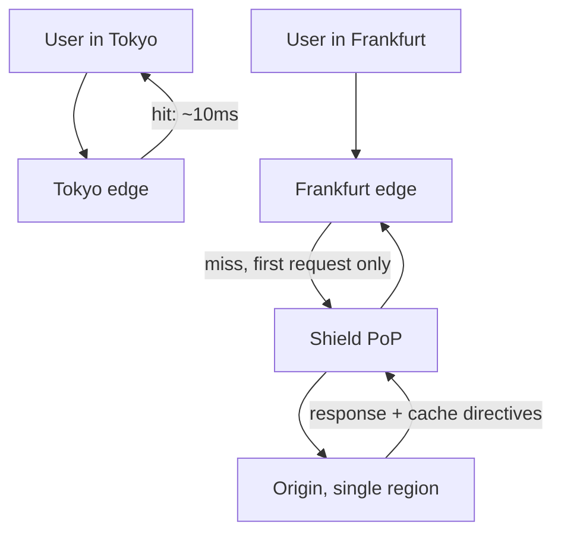

# Content Delivery Network {#ch-cdn}

> Serve bytes from near the user, count how many never reach your origin, and change the URL rather than waiting for a TTL.

**In this chapter:** what a CDN actually offloads · anycast and edge routing · what belongs at the edge · origin shielding · invalidation without purging

## 💡 The Core Idea

A CDN is a cache with a map. It keeps copies of your responses in hundreds of locations and answers
each user from the nearest one. Two things follow, and only one of them is the famous one.

The famous one is latency: a request that would have crossed an ocean is answered a few milliseconds
away. The more valuable one is offload. Every response served at the edge is a request your servers
never see, which makes a CDN the cheapest capacity you can buy — you are not scaling the origin, you
are removing traffic from it.

## How It Works

### Anycast and the edge

The same address is announced from every edge location, and internet routing delivers the request to
whichever one is nearest. That edge either has the response or fetches it once and keeps it.



**A miss costs the origin one request; every later user in that region is answered locally.**

Without a CDN, that Tokyo user pays a 150-millisecond round trip to a US origin on every asset. With
one, they pay ten to the local edge. The origin's location stops being a product decision.

### The offload arithmetic

Origin load is total traffic times the miss rate, which makes the hit ratio the number to argue about:

```typescript
function originRps(totalRps: number, hitRatio: number): number {
  return Math.round(totalRps * (1 - hitRatio));
}

originRps(50_000, 0.8); // 10,000 req/s reach the origin
originRps(50_000, 0.9); //  5,000 req/s — the same ten points, again halving it
```

What hit ratio you can reach depends entirely on what you are serving:

| Content | Achievable hit ratio | Why |
| --- | --- | --- |
| Content-hashed assets — JS, CSS, images | 95–99% | The URL changes when the bytes do, so it can be cached for a year |
| Media segments | 95%+ | Immutable once published, and requested by everyone watching |
| Public HTML with a short TTL | 60–80% | Shared across users, but expires often |
| Public JSON APIs | 70–90% | Cacheable if the response does not depend on who asked |
| Anything personalised | 0% | Every response is different, and a shared cache would leak it |

> ⚠️ A hit ratio below 70% on assets usually means the cache key has something in it that varies per
> user — a cookie or a tracking query parameter. The fix is in the cache key, not in the TTL.

### What belongs at the edge

| Path | Directive | Reasoning |
| --- | --- | --- |
| `/assets/app.7f3c9a.js` | `max-age=31536000, immutable` | Hashed filename; a new build is a new URL |
| `/` and other public HTML | `s-maxage=300, stale-while-revalidate=60` | Shared, but must reflect a deploy quickly |
| `/api/products` | `s-maxage=60, stale-while-revalidate=30` | Public list; a minute of lag is invisible |
| `/api/me`, anything behind a login | `private, no-store` | A shared cache holding this is a data leak |

`max-age` speaks to the browser, `s-maxage` to the shared cache, and `stale-while-revalidate` is what
removes the latency spike at expiry — the edge answers instantly from the stale copy and refreshes
behind the request. The full mechanics of those directives belong to
[Chapter ?? — Object Storage and Delivery](#ch-object-storage-and-delivery).

### Origin shielding

Edges do not share caches. A cold object requested worldwide means every edge missing at once, and the
origin taking hundreds of identical requests for one file. A shield is a designated PoP that every
edge fetches through, so a global miss costs the origin exactly one request.

This matters most for large, popular, immutable objects — a video segment, a launch-day bundle — where
the fan-out is widest and the object is expensive to serve.

### Invalidation, and why hashing beats purging

Purging paths is slow, usually metered, and eventually consistent. Worse, "purge everything" after a
deploy throws away the cache you spent all day filling and hands the next few minutes of traffic
straight to the origin.

The alternative is to make the URL change instead. Content-hashed filenames mean a new build produces
URLs the edge has never seen, so old objects are simply never requested again — no purge, no window of
staleness. The only thing left to invalidate is the small HTML entry point that references them, and
that is one path, not a wildcard.

```typescript
// The only purge a healthy deploy needs: the entry points, by exact path.
async function purgeEntryPoints(cdn: CdnClient, distributionId: string): Promise<void> {
  await cdn.purge({ distributionId, paths: ["/", "/index.html", "/sitemap.xml"] });
}
```

### Media and range requests

Streaming splits a video into segments of a few seconds each, so the edge caches each segment
independently and a viewer who skips ahead pulls only what they watch. Players also issue byte-range
requests, which the edge must answer with partial content rather than the whole object. Both are the
default on any serious CDN — worth naming in an interview because they explain how a platform serves
millions of concurrent viewers from one origin.

## When to Use It

| Scenario | What the CDN buys |
| --- | --- |
| Static assets of any kind | Near-total offload, at the lowest effort of anything on this list |
| Users across more than one continent | Three to ten times lower latency without a second region |
| A launch or a traffic spike | The edge absorbs it; the origin sees the miss rate, not the spike |
| Large media files | Bandwidth savings, plus segment and range handling you would otherwise build |
| Hostile traffic | Attack volume terminates at the edge, far from your servers |

**Do not reach for it** when responses are personalised, when the data changes faster than a useful
TTL, or for writes — a POST has nothing to cache and gains only a hop.

## Common Mistakes

❌ **Caching a response that carries `Set-Cookie`.** The edge stores one user's session and hands it to
the next. ✅ `private, no-store` on anything authenticated, and check the cache key never includes a
session cookie.

❌ **Static filenames.** `main.js` cached for a year is a deploy that never reaches users. ✅ Let the
build hash the content into the filename.

❌ **Purging the world on every deploy.** The cache is emptied, the origin absorbs the refill, and the
deploy looks like an incident. ✅ Purge the entry points by exact path; let hashed URLs handle the rest.

❌ **No shield on a globally popular object.** One cold object becomes hundreds of simultaneous origin
requests. ✅ Turn shielding on for large immutable assets.

❌ **A publicly readable origin behind the CDN.** Users find the direct URL, skip the cache, and your
hit ratio and access rules both stop meaning anything. ✅ Restrict the origin to the CDN's identity.

## 🔑 Key Takeaways

- The offload matters more than the latency: a response served at the edge is one your origin never sees.
- Origin load is traffic times miss rate, so ten points of hit ratio halves it every time.
- What you can cache is decided by whether the response is the same for everyone, not by its size.
- Content-hashed URLs replace invalidation; purging is a fallback for entry points, not a deploy step.
- Origin shielding is what stops a global cache miss becoming a global origin stampede.

## Interview Questions

**Q: Why is a CDN a scaling tool and not just a performance one?**

Because it changes how much traffic your origin sees. At a 90% hit ratio, nine of every ten requests
are answered without touching your infrastructure, so the same servers absorb ten times the traffic.
Adding origin capacity costs servers and operational surface; raising the hit ratio costs a change to
cache headers. That is why the caching question comes before the capacity question.

**Q: After a deploy, users still get the old JavaScript. What went wrong?**

Either the asset filenames did not change, so the edge is still serving bytes it correctly believes are
current, or the HTML referencing them is itself cached too long. The structural fix is content hashing
on assets with a one-year TTL, and a short `s-maxage` on the HTML entry point, which becomes the only
thing ever purged.

**Q: What is origin shielding and when do you need it?**

A designated intermediate PoP that all edges fetch through, so a cache miss at fifty locations becomes
one origin request rather than fifty. You need it when objects are large, globally popular and
frequently cold — media segments, a launch bundle. For small, warm assets in a single-region audience
it adds a hop for little gain.

**Q: When is a CDN the wrong answer?**

When responses are personalised. A shared cache holding a logged-in user's dashboard is a data leak,
not a performance win, and marking it cacheable is one of the few CDN mistakes that is a security
incident rather than a stale page. The move is to cache the shared parts and leave the personalised
part to the origin, near its data.

**Q: How would you diagnose a hit ratio of 40% on static assets?**

Look at the cache key before anything else. A cookie, a per-user query parameter or a `Vary` header on
something that varies per request will fragment one object into thousands of near-identical copies,
each cold. After that, check that the TTL is long enough for a second request to arrive, and that the
filenames are stable enough to be requested twice at all.

## What to Read Next

- [Chapter ?? — Caching](#ch-caching) — the same idea one layer in, where the data is not public
- [Chapter ?? — Object Storage and Delivery](#ch-object-storage-and-delivery) — configuring the edge and its origin in practice
- [Chapter ?? — Load Balancing](#ch-load-balancing) — what handles the traffic that does reach you
